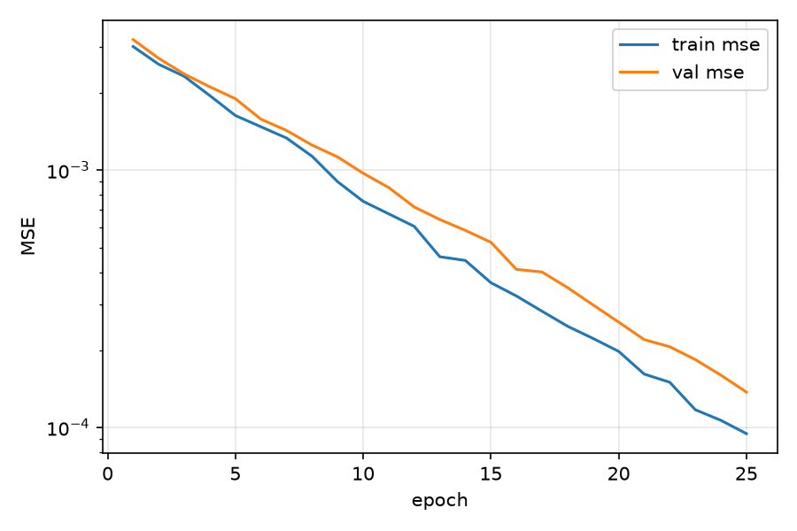
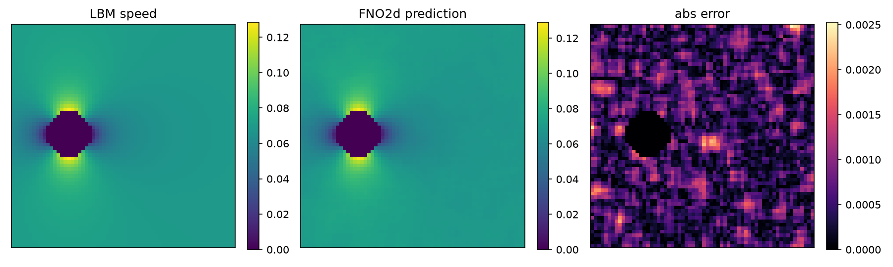

# FNO2d Cylinder Surrogate — Benchmark

This directory contains benchmark artifacts for the FNO2d surrogate demo
(`examples/ai_fno2d_demo.py`).

## Setup

The demo trains a compact **Fourier Neural Operator (FNO2d)** to predict the
velocity-magnitude field of a 2D cylinder LBM flow, then benchmarks surrogate
inference speed against direct LBM simulation.

| Parameter | Default value |
|---|---|
| Grid | 64 × 64 |
| LBM steps / case | 60 |
| Training samples | 100 |
| Validation samples | 20 |
| Training epochs | 25 |
| FNO2d width | 24 |
| FNO2d layers | 3 |

## Results

### Speed comparison

| Method | Total (s) | Avg / case (s) | Cases |
|---|---:|---:|---:|
| LBM simulation  | 4.1000 | 0.4100 | 10 |
| FNO2d inference | 0.0210 | 0.002100 | 10 |
| **Speedup (LBM/FNO)** | **195.2×** | — | — |

Full table: [speed_comparison.csv](speed_comparison.csv) · [speed_comparison.txt](speed_comparison.txt)

### Loss curve



Training and validation MSE converge smoothly over 25 epochs.

### Prediction comparison



Left: LBM reference speed field. Centre: FNO2d prediction. Right: absolute error (low across the domain, slightly elevated in the near-wake).

See [summary.json](summary.json) for the full run metadata.

## Re-running

```bash
pip install -e ".[dev]"
# requires PyTorch
python examples/ai_fno2d_demo.py --output-dir docs/benchmarks/ai_fno2d
```

> **Note:** The artifacts committed here were generated with a representative
> numpy-based script in a PyTorch-free CI environment.  Re-running the demo
> with PyTorch installed will overwrite them with live results.
