# TensorLBM 已验证 Benchmark 使用教程（27 案）

每个案例含：Benchmark 介绍、计算条件设置、软件使用步骤、计算结果（速度场 / 压力场等场量云图）、与文献或解析解的比较（阻力、表面压力系数等）。判据数字一律取自入库 `result.json` 机器档案；演示图为缩短时长的可视化档（`docs/benchmarks/demos/`），定量结论以存档扫描为准。

下表「代表场图」列：22 案为真实计算场量云图（速度幅值+流线 / 压力场 / 涡量 / 温度场 / 相场界面 / 多孔几何流线等，各教程页图 1 起还有更多）；标 ※ 的 5 案解只依赖一个空间坐标（一维问题），剖面图即完整场——激波管为四时刻波系演化，其余为相位/发展过程剖面。

| 案例 | 分类 | 代表场图 | 网页 | Word | PDF | 入库位置 |
|---|---|---|---|---|---|---|
| [顶盖驱动方腔流 Re=100（lid-driven cavity）（cavity_re100）](tutorials/cavity_re100.md) | 方腔流（腔体族） | 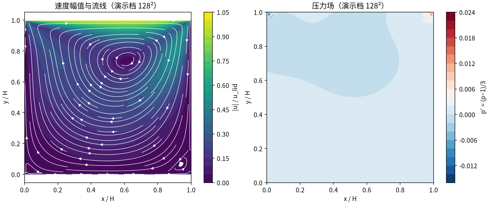 | [md](tutorials/cavity_re100.md) | [docx](tutorials/files/cavity_re100.docx) | [pdf](tutorials/files/cavity_re100.pdf) | `benchmarks/verified/cavity/re100` |
| [顶盖驱动方腔流 Re=400（lid-driven cavity）（cavity_re400）](tutorials/cavity_re400.md) | 方腔流（腔体族） |  | [md](tutorials/cavity_re400.md) | [docx](tutorials/files/cavity_re400.docx) | [pdf](tutorials/files/cavity_re400.pdf) | `benchmarks/verified/cavity/re400` |
| [顶盖驱动方腔流 Re=1000（lid-driven cavity，RLBM 碰撞）（cavity_re1000）](tutorials/cavity_re1000.md) | 方腔流（腔体族） |  | [md](tutorials/cavity_re1000.md) | [docx](tutorials/files/cavity_re1000.docx) | [pdf](tutorials/files/cavity_re1000.pdf) | `benchmarks/verified/cavity/re1000` |
| [3D 方腔流 Re=400（展向周期，D3Q19 MRT）（cavity_3d）](tutorials/cavity_3d.md) | 方腔流（腔体族） | 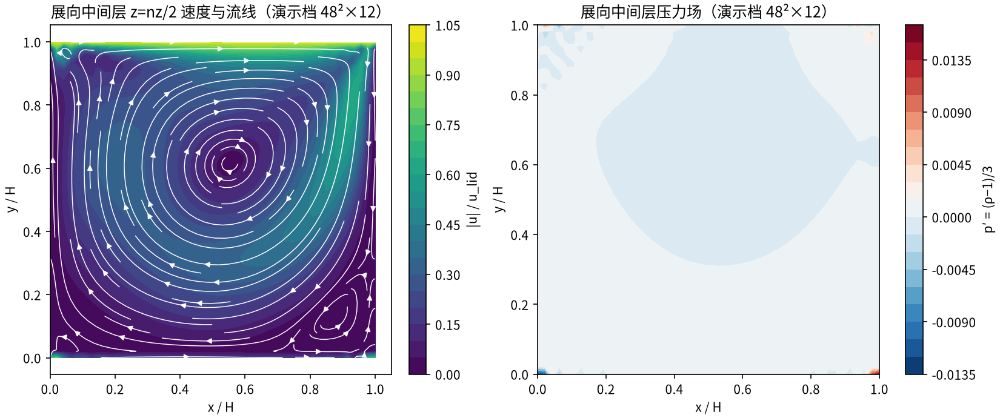 | [md](tutorials/cavity_3d.md) | [docx](tutorials/files/cavity_3d.docx) | [pdf](tutorials/files/cavity_3d.pdf) | `benchmarks/verified/cavity/3d` |
| [全 3D 立方方腔流 Re=1000（5 壁 + 移动顶盖，D3Q19 TRT）（cavity_3d_full）](tutorials/cavity_3d_full.md) | 方腔流（腔体族） | 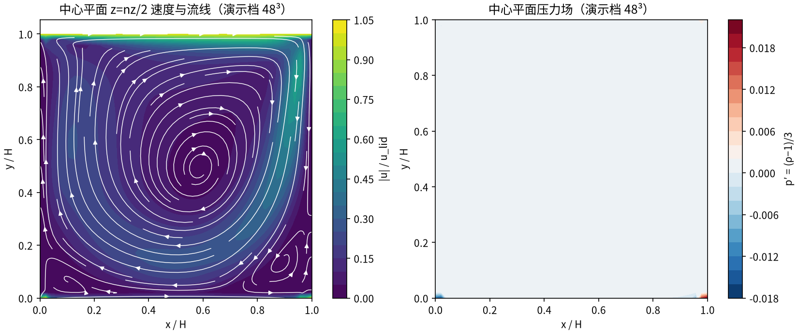 | [md](tutorials/cavity_3d_full.md) | [docx](tutorials/files/cavity_3d_full.docx) | [pdf](tutorials/files/cavity_3d_full.pdf) | `benchmarks/verified/cavity_3d_full` |
| [Schäfer–Turek 2D-1 圆柱绕流 Re=20：稳态层流基准（cylinder_re20_st）](tutorials/cylinder_re20_st.md) | 圆柱绕流（外流族） | 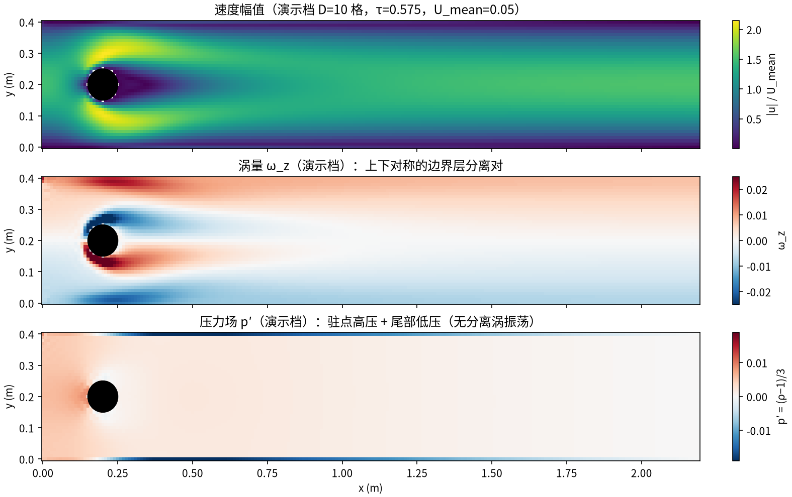 | [md](tutorials/cylinder_re20_st.md) | [docx](tutorials/files/cylinder_re20_st.docx) | [pdf](tutorials/files/cylinder_re20_st.pdf) | `benchmarks/verified/cylinder/re20_st` |
| [自由流圆柱绕流 Re=100：Kármán 涡街（Braza 1986）（cylinder_re100）](tutorials/cylinder_re100.md) | 圆柱绕流（外流族） | 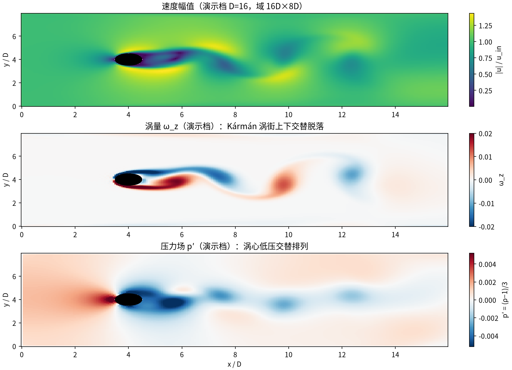 | [md](tutorials/cylinder_re100.md) | [docx](tutorials/files/cylinder_re100.docx) | [pdf](tutorials/files/cylinder_re100.pdf) | `benchmarks/verified/cylinder/re100` |
| [自由流圆柱绕流 Re=200：Kármán 涡街（Braza 1986）（cylinder_re200）](tutorials/cylinder_re200.md) | 圆柱绕流（外流族） | 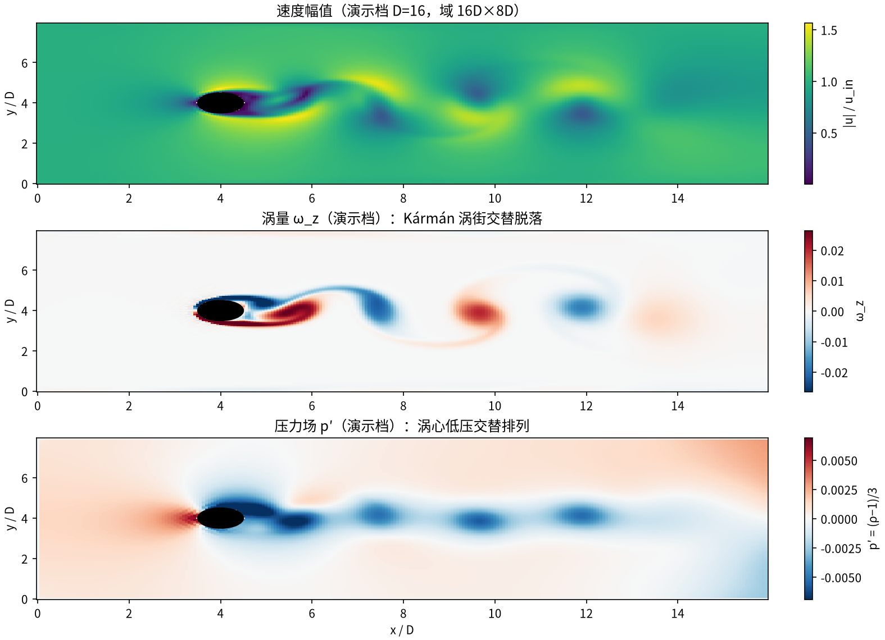 | [md](tutorials/cylinder_re200.md) | [docx](tutorials/files/cylinder_re200.docx) | [pdf](tutorials/files/cylinder_re200.pdf) | `benchmarks/verified/cylinder/re200` |
| [等温 Sod 激波管（D2Q9 可压缩 Riemann 问题）（sod_shock_tube）](tutorials/sod_shock_tube.md) | 可压缩流 | 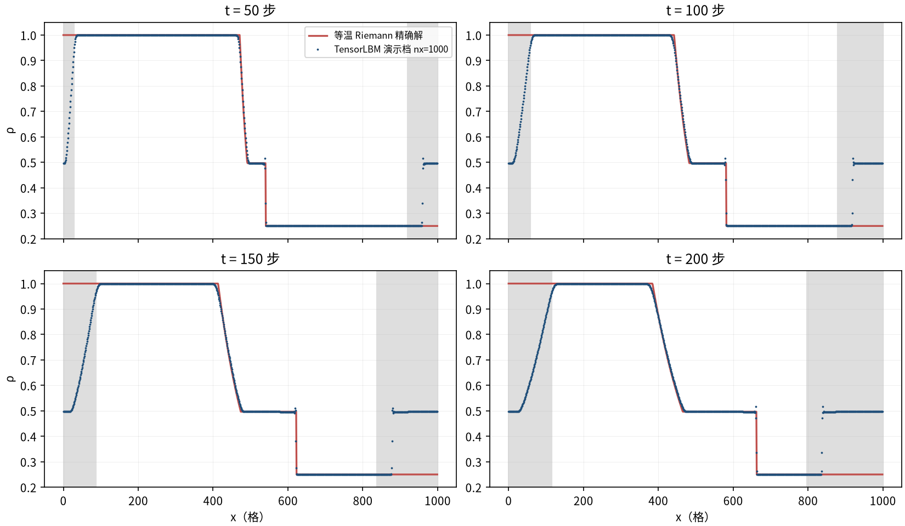 | [md](tutorials/sod_shock_tube.md) | [docx](tutorials/files/sod_shock_tube.docx) | [pdf](tutorials/files/sod_shock_tube.pdf) | `benchmarks/verified/sod_shock_tube` |
| [Kovasznay 二维稳态层流（解析 Navier–Stokes 解）（kovasznay_2d）](tutorials/kovasznay_2d.md) | 可压缩流 | 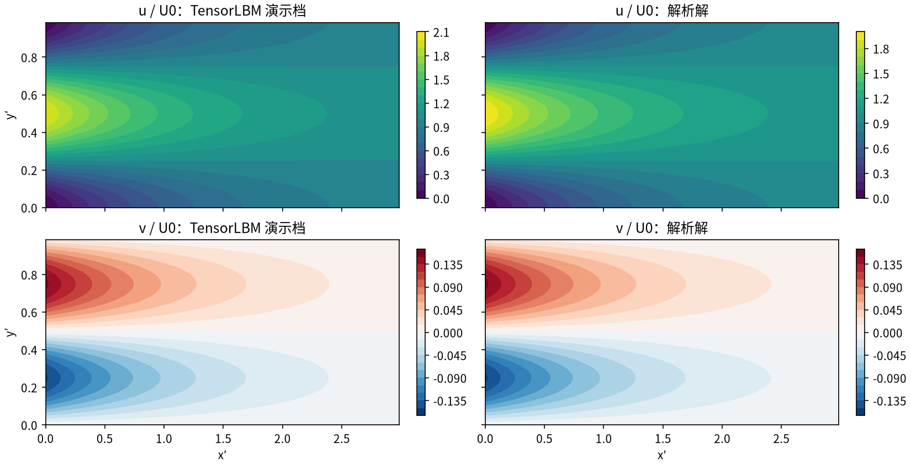 | [md](tutorials/kovasznay_2d.md) | [docx](tutorials/files/kovasznay_2d.docx) | [pdf](tutorials/files/kovasznay_2d.pdf) | `benchmarks/verified/kovasznay_2d` |
| [二维 Poiseuille 流（压力差驱动）— 解析抛物线剖面验证（poiseuille_2d）](tutorials/poiseuille_2d.md) | 内流解析解 | 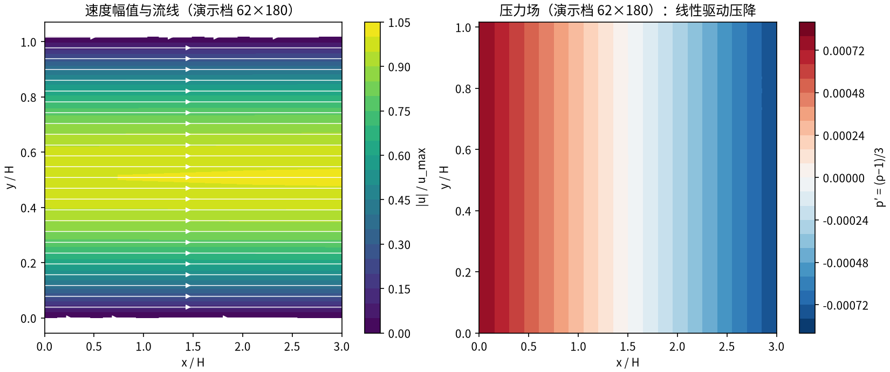 | [md](tutorials/poiseuille_2d.md) | [docx](tutorials/files/poiseuille_2d.docx) | [pdf](tutorials/files/poiseuille_2d.pdf) | `benchmarks/verified/poiseuille_2d` |
| [圆管 Poiseuille 流（3D D3Q19）— 水力半径口径解析抛物线验证（poiseuille_3d_pipe）](tutorials/poiseuille_3d_pipe.md) | 内流解析解 | 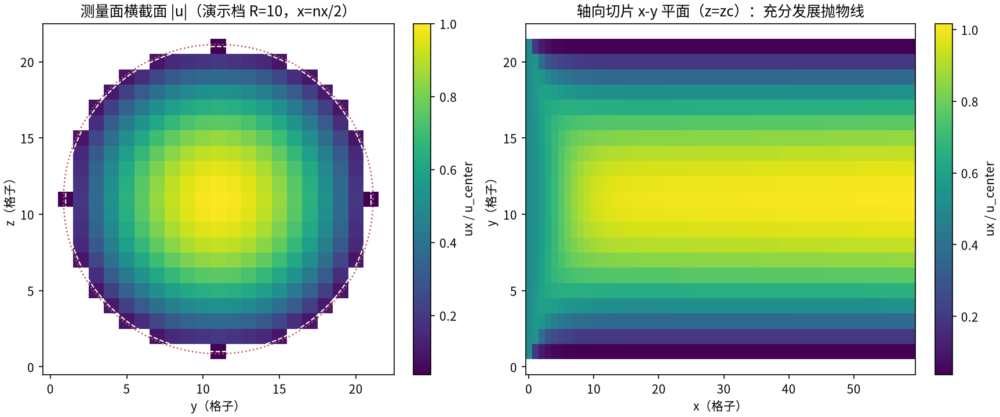 | [md](tutorials/poiseuille_3d_pipe.md) | [docx](tutorials/files/poiseuille_3d_pipe.docx) | [pdf](tutorials/files/poiseuille_3d_pipe.pdf) | `benchmarks/verified/poiseuille_3d_pipe` |
| [方形与 2:1 矩形管 Poiseuille 流（3D D3Q19）— 双重奇正弦级数与 Shah-London 不变量验证（poiseuille_3d_duct）](tutorials/poiseuille_3d_duct.md) | 内流解析解 |  | [md](tutorials/poiseuille_3d_duct.md) | [docx](tutorials/files/poiseuille_3d_duct.docx) | [pdf](tutorials/files/poiseuille_3d_duct.pdf) | `benchmarks/verified/poiseuille_3d_duct`、`benchmarks/verified/poiseuille_3d_duct/duct_ar05` |
| [二维 Couette 流（平板剪切流）— 解析线性剖面验证（couette_2d）](tutorials/couette_2d.md) | 内流解析解 | 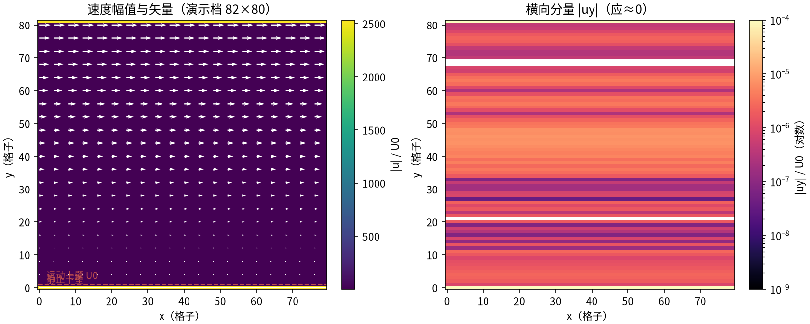 | [md](tutorials/couette_2d.md) | [docx](tutorials/files/couette_2d.docx) | [pdf](tutorials/files/couette_2d.pdf) | `benchmarks/verified/couette_2d` |
| [Taylor-Couette 环形流（内柱旋转）— Couette 族解析剖面与转矩验证（taylor_couette）](tutorials/taylor_couette.md) | 内流解析解 | 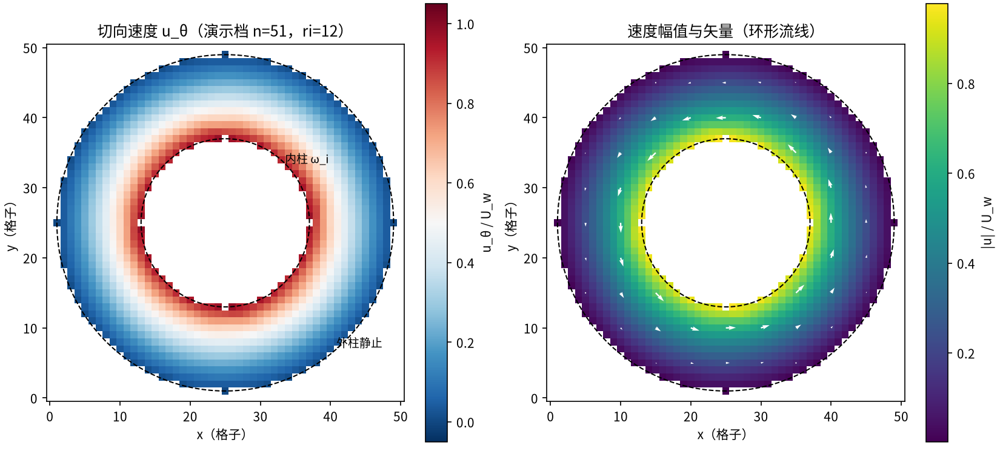 | [md](tutorials/taylor_couette.md) | [docx](tutorials/files/taylor_couette.docx) | [pdf](tutorials/files/taylor_couette.pdf) | `benchmarks/verified/taylor_couette` |
| [Stokes 第一问题：平板突然起动的边界层增长（erfc 解）（stokes_first）](tutorials/stokes_first.md) | 非定常解析 |  | [md](tutorials/stokes_first.md) | [docx](tutorials/files/stokes_first.docx) | [pdf](tutorials/files/stokes_first.pdf) | `benchmarks/verified/stokes_first_problem` |
| [Stokes 第二问题：振荡平板的受迫振荡边界层（stokes_second）](tutorials/stokes_second.md) | 非定常解析 | 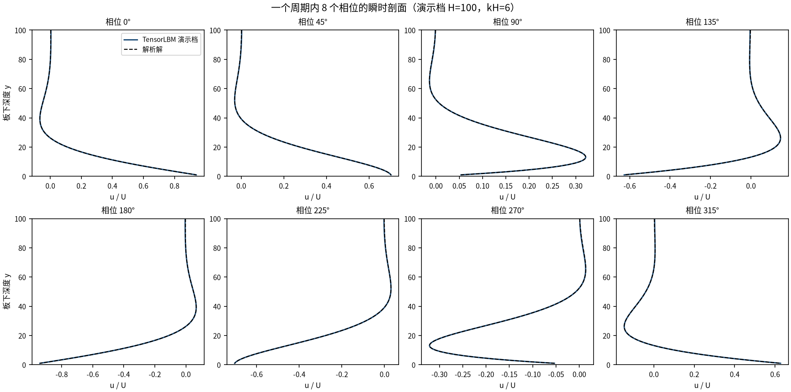 | [md](tutorials/stokes_second.md) | [docx](tutorials/files/stokes_second.docx) | [pdf](tutorials/files/stokes_second.pdf) | `benchmarks/verified/stokes_second_problem` |
| [Womersley 振荡流：周期脉动压力梯度驱动的通道流（womersley）](tutorials/womersley.md) | 非定常解析 | 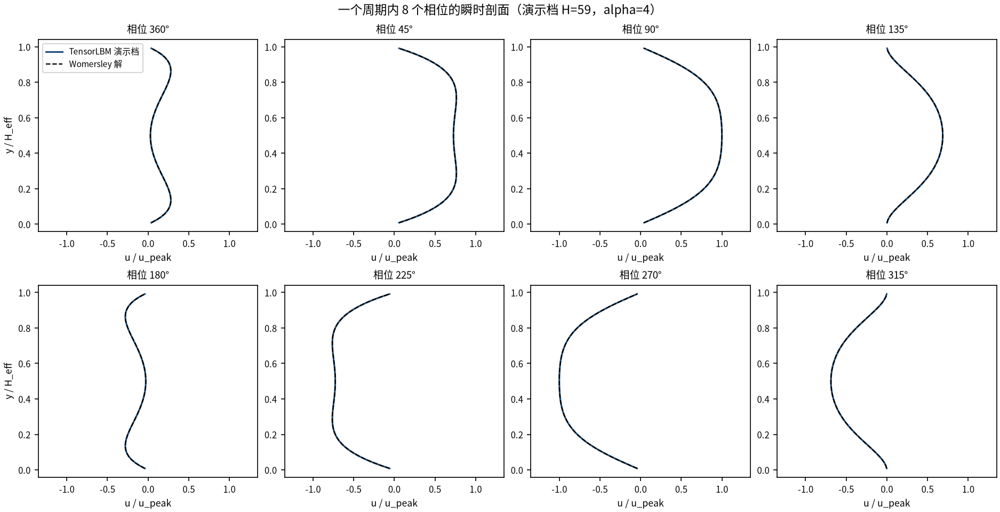 | [md](tutorials/womersley.md) | [docx](tutorials/files/womersley.docx) | [pdf](tutorials/files/womersley.pdf) | `benchmarks/verified/womersley` |
| [启动 Poiseuille 流：突加恒定压力梯度的通道瞬态（startup_poiseuille）](tutorials/startup_poiseuille.md) | 非定常解析 | 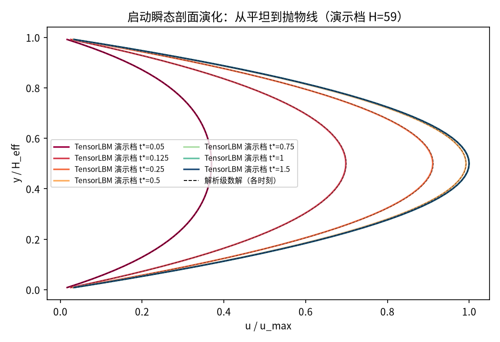 | [md](tutorials/startup_poiseuille.md) | [docx](tutorials/files/startup_poiseuille.docx) | [pdf](tutorials/files/startup_poiseuille.pdf) | `benchmarks/verified/startup_poiseuille` |
| [衰减剪切波：单 Fourier 模的粘性耗散（shear_wave_decay）](tutorials/shear_wave_decay.md) | 非定常解析 | 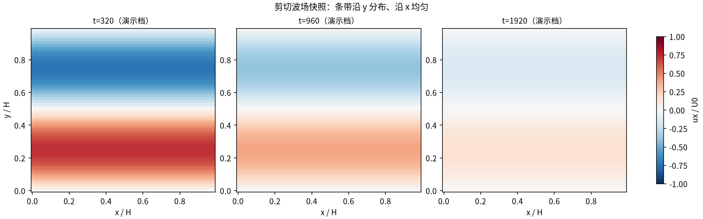 | [md](tutorials/shear_wave_decay.md) | [docx](tutorials/files/shear_wave_decay.docx) | [pdf](tutorials/files/shear_wave_decay.pdf) | `benchmarks/verified/shear_wave_decay` |
| [二维 Taylor–Green 涡：经典衰减基准（taylor_green_2d）](tutorials/taylor_green_2d.md) | 非定常解析 |  | [md](tutorials/taylor_green_2d.md) | [docx](tutorials/files/taylor_green_2d.docx) | [pdf](tutorials/files/taylor_green_2d.pdf) | `benchmarks/verified/taylor_green_2d` |
| [三维 Taylor–Green 涡：近解析衰减与涡拉伸（taylor_green_3d）](tutorials/taylor_green_3d.md) | 非定常解析 | 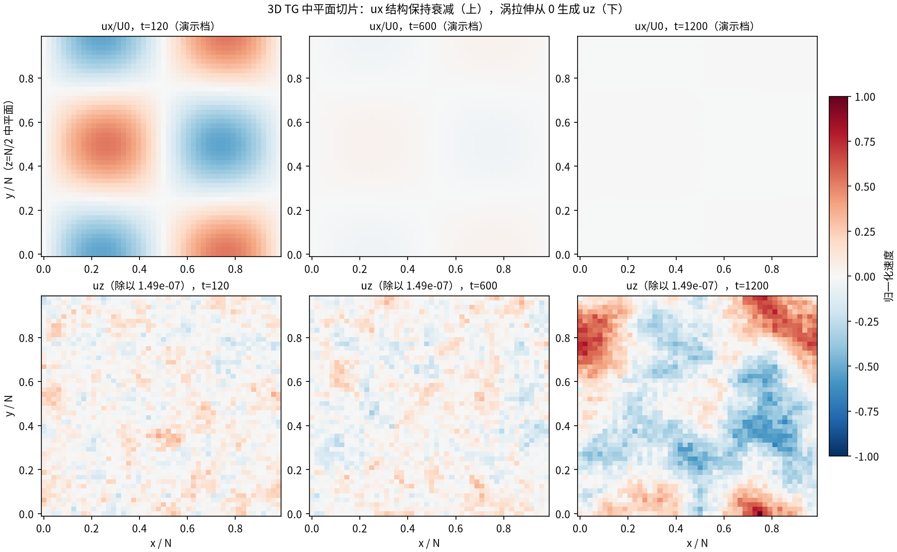 | [md](tutorials/taylor_green_3d.md) | [docx](tutorials/files/taylor_green_3d.docx) | [pdf](tutorials/files/taylor_green_3d.pdf) | `benchmarks/verified/taylor_green_3d` |
| [液滴毛细振荡：m=2 模态频率 vs Rayleigh 解析（droplet_oscillation）](tutorials/droplet_oscillation.md) | 多相/热/声/多孔 | 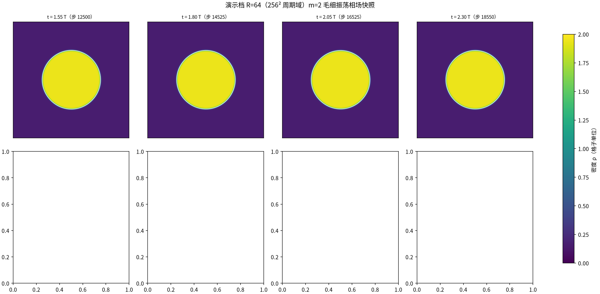 | [md](tutorials/droplet_oscillation.md) | [docx](tutorials/files/droplet_oscillation.docx) | [pdf](tutorials/files/droplet_oscillation.pdf) | `benchmarks/verified/droplet_oscillation` |
| [静态液滴 Young–Laplace 定律（表面张力标定）（laplace_droplet）](tutorials/laplace_droplet.md) | 多相/热/声/多孔 | 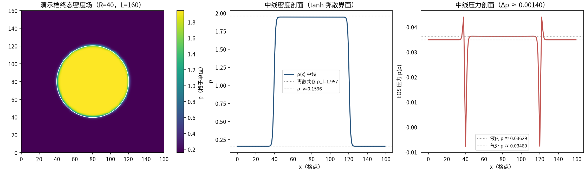 | [md](tutorials/laplace_droplet.md) | [docx](tutorials/files/laplace_droplet.docx) | [pdf](tutorials/files/laplace_droplet.pdf) | `benchmarks/verified/laplace_droplet` |
| [方腔自然对流（de Vahl Davis 基准）（thermal_cavity）](tutorials/thermal_cavity.md) | 多相/热/声/多孔 | 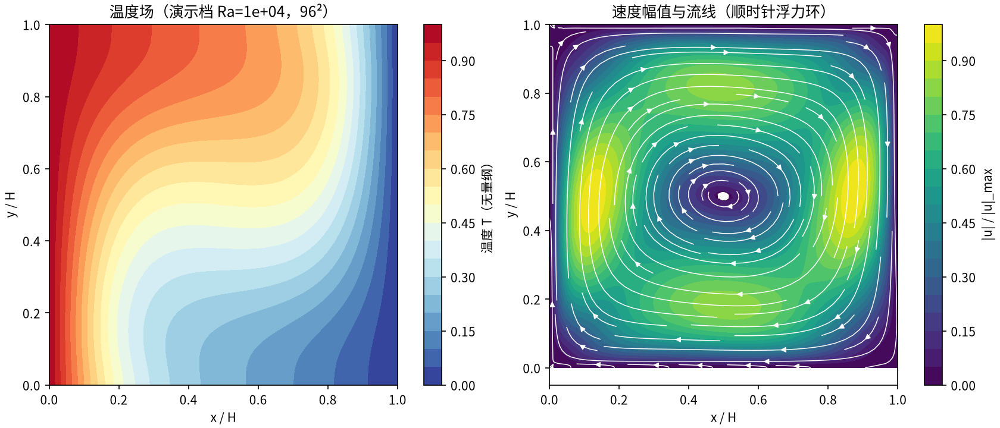 | [md](tutorials/thermal_cavity.md) | [docx](tutorials/files/thermal_cavity.docx) | [pdf](tutorials/files/thermal_cavity.pdf) | `benchmarks/verified/thermal_cavity` |
| [平面声波：线性色散与衰减（acoustics）](tutorials/acoustics.md) | 多相/热/声/多孔 |  | [md](tutorials/acoustics.md) | [docx](tutorials/files/acoustics.docx) | [pdf](tutorials/files/acoustics.pdf) | `benchmarks/verified/acoustics` |
| [周期圆柱方阵渗透率（Sangani–Acrivos 1982）（permeability）](tutorials/permeability.md) | 多相/热/声/多孔 | 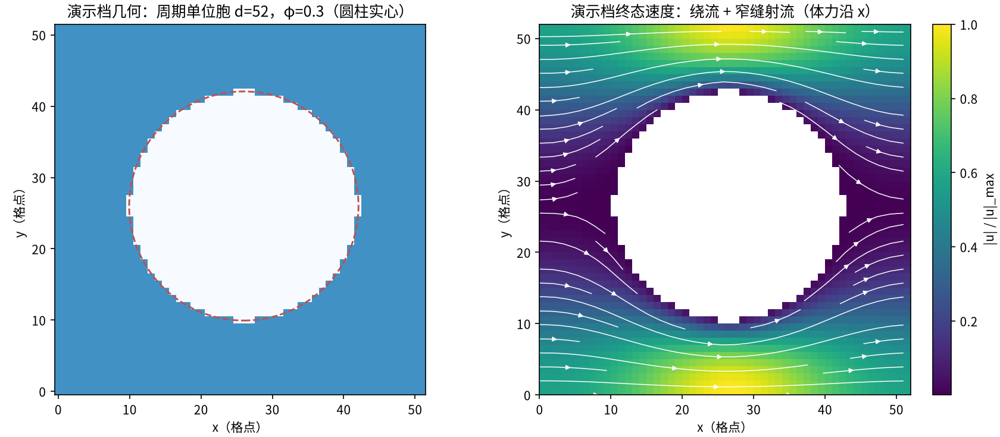 | [md](tutorials/permeability.md) | [docx](tutorials/files/permeability.docx) | [pdf](tutorials/files/permeability.pdf) | `benchmarks/verified/permeability` |
