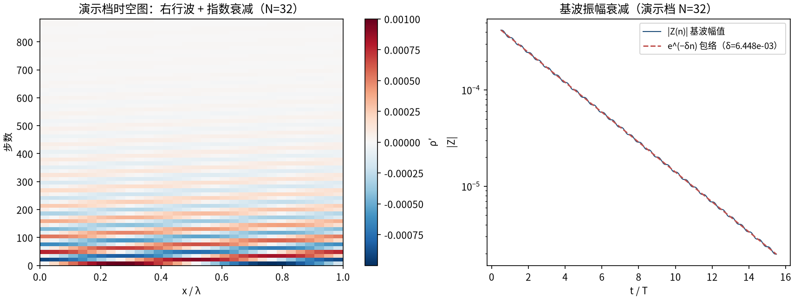
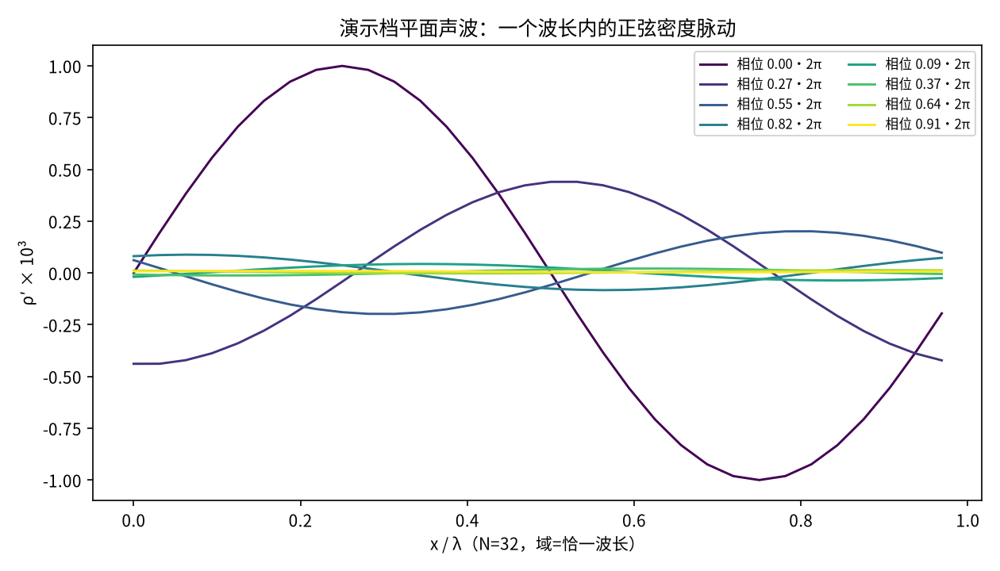
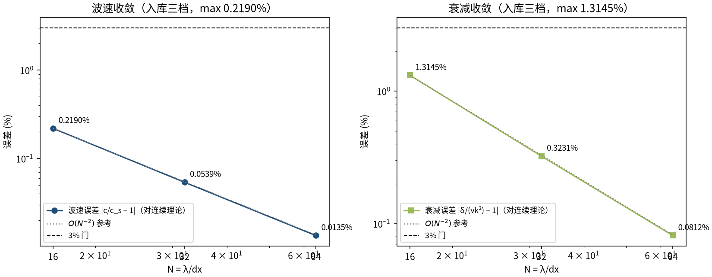
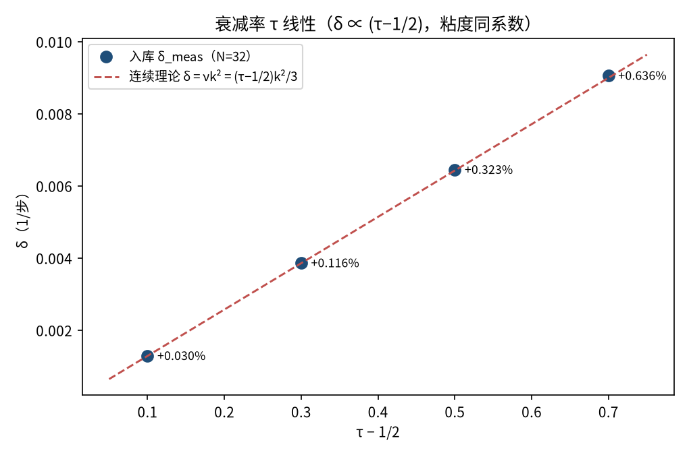

# 平面声波：线性色散与衰减（acoustics）

> Plane Acoustic Wave: Linear Dispersion and Attenuation (D2Q9)

**摘要** — TensorLBM 库原生 D2Q9 BGK（collide_bgk + stream，周期域，零修正）的平面声波在 N = λ/dx = 16/32/64 三档细化下，波速与衰减率对连续线性声学理论（c = 1/√3、δ = νk²、ν = (τ−1/2)/3，零可调参数）的误差分别为 ≤0.2190% 与 ≤1.3145%，双双 ≤3% 且严格单调（判据 A PASS = True，判据 B PASS = True），实测收敛阶 O(N⁻²)。测量值同时与独立推导的离散精确理论（9×9 每波数特征值）吻合到 1e-5–1e-7 相对——级数 ↔ 特征值 ↔ 真实模拟三链闭环。

## 1. Benchmark 介绍

声学是格子 Boltzmann 的「本体物理」：等温 EOS 下 D2Q9 的线性化扰动就是声波，其色散与衰减完全由碰撞算子与离散流迁决定，不含任何模型调参空间。因此平面声波是检验库碰撞/流迁链保真度的最纯净基准——波速给相位误差，衰减给耗散谱，两者对网格细化的收敛阶直接刻画格点离散误差结构。

本案例是 TensorLBM 首个声学问题类基准。参考解取两条独立路线：连续线性声学理论（c_s = 1/√3，δ = νk²，与 LBM 剪切粘度严格同系数）作为零可调参数判据；以及线性化 collide-then-stream 算子的 9×9 每波数特征值（离散精确理论）作为管线自检——两者与真实模拟逐点闭环。

物理注记：δ = νk² 意味着 BGK 的声衰减等价于有效体积粘度 = 剪切粘度（bulk:shear = 1:1），是物理等温 NS（ζ=0）的 2 倍——BGK 人工体积粘的定量表述；离散修正 c_ph = c_s(1−βk²) 首项恰为 c_s（无 O(k) 修正），β、c₂ 有闭式（τ=1 时 β=−1/72、c₂=1/12）。

### 物理与数学背景

绕静止态 (ρ₀=1, u=0) 线性化的 D2Q9 BGK：f ← f − (f−feq)/τ 后拉氏流迁，平面波 ansatz f′_q(x,t) = F_q·e^(st+ikx) 给出色散行列式，右行声学支 s(k,τ) = iω − δ。

```
连续理论：ω = c_s·k，δ = ν·k²，c_s = 1/√3，ν = c_s²·(τ−1/2) = (τ−1/2)/3
```

```
离散修正：c_ph = c_s(1 − βk²)，β = −(12τ²−12τ+1)/72；δ = νk²(1 + c₂k²)，c₂ = (2τ−1)²/12
```

```
测量：Z(n) = ⟨(ρ−1)e^(−ikx)⟩，ω = −d(arg Z)/dn，δ 由 |Z|² = A·e^(−2δn)·(1+ηcos(2ωn+φ)) 稳健估计
```

```
初始条件：ρ′ = ε·sin(kx)，u′ = c_s·ε·sin(kx)（等温声学本征矢量）
```

**参考解** — 预注册双参考：连续线性声学（判据，零可调参数）+ 线性化算子 9×9 特征值（管线自检，理论_check 与色散行列式两法一致 <1e-10）。

**参考文献**

- Lighthill M.J. (1978), Waves in Fluids, Cambridge University Press.
- Dellar P.J. (2001), Bulk and shear viscosities in lattice Boltzmann equations, Phys. Rev. E 64, 031203（LBM 声衰减与体积粘度）.
- Sterling J.D., Chen S. (1996), Stability analysis of lattice Boltzmann methods, J. Comput. Phys. 123, 196（线性化色散分析）.

## 2. 计算条件设置

正式档计算条件取自入库 result.json（程序化注入，下同）。

| 参数 | 取值 | 说明 |
|---|---|---|
| 模型 | D2Q9 BGK 等温线性声学 | tensorlbm.solver.collide_bgk + stream（周期域，无修正/外推/强迫） |
| 精度 / 设备 | float64 / CPU 单线程 | 线性小扰动问题，fp64 消除量化伪差 |
| 主案配置 | N = λ/dx = 16 / 32 / 64（域=恰一波长 k=2π/N） | ny=8（横方向不变），τ=1.0 固定（保持 ν=1/6 口径） |
| 初始扰动 | ρ = 1 + ε·sin(kx)，u_x = c_s·ε·sin(kx) | 等温声学关系 u′ = c_s·ρ′（右行波），ε=1e-3 |
| 测量 | Z(n) = ⟨(ρ−1)e^(−ikx)⟩ 每步 | ω=相位解缠斜率；δ=\|Z\|² 稳健估计器（吸收 2ω 差拍） |
| 拟合窗口 | [T/2, 15.5T]，T = N·√3 | 跳过初始瞬态；每档约 16 个周期 |
| 参考（连续） | c = 1/√3 = 0.577350269，δ = νk²，ν = (τ−1/2)/3 | 零可调参数（无 τ 拟合、无格点修正） |
| 参考（离散） | 9×9 每波数特征值 s(k,τ) | 线性化 collide-then-stream 精确切；与级数展开互相验证 <1e-10 |

## 3. 软件使用步骤

**环境** — Python ≥ 3.11；依赖 torch / numpy / matplotlib；仓库 src 可导入（pip install -e . 或 PYTHONPATH=<repo>/src）

**步骤 1**：获取仓库并进入根目录

```bash
git clone https://github.com/cxs503/TensorLBM.git && cd TensorLBM
```

**步骤 2**：安装/指向 tensorlbm 包

```bash
pip install -e .   # 或 export PYTHONPATH=$PWD/src
```

**步骤 3**：正式全量扫描（主案 + τ 扫描 + 线性性 + 方腔次案；CPU fp64 全程 <2 分钟）

```bash
python benchmarks/verified/acoustics/run.py
```

**步骤 4**：查看判定（pass_c / pass_delta）与全案数字

```bash
cat result.json   # 或 jq .verdict_main result.json
```

### 场量可视化演示脚本

场量可视化演示：与正式档完全同构的迷你扫描（N=16/32/64、τ=1、ε=1e-3、fp64、每档 16 周期），CPU 合计 0.7 s；输出密度脉动快照序列与基波复振幅 Z(n)。演示档自身测量 N=32 得 c ≈ 0.577661636（连续理论 0.577350269）、δ ≈ 6.4484e-03（连续理论 6.4255e-03）——数量级与入库档一致，判据数字以入库扫描为准。

```bash
python docs/benchmarks/demos/acoustics_demo.py --N 16 32 64 --out demo.npz
```

## 4. 计算结果

**表 1 入库主案结果（τ=1.0，ε=1e-3）**

| 档 | k | c_meas | δ_meas | 相位拟合 r² | 反向波占比 b/a |
|---|---|---|---|---|---|
| N=16 | 0.392699 | 0.578614571 | 2.603994e-02 | 0.9999978 | 0.0574 |
| N=32 | 0.196350 | 0.577661636 | 6.446282e-03 | 0.9999995 | 0.0284 |
| N=64 | 0.098175 | 0.577427988 | 1.607686e-03 | 0.9999999 | 0.0142 |

*来源：benchmarks/verified/acoustics/result.json（git c0b84d96d1，float64/cpu）。反向波为平衡态初始化固有播种（b/a = νk/(2c_s)，估计器精确吸收）。*



*图 2 演示档 N=32 的传播与衰减：左=时空图（条纹沿时间轴右移且对比度递减）；右=基波幅值 |Z(n)| 半对数衰减与 e^(−δn) 包络（演示 δ=6.448e-03）。*



*图 1 演示档（N=32）一个波长内的密度脉动 ρ′(x)：不同时刻的剖面（颜色随时间演进）显示正弦波形保持形状右移——线性色散下基波不变形。*

## 5. 与文献 / 解析解的比较

**表 2 与理论参考的比较（入库三档）**

| 量 | N=16 | N=32 | N=64 | 判决 |
|---|---|---|---|---|
| 波速误差（对连续 c_s） | +0.2190% | +0.0539% | +0.0135% | max 0.2190%，单调 = True → PASS = True |
| 衰减误差（对连续 νk²） | +1.3145% | +0.3231% | +0.0812% | max 1.3145%，单调 = True → PASS = True |
| 波速误差（对离散精确理论） | +0.00015% | +0.00010% | +0.00006% | 管线自检（~1e-5 相对）：残差来自物理离散差而非测量 |
| 衰减误差（对离散精确理论） | -0.00002% | -0.00002% | +0.00081% | 同上（~1e-5..1e-7 相对） |

**表 3 τ 敏感性（入库，N=32）**

| 档 | ν | δ_meas | 对连续误差 | 对离散理论误差 |
|---|---|---|---|---|
| τ=0.6 | 0.03333 | 1.285492e-03 | +0.0301% | +0.01785% |
| τ=0.8 | 0.10000 | 3.859790e-03 | +0.1161% | +0.00041% |
| τ=1.0 | 0.16667 | 6.446282e-03 | +0.3231% | -0.00002% |
| τ=1.2 | 0.23333 | 9.052923e-03 | +0.6357% | -0.00004% |

*δ ∝ (τ−1/2) 严格成立；缓增完全由离散修正 c₂(τ)=(2τ−1)²/12 解释。线性性（ε∈{5e-4,1e-3,1e-2}）误差 +0.3230%/+0.3231%/+0.3325%：ε≤1e-3 不敏感，ε=1e-2 见 O(ε) 非线性漂移起点。*



*图 3 入库三档收敛（对数-对数）：波速误差（左）+0.2190% → +0.0539% → +0.0135%、衰减误差（右）+1.3145% → +0.0812%，均严格沿 O(N⁻²) 参考线下降（实测收敛比 3.98–4.07×/档），远离 3% 门。*



*图 4 入库 τ 扫描：δ 随 (τ−1/2) 严格线性（点）与连续理论 δ=νk²（虚线）——BGK 声衰减与剪切粘度严格同系数，即 bulk:shear = 1:1。*

- 误差定义：对连续理论 c_err = (c_meas/c_s − 1)、delta_err = (δ_meas/(νk²) − 1)；判据 A/B 均 ≤3% 且随 N 单调下降。
- 次案方腔驻波（BB 壁）如实记录为限制：体衰减被壁粘性边界层损耗支配（L=32/64 的 δ 超体理论 +156%/+214%，Kirchhoff 边界层公式归因在 16-24% 内），不作判据（预注册预告）。
- 等温 EOS 固有限制：γ-law 气体声学（绝热声速、热致衰减）不在本模型能力内，本基准参考的就是等温线性声学。

## 6. 复现说明

```bash
python benchmarks/verified/acoustics/run.py
```

**预期结果** — c 误差 +0.2190% → +0.0135%；δ 误差 +1.3145% → +0.0812%（双双 ≤3% 单调；pass_c = True、pass_delta = True）

**参考耗时** — CPU fp64 全程 <2 分钟（含四组扫描；演示档实测 0.7 s）

**入库位置** — `benchmarks/verified/acoustics`

---

*本教程由 TensorLBM benchmark 档案自动生成，判据数字均取自入库 `result.json` 机器档案；演示图为缩短时长的可视化档，定量结论以存档扫描为准。*
