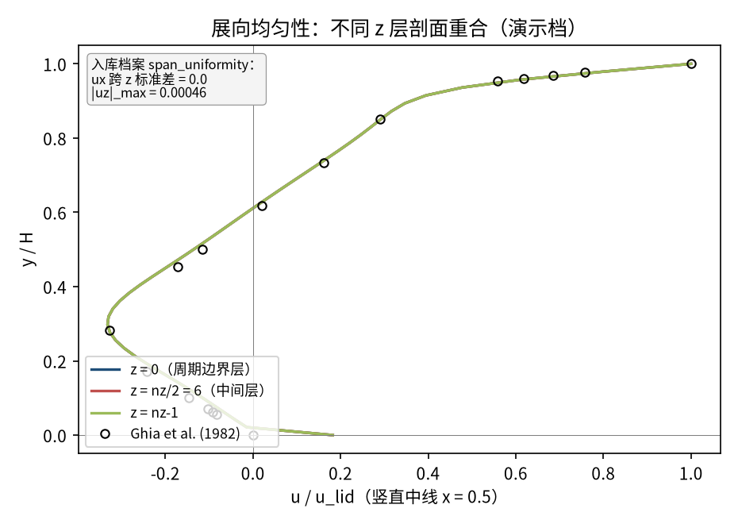
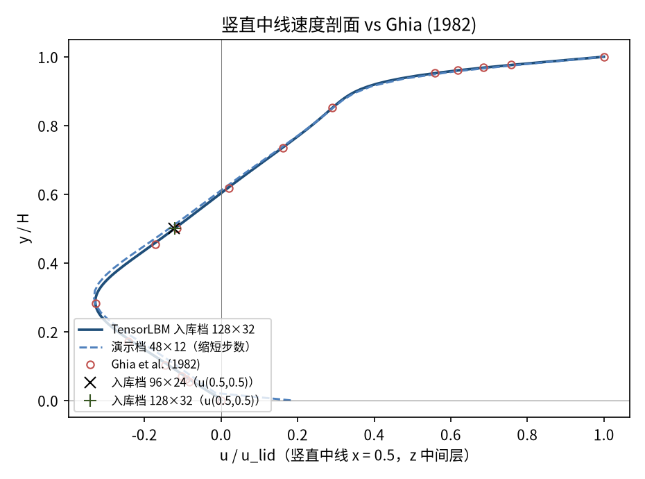
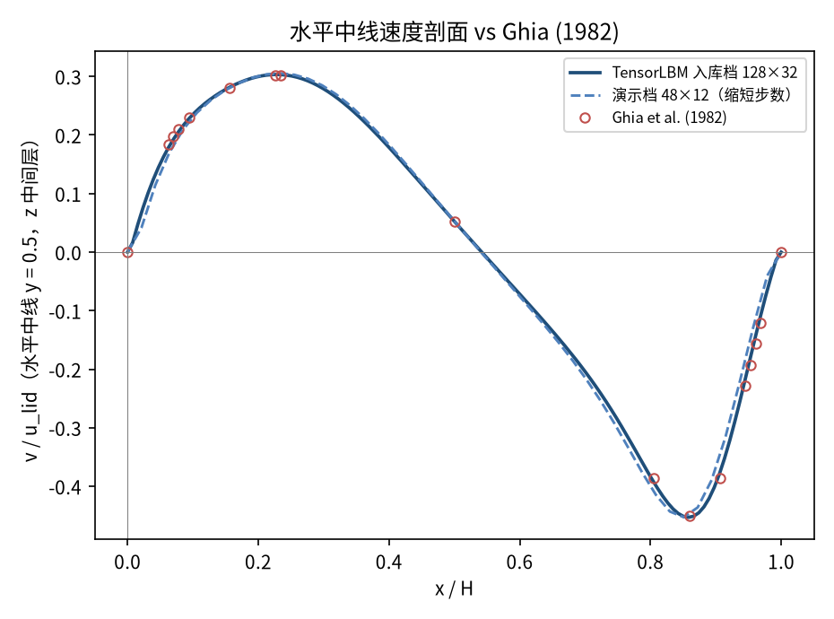
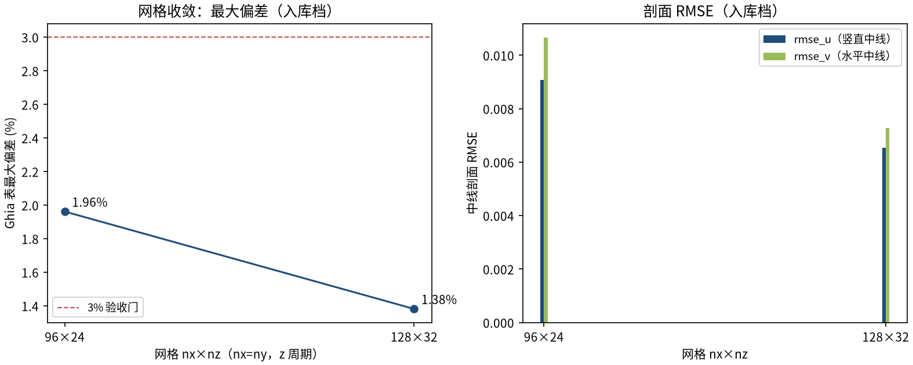

# 3D 方腔流 Re=400（展向周期，D3Q19 MRT）（cavity_3d）

> 3D Spanwise-Periodic Lid-Driven Cavity at Re=400 (D3Q19 MRT)

**摘要** — TensorLBM D3Q19 MRT 三维求解链（collide_mrt3d / stream3d / zou_he_moving_lid_3d）在展向周期方腔 Re=400 上对 Ghia et al. (1982) 二维参考解的直接验证：两档网格 96×24 / 128×32 中线最大偏差 1.96% → 1.38% 单调收敛，展向均匀性 |uz|_max = 0.00046，入库 verified = True。

## 1. Benchmark 介绍

本案例是 2D 方腔的 3D 求解链验证件：f 分布形状 (19, nz, ny, nx)，y 垂直（顶盖 y=ny-1 沿 +x 移动），x 水平，z 展向周期（stream3d 天然周期）。当流动在展向均匀时，3D 解应退化为 2D 基准——因此可用 Ghia (1982) 的 2D 表值直接验证整套 3D 算子（碰撞、流迁、边界）的正确性。

案例 Re = 400，参考解 Ghia et al. (1982) 129×129 多重网格解（内置 GHIA_RE400），涡心参考 (0.5547, 0.6055)。展向等价性由两个档案量背书：ux 跨 z 标准差与 |uz|_max（见结果表），演示图的三个 z 层剖面也逐层重合。

历史注记（入库 key_fix）：自推 D3Q19 Zou-He 顶盖公式的 z 对角对 17/18 颠倒曾是本案例最大陷阱——sum_cyp 误用未知方向 f18 代替已知方向 f17，每步向顶盖注入虚假展向动量（buggy 版 jz=+0.12，修复后精确为 0），曾致大偏差与质量漂移；现用库内置 zou_he_moving_lid_3d（含 z 对角对修复，单测精确守恒）后以两档网格收敛入库。

### 物理与数学背景

不可压 Navier–Stokes 方程的三维格子 Boltzmann 离散：D3Q19 格子、MRT（多弛豫时间）碰撞算子、拉格朗日流迁（z 展向周期）。

```
Re = u_lid·H / ν（H = nx，y 向）
```

```
τ = 3·u_lid·nx / Re + 0.5，格子黏度 ν = (τ−0.5)/3
```

```
f 形状 (Q=19, nz, ny, nx)；macroscopic3d → ρ, ux, uy, uz
```

```
p = ρ·c_s²，c_s² = 1/3（格子单位伪压力）
```

**参考解** — 展向均匀极限下退化为 2D 方腔：Ghia U., Ghia K.N., Shin C.T. (1982) 129×129 多重网格解中线表值；涡心参考 (0.5547, 0.6055)。

**参考文献**

- Ghia U., Ghia K.N., Shin C.T., High-Re solutions for incompressible flow using the Navier-Stokes equations and a multigrid method, J. Comput. Phys. 48 (1982) 387-411.

## 2. 计算条件设置

正式档计算条件取自入库 result.json 与侧车档案 case_*.json（程序化注入）。

| 参数 | 取值 | 说明 |
|---|---|---|
| Re | 400 | 顶盖雷诺数 Re = u_lid·H/ν（H=nx，y 向） |
| 网格（正式档） | 96×24 / 128×32 | f 形状 (19, nz, ny, nx)，nx=ny，z 展向周期 |
| u_lid | 0.06 | 顶盖速度（格子单位，沿 +x） |
| τ | 0.5432 / 0.5576 | 弛豫参数 τ = 3·u_lid·nx/Re + 0.5 |
| 步数（正式档） | 100000 | 两档同长，残差 5.6e-07 / 7.0e-07（内部最大速度变化） |
| 碰撞核 | D3Q19 MRT | tensorlbm.solver3d.collide_mrt3d |
| 边界处理 | V3-3D 配方 | 三静止壁 pre-streaming 半程反弹 + 顶盖 zou_he_moving_lid_3d；z 展向 stream3d 天然周期 |

## 3. 软件使用步骤

**环境** — Python ≥ 3.11；依赖 torch / numpy / matplotlib；仓库 src 可导入（pip install -e . 或 PYTHONPATH=<repo>/src）

**步骤 1**：获取仓库并进入根目录

```bash
git clone https://github.com/cxs503/TensorLBM.git && cd TensorLBM
```

**步骤 2**：安装/指向 tensorlbm 包

```bash
pip install -e .   # 或 export PYTHONPATH=$PWD/src
```

**步骤 3**：单档复现（96²×24 × 100k 步；GPU 可换 --device cuda:1）

```bash
python benchmarks/verified/cavity/3d/run.py single 96 24 /tmp/cavity3d_96.json --device cpu --steps 100000
```

**步骤 4**：正式两档扫描（96²×24 / 128²×32，写出 case_*.json 与 result.json）

```bash
python benchmarks/verified/cavity/3d/run.py both /tmp/cavity3d_out --device96 cuda:1 --device128 cuda:2
```

### 场量可视化演示脚本

场量可视化演示：与正式档同一组库入口，粗网格/缩短步数（48×48×12 × 40000 步，CPU 约 1307 s，残差 8.0e-07，质量漂移 2.05；正式档为 96×24 / 128×32 × 100000 步），输出展向中间层与全场数据；判据数字一律取自入库扫描。

```bash
python docs/benchmarks/demos/cavity_3d_demo.py --nx 48 --nz 12 --steps 40000 --out demo.npz
```

## 4. 计算结果

**表 1 入库扫描结果（两档网格）**

| 量 | 96×24 | 128×32 | 备注 |
|---|---|---|---|
| u(0.5, 0.5) | -0.12349 | -0.12114 | z 中间层中心点（Ghia -0.11477） |
| 主涡心 (x/H, y/H) | (0.5579, 0.6105) | (0.5512, 0.6063) | 参考 Ghia (0.5547, 0.6055) |
| rmse_u | 0.009070 | 0.006530 | 竖直中线 17 点表值 |
| rmse_v | 0.010650 | 0.007270 | 水平中线 17 点表值 |
| max \|偏差\| | 1.9615% | 1.3817% | 两中线全表点（判据量） |
| 展向均匀性 | — | ux 跨 z 标准差 = 0.0；\|uz\|_max = 0.00046 | 入库 result.json span_uniformity（3D→2D 等价性证据） |
| 质量漂移 | — | 93.69（0.018%） | 侧车档案 case_128x32.json |

*来源：benchmarks/verified/cavity/3d/result.json + 侧车档案 case_96x24.json / case_128x32.json（verified_date = 2026-08-19）。*


*图 1 演示档（48²×12 × 40000 步，CPU）展向中间层 z=nz/2 场量：左=速度幅值与流线（主涡形态与 2D 方腔一致），右=压力场 p′ = (ρ−1)/3。3D 案例以中心剖面展示。*

## 5. 与文献 / 解析解的比较

**表 2 与 Ghia et al. (1982) 2D 参考解的比较**

| 量 | 96×24 | 128×32 | 参考/说明 |
|---|---|---|---|
| u(0.5, 0.5) 相对 Ghia | +7.60% | +5.55% | 参考 -0.11477（Ghia 表值） |
| 主涡心偏移 | 0.0059 H | 0.0036 H | 对 Ghia (0.5547, 0.6055) |
| max \|偏差\|（判据量） | 1.9615% | 1.3817% | 单调下降 = True，≤3% 门内，入库 verified = True |



*图 2 展向均匀性（演示档 48×12）：z=0 / z=nz/2 / z=nz-1 三个展向层的竖直中线剖面重合（周期边界层与中间层一致），且贴合 Ghia 表点；文本框为入库档案 span_uniformity 数字。*



*图 3 竖直中线速度剖面 vs Ghia (1982)：实线=入库正式档 128×32（侧车档案全剖面数组），虚线=演示档，× / + 为两档入库 u(0.5,0.5) 锚点。*



*图 4 水平中线速度剖面 vs Ghia (1982)：实线=入库正式档 128×32，虚线=演示档（缩短步数）。*



*图 5 网格收敛（入库判据数字）：max|偏差| 1.96% → 1.38% 单调下降；rmse_u / rmse_v 同步收敛。*

- 误差定义：z 中间层中线剖面 17 个表点的最大绝对偏差（无量纲速度单位）；验收标准 |err| ≤ 3% 且网格细化单调下降。
- 3D→2D 等价性：展向均匀性由 ux 跨 z 标准差与 |uz|_max 两个档案量直接背书（见结果表），非仅靠剖面拟合。
- 本案例为直接观测量对参考解（无任何模型修正或重标定），符合严格入库标准。

## 6. 复现说明

```bash
python benchmarks/verified/cavity/3d/run.py both /tmp/cavity3d_out --device96 cuda:1 --device128 cuda:2
```

**预期结果** — max |偏差| 1.9615% → 1.3817%（单调，≤3%）；u(0.5, 0.5) = -0.12349 / -0.12114（Ghia -0.11477）；主涡心偏移 ≤ 0.0059 H

**参考耗时** — GPU 实测 128²×32 档约 1510 s（侧车档案 elapsed_s，cuda:2）；演示档 CPU 实测 1307 s（48×12 × 40000 步）

**入库位置** — `benchmarks/verified/cavity/3d`

---

*本教程由 TensorLBM benchmark 档案自动生成，判据数字均取自入库 `result.json` 机器档案；演示图为缩短时长的可视化档，定量结论以存档扫描为准。*
