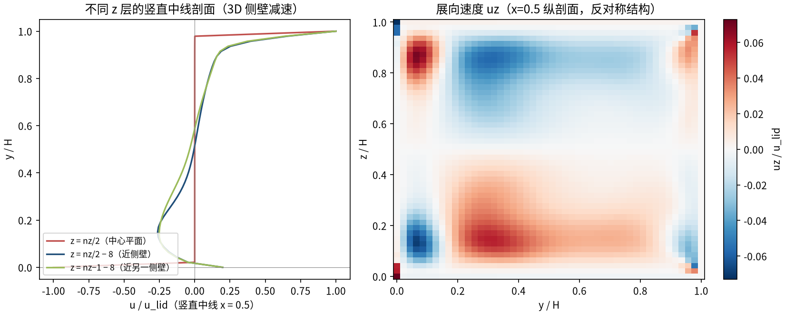
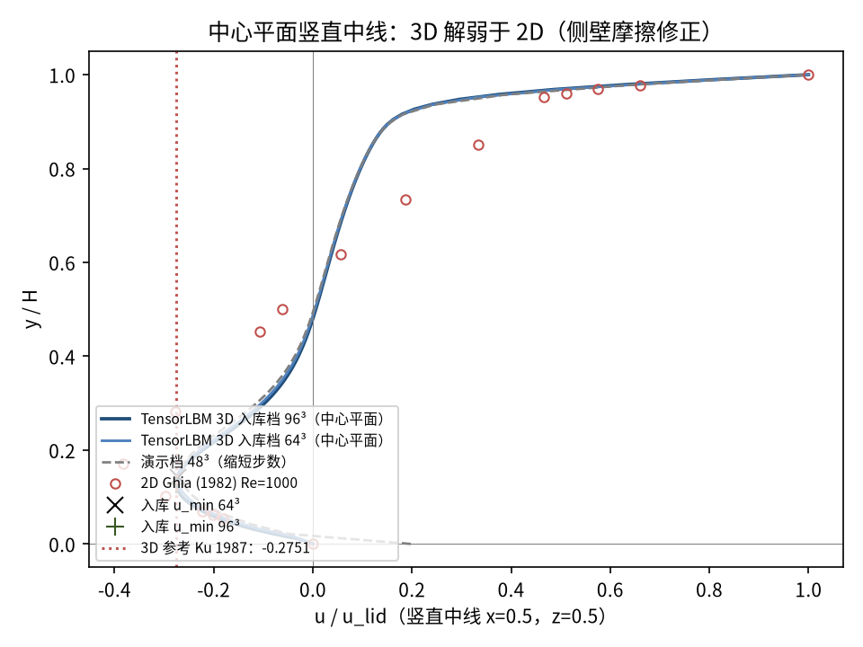
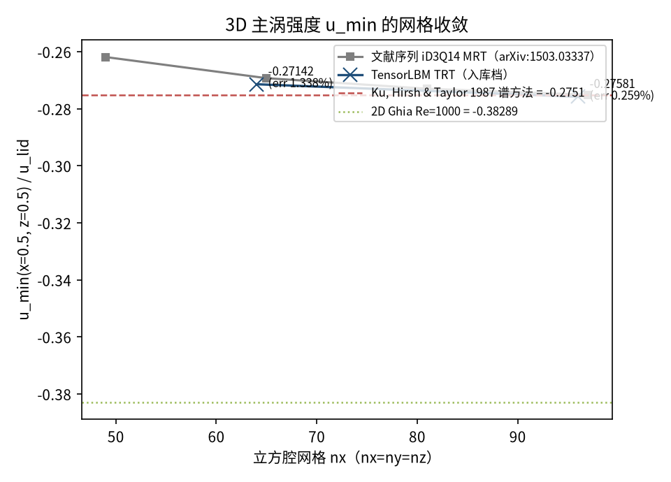

# 全 3D 立方方腔流 Re=1000（5 壁 + 移动顶盖，D3Q19 TRT）（cavity_3d_full）

> Full 3D Cubic Lid-Driven Cavity at Re=1000 (Ku et al., 1987)

**摘要** — TensorLBM D3Q19 TRT 求解器在全 3D 立方腔（5 静止壁 + 移动顶盖）Re=1000 上对 Ku, Hirsh & Taylor (1987) 谱方法基准的验证：中心线最低速度 u_min(x=0.5, z=0.5) 两档网格 64³/96³ 收敛于 -0.27142 → -0.27581，对 Ku 参考 -0.2751 误差 1.34% → 0.26% 单调下降（入库 verified = True）；3D 侧壁摩擦使主涡较 2D Ghia 弱约 28%。

## 1. Benchmark 介绍

全 3D 方腔（立方腔 [0,1]³，5 静止壁 + 顶盖移动）是三维内流的标准基准：与展向周期版不同，展向 z 有限，两侧壁通过摩擦抽走动量，主涡强度显著弱于2D 解，且出现展向速度 uz 的反对称结构——是检验 3D 求解器侧壁边界与三维涡结构的标准场景。

本案例 Re = 1000，定量锚点为中心线最低速度 u_min(x=0.5, z=0.5)：参考取 Ku, Hirsh & Taylor (1987) 谱方法值 -0.2751，并与文献 iD3Q14 MRT 网格收敛序列（arXiv:1503.03337，49³→97³）交叉对照。3D 修正量以 2D Ghia Re=1000 的 u_min = -0.38289 为基线（约 28% 减弱，来自侧壁摩擦）。

碰撞算子选型（入库 run.py 记录）：Re=1000 立方腔冒烟实测中 MRT、RLBM、cumulant、cascaded、KBC 在低 τ 下均快速 NaN，仅 TRT（两弛豫时间，Λ = 0.1875 = 3/16）稳定且 u_min 单调收敛——本档为 TRT 碰撞在 3D 高 Re 的实证。边界为 V3-3D 配方（5 静止壁 pre-streaming 半程反弹 + 顶盖 zou_he_moving_lid_3d）。

### 物理与数学背景

不可压 Navier–Stokes 方程的三维格子 Boltzmann 离散：D3Q19 格子、TRT（两弛豫时间）碰撞算子、拉格朗日流迁（立方腔全域有限边界）。

```
Re = u_lid·H / ν（H = nx）
```

```
τ+ = 3·u_lid·nx / Re + 0.5（快弛豫）；ν = (τ+−0.5)/3
```

```
TRT：Λ = (τ+−0.5)(τ−−0.5) = 0.1875 = 3/16（魔幻参数，精度稳定性折中）
```

```
3D 修正量 = (u_min_3D − u_min_2D) / |u_min_2D|（侧壁摩擦效应）
```

```
p = ρ·c_s²，c_s² = 1/3（格子单位伪压力）
```

**参考解** — Ku H.C., Hirsh R.S., Taylor T.D. (1987) 谱方法 3D 立方腔 Re=1000：u_min(x=0.5, z=0.5) = -0.2751；文献 iD3Q14 序列（arXiv:1503.03337）97³ 收敛到同值。2D 对照 Ghia (1982) u_min = -0.38289。

**参考文献**

- Ku H.C., Hirsh R.S., Taylor T.D., A pseudospectral method for solution of the three-dimensional incompressible Navier-Stokes equations, J. Comput. Phys. 70 (1987) 439-462.
- Ghia U., Ghia K.N., Shin C.T., High-Re solutions for incompressible flow using the Navier-Stokes equations and a multigrid method, J. Comput. Phys. 48 (1982) 387-411.
- Latt J. et al., Numerical analysis of the cumulant lattice Boltzmann stream in a lid-driven cavity flow (iD3Q14 MRT 序列), arXiv:1503.03337.

## 2. 计算条件设置

正式档计算条件取自入库 result.json 与侧车档案 case_643/963.json（程序化注入）。

| 参数 | 取值 | 说明 |
|---|---|---|
| Re | 1000 | 顶盖雷诺数 Re = u_lid·H/ν（H=nx） |
| 几何 | 64³ / 96³ | 立方腔 [0,1]³：5 静止壁 + 顶盖移动，展向有限（非周期） |
| u_lid | 0.06 | 顶盖速度（格子单位，沿 +x） |
| τ+ | 0.51152 / 0.51728 | TRT 快弛豫 τ+ = 3·u_lid·nx/Re + 0.5 |
| Λ_TRT | 0.1875（= 3/16） | TRT 魔幻参数（collide_trt3d 签名默认值） |
| 步数（正式档） | 100000 | 两档同长，残差 9.8e-07 / 3.8e-06 |
| 碰撞核 | D3Q19 TRT | tensorlbm.solver3d.collide_trt3d（Re=1000 唯一实测稳定解） |
| 边界处理 | V3-3D 配方 | 5 静止壁 pre-streaming 半程反弹 + 顶盖 zou_he_moving_lid_3d |

## 3. 软件使用步骤

**环境** — Python ≥ 3.11；依赖 torch / numpy / matplotlib；仓库 src 可导入（pip install -e . 或 PYTHONPATH=<repo>/src）

**步骤 1**：获取仓库并进入根目录

```bash
git clone https://github.com/cxs503/TensorLBM.git && cd TensorLBM
```

**步骤 2**：安装/指向 tensorlbm 包

```bash
pip install -e .   # 或 export PYTHONPATH=$PWD/src
```

**步骤 3**：单档复现（64³ × 100k 步；GPU 可换 --device cuda:2）

```bash
python benchmarks/verified/cavity_3d_full/run.py single 64 /tmp/cavity3df_64.json --device cpu --steps 100000
```

**步骤 4**：正式两档扫描（64³/96³，写出 case_643/963.json 与 result.json）

```bash
python benchmarks/verified/cavity_3d_full/run.py both /tmp/cavity3df_out --device64 cuda:2 --device96 cuda:2
```

### 场量可视化演示脚本

场量可视化演示：与正式档同一组库入口（collide_trt3d），粗网格/缩短步数（48³ × 40000 步，CPU 约 1393 s，残差 2.2e-05；正式档为 64³/96³ × 100000 步），输出中心平面与全场数据（演示档 u_min = -0.2669，未完全收敛，仅用于可视化）；判据数字一律取自入库扫描。

```bash
python docs/benchmarks/demos/cavity_3d_full_demo.py --nx 48 --steps 40000 --out demo.npz
```

## 4. 计算结果

**表 1 入库扫描结果（两档网格）**

| 量 | 64³ | 96³ | 备注 |
|---|---|---|---|
| u_min(x=0.5, z=0.5) | -0.27142 | -0.27581 | 中心线最低速度（判据量；参考 Ku -0.2751） |
| u_min 位置 y/H | 0.1429 | 0.1263 | 主涡核垂向位置 |
| 对 Ku 误差 | 1.338% | 0.259% | 3D 谱方法参考（判据量） |
| 3D 修正量（vs 2D） | 29.11% | 27.96% | 相对 2D Ghia u_min = -0.38289 |
| 两档网格差 | 1.59% | — | 96³ 相对 64³ 的 u_min 变化（收敛中） |
| 耗时 | 779 s | 2729 s | GPU（cuda:2，侧车档案 elapsed_s） |

*来源：benchmarks/verified/cavity_3d_full/result.json + 侧车档案 case_643.json / case_963.json（verified_date = 2026-08-20）。*


*图 1 演示档（48³ × 40000 步，CPU）中心平面 z=nz/2 场量：左=速度幅值与流线（3D 主涡），右=压力场 p′ = (ρ−1)/3。3D 案例以中心剖面展示；演示档缩短步数。*

## 5. 与文献 / 解析解的比较

**表 2 与 Ku et al. (1987) 3D 参考 / 2D Ghia 的比较**

| 量 | 64³ | 96³ | 参考/说明 |
|---|---|---|---|
| u_min vs Ku 1987 | 1.338% | 0.259% | 参考 -0.2751（谱方法）；单调下降 = True，入库 verified = True |
| u_min vs 2D Ghia（3D 修正） | 29.11% | 27.96% | 2D 参考 -0.38289——侧壁摩擦使 3D 主涡弱于 2D |
| 主涡心（中心平面） | (0.5873, 0.4762) | (0.5895, 0.4737) | 2D Ghia 涡心 (0.5313, 0.5625)（定性对照） |
| 展向对称性 | \|uz\| 中平面最大 0.001966 | \|uz\| 中平面最大 0.001301 | 中心平面 uz 应近似为 0（镜像对称） |
| 质量漂移 | 709.6 | 2426.4 | 占初始质量 0.27% / 0.27%（Zou-He 顶盖注质量） |



*图 2 展向结构（演示档 48³）：左=不同 z 层的竖直中线剖面（近侧壁层主涡减速，3D 侧壁摩擦效应），右=x=0.5 纵剖面的展向速度 uz（反对称结构，中心平面 uz≈0）。*



*图 3 中心平面竖直中线剖面：实线=入库档 64³/96³（侧车档案全剖面数组），虚线=演示档，圆点=2D Ghia Re=1000 表值，× / + =两档 u_min 锚点，红点线=Ku 1987 3D 参考 -0.2751——3D 剖面整体弱于 2D，u_min 收敛于 Ku 参考线。*



*图 4 u_min 网格收敛（入库判据数字）：TensorLBM TRT 64³/96³ 误差 1.338% → 0.259% 单调下降，与文献 iD3Q14 序列（49³→97³）同向收敛于 Ku 谱方法值 -0.2751；绿点线为 2D Ghia 值 -0.38289（3D 修正量基线）。*

- 判据量：中心线最低速度 u_min(x=0.5, z=0.5) 对 Ku 谱方法参考的相对误差，两档网格单调下降即达标（无 3% 硬门，3D 基准以交叉文献一致性为准）。
- 3D 修正量（vs 2D Ghia）不是误差而是物理效应：侧壁摩擦使 3D 主涡弱于 2D，两档一致性（约 28-29%）是该效应被正确捕获的证据。
- 中心平面展向对称性（uz 中平面最大值 ~1e-3 量级）与质量漂移（Zou-He 顶盖注入，占初始质量 ~0.26-0.26%）为辅助健康量。
- 本案例为直接观测量对参考解（无任何模型修正或重标定），符合严格入库标准。

## 6. 复现说明

```bash
python benchmarks/verified/cavity_3d_full/run.py both /tmp/cavity3df_out --device64 cuda:2 --device96 cuda:2
```

**预期结果** — u_min = -0.27142 → -0.27581（对 Ku -0.2751 误差 1.338% → 0.259%，单调）；3D 修正量 29.11% → 27.96%

**参考耗时** — GPU 实测 779 s（64³）+ 2729 s（96³）（侧车档案 elapsed_s，cuda:2）；演示档 CPU 实测 1393 s（48³ × 40000 步）

**入库位置** — `benchmarks/verified/cavity_3d_full`

---

*本教程由 TensorLBM benchmark 档案自动生成，判据数字均取自入库 `result.json` 机器档案；演示图为缩短时长的可视化档，定量结论以存档扫描为准。*
