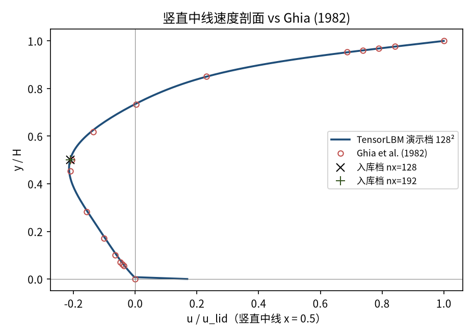
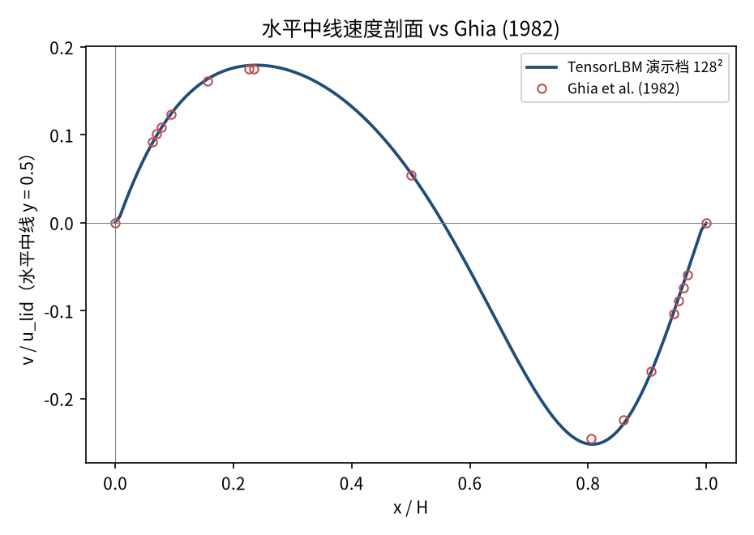
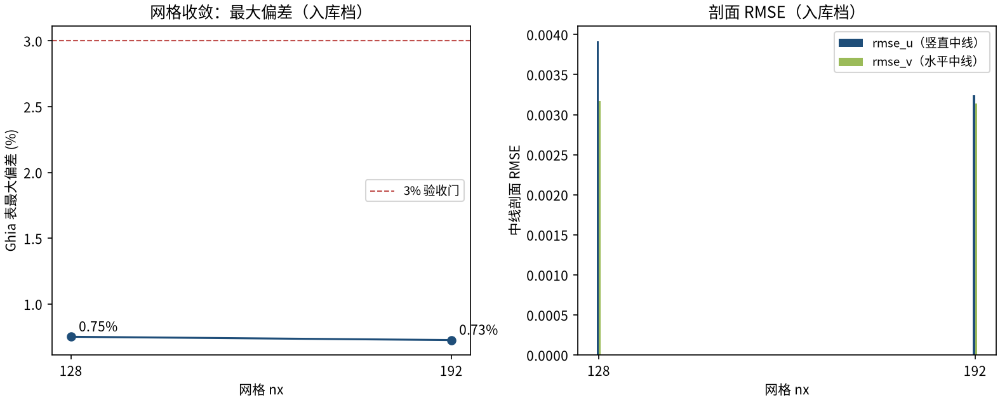

# 顶盖驱动方腔流 Re=100（lid-driven cavity）（cavity_re100）

> Lid-Driven Cavity at Re=100 (Ghia et al., 1982)

**摘要** — TensorLBM D2Q9 MRT 求解器在 Re=100 方腔流上对 Ghia et al. (1982) 129×129 解的直接验证：两档网格 128²/192² 中线剖面最大偏差 0.75% → 0.73% 单调收敛，全部 ≤3%（入库判定 pass = True）。

## 1. Benchmark 介绍

方腔流是计算流体力学最经典的基准算例之一：顶盖以恒定速度 u_lid 拖动腔内流体，腔内形成主涡与次级角涡。几何简单，但包含回流、涡心驻定、剪切层等关键流动结构，是检验求解器精度与边界处理的首选案例。

本案例 Re = u_lid·H/ν = 100，流动为稳态层流。参考解取 Ghia et al. (1982) 的 129×129 多重网格解——方腔流事实上的标准参考；表值内置于库（tensorlbm.lid_driven_cavity.GHIA_RE100，含竖直/水平中线速度与涡心位置）。

历史注记：早期版本三静止壁使用 post-streaming 全步反弹，顶盖动量经周期环绕注入底壁，Re=100 偏差曾达 22.5%；现行 V3 配方（三静止壁 pre-streaming 半程反弹 + 顶盖 Zou/He 动壁）修复后以两档网格收敛入库。

### 物理与数学背景

不可压 Navier–Stokes 方程的格子 Boltzmann 离散：D2Q9 格子、MRT（多弛豫时间）碰撞算子、拉格朗日流迁。

```
Re = u_lid·H / ν
```

```
τ = 3·u_lid·nx / Re + 0.5，格子黏度 ν = (τ−0.5)/3
```

```
p = ρ·c_s²，c_s² = 1/3（格子单位伪压力）
```

**参考解** — Ghia U., Ghia K.N., Shin C.T. (1982) 129×129 多重网格解中线表值；涡心参考 (0.6172, 0.7344)。

**参考文献**

- Ghia U., Ghia K.N., Shin C.T., High-Re solutions for incompressible flow using the Navier-Stokes equations and a multigrid method, J. Comput. Phys. 48 (1982) 387-411.

## 2. 计算条件设置

正式档计算条件取自入库 result.json（程序化注入，下同）。

| 参数 | 取值 | 说明 |
|---|---|---|
| Re | 100 | 顶盖雷诺数 Re = u_lid·H/ν |
| 网格（正式档） | 128² / 192² | 两档网格收敛（入库 result.json） |
| u_lid | 0.06 | 顶盖速度（格子单位） |
| τ | 0.7304 / 0.8456 | 弛豫参数 τ = 3·u_lid·nx/Re + 0.5 |
| 步数（正式档） | 100000 | 两档同长，稳态残差 ≤ 4.4e-07 |
| 碰撞核 | D2Q9 MRT | tensorlbm.solver.collide_mrt |
| 边界处理 | V3 配方 | 三静止壁 pre-streaming 半程反弹 + 顶盖 Zou/He 动壁 |

## 3. 软件使用步骤

**环境** — Python ≥ 3.11；依赖 torch / numpy / matplotlib；仓库 src 可导入（pip install -e . 或 PYTHONPATH=<repo>/src）

**步骤 1**：获取仓库并进入根目录

```bash
git clone https://github.com/cxs503/TensorLBM.git && cd TensorLBM
```

**步骤 2**：安装/指向 tensorlbm 包

```bash
pip install -e .   # 或 export PYTHONPATH=$PWD/src
```

**步骤 3**：单档快速复现（约 3 分钟，CPU）

```bash
python benchmarks/verified/cavity/re100/run.py --nx 128 --device cpu
```

**步骤 4**：正式两档网格收敛扫描，写出判定 result.json

```bash
python benchmarks/verified/cavity/re100/run.py --nx 128 192 --device cpu --out result.json
```

### 场量可视化演示脚本

场量可视化演示：与正式档同一组库入口，缩短步数（128² × 30000 步，CPU 约 38 s），输出速度场/压力场/中线剖面；判据数字一律取自入库扫描，演示档仅用于可视化。

```bash
python docs/benchmarks/demos/cavity_re100_demo.py --nx 128 --steps 30000 --out demo.npz
```

## 4. 计算结果

**表 1 入库扫描结果（两档网格）**

| 量 | nx=128 | nx=192 | 备注 |
|---|---|---|---|
| u(0.5, 0.5) | -0.21085 | -0.21028 | 中心点水平速度（Ghia -0.20581） |
| v(0.5, 0.5) | 0.05653 | 0.05690 | 中心点垂向速度 |
| 主涡心 (x/H, y/H) | (0.6139, 0.7402) | (0.6141, 0.7388) | 参考 Ghia (0.6172, 0.7344) |
| rmse_u | 0.003912 | 0.003239 | 竖直中线 17 点表值 |
| rmse_v | 0.003168 | 0.003143 | 水平中线 17 点表值 |
| max \|偏差\| | 0.7514% | 0.7263% | 两中线全表点（判据量） |
| 耗时 | 159 s | 302 s | CPU，正式档 |

*来源：benchmarks/verified/cavity/re100/result.json（verified_date = 2026-08-19）。*


*图 1 演示档（128² × 30000 步，CPU）场量：左=速度幅值与流线（主涡结构清晰），右=压力场 p′ = (ρ−1)/3（涡心低压、顶盖前缘高压滞止区）。演示档缩短步数，场量形态与正式档一致。*

## 5. 与文献 / 解析解的比较

**表 2 与 Ghia et al. (1982) 的比较**

| 量 | nx=128 | nx=192 | 参考/说明 |
|---|---|---|---|
| u(0.5, 0.5) 相对 Ghia | +2.45% | +2.17% | 参考 -0.20581（Ghia 表值） |
| 主涡心偏移 | 0.0067 H | 0.0054 H | 对 Ghia (0.6172, 0.7344) |
| max \|偏差\|（判据量） | 0.7514% | 0.7263% | 单调下降 = True，≤3% 门内，入库 pass = True |



*图 2 竖直中线速度剖面 vs Ghia (1982) 17 点表值。曲线为演示档，× / + 为入库两档存档值（u(0.5, 0.5)）。*



*图 3 水平中线速度剖面 vs Ghia (1982) 17 点表值（演示档曲线）。*



*图 4 网格收敛（入库判据数字）：max|偏差| 0.75% → 0.73% 单调下降；rmse_u / rmse_v 同步收敛。*

- 误差定义：中线剖面 17 个表点的最大绝对偏差（无量纲速度单位）；验收标准 |err| ≤ 3% 且网格细化单调下降。
- 本案例为直接观测量对参考解（无任何模型修正或重标定），符合严格入库标准。

## 6. 复现说明

```bash
python benchmarks/verified/cavity/re100/run.py --nx 128 192 --device cpu --out result.json
```

**预期结果** — max |偏差| 0.7514% → 0.7263%（单调，≤3%）；u(0.5, 0.5) = -0.21085 / -0.21028（Ghia -0.20581）

**参考耗时** — 约 461 s 合计（CPU 32 线程；GPU 更快）

**入库位置** — `benchmarks/verified/cavity/re100`

---

*本教程由 TensorLBM benchmark 档案自动生成，判据数字均取自入库 `result.json` 机器档案；演示图为缩短时长的可视化档，定量结论以存档扫描为准。*
