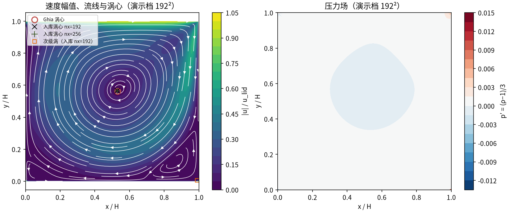
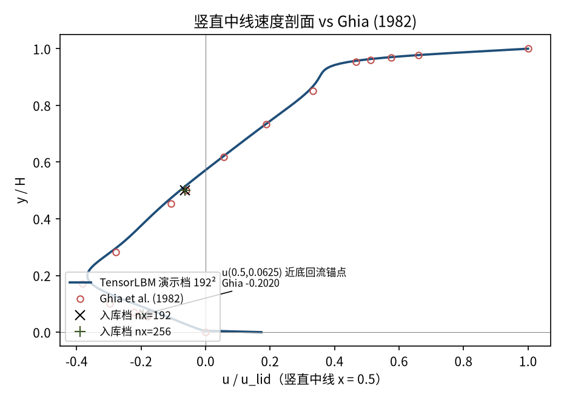
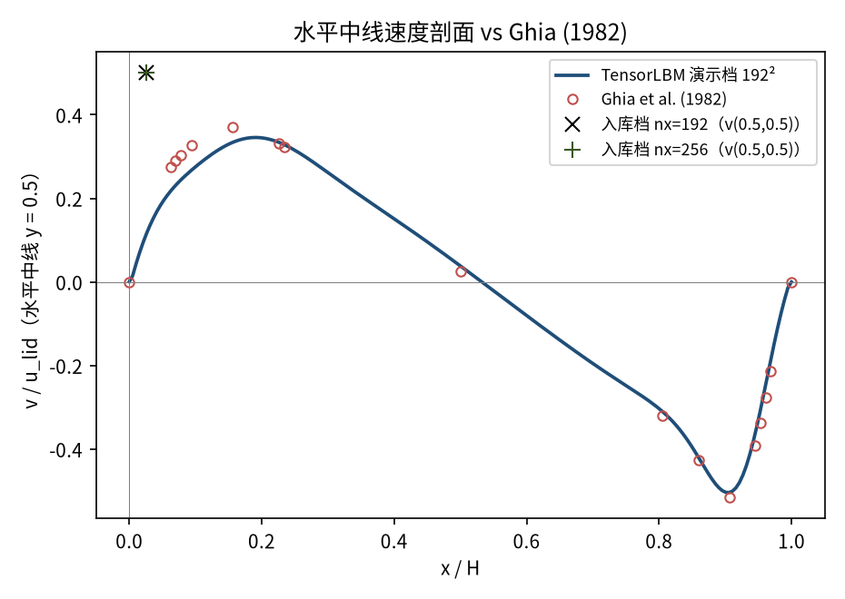
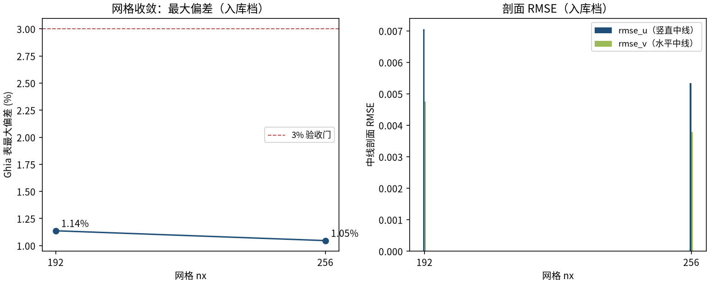

# 顶盖驱动方腔流 Re=1000（lid-driven cavity，RLBM 碰撞）（cavity_re1000）

> Lid-Driven Cavity at Re=1000 (Ghia et al., 1982; RLBM collision)

**摘要** — TensorLBM D2Q9 RLBM（正则化 BGK）求解器在 Re=1000 方腔流上对 Ghia et al. (1982) 129×129 解的直接验证：两档网格 192²/256² × 200k 步长收敛，中线剖面最大偏差 1.14% → 1.05% 单调收敛，全部 ≤3%（入库判定 pass = True）。Re=1000 超出 MRT 稳定域，本档为 collide_rlbm 的稳定性与精度实证。

## 1. Benchmark 介绍

方腔流是计算流体力学最经典的基准算例之一：顶盖以恒定速度 u_lid 拖动腔内流体，腔内形成主涡与次级角涡。Re=1000 时主涡心向腔心移动，左下/右下角出现明确的次级角涡，是层流方腔谱系中检验求解器黏性下限稳定性的标准档位。

本案例 Re = u_lid·H/ν = 1000，参考解取 Ghia et al. (1982) 129×129 多重网格解，主涡心参考 (0.5313, 0.5625)、u(0.5,0.5) = -0.06080（表值内置于库 tensorlbm.lid_driven_cavity.GHIA_RE1000）。

碰撞算子选型是本案例的核心看点（入库 key_fix 记录）：MRT 在 Re=1000 等 Re 配方（τ=0.5346@192²）下于早期步 NaN 发散，τ 扫描给出稳定边界 τ ≥ 0.56，即 MRT 稳定上限约 Re~576（u_lid=0.06）。改用库内 collide_rlbm（Latt & Chopard 2006 正则化 BGK——非平衡分布投影到二阶 Hermite 子空间、滤除高阶鬼矩，专为 τ→0.5 低粘稳定设计）后稳定达标。此外 Re=1000 主涡演化慢：200k 步长收敛才把两档残差压到 ~1e-5 量级，两档误差单调下降成立。

### 物理与数学背景

不可压 Navier–Stokes 方程的格子 Boltzmann 离散：D2Q9 格子、RLBM（正则化 BGK）碰撞算子、拉格朗日流迁。

```
Re = u_lid·H / ν
```

```
τ = 3·u_lid·nx / Re + 0.5，格子黏度 ν = (τ−0.5)/3
```

```
RLBM：f_neq^reg = 以二阶 Hermite 基重建的非平衡分布（滤除高阶鬼矩）
```

```
p = ρ·c_s²，c_s² = 1/3（格子单位伪压力）
```

**参考解** — Ghia U., Ghia K.N., Shin C.T. (1982) 129×129 多重网格解中线表值；Re=1000 主涡心参考 (0.5313, 0.5625)。

**参考文献**

- Ghia U., Ghia K.N., Shin C.T., High-Re solutions for incompressible flow using the Navier-Stokes equations and a multigrid method, J. Comput. Phys. 48 (1982) 387-411.
- Latt J., Chopard B., A benchmark study of Lattice Boltzmann models for flows with a reference velocity, Math. Comput. Simul. 72 (2006) 165-168.

## 2. 计算条件设置

正式档计算条件取自入库 result.json（程序化注入，下同）。

| 参数 | 取值 | 说明 |
|---|---|---|
| Re | 1000 | 顶盖雷诺数 Re = u_lid·H/ν |
| 网格（正式档） | 192² / 256² | 两档网格收敛（入库 result.json） |
| u_lid | 0.06 | 顶盖速度（格子单位） |
| τ | 0.53456 / 0.54608 | 弛豫参数 τ = 3·u_lid·nx/Re + 0.5 |
| 步数（正式档） | 200000 | 两档同长（Re=1000 收敛慢），残差 1.1e-05 / 2.4e-05 |
| 碰撞核 | D2Q9 RLBM | tensorlbm.solver.collide_rlbm（正则化 BGK） |
| 边界处理 | V3 配方 | 三静止壁 pre-streaming 半程反弹 + 顶盖 Zou/He 动壁 |

## 3. 软件使用步骤

**环境** — Python ≥ 3.11；依赖 torch / numpy / matplotlib；仓库 src 可导入（pip install -e . 或 PYTHONPATH=<repo>/src）

**步骤 1**：获取仓库并进入根目录

```bash
git clone https://github.com/cxs503/TensorLBM.git && cd TensorLBM
```

**步骤 2**：安装/指向 tensorlbm 包

```bash
pip install -e .   # 或 export PYTHONPATH=$PWD/src
```

**步骤 3**：单档复现（192² × 200k 步，CPU 约 15-20 分钟）

```bash
python benchmarks/verified/cavity/re1000/run.py --nx 192 --device cpu
```

**步骤 4**：正式两档网格收敛扫描（result.json 写回案例目录）

```bash
python benchmarks/verified/cavity/re1000/run.py --nx 192 256 --device cpu
```

### 场量可视化演示脚本

场量可视化演示：与正式档同一组库入口（collide_rlbm），缩短步数（192² × 60000 步，CPU 约 1251 s，残差 1.6e-03；正式档为 200k 步），输出速度场/压力场/中线剖面；判据数字一律取自入库扫描，演示档仅用于可视化。

```bash
python docs/benchmarks/demos/cavity_re1000_demo.py --nx 192 --steps 60000 --out demo.npz
```

## 4. 计算结果

**表 1 入库扫描结果（两档网格）**

| 量 | nx=192 | nx=256 | 备注 |
|---|---|---|---|
| u(0.5, 0.5) | -0.06428 | -0.06349 | 中心点水平速度（Ghia -0.06080） |
| u(0.5, 0.0625) | -0.19072 | -0.19343 | 近底壁回流（Ghia 表值 -0.20196） |
| v(0.5, 0.5) | 0.02558 | 0.02564 | 中心点垂向速度 |
| 主涡心 (x/H, y/H) | (0.5288, 0.5654) | (0.5294, 0.5647) | 参考 Ghia (0.5313, 0.5625) |
| 次级涡贴角点 | (0.9895, 0.0052) | (0.9961, 0.0039) | 右下角次级涡（角部分辨率受网格限制） |
| rmse_u | 0.007047 | 0.005345 | 竖直中线 17 点表值 |
| rmse_v | 0.004762 | 0.003785 | 水平中线 17 点表值 |
| max \|偏差\| | 1.1373% | 1.0465% | 两中线全表点（判据量） |
| 耗时 | 201 s | 201 s | GPU（cuda:1，result.json elapsed_s） |

*来源：benchmarks/verified/cavity/re1000/result.json（verified_date = 2026-08-19）。*



*图 1 演示档（192² × 60000 步，CPU）场量：左=速度幅值与流线，叠加涡心锚点——红圈为 Ghia 参考涡心，×/+ 为入库两档主涡心，橙方框为入库 nx=192 次级涡贴角位置；右=压力场 p′ = (ρ−1)/3（主涡心低压、顶盖前缘滞止高压、角涡次级低压痕）。*

## 5. 与文献 / 解析解的比较

**表 2 与 Ghia et al. (1982) 的比较**

| 量 | nx=192 | nx=256 | 参考/说明 |
|---|---|---|---|
| u(0.5, 0.5) 相对 Ghia | +5.73% | +4.43% | 参考 -0.06080（Ghia 表值） |
| u(0.5, 0.0625) 相对 Ghia | -5.57% | -4.22% | 参考 -0.20196（Ghia 表 y=0.0625 行） |
| 主涡心偏移 | 0.0038 H | 0.0029 H | 对 Ghia (0.5313, 0.5625) |
| max \|偏差\|（判据量） | 1.1373% | 1.0465% | 单调下降 = True，≤3% 门内，入库 pass = True |



*图 2 竖直中线速度剖面 vs Ghia (1982) 17 点表值。曲线为演示档，× / + 为入库两档存档值（y=0.5 中心点与 y=0.0625 近底回流锚点）。*



*图 3 水平中线速度剖面 vs Ghia (1982) 17 点表值（演示档曲线 + 入库两档 v(0.5,0.5) 锚点）。*



*图 4 网格收敛（入库判据数字）：max|偏差| 1.14% → 1.05% 单调下降；rmse_u / rmse_v 同步收敛。*

- 误差定义：中线剖面 17 个表点的最大绝对偏差（无量纲速度单位）；验收标准 |err| ≤ 3% 且网格细化单调下降。
- 本案例为直接观测量对参考解（无任何模型修正或重标定），符合严格入库标准。
- 次级角涡：速度场捕获左下角回流方向正确；角涡心的精确定位受网格限制（入库 sub_vortex 贴角），达标判定不依赖角涡定位。

## 6. 复现说明

```bash
python benchmarks/verified/cavity/re1000/run.py --nx 192 256 --device cpu
```

**预期结果** — max |偏差| 1.1373% → 1.0465%（单调，≤3%）；u(0.5, 0.5) = -0.06428 / -0.06349（Ghia -0.06080）；主涡心偏移 ≤ 0.0038 H

**参考耗时** — GPU 实测各档约 201 / 201 s（result.json elapsed_s，cuda:1）；CPU 32 线程约 15-20 分钟/档

**入库位置** — `benchmarks/verified/cavity/re1000`

---

*本教程由 TensorLBM benchmark 档案自动生成，判据数字均取自入库 `result.json` 机器档案；演示图为缩短时长的可视化档，定量结论以存档扫描为准。*
