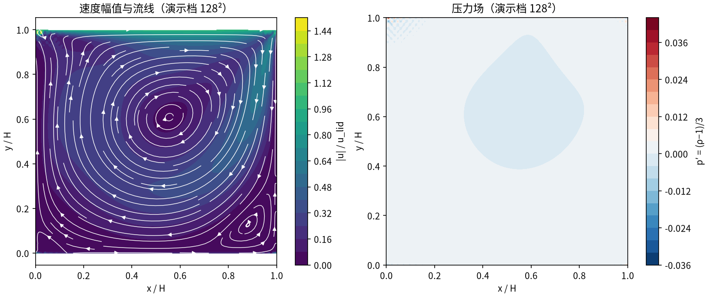
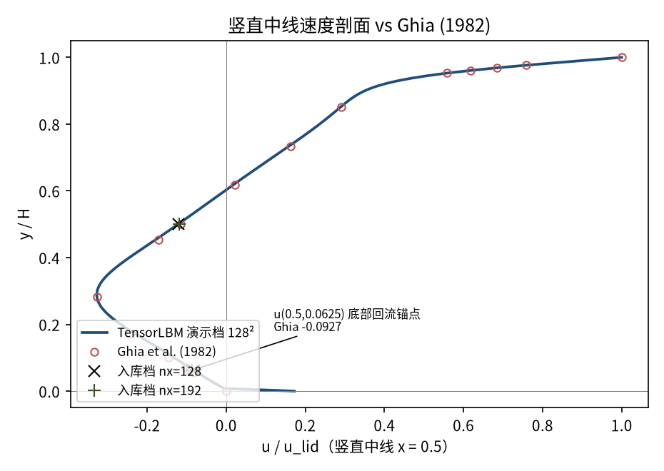
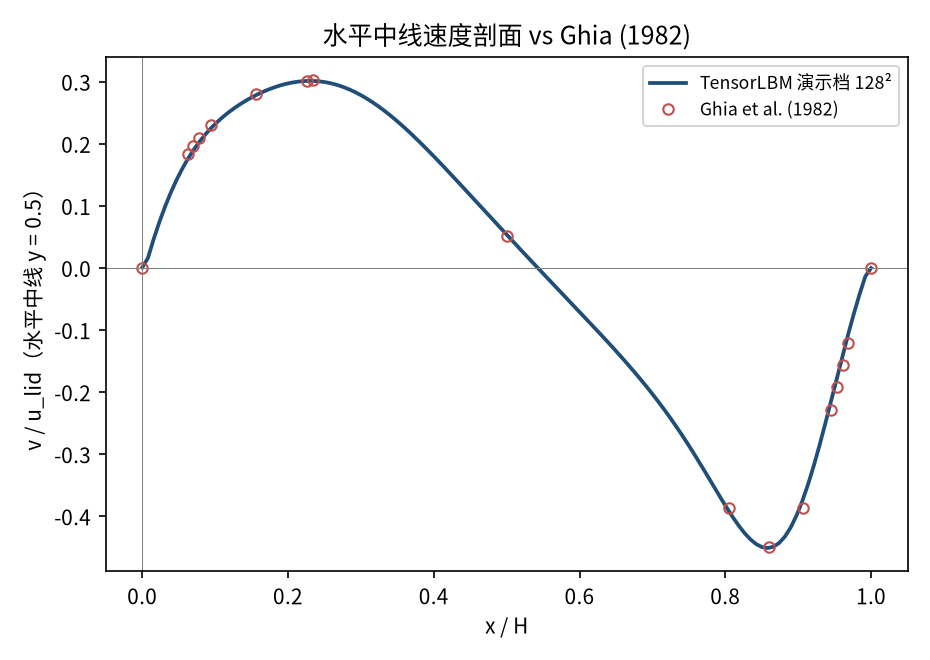
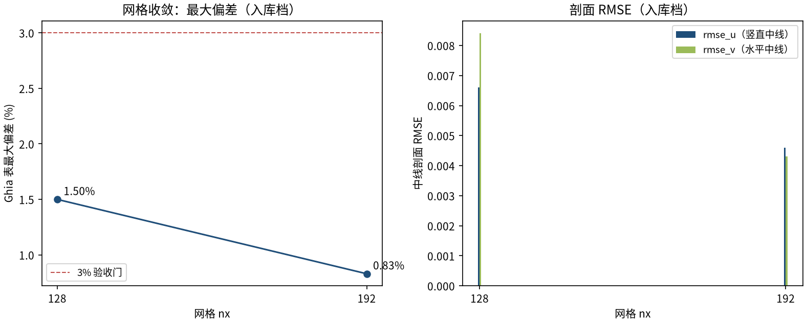

# 顶盖驱动方腔流 Re=400（lid-driven cavity）（cavity_re400）

> Lid-Driven Cavity at Re=400 (Ghia et al., 1982)

**摘要** — TensorLBM D2Q9 MRT 求解器在 Re=400 方腔流上对 Ghia et al. (1982) 129×129 解的直接验证：两档网格 128²/192² 中线剖面最大偏差 1.50% → 0.83% 单调收敛，全部 ≤3%（入库判定 verified = True）。

## 1. Benchmark 介绍

方腔流是计算流体力学最经典的基准算例之一：顶盖以恒定速度 u_lid 拖动腔内流体，腔内形成主涡与次级角涡。几何简单，但包含回流、涡心驻定、剪切层等关键流动结构，是检验求解器精度与边界处理的首选案例。

本案例 Re = u_lid·H/ν = 400，稳态层流，主涡心参考 (0.5547, 0.6055)。与 Re=100 档相比，Re=400 主涡更扁、下游次级角涡开始出现，对边界配方的动量守恒更敏感。参考解取 Ghia et al. (1982) 129×129 多重网格解——方腔流事实上的标准参考；表值内置于库（tensorlbm.lid_driven_cavity.GHIA_RE400，含竖直/水平中线速度 17 点表）。

历史注记（入库 key_fix）：早期 V0 配方（post-streaming 全步反弹）使顶盖动量经周期环绕注入底壁，底部回流过量 2.6 倍，曾造成 23.6% 系统性偏差；现行 V3 配方（三静止壁 pre-streaming 半程反弹 + 顶盖 Zou/He 动壁）修复后以两档网格收敛入库。

### 物理与数学背景

不可压 Navier–Stokes 方程的格子 Boltzmann 离散：D2Q9 格子、MRT（多弛豫时间）碰撞算子、拉格朗日流迁。

```
Re = u_lid·H / ν
```

```
τ = 3·u_lid·nx / Re + 0.5，格子黏度 ν = (τ−0.5)/3
```

```
p = ρ·c_s²，c_s² = 1/3（格子单位伪压力）
```

**参考解** — Ghia U., Ghia K.N., Shin C.T. (1982) 129×129 多重网格解中线表值；Re=400 涡心参考 (0.5547, 0.6055)。

**参考文献**

- Ghia U., Ghia K.N., Shin C.T., High-Re solutions for incompressible flow using the Navier-Stokes equations and a multigrid method, J. Comput. Phys. 48 (1982) 387-411.

## 2. 计算条件设置

正式档计算条件取自入库 result.json（程序化注入，下同）。

| 参数 | 取值 | 说明 |
|---|---|---|
| Re | 400 | 顶盖雷诺数 Re = u_lid·H/ν |
| 网格（正式档） | 128² / 192² | 两档网格收敛（入库 result.json） |
| u_lid | 0.06 | 顶盖速度（格子单位） |
| τ | 0.5576 / 0.5864 | 弛豫参数 τ = 3·u_lid·nx/Re + 0.5 |
| 步数（正式档） | 100000 | 两档同长，稳态残差 ≤ 3.4e-05 |
| 碰撞核 | D2Q9 MRT | tensorlbm.solver.collide_mrt |
| 边界处理 | V3 配方 | 三静止壁 pre-streaming 半程反弹 + 顶盖 Zou/He 动壁 |

## 3. 软件使用步骤

**环境** — Python ≥ 3.11；依赖 torch / numpy / matplotlib；仓库 src 可导入（pip install -e . 或 PYTHONPATH=<repo>/src）

**步骤 1**：获取仓库并进入根目录

```bash
git clone https://github.com/cxs503/TensorLBM.git && cd TensorLBM
```

**步骤 2**：安装/指向 tensorlbm 包

```bash
pip install -e .   # 或 export PYTHONPATH=$PWD/src
```

**步骤 3**：单档快速复现（128² × 100k 步，CPU 数分钟）

```bash
python benchmarks/verified/cavity/re400/run.py --nx 128 --device cpu
```

**步骤 4**：正式两档网格收敛扫描，写出判定 result.json

```bash
python benchmarks/verified/cavity/re400/run.py --nx 128 192 --device cpu --out result.json
```

### 场量可视化演示脚本

场量可视化演示：与正式档同一组库入口，缩短步数（128² × 60000 步，CPU 约 1159 s，残差 5.0e-05），输出速度场/压力场/中线剖面；判据数字一律取自入库扫描，演示档仅用于可视化。

```bash
python docs/benchmarks/demos/cavity_re400_demo.py --nx 128 --steps 60000 --out demo.npz
```

## 4. 计算结果

**表 1 入库扫描结果（两档网格）**

| 量 | nx=128 | nx=192 | 备注 |
|---|---|---|---|
| u(0.5, 0.5) | -0.12110 | -0.11930 | 中心点水平速度（Ghia -0.11480） |
| u(0.5, 0.0625) | -0.08240 | -0.08630 | 近底壁回流（Ghia 表值 -0.09266） |
| rmse_u | 0.006600 | 0.004600 | 竖直中线 17 点表值 |
| rmse_v | 0.008400 | 0.004300 | 水平中线 17 点表值 |
| max \|偏差\| | 1.5000% | 0.8300% | 两中线全表点（判据量） |
| 稳态残差 | 1.4e-06 | 3.4e-05 | 深度稳态（间隔 10000 步最大速度变化） |

*来源：benchmarks/verified/cavity/re400/result.json（verified_date = 2026-08-19）。*



*图 1 演示档（128² × 60000 步，CPU）场量：左=速度幅值与流线（主涡略扁、下游次级角涡萌生），右=压力场 p′ = (ρ−1)/3（涡心低压、顶盖前缘高压滞止区）。演示档缩短步数，场量形态与正式档一致。*

## 5. 与文献 / 解析解的比较

**表 2 与 Ghia et al. (1982) 的比较**

| 量 | nx=128 | nx=192 | 参考/说明 |
|---|---|---|---|
| u(0.5, 0.5) 相对 Ghia | +5.49% | +3.92% | 参考 -0.11480（Ghia 表值） |
| u(0.5, 0.0625) 相对 Ghia | -11.07% | -6.86% | 参考 -0.09266（Ghia 表 y=0.0625 行） |
| max \|偏差\|（判据量） | 1.5000% | 0.8300% | 单调下降 = True，≤3% 门内，入库 verified = True |



*图 2 竖直中线速度剖面 vs Ghia (1982) 17 点表值。曲线为演示档，× / + 为入库两档存档值（y=0.5 中心点与 y=0.0625 近底壁回流锚点）。*



*图 3 水平中线速度剖面 vs Ghia (1982) 17 点表值（演示档曲线）。*



*图 4 网格收敛（入库判据数字）：max|偏差| 1.50% → 0.83% 单调下降；rmse_u / rmse_v 同步收敛。*

- 误差定义：中线剖面 17 个表点的最大绝对偏差（无量纲速度单位）；验收标准 |err| ≤ 3% 且网格细化单调下降。
- 本案例为直接观测量对参考解（无任何模型修正或重标定），符合严格入库标准。

## 6. 复现说明

```bash
python benchmarks/verified/cavity/re400/run.py --nx 128 192 --device cpu --out result.json
```

**预期结果** — max |偏差| 1.5000% → 0.8300%（单调，≤3%）；u(0.5, 0.5) = -0.12110 / -0.11930（Ghia -0.11480）

**参考耗时** — CPU 估算约 1931 s（128²）+ 4345 s（192²），由演示档实测（128² × 60000 步 1159 s）按步数/网格比外推；GPU 更快

**入库位置** — `benchmarks/verified/cavity/re400`

---

*本教程由 TensorLBM benchmark 档案自动生成，判据数字均取自入库 `result.json` 机器档案；演示图为缩短时长的可视化档，定量结论以存档扫描为准。*
