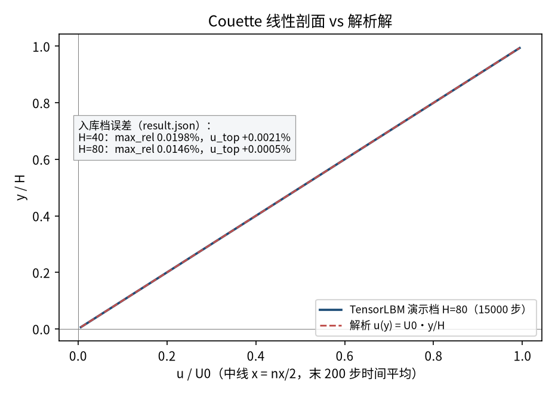
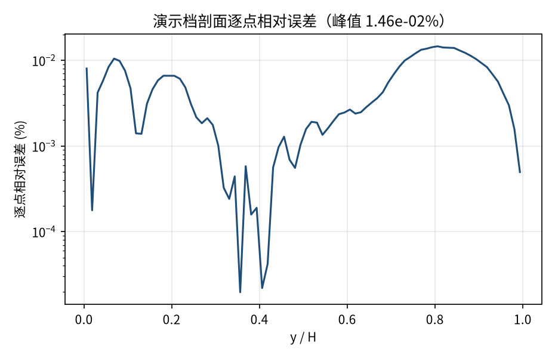
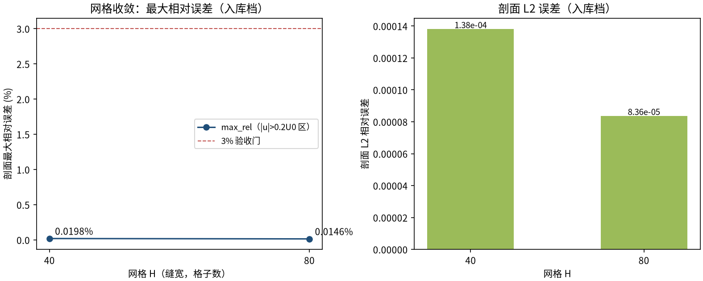

# 二维 Couette 流（平板剪切流）— 解析线性剖面验证（couette_2d）

> Plane Couette Flow (Analytic Linear Profile, D2Q9)

**摘要** — TensorLBM D2Q9 BGK 求解器在平板 Couette 流上对解析线性剖面的直接验证：上壁以 U0 运动、下壁静止，半程反弹 + 动壁动量注入；两档网格 H=40/80 剖面最大相对误差 0.0198% → 0.0146% 单调下降，远低于 3% 验收门（入库判定 verified，2026-08-18）。

## 1. Benchmark 介绍

Couette 流是两平行平板间的剪切流：上壁以恒定速度 U0 拖动流体，下壁静止，x 方向周期。稳态解是精确的线性速度剖面 u(y) = U0·y/H，对任意 Re 成立（剖面形状与 Re 无关），是检验动壁边界处理与黏性恢复的最基础基准。

本案例的关键测试点是移动壁边界：半程反弹的动壁版本在反射分布上叠加标准动量注入项 2·w_q·ρ·(c_q·u_wall)/cs²（Zou & He 1997 / Ladd 1994 教材形式），每步向上壁邻域流体注入恰好正确的 x 动量；下壁 u_wall=0 退化为普通反弹。

全部边界与碰撞走 tensorlbm 公共入口（d2q9 / solver），无手写物理核、无修正因子、无外推（extrap: none）——真实模拟直接对解析解。

### 物理与数学背景

不可压 Navier–Stokes 方程的格子 Boltzmann 离散：D2Q9 格子、BGK 单弛豫碰撞、拉格朗日流迁；壁面 pre-streaming 半程反弹。

```
u(y) = U0 · y / H（稳态精确解，任意 Re）
```

```
ν = (τ − 0.5)/3，τ = 0.8 → ν = 0.1
```

```
Re = U0·H/ν，Ma = U0/c_s，c_s² = 1/3
```

```
壁面剪切 τ_w = ρ·ν·U0/H（与离散斜率一致）
```

```
动壁反弹：f_new[q] = f_pre[opp(q)] + 2·w_q·ρ·(c_q·u_wall)/cs²
```

**参考解** — 线性 Couette 剖面 u(y) = U0·y/H 为教科书精确解；半程反弹把无滑移壁精确置于 y = 0.5 与 y = ny−1.5（有效缝宽 H = ny−2）。

**参考文献**

- Zou, Q. & He, X. (1997). On pressure and velocity boundary conditions for the lattice Boltzmann BGK model. Phys. Fluids 9, 1591-1598.
- Ladd, A.J.C. (1994). Numerical simulations of particulate suspensions via a discretized Boltzmann equation. J. Fluid Mech. 271, 285-339.

## 2. 计算条件设置

正式档计算条件取自入库 result.json（程序化注入，下同）。

| 参数 | 取值 | 说明 |
|---|---|---|
| 格子 / 碰撞 | D2Q9 / BGK | tensorlbm.solver.collide_bgk + stream |
| 边界处理 | 动壁半程反弹（pre-streaming） | 上壁 U0 运动 + 下壁静止，f_pre[opp] + 2·w·ρ·(c·u_w)/cs² 动量注入；x 向周期 |
| 驱动方式 | 上壁剪切拖动 | U0 = 0.05（格子单位） |
| τ / ν | 0.8 / 0.1 | ν = (τ−0.5)/3 |
| 网格（正式档） | H=40 / H=80 | ny=H+2（壁面行 y=0 与 ny−1），x 周期 |
| Re（正式档） | 20 / 40 | Re = U0·H/ν（剖面形状与 Re 无关） |
| Ma | 0.0866 | U0/c_s，c_s² = 1/3 |
| 解析参考 | u(y) = U0·y/H | 线性 Couette 剖面，精确解 |

## 3. 软件使用步骤

**环境** — Python ≥ 3.11；依赖 torch / numpy / matplotlib；仓库 src 可导入（pip install -e . 或 PYTHONPATH=<repo>/src）

**步骤 1**：获取仓库并进入根目录

```bash
git clone https://github.com/cxs503/TensorLBM.git && cd TensorLBM
```

**步骤 2**：安装/指向 tensorlbm 包

```bash
pip install -e .   # 或 export PYTHONPATH=$PWD/src
```

**步骤 3**：单档快速复现（H=40，CPU，约 1 分钟）

```bash
python benchmarks/verified/couette_2d/run.py single 40 case_h40.json --device cpu
```

**步骤 4**：正式两档网格收敛扫描（与入库 run 同参数）

```bash
python benchmarks/verified/couette_2d/run.py scan couette_scan --H 40 80 --tau 0.8 --u0 0.05 --device cpu
```

### 场量可视化演示脚本

场量可视化演示：与正式档同一组库入口，H=80（ny=82×nx=80）× 15000 步，CPU 约 14 s，输出速度场/中线剖面/解析对比；判据数字一律取自入库扫描，演示档仅用于可视化。

```bash
python docs/benchmarks/demos/couette_2d_demo.py --H 80 --steps 15000 --out demo.npz
```

## 4. 计算结果

**表 1 入库扫描结果（两档网格）**

| 量 | H=40 | H=80 | 备注 |
|---|---|---|---|
| Re | 20 | 40 | U0·H/ν |
| L2 相对误差 | 1.38e-04 | 8.36e-05 | 全剖面（判据量） |
| 最大相对误差 | 0.0198% | 0.0146% | 中心区 \|u\|>0.2·U0（判据量） |
| 顶行速度误差 | +0.0021% | +0.0005% | 最上流体行 vs U0·(1−0.5/H) |
| 稳态 | 是 | 是 | 漂移判据 <1e-5 |

*来源：benchmarks/verified/couette_2d/result.json（verified_date = 2026-08-18）。*


*图 1 演示档（82×80 × 15000 步，CPU）场量：左=速度幅值 |u|/U0 与矢量场（线性剪切、水平流线），虚线标注运动上壁与静止下壁；右=横向分量 |uy|/U0（对数色标，量级 1e-7 以下，证实流动为一维纯剪切）。*

## 5. 与文献 / 解析解的比较

**表 2 与解析线性剖面的比较（入库判据）**

| 量 | H=40 | H=80 | 参考/说明 |
|---|---|---|---|
| 最大相对误差收敛 | 0.0198% | 0.0146% | 单调下降 = True，远低于 3% 门 |
| L2 收敛 | 1.38e-04 | 8.36e-05 | 二阶收敛趋势（误差 ~ H⁻¹ 量级受边界离散主导） |
| 入库判定 | verified | 2026-08-18 | 真实模拟（extrap: none）+ 两档收敛 → 达标 |



*图 2 中线速度剖面 vs 解析解 u=U0·y/H。曲线为演示档（末 200 步时间平均）；文本框为入库两档存档误差（max_rel 与顶行速度误差）。*



*图 3 演示档剖面逐点相对误差（对数纵轴）：全缝宽内低于约 1e-3%，靠近下壁 y→0 处因参考速度趋零而放大（相对误差口径固有）。*



*图 4 网格收敛（入库判据数字）：max_rel 0.0198% → 0.0146% 单调下降；L2 1.38e-04 → 8.36e-05。*

- 误差定义：剖面最大相对误差取中心区 |u| > 0.2·U0（远离参考速度趋零的下壁）；L2 为全剖面相对误差。验收标准 ≤3% 且网格细化单调下降。
- 本案例为直接观测量对解析解（无模型修正、无重标定、extrap: none），符合严格入库标准。

## 6. 复现说明

```bash
python benchmarks/verified/couette_2d/run.py scan couette_scan --H 40 80 --tau 0.8 --u0 0.05 --device cpu
```

**预期结果** — max_rel 0.0198% → 0.0146%（单调，≤3%）；L2 1.38e-04 → 8.36e-05；顶行速度误差 +0.0021% / +0.0005%

**参考耗时** — 两档合计约 2-3 分钟（CPU；GPU 更快）

**入库位置** — `benchmarks/verified/couette_2d`

---

*本教程由 TensorLBM benchmark 档案自动生成，判据数字均取自入库 `result.json` 机器档案；演示图为缩短时长的可视化档，定量结论以存档扫描为准。*
