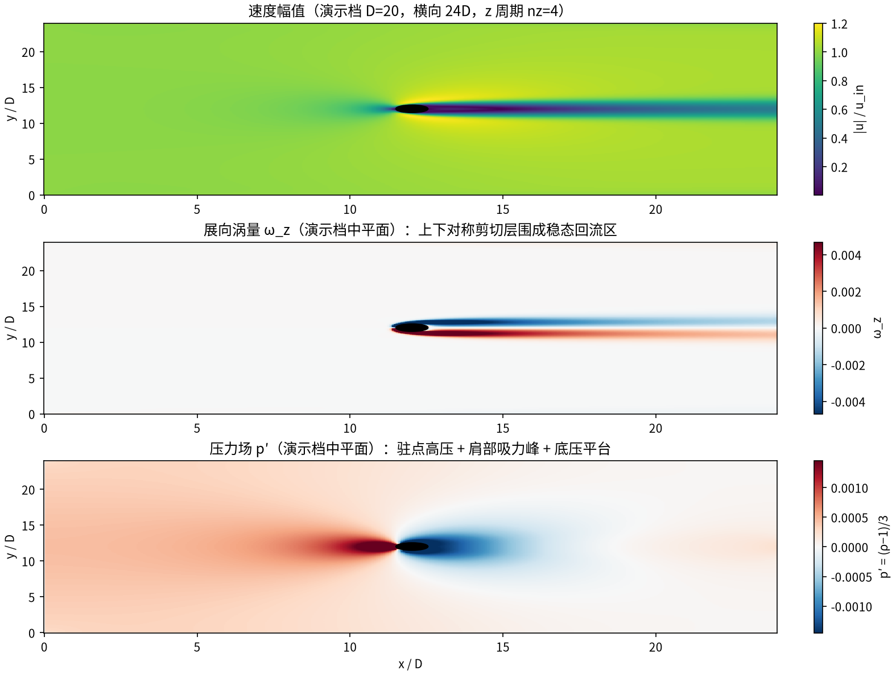
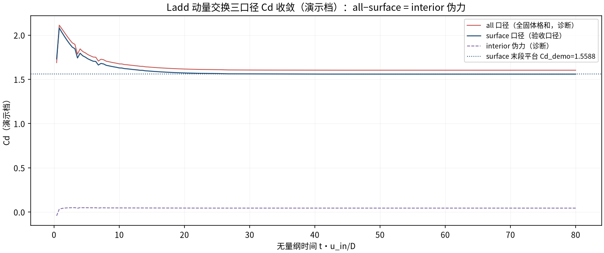
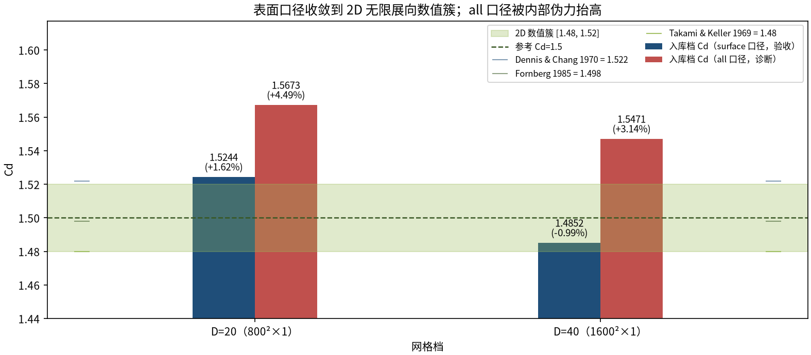

# 3D 展向周期圆柱绕流 Re=40：稳态尾流 Cd（表面 MEM 口径）（cylinder_3d）

> 3D Spanwise-Periodic Cylinder at Re=40: Steady-Wake Cd (Surface-Only MEM Caliber)

**摘要** — TensorLBM D3Q19 BGK 求解器在展向周期（无限展向）圆柱 Re=40 稳态尾流上对 2D 自由流数值簇的验证：横向 40D 域（阻塞比 2.5%），两档网格 D=20/40 表面口径（壁面相邻固体格 Ladd 动量交换）Cd 1.5244/1.4852（+1.62%/-0.99%），网格跨度 2.61% ≤3%（入库 verified = True，2026-09-30）；全固体格口径被内部伪力抬至 +4.49%/+3.14%，测力口径即本案例的方法学结论。

## 1. Benchmark 介绍

把二维圆柱沿展向挤出并以周期边界闭合，得到「无限展长」的三维表述：Re=40 低于涡脱阈值（Re_c≈47），尾流定常且展向不变，任何 nz≥1 给出相同的单位展长受力——这是把 D3Q19 全机械（z 周期 stream3d_roll + far_field_bc_3d）与已验证的 2D 圆柱族对齐的最便宜路径，也是 3D 求解器进钝体族的第一级台阶。

参考口径与 2D 数值簇对齐（入库 REFERENCE_AUDIT）：3D 挤出 + z 周期物理等价于 2D 无限展向，故对标 2D 自由流数值簇 Cd≈1.5（Dennis & Chang 1970 = 1.522、Fornberg 1985 = 1.498、Takami & Keller 1969 = 1.48），而不是 Tritton 1959 ≈1.54 的有限展长风洞实验——后者自带端部效应，历史上曾独自制造大幅误判。

测力口径是本案例的核心方法学发现：Ladd 动量交换和 Σ_solid 2·c_ix·f_i 在曲率体素体上分解为 surface + interior，内部固体格携带非简并伪力（实测 0.0429→0.0618，随 D 增长），全固体格求和因此系统性高读 Cd；把求和限制到壁面相邻固体格（6-邻居触流体）即恢复真值——这也是历史球体 MEM 判决失败的真因（docs/mem_surface_caliber_finding.md）。

### 物理与数学背景

不可压 Navier–Stokes 方程的三维格子 Boltzmann 离散：D3Q19 格子、BGK 碰撞、拉格朗日流迁；z 向周期（无限展向），y± 自由流 Dirichlet，x− 入流 / x+ 零梯度出口。

```
Re = u_in·D / ν = 40，ν = (τ−0.5)/3（< Re_c≈47：定常尾流）
```

```
Cd = Fx / (0.5·ρ·u_in²·D·nz)（迎风面积 D×Lz，与展长无关）
```

```
MEM：F_x = 2·Σ_solid c_ix·f_i = 2·Σ_surface + 2·Σ_interior（surface = 壁面相邻固体格 → 验收口径）
```

```
步进链：collide_bgk3d → NoDynamics（固体格恢复）→ half-way BB（stream 前）→ stream3d_roll → far_field_bc_3d
```

**参考解** — 2D 自由流数值簇 Cd = 1.5（[1.48, 1.52]）：Dennis & Chang 1970 = 1.522、Fornberg 1985 = 1.498、Takami & Keller 1969 = 1.48。不适用：Tritton 1959 ≈1.54（有限展长实验）。

**参考文献**

- Dennis S.C.R., Chang G.-Z. (1970), Numerical solutions for steady flow past a circular cylinder at Reynolds numbers up to 100, J. Fluid Mech. 42, 471-489.
- Fornberg B. (1985), Steady viscous flow past a circular cylinder at high Reynolds numbers, J. Fluid Mech. 158, 129-144.
- Takami H., Keller H.B. (1969), Steady two-dimensional viscous flow of an incompressible fluid past a circular cylinder, Phys. Fluids Suppl. II 12, 51-56.
- Ladd A.J.C. (1994), Numerical simulations of particulate suspensions via a discretized Boltzmann equation. Part I, J. Fluid Mech. 271, 285-309.
- Tritton D.J. (1959), Experiments on the flow past a circular cylinder at low Reynolds numbers, J. Fluid Mech. 6, 547-567（有限展长实验——上下文参考，非打分口径）.

## 2. 计算条件设置

正式档计算条件取自入库 result.json（程序化注入，下同）。

| 参数 | 取值 | 说明 |
|---|---|---|
| 问题 | 3D 展向周期圆柱绕流 Re=40（稳态尾流） | Re < 涡脱阈值 Re_c≈47：定常对称回流区，量兴趣 = 稳态 Cd |
| 几何 | 圆截面沿 z 挤出 + z 周期（无限展向） | nz=1 与 nz=4 逐位等价（z 不变性）；楼梯化圆截面 |
| 域（正式档） | 横向 40D（800²/1600²），阻塞比 2.5% | 与 verified/cylinder（2D 圆柱族）同口径 |
| 晶格 / 碰撞 | D3Q19 bgk | tensorlbm.solver3d.collide_bgk3d + stream3d_roll（z 周期） |
| 边界 | far_field_bc_3d + half-way BB | y± 自由流 Dirichlet、x− 入流 / x+ 零梯度、z± 周期；BB 在 stream 前施加（NoDynamics 恢复固体格） |
| u_in / τ | 0.08；τ = 3·u·D/Re+0.5 | D=20 → 0.620；D=40 → 0.740（ν = u·D/Re） |
| 测力 | Ladd 动量交换（MEM）三口径 | 验收口径 = surface（壁面相邻固体格，6-邻居触流体）；post-stream、pre-bounce-back |
| 步数（正式档） | 40000 / 40000 | 末 200 采样平台窗平均（采样间隔 100 步） |
| 参考口径 | 2D 自由流数值簇 Cd=1.5 [1.48, 1.52] | 挤出 + z 周期 ≡ 2D 无限展向 → 对标 2D 数值簇而非有限展长实验 |

## 3. 软件使用步骤

**环境** — Python ≥ 3.11；依赖 torch / numpy / matplotlib；仓库 src 可导入（pip install -e . 或 PYTHONPATH=<repo>/src）

**步骤 1**：获取仓库并进入根目录

```bash
git clone https://github.com/cxs503/TensorLBM.git && cd TensorLBM
```

**步骤 2**：安装/指向 tensorlbm 包

```bash
pip install -e .   # 或 export PYTHONPATH=$PWD/src
```

**步骤 3**：单档复现（D=20；GPU 数分钟，CPU 需数小时）

```bash
python benchmarks/verified/cylinder_3d/run.py single 20 /tmp/cyl3d_d20.json --steps 40000 --lateral 40 --nz 1 --device cuda:0
```

**步骤 4**：第二档（D=40）与 verify 批量模式可按 run.py --help 选择；两档构成入库判定对

```bash
python benchmarks/verified/cylinder_3d/run.py single 40 /tmp/cyl3d_d40.json --steps 40000 --lateral 40 --nz 1 --device cuda:0
```

### 场量可视化演示脚本

稳态尾流场量可视化演示：与正式档同一组库入口与步进链（collide_bgk3d + half-way BB + stream3d_roll + far_field_bc_3d + 三口径 MEM 测力），缩域缩步（D=20、横向 24D、nz=4、20000 步；正式档 D=20/40、横向 40D、40000 步），GPU 约 53 s；输出中平面 |u|/ω_z/p′ 场量与三口径 Cd 迹线。演示档因阻塞比升高（4.17% vs 正式档 2.5%）与缩短步数，Cd_surf_demo=1.5588 偏高，仅用于展示稳态尾流结构与口径差异；定量判据一律取入库扫描。

```bash
python docs/benchmarks/demos/cylinder_3d_demo.py --D 20 --lateral 24 --nz 4 --steps 20000 --out demo.npz
```

## 4. 计算结果

**表 1 入库扫描结果（横向 40D，u_in=0.08，Re=40）**

| 量 | D=20 | D=40 | 参考/说明 |
|---|---|---|---|
| Cd（surface 口径，验收） | 1.5244 | 1.4852 | 参考 1.5（簇 [1.48, 1.52]） |
| surface 误差 | +1.62% | -0.99% | 判据量（≤3%） |
| Cd（all 口径，诊断） | 1.5673 | 1.5471 | 全固体格和——被内部伪力系统性抬高 |
| all 口径误差（导出） | +4.49% | +3.14% | 由入库 cd_mem_all 与簇中心同式计算 |
| Cd（interior 伪力，诊断） | 0.0429 | 0.0618 | 内部固体格非简并贡献，随 D 增长 |
| 网格 | 800×800×1 | 1600×1600×1 | 横向 40D，z 周期单层 |
| τ / 步数 | 0.620 / 40000 | 0.740 / 40000 | u_in=0.08，Re=40 |

*来源：benchmarks/verified/cylinder_3d/result.json（verified = True，2026-09-30）。*



*图 1 演示档（D=20，横向 24D，nz=4，20000 步，GPU）中平面 z=nz/2 场量：上=速度幅值（柱前减速、肩部加速与回流区），中=展向涡量 ω_z（上下对称剪切层围成稳态回流泡），下=压力场 p′（驻点高压、肩部吸力峰与底压平台）。全场 |uz| 最大 8.72e-07 ≈ 0，直接验证 z 向不变（2D 等价）。*



*图 2 演示档三口径 Cd 收敛迹线：surface（验收口径）平台 Cd_demo=1.5588；all 口径平台 1.6030 被抬高，差值即 interior 伪力（0.0442，图中紫色虚线）——与入库两档「全固体求和高读、表面口径达标」的同一结构。*

## 5. 与文献 / 解析解的比较

**表 2 与 2D 数值簇的比较与口径判定（入库档）**

| 量 | 值 | 说明 |
|---|---|---|
| surface Cd 收敛 | 1.5244 → 1.4852 | 误差 +1.62% → -0.99%；网格跨度 2.61% ≤ 3% |
| all 口径偏差 | +4.49% / +3.14% | interior 伪力 0.0429 → 0.0618 随 D 增长——surface 限制即修复 |
| 32D 域替代对 | 1.5368 / 1.4972 | 误差 +2.45% / -0.19%，跨度 2.64%——亦过（32D 域对；以 40D 低阻塞域为准） |
| 参考簇 | 1.522 / 1.498 / 1.48 | Dennis & Chang 1970 / Fornberg 1985 / Takami & Keller 1969；采用中心 1.5 [1.48, 1.52] |
| 判定 | verified = True | 入库 2026-09-30（两档 ≤3% 且跨度 ≤3%） |



*图 3 入库两档三口径 vs 2D 数值簇（入库判据数字）：surface 口径 Cd 1.5244→1.4852（+1.62%→-0.99%）落入簇带（绿色）；all 口径（+4.49%/+3.14%）被 interior 伪力系统性抬高；三篇文献源值以短横线标出。*

- 测力口径：Ladd MEM 和在体素化曲率体上 = surface + interior；内部格伪力不简并（实测随 D 增长），全固体求和高读 Cd、也是历史球 MEM「+264%」失败真因；本库验收一律 surface 口径（docs/mem_surface_caliber_finding.md）。
- 参考口径：3D 挤出 + z 周期 ≡ 2D 无限展向，对标 2D 自由流数值簇；Tritton 1959 ≈1.54 为有限展长实验（端部效应 + 三维尾流污染），不作为 2D 等价问题的打分参考。
- 验收条款：两档 surface Cd 各自 ≤3% 且网格跨度 ≤3%（实测 2.61%）；32D 域替代对亦过（+2.45%/-0.19%，跨度 2.64%），40D 低阻塞域为准。
- 演示档口径：横向 24D（阻塞比 4.17% vs 正式档 2.5%）+ 20000 步（正式 40000），Cd_demo 偏高由阻塞比解释；定量结论以入库 D=20/40 档为准。

## 6. 复现说明

```bash
python benchmarks/verified/cylinder_3d/run.py single 20 /tmp/cyl3d_d20.json --steps 40000 --lateral 40 --nz 1 --device cuda:0
```

**预期结果** — D=20: Cd(surface)=1.5244（+1.62%）；D=40: Cd(surface)=1.4852（-0.99%）；网格跨度 2.61%（均 ≤3%）

**参考耗时** — 入库实测（SDAA eager）约 4 h/档（README 记录）；演示档 GPU 53 s（D=20 缩域 20000 步）

**入库位置** — `benchmarks/verified/cylinder_3d`

---

*本教程由 TensorLBM benchmark 档案自动生成，判据数字均取自入库 `result.json` 机器档案；演示图为缩短时长的可视化档，定量结论以存档扫描为准。*
