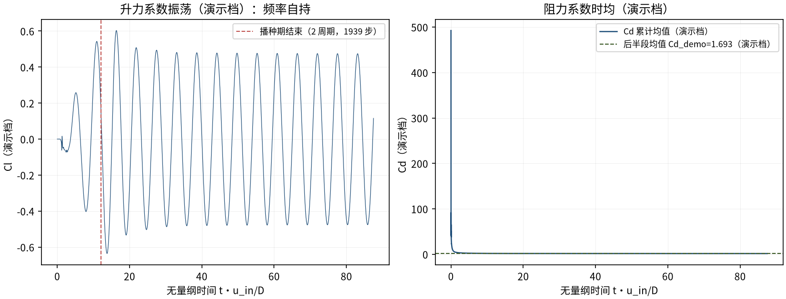
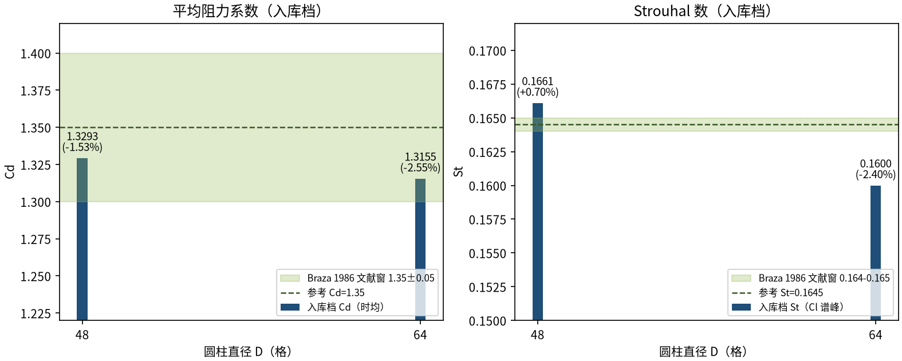

# 自由流圆柱绕流 Re=100：Kármán 涡街（Braza 1986）（cylinder_re100）

> Flow Past a Cylinder at Re=100: Karman Vortex Street (Braza 1986)

**摘要** — TensorLBM D2Q9 MRT 求解器在自由流圆柱 Re=100 涡街上对 Braza et al. (1986) 的验证：域 40D×40D、下游 10D sponge、入口 2 周期播种，两档网格 D=48/64 时均 Cd 1.3293/1.3155（-1.53%/-2.55%）、St 0.1661/0.1600（+0.70%/-2.40%），Cd/St 全指标 ≤3% 且误差随细化下降（入库 verified = True，2026-08-19）。

## 1. Benchmark 介绍

圆柱绕流在 Re≈47 发生定常失稳（Hopf 分岔），Re=100 处于二维Kármán 涡街的经典区间：尾缘交替脱落的旋涡产生周期性升力振荡，涡脱频率以 Strouhal 数 St=f·D/u 表征。它是非定常求解器的最经典综合基准——同时检验时间精度、远场边界、频谱分析与力积分。

参考解取 Braza et al. 1986（JFM 165）：Cd≈1.35（±0.05）、St≈0.1645。本案例的工程链是整个涡街系列的模板（Re=200 案例直接复用）：入口播种 2 周期打破对称、下游 sponge 吸收层压制尾流反射、Cl 序列 FFT 提谱峰得 St。

两个历史根因修复（入库 key_fixes 全文存档，程序化注入）：①播种权重 bug: 手写 D2Q9 cy_w 符号错([0,0,1,0,1,0,1,0,1] vs 正确[0,0,1,0,-1,1,1,-1,-1]) -> uy_seed 0.277 而非 0.008 (3.5倍横向射流) -> NaN 真根因; 修复用 d2q9.C 列；②sponge layer: 下游最后10D tau_field 渐变(alpha=10, tau_max=7.17, nu x43) 消除 far-field 零梯度出口尾流反射。两条都是「零手写物理」原则的教训：速度权重等格点常量一律直接取库值（d2q9.C），边界反射类发散优先怀疑出口而非碰撞核。

### 物理与数学背景

不可压 Navier–Stokes 方程的格子 Boltzmann 离散：D2Q9 格子、MRT（多弛豫时间）碰撞算子（支持 tau_field 逐格弛豫 = sponge）、拉格朗日流迁。

```
Re = u_in·D / ν，ν = (τ−0.5)/3
```

```
St = f·D / u_in（涡脱频率 f 由 Cl 序列 FFT 谱峰 + 抛物线插值提取）
```

```
Cd = Fx / (0.5·ρ·u_in²·D)（Ladd 动量交换，表面格求和）
```

```
sponge：τ_eff(x) = τ·(1 + α·σ(x))，σ 平方渐变 0→1，α=10
```

**参考解** — Braza M. et al. (1986) 实验/高保真参考：Cd=1.35（±0.05）、St=0.1645（0.164-0.165）。

**参考文献**

- Braza M., Chassaing P., Ha Minh H. (1986), Numerical study and physical analysis of the pressure and velocity fields in the near wake of a circular cylinder, J. Fluid Mech. 165, 79-130.
- Ladd A.J.C. (1994), Numerical simulations of particulate suspensions via a discretized Boltzmann equation. Part I. Theoretical foundation, J. Fluid Mech. 271, 285-309.

## 2. 计算条件设置

正式档计算条件取自入库 result.json 与 run.py（程序化注入，下同）。

| 参数 | 取值 | 说明 |
|---|---|---|
| 问题 | 自由流圆柱绕流 Re=100（Kármán 涡街） | 自持周期涡脱的经典基准 |
| 域（正式档） | 40D x 40D | 圆柱心 (10D, 20D)，阻塞比 2.5% |
| 晶格 / 碰撞 | D2Q9 MRT（tau_field sponge） | tensorlbm.solver.collide_mrt / stream |
| 远场边界 | far_field_bc_2d | 入口/两侧自由流 Dirichlet + 出口零梯度 + 圆柱反弹 |
| sponge 层 | 下游 10D，平方渐变，α=10 | τ_eff = τ·(1+α·σ)，消除尾流反射（历史发散根因修复） |
| 播种 | St_seed=0.165、10% 振幅、入口整列、2 周期 | 对称破缺后频率自选；权重直接取库常量 d2q9.C |
| u_in / τ | 0.05；τ = 3·u·D/Re+0.5 | D=48 → 0.572；D=64 → 0.596（ν = u·D/Re） |
| 测力 | Ladd 动量交换（表面格） | post-stream、pre-bounce-back 采样 |
| 步数（正式档） | 60000 / 90000 | 时均窗 = 后 50%；St 由 Cl 序列 FFT 谱峰提取 |

## 3. 软件使用步骤

**环境** — Python ≥ 3.11；依赖 torch / numpy / matplotlib；仓库 src 可导入（pip install -e . 或 PYTHONPATH=<repo>/src）

**步骤 1**：获取仓库并进入根目录

```bash
git clone https://github.com/cxs503/TensorLBM.git && cd TensorLBM
```

**步骤 2**：安装/指向 tensorlbm 包

```bash
pip install -e .   # 或 export PYTHONPATH=$PWD/src
```

**步骤 3**：单档复现（D=48；GPU 约数十分钟，CPU 需数小时）

```bash
python benchmarks/verified/cylinder/re100/run.py --D 48 --steps 60000 --device cuda:0
```

**步骤 4**：两档网格（D=48/64）批量运行并写出判定 result.json

```bash
python benchmarks/verified/cylinder/re100/run.py --D 48 64 --device cpu --out result.json
```

### 场量可视化演示脚本

涡街瞬态可视化演示：与正式档同一组库入口与步进链（collide_mrt tau_field + far_field_bc_2d + 播种），缩域缩径（D=16、域 16D×8D、u_in=0.1，正式档 D=48/64、40D×40D、u_in=0.05），14000 步 CPU 约 300 s；输出 |u|/涡量/p′ 瞬态场与 Cd/Cl 序列。演示档因阻塞比升高（12.5% vs 正式档 2.5%）与粗径阶梯，Cd_demo=1.693、St_demo=0.1806 偏离参考，仅用于展示涡街形态与频率自持；定量判据一律取入库扫描。

```bash
python docs/benchmarks/demos/cylinder_re100_demo.py --D 16 --steps 14000 --out demo.npz
```

## 4. 计算结果

**表 1 入库扫描结果（域 40D×40D，u_in=0.05）**

| 量 | D=48 | D=64 | 参考/说明 |
|---|---|---|---|
| Cd（时均） | 1.3293 | 1.3155 | 参考 1.35（±0.05 文献窗） |
| Cd 误差 | -1.53% | -2.55% | 判据量（≤3%） |
| St（Cl 谱峰） | 0.1661 | 0.1600 | 参考 0.1645（0.164-0.165 文献窗） |
| St 误差 | +0.70% | -2.40% | 判据量（≤3%） |
| 步数 | 60000 | 90000 | 两档独立运行 |

*来源：benchmarks/verified/cylinder/re100/result.json（verified = True，2026-08-19）。*


*图 1 演示档（D=16，域 16D×8D，14000 步，CPU）涡街瞬态场量：上=速度幅值（剪切层与尾流减速区），中=涡量 ω_z（上下交替脱落的旋涡列即 Kármán 涡街），下=压力场 p′（涡心低压与驻点高压交替）。*



*图 2 演示档力系数历史：左=Cl（播种期结束后自持等幅振荡，FFT 谱峰 St_demo=0.1806，与播种频率 0.165 同量级 = 频率锁定到流场固有值）；右=Cd 累计均值收敛到Cd_demo=1.693（演示档，受阻塞比与粗径影响偏高）。*

## 5. 与文献 / 解析解的比较

**表 2 与 Braza 1986 的比较与收敛判定（入库档）**

| 量 | 值 | 说明 |
|---|---|---|
| Cd 收敛 | 1.3293 → 1.3155 | 误差 -1.53% → -2.55%（单调向参考收敛） |
| St 收敛 | 0.1661 → 0.1600 | 误差 +0.70% → -2.40%（均在窗内） |
| Cd ≤3% 且误差随细化下降 | 是 | 入库 verified = True（2026-08-19） |
| 参考 | Braza et al. 1986 (JFM 165): Cd=1.35±0.05, St≈0.164-0.165 | Braza et al. 1986 (JFM 165) Re=100 |



*图 3 网格收敛（入库判据数字）：Cd 1.3293→1.3155、St 0.1661→0.1600，误差均在 Braza 1986 文献窗（绿色带）内且 Cd 误差随细化下降，全指标 ≤3%。*

- 误差定义：Cd 取时均窗（后 50% 步数）平均；St 取 Cl 序列 FFT 谱峰（抛物线插值精化）；验收 |err| ≤3% 且 Cd 误差随细化下降。
- 演示档口径：D=16 缩径 + 16D×8D 缩域使阻塞比升至 12.5%（正式档 2.5%），Cd_demo/St_demo 系统性偏高，仅证明涡街形态与频率自持；定量结论以入库 D=48/64 档为准。
- 本案例为直接观测量对文献参考（无任何模型修正或重标定），符合严格入库标准；工程链（播种 + sponge + MRT tau_field）被 Re=200 案例原样复用。

## 6. 复现说明

```bash
python benchmarks/verified/cylinder/re100/run.py --D 48 64 --device cpu --out result.json
```

**预期结果** — D=48: Cd=1.3293（-1.53%）、St=0.1661（+0.70%）；D=64: Cd=1.3155（-2.55%）、St=0.1600（-2.40%）（均 ≤3%）

**参考耗时** — CPU 两档合计数小时（60000+90000 步）；GPU 数十分钟/档

**入库位置** — `benchmarks/verified/cylinder/re100`

---

*本教程由 TensorLBM benchmark 档案自动生成，判据数字均取自入库 `result.json` 机器档案；演示图为缩短时长的可视化档，定量结论以存档扫描为准。*
