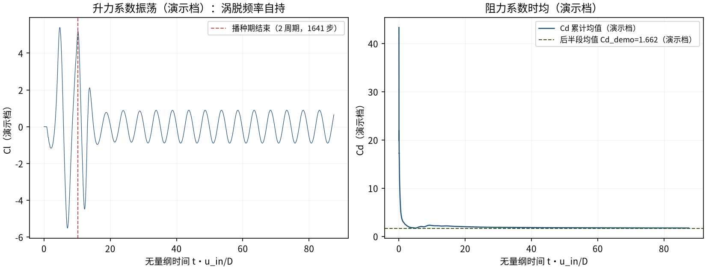
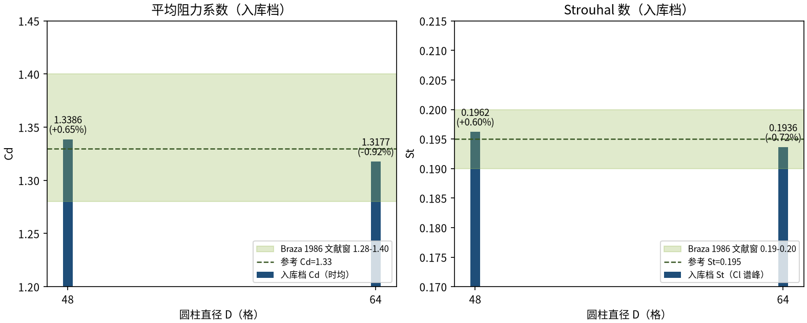

# 自由流圆柱绕流 Re=200：Kármán 涡街（Braza 1986）（cylinder_re200）

> Flow Past a Cylinder at Re=200: Karman Vortex Street (Braza 1986)

**摘要** — TensorLBM D2Q9 MRT 求解器在自由流圆柱 Re=200 涡街上对 Braza et al. (1986) 的验证：域 40D×40D、下游 10D sponge、入口 2 周期播种，两档网格 D=48/64 时均 Cd 1.3386/1.3177（+0.65%/-0.92%）、St 0.1962/0.1936（+0.60%/-0.72%），全指标 ≤3% 且随细化收敛（入库 verified = True）。

## 1. Benchmark 介绍

圆柱绕流在 Re≈47 以上失稳为 Kármán 涡街：尾缘交替脱落的旋涡形成周期性升力振荡与阻力脉动，是钝体绕流非定常行为的最经典基准。Re=200 处于 2D 涡街仍稳定的上限区（2D→3D 转捩约 Re≈190-260 的展向失稳之下），二维模拟与实验/高保真 2D 参考可比。

参考解取 Braza et al. 1986（JFM 165）：Cd≈1.33（文献窗 1.28-1.40）、St≈0.195（文献窗 0.19-0.20）。本案例复用 Re=100 验证过的完整工程链（播种 + sponge + MRT tau_field），仅改 Re 与播种频率 St_seed=0.195——工程链跨雷诺数可移植性的直接检验。

两个历史根因修复（正式档 README/key_fixes 存档）：其一，手写 D2Q9 速度权重 cy_w 符号错把播种横向速度放大 35 倍导致 18 步爆炸，修复为直接取库常量 d2q9.C；其二，零梯度出口对涡街尾流的压力反射使 2 万步发散，修复为下游 10D sponge 吸收层（τ_eff = τ·(1+α·σ)，α=10）。

### 物理与数学背景

不可压 Navier–Stokes 方程的格子 Boltzmann 离散：D2Q9 格子、MRT（多弛豫时间）碰撞算子（支持 tau_field 逐格弛豫 = sponge）、拉格朗日流迁。

```
Re = u_in·D / ν，ν = (τ−0.5)/3
```

```
St = f·D / u_in（涡脱频率 f 由 Cl 序列 FFT 谱峰 + 抛物线插值提取）
```

```
Cd = Fx / (0.5·ρ·u_in²·D)（Ladd 动量交换，表面格求和）
```

```
sponge：τ_eff(x) = τ·(1 + α·σ(x))，σ 平方渐变 0→1，α=10
```

**参考解** — Braza M., Favier D., Hemon P. (1986) 实验参考：Cd=1.33（窗 1.28-1.40）、St=0.195（窗 0.19-0.20）。

**参考文献**

- Braza M., Chassaing P., Ha Minh H. (1986), Numerical study and physical analysis of the pressure and velocity fields in the near wake of a circular cylinder, J. Fluid Mech. 165, 79-130.
- Ladd A.J.C. (1994), Numerical simulations of particulate suspensions via a discretized Boltzmann equation. Part I. Theoretical foundation, J. Fluid Mech. 271, 285-309.

## 2. 计算条件设置

正式档计算条件取自入库 result.json 与 run.py（程序化注入，下同）。

| 参数 | 取值 | 说明 |
|---|---|---|
| 问题 | 自由流圆柱绕流 Re=200（Kármán 涡街） | 自持周期涡脱的非定常基准 |
| 域（正式档） | 40D x 40D | 圆柱心 (12D, 20D)，阻塞比 2.5% |
| 晶格 / 碰撞 | D2Q9 MRT（tau_field sponge） | tensorlbm.solver.collide_mrt / stream |
| 远场边界 | far_field_bc_2d | 入口/两侧自由流 Dirichlet + 出口零梯度 + 圆柱反弹 |
| sponge 层 | 下游 10D，平方渐变，α=10 | τ_eff = τ·(1+α·σ)，消除尾流反射（NaN 根因修复） |
| 播种 | St_seed=0.195、10% 振幅、入口 4 列、2 周期 | 对称破缺后频率自选；权重取库常量 d2q9.C |
| u_in / τ | 0.08；τ = 3·u·D/Re+0.5 | D=48 → 0.5576；D=64 → 0.5768（nu = u·D/Re） |
| 测力 | Ladd 动量交换（表面格） | post-stream、pre-bounce-back 采样 |
| 质量重整化 | 每 2000 步全局 | f *= M0/Σf（与正式档一致） |
| 步数（正式档） | 70000 / 80000 | 时均窗 = 后 50%（warmup_frac=0.5） |

## 3. 软件使用步骤

**环境** — Python ≥ 3.11；依赖 torch / numpy / matplotlib；仓库 src 可导入（pip install -e . 或 PYTHONPATH=<repo>/src）

**步骤 1**：获取仓库并进入根目录

```bash
git clone https://github.com/cxs503/TensorLBM.git && cd TensorLBM
```

**步骤 2**：安装/指向 tensorlbm 包

```bash
pip install -e .   # 或 export PYTHONPATH=$PWD/src
```

**步骤 3**：单档复现（D=48；GPU 约数十分钟，CPU 需数小时）

```bash
python benchmarks/verified/cylinder/re200/run.py --D 48 --steps 70000 --device cuda:0
```

**步骤 4**：两档网格（D=48/64）分别运行，合并对照 result.json

```bash
python benchmarks/verified/cylinder/re200/run.py --D 48 --steps 70000 --out out_dir --device cuda:0 && python benchmarks/verified/cylinder/re200/run.py --D 64 --steps 80000 --out out_dir --device cuda:0
```

### 场量可视化演示脚本

涡街瞬态可视化演示：与正式档同一组库入口与步进链（含固体冻结、质量重整化、4 列播种），缩域缩径（D=16、域 16D×8D、u_in=0.1，正式档 D=48/64、40D×40D、u_in=0.08），14000 步 CPU 约 334 s；输出 |u|/涡量/p′ 瞬态场与 Cd/Cl 序列。演示档因阻塞比升高（12.5%）与粗径阶梯，Cd_demo=1.662、St_demo=0.2035 偏离参考，仅用于展示涡街形态与频率自持；定量判据一律取入库扫描。

```bash
python docs/benchmarks/demos/cylinder_re200_demo.py --D 16 --steps 14000 --out demo.npz
```

## 4. 计算结果

**表 1 入库扫描结果（域 40D×40D，u_in=0.08）**

| 量 | D=48 | D=64 | 参考/说明 |
|---|---|---|---|
| Cd（时均） | 1.3386 | 1.3177 | 参考 1.33（文献窗 1.28-1.40） |
| Cd 误差 | +0.65% | -0.92% | 判据量（≤3%） |
| St（Cl 谱峰） | 0.1962 | 0.1936 | 参考 0.195（文献窗 0.19-0.20） |
| St 误差 | +0.60% | -0.72% | 判据量（≤3%） |
| Cl 标准差 | 0.485 | 0.470 | 升力振荡幅度（横向载荷评估用） |
| 步数 | 70000 | 80000 | 两档独立运行 |

*来源：benchmarks/verified/cylinder/re200/result.json（verified = True，2026-08-19）。*


*图 1 演示档（D=16，域 16D×8D，14000 步，CPU）涡街瞬态场量：上=速度幅值（剪切层与尾流减速区），中=涡量 ω_z（上下交替脱落的旋涡列即 Kármán 涡街），下=压力场 p′（涡心低压与驻点高压交替）。*



*图 2 演示档力系数历史：左=Cl（播种期结束后自持等幅振荡，FFT 谱峰 St_demo=0.2035，与播种频率 0.195 同量级 = 频率锁定到流场固有值）；右=Cd 累计均值收敛到Cd_demo=1.662（演示档，受阻塞比与粗径影响偏高）。*

## 5. 与文献 / 解析解的比较

**表 2 与 Braza 1986 的比较与收敛判定（入库档）**

| 量 | 值 | 说明 |
|---|---|---|
| Cd 收敛 | 1.3386 → 1.3177 | 误差 +0.65% → -0.92%（向参考收敛） |
| St 收敛 | 0.1962 → 0.1936 | 误差 +0.60% → -0.72% |
| 全指标 ≤3% | 是 | 入库 verified = True（2026-08-19） |
| 参考 | Braza 1986: Cd=1.33 (1.28-1.40), St≈0.195 (0.19-0.20) | Braza et al. 1986 (JFM 165) Re=200 |



*图 3 网格收敛（入库判据数字）：Cd 1.3386→1.3177、St 0.1962→0.1936，误差均在 Braza 1986 文献窗（绿色带）内且随细化收敛，全指标 ≤3%。*

- 误差定义：Cd 取时均窗（后 50% 步数）平均；St 取 Cl 序列 FFT 谱峰（log 谱抛物线插值精化），滞回过零作交叉验证；验收 |err| ≤3%。
- 演示档口径：D=16 缩径 + 16D×8D 缩域使阻塞比升至 12.5%（正式档 2.5%），Cd_demo/St_demo 系统性偏高，仅证明涡街形态与频率自持；定量结论以入库 D=48/64 档为准。
- 本案例为直接观测量对文献参考（无任何模型修正或重标定），符合严格入库标准。

## 6. 复现说明

```bash
python benchmarks/verified/cylinder/re200/run.py --D 48 --steps 70000 --device cuda:0
```

**预期结果** — D=48: Cd=1.3386（+0.65%）、St=0.1962（+0.60%）；D=64: Cd=1.3177（-0.92%）、St=0.1936（-0.72%）（均 ≤3%）

**参考耗时** — GPU（cuda）单档约 1-3 小时；CPU 需数小时/档

**入库位置** — `benchmarks/verified/cylinder/re200`

---

*本教程由 TensorLBM benchmark 档案自动生成，判据数字均取自入库 `result.json` 机器档案；演示图为缩短时长的可视化档，定量结论以存档扫描为准。*
