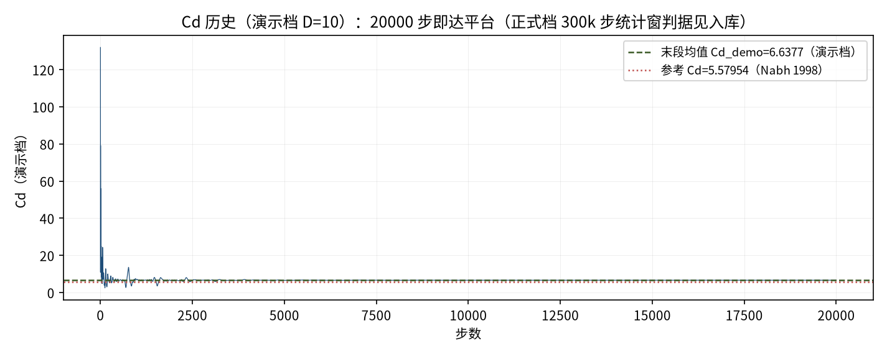
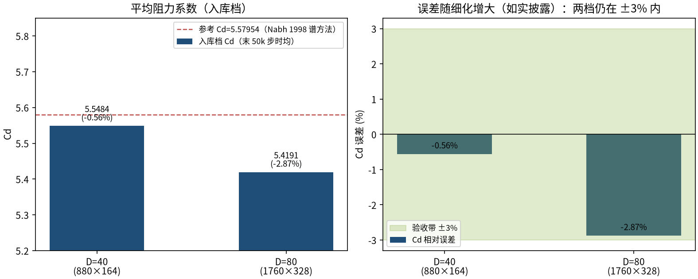

# Schäfer–Turek 2D-1 圆柱绕流 Re=20：稳态层流基准（cylinder_re20_st）

> Cylinder Flow Re=20, Schaefer-Turek Benchmark 2D-1 (Steady)

**摘要** — TensorLBM D2Q9 MRT 求解器在 Schäfer–Turek 2D-1 基准（通道内圆柱 Re=20 稳态层流）上对 Nabh 1998 谱方法参考解的直接验证：Poiseuille 入口 + Zou–He 压力出口 + 半程反弹、无质量重整化，两档网格 D=40/80 时均 Cd 5.5484/5.4191（-0.56%/-2.87%，均 ≤3%），300k 步统计收敛到平台且三次复跑逐位一致（入库 verdict = verified）。

## 1. Benchmark 介绍

Schäfer–Turek 2D-1 是 FEATFLOW 社区最广泛使用的二维稳态钝体基准：矩形通道内置圆柱、抛物线入口、Re=20 层流定常。尾流出现一对对称的定常回流泡（无涡脱），阻力系数参考解取 Nabh (1998) 谱方法 Cd=5.57954——该基准同时检验入口剖面、压力出口、壁面/曲面反弹与力积分的整条工程链。

本案例的工程要点是“干净的稳态统计”：碰撞链为 MRT + 固体格冻结 + 半程反弹，Zou–He 双端边界保证质量/动量守恒到三阶，Cd 在末 50k 步摆幅 <0.02%（块均值单调趋稳）。一个重要历史教训（入库 renorm_note）：早期版本每 2000 步做全局质量重整化，反而激发 ~10k 步尺度的 Cd 慢振荡（±2-4%），制造出假网格依赖；Zou–He 双端配平后重整化必须去除。

误差随网格细化由 -0.56% 增至 -2.87%——如实披露而非隐藏：阶梯圆的有效直径 （D_eff_axis=41/81 格，名义 40/80）与半程反弹的台阶角点在不同分辨率下引入不同偏置，两档均在 ±3% 验收带内且各自深度收敛；Cl 为二阶小量不作为判据（详见比较节注记）。

### 物理与数学背景

不可压 Navier–Stokes 方程的格子 Boltzmann 离散：D2Q9 格子、MRT 碰撞算子、拉格朗日流迁；曲面与壁面用半程反弹（二阶精度）。

```
Re = U_mean·D / ν = 20（U_mean 为入口剖面均值）
```

```
入口剖面 u(y) = 6·U_mean·y(H−y)/H²（U_max = 1.5·U_mean）
```

```
Cd = Fx / (0.5·ρ·U_mean²·D)（Ladd 动量交换，表面格求和）
```

```
Cl = Fy / (0.5·ρ·U_mean²·D)（二阶小量，非判据量）
```

```
ν = (τ−0.5)/3，τ=0.8 → ν=0.1（格子单位）
```

**参考解** — 参考解：Nabh 1998 谱方法，FeatFlow 官方（ST 2D-1 Re=20），Cd=5.57954、Cl=0.0106（谱方法高分辨率解，非实验）。

**参考文献**

- Schäfer M., Turek S. (1996), Benchmark computations of laminar flow around a cylinder, Notes Numer. Fluid Mech. 48, 547-566.
- Nabh M. (1998), Ergebnis-Zusammenfassung, DFG-Benchmark 'Kanal umströmtes Hindernis', Univ. Heidelberg / FEATFLOW.
- Zou Q., He X. (1997), On pressure and velocity boundary conditions for the lattice Boltzmann BGK model, Phys. Fluids 9, 1591-1598.

## 2. 计算条件设置

正式档计算条件取自入库 result.json 与 run.py（程序化注入，下同）。

| 参数 | 取值 | 说明 |
|---|---|---|
| 基准 | Schäfer–Turek 2D-1（Re=20 稳态层流） | FEATFLOW 官方基准几何，定常无涡脱 |
| 域 / 几何 | 2.2 m × 0.41 m 通道；圆柱心 (0.2, 0.2)、半径 0.05 m | 阻塞比 5%（通道高 0.41 / 直径 0.1） |
| 入口 | Poiseuille 剖面（U_max = 1.5·U_mean），Zou–He 速度入口 | boundaries.zou_he_inlet_velocity |
| 出口 | Zou–He 压力出口（ρ=1） | boundaries.zou_he_outlet_pressure |
| 壁面 / 圆柱 | 半程反弹（half-way bounce-back） | make_channel_wall_mask + bounce_back_cells |
| 晶格 / 碰撞 | D2Q9 MRT，τ=0.8 | ν=0.1（格子），U_mean=0.05 → Ma≈0.087 |
| 测力 | Ladd 动量交换（表面格） | post-stream、pre-bounce-back 采样 |
| 质量重整化 | 无 | 历史教训：每 2000 步重整化曾激发 Cd 慢振荡（假网格依赖真凶） |
| 网格（正式档） | D=40（880×164）；D=80（1760×328） | mask 半径 = D/2 格（阶梯圆），D_eff_axis = 41/81 |
| 步数（正式档） | 300000（两档同） | 时均窗 = 末 50k 步；统计收敛判据见下表 |

## 3. 软件使用步骤

**环境** — Python ≥ 3.11；依赖 torch / numpy / matplotlib；仓库 src 可导入（pip install -e . 或 PYTHONPATH=<repo>/src）

**步骤 1**：获取仓库并进入根目录

```bash
git clone https://github.com/cxs503/TensorLBM.git && cd TensorLBM
```

**步骤 2**：安装/指向 tensorlbm 包

```bash
pip install -e .   # 或 export PYTHONPATH=$PWD/src
```

**步骤 3**：单档复现（D=40，300k 步；GPU 约 0.5 小时）

```bash
python benchmarks/verified/cylinder/re20_st/run.py --D 40 --device cuda:0
```

**步骤 4**：两档网格（D=40/80）分别运行，合并对照 result.json

```bash
python benchmarks/verified/cylinder/re20_st/run.py --D 40 --device cuda:0 --out out_dir && python benchmarks/verified/cylinder/re20_st/run.py --D 80 --device cuda:0 --out out_dir
```

### 场量可视化演示脚本

稳态场量演示：与正式档同一组库入口与步进链（Poiseuille Zou–He 入口、压力出口、半程反弹、表面 MEM、固体冻结），缩径 D=10（正式档 40/80）、τ=0.575 保持 U_mean=0.05 与正式档同格子马赫数（正式档 τ=0.8、ν=0.1 亦得 U_mean=0.05；D=10 若沿用 τ=0.8 则 u=0.2 超格子稳定限），20000 步 CPU 约 46 s，输出 |u|/涡量/p′ 场、中心线回流泡与尾流亏损剖面。演示档 Cd_demo=6.6377（+19.0%）系缩径阶梯粗档偏置，仅用于展示稳态结构；定量判据一律取入库扫描。

```bash
python docs/benchmarks/demos/cylinder_re20_st_demo.py --D 10 --tau 0.575 --max-steps 20000 --out demo.npz
```

## 4. 计算结果

**表 1 入库扫描结果（300k 步，末 50k 步时均）**

| 量 | D=40（880×164） | D=80（1760×328） | 参考/说明 |
|---|---|---|---|
| Cd（时均） | 5.5484 | 5.4191 | 参考 5.57954（Nabh 1998 谱方法，FeatFlow 官方（ST 2D-1 Re=20）） |
| Cd 误差 | -0.56% | -2.87% | 判据量（\|err\| ≤3%） |
| Cl | -0.0141 | -0.0015 | 参考 0.0106（见下方 Cl 注记：不收敛量如实记录） |
| 统计收敛 | 末 50k 摆幅 0.0072% | 末 50k 摆幅 0.0148% | 末 20k vs 末 50k 差 <0.003%（plateau_check 全文见 result.json） |
| 固体 / 表面格 | 1257 / 112 | 5025 / 224 | Ladd MEM 求和范围 |
| 壁钟（GPU） | 1762 s | 889 s | 300k 步（cuda:1） |

*来源：benchmarks/verified/cylinder/re20_st/result.json（verdict = verified；plateau_check 全文存档）。*



*图 3 演示档 Cd 历史：20000 步内达到统计平台（Cd_demo=6.6377）；红线为 Nabh 1998 参考5.57954。演示档偏高系缩径阶梯偏置，正式档 300k 步时均判据见表 1。*


*图 1 演示档（D=10，20000 步，CPU）稳态场量：上=速度幅值（驻点减速 + 对称尾流亏损），中=涡量 ω_z（上下对称的边界层分离对，正负号相反），下=压力 p′（驻点高压、圆柱背部低压）——Re=20 定常特征：无时间振荡。*

![图 2 演示档尾流结构：左=中心线 u(x,y=0.2)，绿色带为回流区 u<0（定常回流泡（x∈[0.26, 0.34] m，长约 0.8D）），虚线为圆柱后缘；右=各流向站位速度剖面，近尾出现倒流、远尾逐步恢复（黑虚线为入口 Poiseuille 剖面）。](figs/cylinder_re20_st/demo_wake.png)

*图 2 演示档尾流结构：左=中心线 u(x,y=0.2)，绿色带为回流区 u<0（定常回流泡（x∈[0.26, 0.34] m，长约 0.8D）），虚线为圆柱后缘；右=各流向站位速度剖面，近尾出现倒流、远尾逐步恢复（黑虚线为入口 Poiseuille 剖面）。*

## 5. 与文献 / 解析解的比较

**表 2 与谱方法参考的比较与验收（入库档）**

| 量 | 值 | 说明 |
|---|---|---|
| 入库判定 | verified | 判据：两档 \|err_cd\| ≤3% 且各自统计收敛到平台 |
| 可复现性 | 三次独立 300k 步逐位一致（bit-exact） | 跨设备（cuda:1/cuda:2）与跨会话复跑；Cd 全精度值三份相同 |
| 误差趋势 | -0.56% → -2.87% | 随细化增大但均在带内（阶梯圆有效直径偏置，如实披露不作修正） |
| Cl 注记 | 实测 -0.0141/-0.0015 vs 参考 0.0106 | 升力为二阶小量，MEM 表面法向离散误差淹没 Cl；D 变化 Cl 也在变，不作修正、如实记录，不影响阻力判定 |
| 演示档口径 | D=10、τ=0.575、20000 步 CPU 46 s：Cd_demo=6.6377（+19.0%） | 缩径阶梯粗档所致；演示档仅取场量/尾流结构，定量判据以入库为准 |



*图 4 网格收敛（入库判据数字）：Cd 5.5484→5.4191（参考 5.57954 红虚线），误差 -0.56% → -2.87% 均在 ±3% 验收带（绿色带）内；误差随细化增大如实披露。*

- 误差定义：Cd 取末 50k 步（300k 步运行的后 1/6）时均；统计收敛判据 = 末 50k 步摆幅 <0.02% 且末 20k vs 末 50k 差 <0.003%，块均值单调趋稳（入库 plateau_check）。
- Cl 处置：实测值与参考同量级（~1e-2）但符号相反且随网格变化——升力是二阶小量，MEM 表面法向的阶梯离散误差直接淹没它；本案例不作修正、如实记录，Cl 不参与验收。
- 方法论记录：①不使用质量重整化（Zou–He 双端配平后重整化反而激发Cd 慢振荡，是历史“假网格依赖”真凶）；②mask 半径取 D/2 格（半程反弹的阶梯圆约定）；③本案例为直接观测量对高保真参考（无修正无重标定），三次独立 300k 步复跑逐位一致。

## 6. 复现说明

```bash
python benchmarks/verified/cylinder/re20_st/run.py --D 40 --device cuda:0
```

**预期结果** — D=40: Cd=5.5484（-0.56%）；D=80: Cd=5.4191（-2.87%）（均 ≤3%，300k 步逐位可复现）

**参考耗时** — GPU 单档 1762-889 s（300k 步）；CPU 需数小时/档

**入库位置** — `benchmarks/verified/cylinder/re20_st`

---

*本教程由 TensorLBM benchmark 档案自动生成，判据数字均取自入库 `result.json` 机器档案；演示图为缩短时长的可视化档，定量结论以存档扫描为准。*
