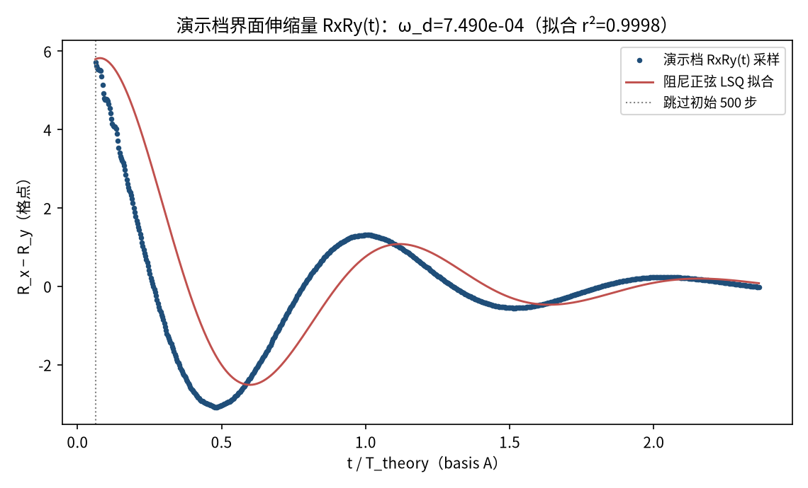
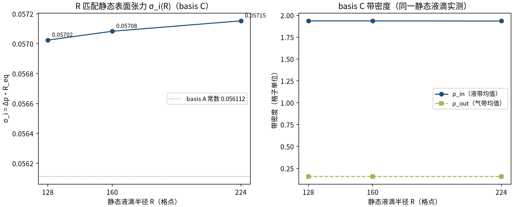
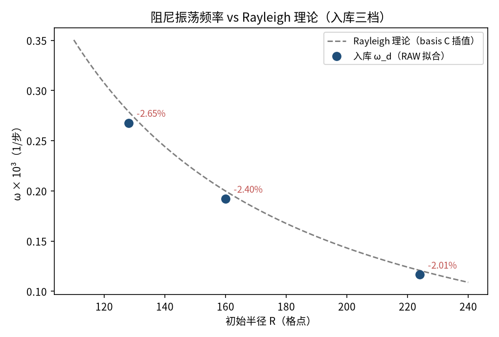
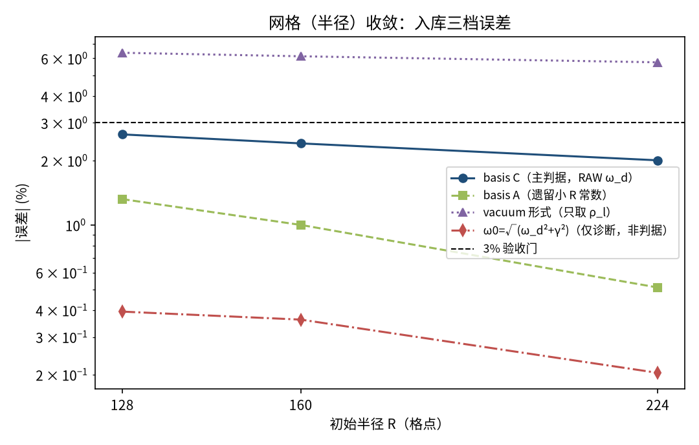
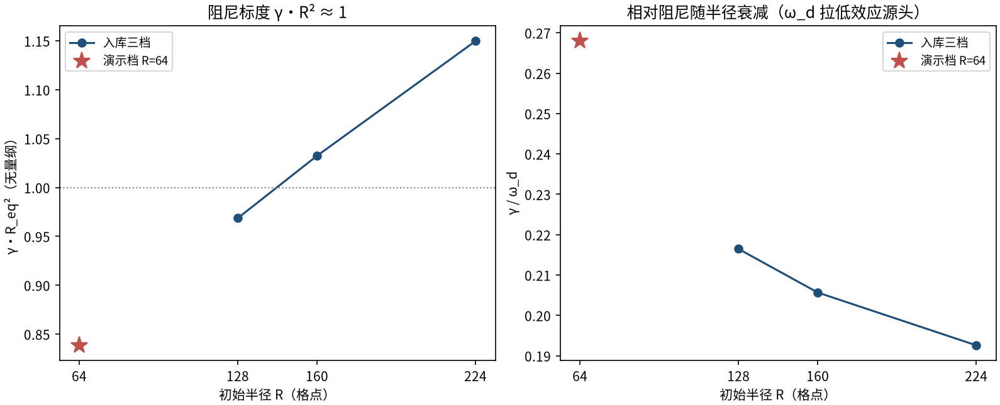

# 液滴毛细振荡：m=2 模态频率 vs Rayleigh 解析（droplet_oscillation）

> Droplet Capillary Oscillation vs Rayleigh Frequency (SCMP, m=2 mode)

**摘要** — TensorLBM SC94 单组分伪势模型中，椭圆初始化液滴的 m=2 毛细振荡 RAW 阻尼频率 ω_d（界面伸缩量 RxRy(t) 的时域阻尼正弦 LSQ 拟合）对 Rayleigh 理论ω_th=√(6σ/((ρ_l+ρ_v)R³))（basis C：同半径静态液滴标定 σ_i 与带密度）的误差在R=128/160/224 三档为 -2.65% → -2.40% → -2.01%，全部 ≤3% 且严格单调收敛（入库 pass = True）。误差主体是阻尼振荡频率的固有拉低ω_d=√(ω₀²−γ²)，未做任何修正——RAW 误差本身即判据。

## 1. Benchmark 介绍

毛细振荡是界面流动的经典自由边界问题：受扰液滴在表面张力驱动下以一系列离散的Lamb 模态回复振荡，m=2（四极）模态是小振幅下最易激发的最低阶模态。Rayleigh (1879) 给出无粘理论频率 ω² = m(m²−1)σ/((ρ_l+ρ_v)R³)，m=2 时为 6σ/((ρ_l+ρ_v)R³)；粘性将频率拉低为阻尼振荡频率 ω_d = √(ω₀²−γ²)。

本基准检验伪势多相模型的界面动力学闭合能力：动态振荡频率必须与同一模型的静态表面张力自洽——σ_i 与带密度取自同半径、同模型族的静态 Laplace 液滴（basis C），杜绝跨尺度混合常数造成的「凑准」。

严格标准口径：判据是 RAW 观测阻尼频率 ω_d；把阻尼还原的 ω₀=√(ω_d²+γ²) 写入判据属于被禁止的修正。本案例 ω₀ 仅作为诊断列出现（其误差 −0.20% ~ −0.39% 佐证「模型本征频率 Rayleigh 正确、RAW 误差来自真实阻尼拉低」的物理归因）。

### 物理与数学背景

SC94 单组分伪势格子 Boltzmann：D2Q9 格子、BGK 碰撞、伪势力F = −G_eff·ψ(ρ)·Σᵢwᵢψ(ρ(x+cᵢ))cᵢ（ψ = 1 − e^(−ρ)，库后向 gather 符号约定下G=+5 等效标准 G_eff=−5），周期域拉氏流迁。

```
Rayleigh 毛细频率（m=2）：ω_th = sqrt(6·σ_i / ((ρ_in+ρ_out)·R_eq³))
```

```
阻尼正弦拟合模型：RxRy(t) = A·exp(−γt)·cos(ω_d·t + φ) + c
```

```
阻尼拉低：ω_d = sqrt(ω₀² − γ²)（ω₀ 为模型本征频率，仅诊断）
```

```
basis C 静态标定：σ_i(R) = Δp·R_eq（同半径静态 Laplace 液滴）
```

**参考解** — Rayleigh (1879) 线性毛细波理论；本案例采用 basis C（逐档 R 匹配静态标定）为主判据，basis A（遗留小 R 常数 σ=0.056112、ρ 1.957/0.1596）与 vacuum 形式为次要列。

**参考文献**

- Rayleigh, Lord (1879), On the capillary phenomena of jets, Proc. R. Soc. Lond. 29, 71-97.
- Shan X., Chen H. (1993), Lattice Boltzmann model for simulating flows with multiple phases and components, Phys. Rev. E 47, 1815.
- Miller W., Succi S., Mansutti D. (2003), Lattice Boltzmann model for anisotropic liquid droplet coalescence, Int. J. Mod. Phys. B 17, 179（LBM 液滴振荡先例）.

## 2. 计算条件设置

正式档计算条件取自入库 result.json（程序化注入，下同）。

| 参数 | 取值 | 说明 |
|---|---|---|
| 模型 | SCMP SC94 单组分伪势 | ψ = 1 − e^(−ρ)，物理 G_eff = −5.0（库参数 G = +5.0，后向 gather 符号约定） |
| 碰撞核 / 流迁 | D2Q9 BGK + 周期拉氏 | tensorlbm.multiphase.collide_sc_single_component + solver.stream（零手写物理） |
| τ / 精度 | 1 / float32 | 弛豫时间 τ=1（ν=1/6），单精度 |
| 域 / 初始界面 | L = 4R 周期，椭圆 tanh 剖面 | R(θ)=R₀(1+0.05·cos2θ)，界面宽度 W=4（m=2 模态，eps=0.05） |
| 档位（正式档） | R = 128 / 160 / 224 | 每档 L = 512 / 640 / 896，演化 ≥5.6 个理论周期 |
| 主观测信号 | RxRy(t) = R_x − R_y | 亚格点中密度界面伸缩量（预注册主信号；σ_ω 与 r² 双最优） |
| 主窗口 | 跳过 500 步 + 2.0 理论周期 | 预扫描不稳定图锁定：≥2.5p 在 R≥224 受慢拉伸失稳污染，1p 受初始瞬态偏置 |
| 理论参考（basis C） | ω_th = √(6σ_i/((ρ_in+ρ_out)·R_eq³)) | σ_i(R)=Δp·R_eq 与带密度取自同半径同族静态 Laplace 液滴（主判据） |

## 3. 软件使用步骤

**环境** — Python ≥ 3.11；依赖 torch / numpy / matplotlib；仓库 src 可导入（pip install -e . 或 PYTHONPATH=<repo>/src）

**步骤 1**：获取仓库并进入根目录

```bash
git clone https://github.com/cxs503/TensorLBM.git && cd TensorLBM
```

**步骤 2**：安装/指向 tensorlbm 包

```bash
pip install -e .   # 或 export PYTHONPATH=$PWD/src
```

**步骤 3**：单档快速体验（R=128，CPU 约数十分钟；GPU 更快）

```bash
python benchmarks/verified/droplet_oscillation/run.py --radii 128 --device cpu --out /tmp/droplet_R128
```

**步骤 4**：正式三档扫描（静态标定 + 振荡 + 拟合 + 判定门），写出 result.json

```bash
python benchmarks/verified/droplet_oscillation/run.py --radii 128,160,224 --device cuda:0 --out <dir>
```

### 场量可视化演示脚本

场量可视化演示：与正式档同一组库入口，缩小半径 R=64（正式档 128/160/224）、约 2.3 个理论周期（256² 周期域 × 19075 步，CPU 约 417 s），输出界面伸缩时间序列 RxRy(t) 与相场快照序列；演示档理论线用 basis A 常数，判据数字一律取自入库扫描。

```bash
python docs/benchmarks/demos/droplet_oscillation_demo.py --R 64 --periods 2.3 --out demo.npz
```

## 4. 计算结果

**表 1 入库扫描结果（三档半径）**

| 量 | R=128 | R=160 | R=224 | 备注 |
|---|---|---|---|---|
| ω_d（RAW 拟合） | 2.677966e-04 | 1.921602e-04 | 1.165128e-04 | 阻尼振荡频率（1/步） |
| σ_ω/ω_d | 0.166% | 0.150% | 0.145% | 拟合 1σ（门 <1%） |
| γ（阻尼率） | 5.797e-05 | 3.952e-05 | 2.244e-05 | 1/步 |
| γ/ω_d | 0.216 | 0.206 | 0.193 | 拉低效应强度（∝R^(−1/2) 递减） |
| 拟合 r² | 0.99980 | 0.99979 | 0.99973 | 2.0p 主窗 RxRy |
| R_eq（窗口均值） | 129.26 | 161.62 | 226.36 | 格点（初值 128/160/224） |
| T_theory（basis C） | 22841 | 31911 | 52846 | 理论周期（步） |
| 质量漂移 | 8.06e-04 | 1.07e-03 | 1.74e-03 | 门 <2e-3 |
| 演化步数 | 99000 | 138000 | 228000 | ≥5.6 理论周期 |

*来源：benchmarks/verified/droplet_oscillation/result.json（campaign：bm_widen Wave-2 W2-B strict standard (2026-09-20)）。*



*图 2 演示档 RxRy(t)（R=64）与阻尼正弦 LSQ 拟合：拟合 ω_d=7.490e-04（对 basis A 理论 7.790e-04 偏差 -3.85%，r²=0.9998）。演示档半径小于正式档、γ/ω_d 更大，衰减更快；该数字仅示意测量管线形态，判据以入库三档为准。*



*图 3 basis C 的构造：左=同半径静态 Laplace 液滴标定的 σ_i(R)（0.05702 → 0.05715，随 R 缓升约 1.7%，为模型真实的曲率/压缩性趋势）；右=静态带密度 ρ_in/ρ_out。*


*图 1 演示档（R=64，256²，CPU）m=2 毛细振荡相场快照：白线为中密度界面 ρ≈1.06。液滴在椭圆（x 方向拉长）与反向椭圆之间往复振荡，振幅随时间衰减——表面张力驱动回复、伪势模型耗散提供阻尼。*

## 5. 与文献 / 解析解的比较

**表 2 与 Rayleigh 理论的比较（多基准并列）**

| 量 | R=128 | R=160 | R=224 | 口径说明 |
|---|---|---|---|---|
| ω_d 误差（basis C，主判据） | -2.649% | -2.404% | -2.005% | RAW 阻尼频率 vs Rayleigh；\|err\|≤3% 且随 R 严格下降 |
| ω_d 误差（basis A） | -1.321% | -1.001% | -0.511% | 遗留小 R 常数参考（次要列） |
| ω_d 误差（vacuum 形式） | -6.371% | -6.135% | -5.749% | 只含 ρ_l 的真空形式（次要列） |
| ω₀ 诊断误差 | -0.394% | -0.362% | -0.204% | ω₀=√(ω_d²+γ²)（禁止入判据的阻尼还原量，仅诊断） |

*汇总：全档 ≤3% = True；严格单调收敛 = True；拟合质量门 = True；总判 pass = True。*



*图 4 入库三档 RAW ω_d vs Rayleigh 理论（basis C）：红色标注为各档带符号误差，随 R 增大从 -2.65% 收敛到 -2.01%。*



*图 5 误差收敛（对数纵轴）：主判据 basis C（RAW ω_d，蓝）严格单调下降；basis A（绿）与 vacuum（紫）为次要参考；红色 ω₀ 诊断列误差最小（−0.20% ~ −0.39%）但按预注册不得入判据。*



*图 6 阻尼标度：左=γ·R_eq² ≈ 1（三档入库 + 演示档同量级，粘性毛细弛豫时间的无量纲化）；右=γ/ω_d 随 R 增大而减小——RAW 误差的拉低效应随 R 衰减正是单调收敛的物理来源。*

- 误差定义：(ω_d − ω_th)/ω_th × 100%，ω_th 取 basis C（R 匹配静态 σ_i 与带密度）；验收标准 |err| ≤ 3% 每档且随 R 严格下降、σ_ω/ω_d < 1%、质量漂移 < 2e-3。
- 严格标准注记：判据为 RAW 观测阻尼频率，无阻尼还原、无任何模型修正；ω₀=√(ω_d²+γ²) 仅作诊断列（预注册禁止其入判据）。
- 诚实披露：模型族存在慢拉伸失稳（e 折叠约 6 万步），限制可用窗口；R=320 无干净 ≥1.5p 窗口故不入档；float32 质量漂移约 7.7e-9/步，全部窗口远在干净区内（详见档案 NOTES.md）。

## 6. 复现说明

```bash
python benchmarks/verified/droplet_oscillation/run.py --radii 128,160,224 --device cuda:0 --out <dir>
```

**预期结果** — err（basis C）= -2.649% → -2.404% → -2.005%（|err|≤3% 且严格单调）；σ_ω/ω_d ≤ 0.166%；pass = True

**参考耗时** — 入库档 GPU（RTX 5090）三档合计约 10 分钟（含静态标定；每档步数 99000/138000/228000）

**入库位置** — `benchmarks/verified/droplet_oscillation`

---

*本教程由 TensorLBM benchmark 档案自动生成，判据数字均取自入库 `result.json` 机器档案；演示图为缩短时长的可视化档，定量结论以存档扫描为准。*
