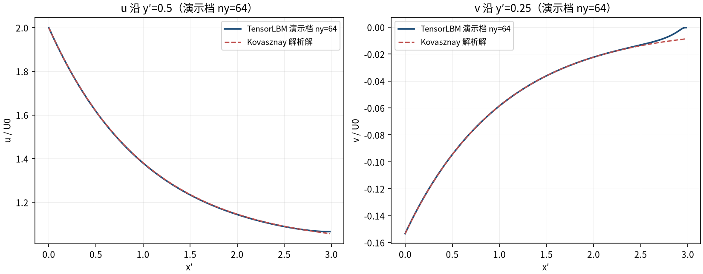
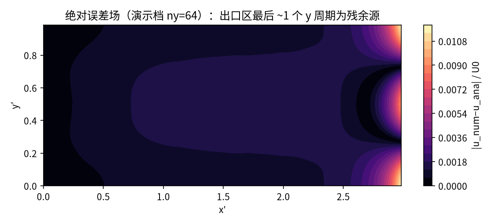
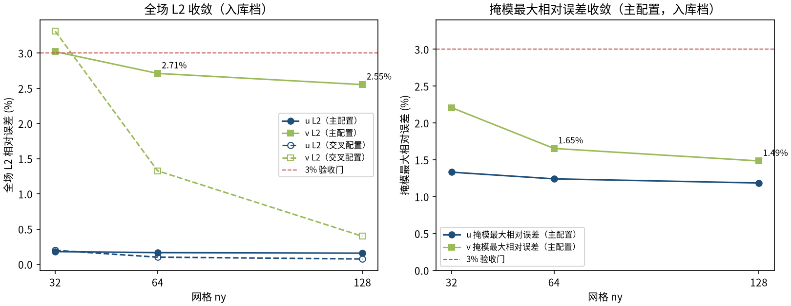

# Kovasznay 二维稳态层流（解析 Navier–Stokes 解）（kovasznay_2d）

> Kovasznay 2D Steady Flow (Analytic Navier-Stokes Solution)

**摘要** — TensorLBM D2Q9 BGK 求解器在 Kovasznay (1948) 二维稳态不可压 Navier–Stokes 精确解上的直接验证：Re=40、λ=-0.963741，主配置（x′∈[0,3] 零梯度出口）三档网格 ny=32/64/128 全场 u/v L2 与掩模最大相对误差均 ≤3%（最大 2.7113%），且 64→128 四项指标单调下降（入库 verdict = PASS）。

## 1. Benchmark 介绍

Kovasznay 流是二维稳态不可压 Navier–Stokes 方程的精确解：垂直于来流的周期性涡列沿流向指数衰减，模拟格栅尾迹的层流区。它是少数存在全场解析解的有旋流动，能同时检验求解器的对流、扩散与压力-速度耦合，是稳态求解器验证的标准算例（Kovasznay 1948）。

本案例 Re = 40（特征速度 U0=0.03、特征长度 = y 向周期），衰减率 λ = -0.963741。注意一个常见陷阱：λ 必须由动量方程的特征根 λ = Re/2 − √(Re²/4+4π²) 精确给出（Re=40 → −0.9637）；文献中偶尔引用的 λ≈−0.5 对应 Re≈78.5，与本案例不符——入库档案对此有明确勘误记录。

实现为零手写物理的库链：solver.collide_bgk + stream（周期 gather）+ boundaries.zou_he_inlet_velocity（解析 Dirichlet 入口）+ 内联零梯度出口（库无该函数，3 行内联，README 已登记为共性模块缺口）。初值取全场解析平衡态，主配置域长 3 个 y 周期——这是关键工程结论：零梯度出口会把出口附近 v 分量压平（短域 x′∈[0,1] 时全场 v 误差 ~96%），域长 3 个周期后出口扰动衰减至 e^{λ·3}≈0.056，全场误差回到 ≤3%。

### 物理与数学背景

二维稳态不可压 Navier–Stokes 方程的格子 Boltzmann 离散：D2Q9 格子、BGK 单弛豫碰撞、周期 gather 流迁（y 向周期内建）。

```
u(x′,y′) = U0·(1 − e^{λx′}·cos 2πy′)
```

```
v(x′,y′) = U0·(λ/2π)·e^{λx′}·sin 2πy′
```

```
p(x′,y′) = 0.5·(1 − e^{2λx′})（ρU0² 归一）
```

```
λ = Re/2 − √(Re²/4 + 4π²)（负根；Re=40 → −0.963741）
```

```
ν = U0·ny/Re，τ = 0.5 + 3ν
```

**参考解** — Kovasznay L.I.G. (1948) 精确解；解析解已独立数值验证（max|N-S 残差| ≈ 1e-3 为差分截断，恒等式 λ=ν(λ²−4π²) 成立至 2e-15，见入库 result.json notes）。

**参考文献**

- Kovasznay L.I.G. (1948), Laminar flow behind a two-dimensional grid, Proc. Camb. Phil. Soc. 44, 58-62.
- Zou Q., He X. (1997), On pressure and velocity boundary conditions for the lattice Boltzmann BGK model, Phys. Fluids 9, 1591-1598.

## 2. 计算条件设置

正式档计算条件取自入库 result.json（程序化注入，下同）。

| 参数 | 取值 | 说明 |
|---|---|---|
| Re | 40 | Re = U0·L/ν，特征长度 L = y 向周期 |
| λ（衰减率） | -0.963741 | λ = Re/2 − √(Re²/4+4π²) = −0.963741（负根） |
| U0 | 0.03 | u ∈ [0, 2U0]，Ma_max = 2U0/cs ≈ 0.104 |
| 网格（主配置） | 96×32 / 192×64 / 384×128 | nx = 3·ny，x′∈[0,3]，y 向周期 1 |
| τ | 0.572 / 0.644 / 0.788 | ν = U0·ny/Re，τ = 0.5+3ν |
| 步数（主配置） | 20000 | 稳态监测 ‖u(t)−u(t−2500)‖₂/‖u‖₂ < 5e-5 |
| 碰撞核 | D2Q9 BGK | tensorlbm.solver.collide_bgk / stream |
| 边界处理 | Zou/He 解析入口 + 零梯度出口 | boundaries.zou_he_inlet_velocity；出口 f[:,:,-1]=f[:,:,-2] |

## 3. 软件使用步骤

**环境** — Python ≥ 3.11；依赖 torch / numpy / matplotlib；仓库 src 可导入（pip install -e . 或 PYTHONPATH=<repo>/src）

**步骤 1**：获取仓库并进入根目录

```bash
git clone https://github.com/cxs503/TensorLBM.git && cd TensorLBM
```

**步骤 2**：安装/指向 tensorlbm 包

```bash
pip install -e .   # 或 export PYTHONPATH=$PWD/src
```

**步骤 3**：单档快速复现（ny=64，CPU 约 1 分钟）

```bash
python benchmarks/verified/kovasznay_2d/run.py single 64 case_ny64.json --xmax 3.0 --outlet zerograd --device cpu
```

**步骤 4**：正式三档网格收敛扫描，写出判定 result.json

```bash
python benchmarks/verified/kovasznay_2d/run.py scan out_dir --grids 32 64 128 --xmax 3.0 --outlet zerograd --min-steps 20000 --max-steps 60000 --device cpu
```

### 场量可视化演示脚本

场量可视化演示：与正式档同一组库入口与步进链，取 ny=64（= 正式验收扫描最粗档）、20000 步、末 100 步时均，CPU 约 70 s；输出 u/v 数值场与解析场对比。演示档 L2 （u 0.00165 / v 0.02711）与入库档 ny=64 行一致（差 <1e-4，同一确定性链的复现性交叉验证）。

```bash
python docs/benchmarks/demos/kovasznay_2d_demo.py --ny 64 --steps 20000 --out demo.npz
```

## 4. 计算结果

**表 1 入库扫描结果（主配置：x′∈[0,3] 零梯度出口）**

| 量 | ny=32 | ny=64 | ny=128 | 备注 |
|---|---|---|---|---|
| u L2 相对误差 | 0.18% | 0.17% | 0.16% | 全场 ‖·‖₂ |
| v L2 相对误差 | 3.02% | 2.71% | 2.55% | 全场（主要残余源=出口区） |
| u 掩模最大相对误差 | 1.33% | 1.24% | 1.19% | \|u_ana\|>0.1·U0 |
| v 掩模最大相对误差 | 2.21% | 1.65% | 1.49% | \|v_ana\|>0.1·max\|v_ana\| |
| 质量漂移 | -0.004% | -0.005% | -0.011% | Zou-He 入口+零梯度出口的慢泄漏 |
| 稳态达成 | 是 | 是 | 是 | 20000 步即稳（steady=True） |
| 耗时（CPU） | 12 s | 31 s | 108 s | 正式档 |

*来源：benchmarks/verified/kovasznay_2d/result.json（primary_config）。*


*图 1 演示档（ny=64，20000 步，CPU）场量 vs 解析解：上=u/U0（入口 2U0 峰值衰减为 U0 平台、涡列沿 x′ 指数衰减），下=v/U0（正负交替的横向分量同步衰减）。数值列与解析列肉眼不可分。*

## 5. 与文献 / 解析解的比较

**表 2 与解析解的比较与验收（主配置）**

| 量 | 值 | 说明 |
|---|---|---|
| 验收判据 | max over {u,v L2 rel err, u/v masked max rel err} on ny=64/128 <… | （result.json acceptance 全文） |
| 最大误差（判据量） | ny=64: 2.7113% → ny=128: 2.5524% | max = 2.7113% ≤ 3% |
| 四指标单调下降 | u_l2_decreases、v_l2_decreases、u_max_rel_decreases、v_max_rel_decreases | 64→128 收敛（弱收敛：单调但斜率小） |
| 主配置 verdict | PASS | 入库判定 PASS |
| 演示档一致性 | u_l2_demo=0.00165 / v_l2_demo=0.02711 | 与入库档 ny=64 行复现（差 <1e-4：4.4e-09/1.6e-09） |

**表 3 交叉验证配置（双端解析 Dirichlet，方域 x′∈[0,1]）**

| 量 | ny=32 | ny=64 | ny=128 | 备注 |
|---|---|---|---|---|
| u L2 相对误差 | 0.20% | 0.10% | 0.07% | 双端解析 Dirichlet，方域 x′∈[0,1] |
| v L2 相对误差 | 3.31% | 1.33% | 0.40% | 随细化 ~2-8× 快速下降 |
| v 掩模最大相对误差 | 29.09% | 16.10% | 5.59% | sin 零穿越度量伪影，L2 为准 |

*文献标准做法，用于展示内部求解器本身的收敛性（无出口 BC 污染）；不作为验收配置（v 掩模最大相对误差为 sin 零穿越度量伪影，L2 指标为准）。*



*图 2 剖面对比（演示档 ny=64）：左=u 沿 y′=0.5（2U0→U0 的指数衰减+余弦调制），右=v 沿 y′=0.25（|v| 最大线上数值与解析重合）。*



*图 3 绝对误差场（演示档 ny=64）：误差集中在出口最后 ~1 个 y 周期（零梯度 BC 影响区，v 被压平），内部区误差在 1%·U0 量级——与入库档案的误差源归因一致。*



*图 4 网格收敛（入库判据数字）：主配置 v L2 2.71% → 2.55% （u L2 0.17% → 0.16%），掩模最大相对误差同步下降；虚线为交叉配置（双端 Dirichlet）的快速收敛对照。*

- 误差定义：全场 L2 相对误差 ‖u_num−u_ana‖₂/‖u_ana‖₂ 与掩模最大点相对误差（阈值 0.1·幅值，避免除近零）；验收标准 max(四指标) ≤3% 且 64→128 单调下降。
- 残余误差两来源（均不随网格细化消失，故为弱收敛）：出口零梯度 BC 影响区（最后 ~0.5-1 个 y 周期，v 压平）与 BGK 的 O(Ma²) 压缩性误差（u L2 ≈0.16% 底噪）。
- 方法论记录：二阶外推出口（2f[n-2]−f[n-3]）会负概率发散不可用（gaps K3）；短域方域配置会把 v 杀到 ~96% 误差，域长 3 周期为经验最优；本案例为直接观测量对解析解（无修正无重标定）。

## 6. 复现说明

```bash
python benchmarks/verified/kovasznay_2d/run.py scan out_dir --grids 32 64 128 --xmax 3.0 --outlet zerograd --min-steps 20000 --max-steps 60000 --device cpu
```

**预期结果** — u L2 0.17% → 0.16%；v L2 2.71% → 2.55%；最大误差 2.7113% → 2.5524%（≤3% 且四指标单调下降，PASS）

**参考耗时** — 约 151 s 合计（CPU；ny=128 档最慢）

**入库位置** — `benchmarks/verified/kovasznay_2d`

---

*本教程由 TensorLBM benchmark 档案自动生成，判据数字均取自入库 `result.json` 机器档案；演示图为缩短时长的可视化档，定量结论以存档扫描为准。*
