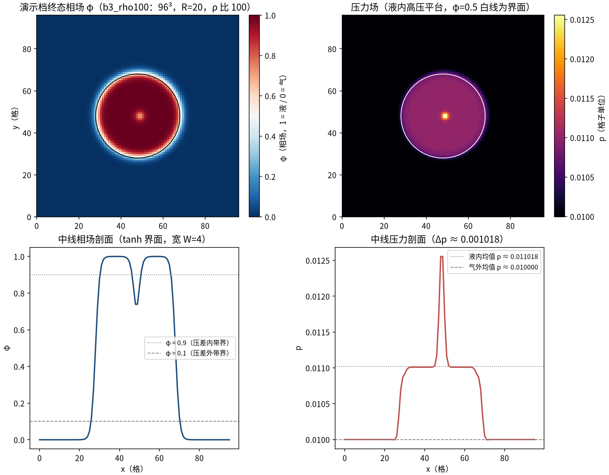
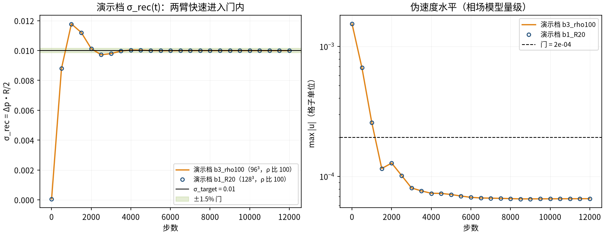
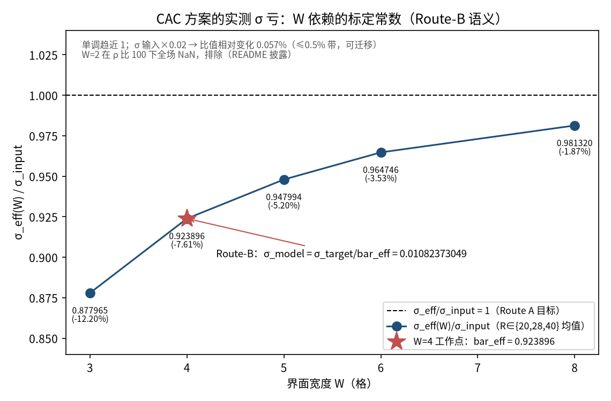
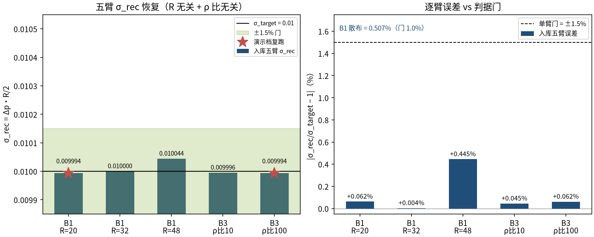

# CAC 相场两相液滴 Young–Laplace：Route-B σ 标定与 R/密度比迁移（laplace_cac_phasefield）

> CAC Phase-Field Droplet Young-Laplace: Route-B Sigma Calibration with R and Density-Ratio Transfer

**摘要** — CAC（conservative Allen–Cahn）相场两相格子 Boltzmann（D3Q19 双分布、fp64、调和黏度律、W=4，tensorlbm.cac_lbm 模块）在 3D 球形静态液滴上验证 Young–Laplace 律 Δp = 2σ/R。方案实测表面张力 σ_eff(W) ≠ σ_input 是 W 依赖的标定常数（W 梯 0.877965→0.981320 单调趋近 1），Route-B 一步补偿 σ_model = σ_target/bar_eff(W=4) = 0.01082373049 后，B1 三半径（R=20/32/48@128³、ρ 比 100）与 B3 双密度比（10/100@96³、R=20）五臂 σ_rec 全部恢复 0.01（最大误差 0.4449%、B1 散布 0.5066%、伪速度 ≤ 6.7e-05、φ 漂移 ≤ 8.6e-13）——σ 标定的 R 无关性与密度比无关性成立，verified = True。

## 1. Benchmark 介绍

相场（diffuse-interface）类两相 LBM 用有序参数 φ 的输运方程显式追踪界面，界面物理（表面张力、界面宽 W）由自由能参数解析进入格式——与伪势类（见 laplace_droplet、laplace_pr_eos 案）「σ 从压差自测」不同，相场格式输入的是一个模型 σ。本基准回答的问题是：输入的 σ_model 经过离散格式后，实测界面张力是否恢复目标值、且这种恢复是否与 R 和密度比无关。

直接标定（Route A：取 σ_model = σ_target）在本方案不可达：σ_eff(W)/σ_input 在可用 W 梯上单调趋近 1 但始终偏低（W=8 时仍差 1.87% > 1% 门）。基准因此采用 Route-B：固定 W=4，一次性测出标定常数 bar_eff(W=4) = 0.9238958796，模型输入补偿 σ_model = σ_target/bar_eff——该常数 R 无关、σ 量级可迁移（线性度 0.057%），同一常数用于全部五臂、无逐臂调参。

模型实现为仓库新增模块 tensorlbm.cac_lbm（Liang et al. PRE 97, 033309 格式：h-LBE 输运 φ 的 CAC 对流重生项、g-LBE 输运压力/动量的HCH 项、各向同性 Eq.(27/28) 梯度/拉普拉斯模板；复用库 d3q19 流迁与反弹边界，零手写 collide/stream，grep 校验）。µ(φ) 连续混合律（harmonic）与 _macro_fp64 诊断口径为 W10-M1 冻结修改随模块入库。

已知边界（本基准未覆盖、另行披露）：极端参数族（W=2@ρ 比 100、κ≤0.1 黏度比）存在 CAC 不稳定性。

### 物理与数学背景

conservative Allen–Cahn 相场方程 + 不可压 Navier–Stokes 的双分布格子 Boltzmann 离散：h-LBE（φ 的 CAC 对流重生项）与 g-LBE（压力/动量，HCH 形式），D3Q19 格子、各向同性梯度/拉普拉斯模板。

```
Young–Laplace（3D 球）：Δp = p_in − p_out = 2σ/R
```

```
逐臂恢复：σ_rec = Δp·R/2（R 取名义半径；压差带 φ>0.9 内 / φ<0.1 外）
```

```
界面剖面：φ = 0.5 + 0.5·tanh(2(R − r)/W)（Eq.(30) 初始化）
```

```
自由能参数：β、κ 由 (σ, W) 解析（free_energy_params）
```

```
Route-B 标定：bar_eff(W) = σ_eff(W)/σ_input；σ_model = σ_target/bar_eff(W=4)
```

```
判据：单臂 |σ_rec/σ_target − 1| ≤ 1.5%；B1 散布 ≤ 1%；max|u| ≤ 2e-4；φ 漂移 @10k ≤ 1e-6；全程 NaN-free
```

**参考解** — Young (1805) / Laplace (1806) 毛细静力学（3D 球 Δp = 2σ/R）。σ_target = 0.01 为本基准自设的目标表面张力（非文献值）；验证对象是 σ_rec 对 σ_target 的恢复精度及其 R/密度比无关性。

**参考文献**

- Young T. (1805), Phil. Trans. R. Soc. 95, 65；Laplace P. S. (1806), Mecanique Celeste, Suppl.（3D 球 Δp = 2σ/R）
- Liang H., Xu B., Chen B., Wang H., Chai Z., Shi B. (2018), Lattice Boltzmann modeling of wall-bounded two-component flows, Phys. Rev. E 97, 033309（CAC 相场 LBE 格式：h-LBE/HCH 双分布、化学势、各向同性模板）
- Wang H., He X., Wang Y. et al., arXiv:2306.11320（同族参数对比 hydro 方程交叉核对）

## 2. 计算条件设置

正式档计算条件取自入库 result.json（arms.params + criteria，程序化注入，下同）。

| 参数 | 取值 | 说明 |
|---|---|---|
| 问题 | CAC 相场两相静态液滴 Laplace 律（3D 球） | 周期立方域中心液滴弛豫到稳态：Δp = 2σ/R |
| 模型 | CAC/HCH 双分布 D3Q19（h-LBE 输运 φ、g-LBE 输运压力/动量） | tensorlbm.cac_lbm（本 PR 新增模块；零手写 collide/stream，grep 校验） |
| 精度 / 边界 | float64，周期（ppp） | 跨设备 fp64 逐位一致不成立，σ_rec 跨设备一致 ~1e-5 |
| 黏度律 | µ(φ) 调和平均（harmonic），ν = 0.1 两相 | B3 中 µ_g = ν·ρ_g；step 律会引入 τ 台阶伪影（P0 判决弃用） |
| 界面 / 迁移率 | W = 4，M = 0.05，p0 = 0.01 | 自由能参数 β、κ由 σ/W 解析（free_energy_params） |
| σ 输入（Route-B） | σ_model = σ_target/bar_eff(W=4) = 0.01/0.9238958796 = 0.01082373049 | 同一常数用于 B1 全部半径与 B3 全部密度比（无逐臂调参） |
| 臂（B1 R 迁移） | R = 20/32/48 @128³，ρ 比 100（ρ_l=1、ρ_g=0.01） | 共 3 臂；判定 R 无关 |
| 臂（B3 密度比迁移） | ρ 比 = 10/100 @96³，R = 20 | 判定 ρ 比无关 |
| 步数 / 估计窗 | 12000 步；估计窗 = 末 2000 步（每 500 步采样） | 压差带：界面内 φ>0.9 / 界面外 φ<0.1；σ_rec 用名义 R |
| 判据门 | 单臂 \|σ_rec/σ_target−1\| ≤ 1.5%；B1 散布 (max−min)/mean ≤ 1.0%；伪速度 ≤ 2e-04；φ 积分漂移 @10k ≤ 1e-06；全程 NaN-free | 五条全过才 verified |

## 3. 软件使用步骤

**环境** — Python ≥ 3.11；依赖 torch / numpy / matplotlib；仓库 src 可导入（pip install -e . 或 PYTHONPATH=<repo>/src）；GPU 建议（fp64，CPU 单臂数小时）

**步骤 1**：获取仓库并进入根目录

```bash
git clone https://github.com/cxs503/TensorLBM.git && cd TensorLBM
```

**步骤 2**：安装/指向 tensorlbm 包

```bash
pip install -e .   # 或 export PYTHONPATH=$PWD/src
```

**步骤 3**：全部 5 臂复现（GPU fp64 约 25 分钟；--device auto 自动回退 CPU）

```bash
python benchmarks/verified/laplace_cac_phasefield/run.py --out /tmp/laplace_cac_repro
```

**步骤 4**：单臂快速验证（96³，GPU 约 3 分钟）

```bash
python benchmarks/verified/laplace_cac_phasefield/run.py --arms b3_rho10 --out /tmp/laplace_cac_repro
```

### 场量可视化演示脚本

场量可视化演示：与正式档同一臂构造（tensorlbm.cac_lbm.CACSim + init_phi_droplet + _macro_fp64）、同 12000 步、同估计窗与压差带，GPU fp64 复跑 5 臂中的 2 臂——b1_R20（128³，R 阶梯代表，ρ 比 100）与 b3_rho100（96³，密度比迁移代表），合计约 10 分钟；输出终态 φ/压力/密度/|u| 中面切片、中线剖面与 σ_rec(t)/u_max(t) 序列。演示档 σ_rec 与入库臂一致（构建时断言 ≤0.5%；fp64 跨 GPU 不保证逐位，可观测量一致 ~1e-5）。缩短维度 = 只跑 2/5 臂（单臂协议不缩短）；B1 其余半径与 B3 ρ 比 10 的数字一律取自入库扫描。CPU 运行单臂数小时，演示建议 GPU。

```bash
python docs/benchmarks/demos/laplace_cac_phasefield_demo.py --arms b1_R20,b3_rho100 --out demo.npz
```

## 4. 计算结果

**表 1 入库五臂结果 + 演示档复跑（机器值）**

| 臂 | Δp（窗均） | σ_rec | 误差 | max \|u\|（窗） | φ 漂移@10k |
|---|---|---|---|---|---|
| B1 R=20（128³，ρ比100） | 0.0009993760666 | 0.00999376 | +0.0624% | 6.73e-05 | 8.6e-13 |
| B1 R=32（128³，ρ比100） | 0.0006250221401 | 0.01000035 | +0.0035% | 6.14e-05 | 8.6e-13 |
| B1 R=48（128³，ρ比100） | 0.0004185204433 | 0.01004449 | +0.4449% | 6.08e-05 | 8.6e-13 |
| B3 ρ比=10（96³，R=20） | 0.0009995520561 | 0.00999552 | +0.0448% | 5.02e-05 | 8.6e-13 |
| B3 ρ比=100（96³，R=20） | 0.0009993821686 | 0.00999382 | +0.0618% | 6.74e-05 | 8.6e-13 |
| 演示档复跑 b1_R20（GPU） | — | 0.00999376 | -0.0624% | 6.73e-05 | — |
| 演示档复跑 b3_rho100（GPU） | — | 0.00999382 | -0.0618% | 6.74e-05 | — |

*来源：benchmarks/verified/laplace_cac_phasefield/result.json（gates.pass = True、verified = True；估计窗 = 末 2000 步、每 500 步采样、窗均）。演示档为 GPU 复跑（σ_model 同 Route-B 常数 0.01082373049）。*



*图 1 演示档 b3_rho100 终态场量：左上=相场 φ 中面切片（黑线 φ=0.5 界面，液内 φ≈1/气外 φ≈0）；右上=压力场（液内高压平台，Δp 的来源）；左下=中线 φ 剖面（tanh 界面宽 W=4，虚线标出 φ=0.9/0.1 压差带界）；右下=中线压力剖面（Δp ≈ 0.001018 → σ_rec = Δp·R/2）。*



*图 2 演示档时序：左=σ_rec(t)（两臂均快速进入 ±1.5% 门带，绿区）；右=max|u|(t) 对数轴（伪速度稳态 ~7e-05，远低于门 2e-04——相场模型动能近零的标志）。两臂轨迹几乎重合（σ_rec 逐采样最大差 7.5e-04·σ_target：同 R=20、同 ρ 比 100，仅域尺寸不同 128³ vs 96³——界面局部物理决定弛豫，域尺寸不敏感的直接证据，故 b3 画实线、b1 画空心圆叠加显示）。*

## 5. 与文献 / 解析解的比较

**表 2 判据门 vs 实测 + Route-B 标定块（入库档）**

| 量 | 实测 | 说明 |
|---|---|---|
| 单臂最大误差 | 0.4449% | 门 ≤ 1.5%（五臂全部 ≤ 0.4449%） |
| B1 三半径散布 | 0.5066% | 门 ≤ 1.0%（R 无关性） |
| 伪速度 max \|u\| | 6.74e-05 | 门 ≤ 2e-04（相场模型量级） |
| φ 积分漂移 @10k | 8.6e-13 | 门 ≤ 1e-06（CAC 守恒律逐位成立） |
| NaN-free | True（5/5 臂） | 必须条款 |
| Route-B 标定 | bar_eff(W=4) = 0.9238958796（−7.61%）→ σ_model = 0.01082373049 | W 梯 W=3: 0.877965, W=5: 0.947994, W=6: 0.964746, W=8: 0.981320；W=4 单列 |
| 标定线性度 | σ 输入×0.02 → 比值相对变化 0.057% | ≤0.5% 带：标定常数在 σ 量级间可迁移 |
| 判决 | verified = True（gates.pass = True） | 入库 benchmarks/verified/laplace_cac_phasefield/result.json |



*图 3 Route-B σ 标定语义：σ_eff(W)/σ_input 随界面宽度 W 单调趋近 1 但始终 <1（W=8 仍差 1.87% → Route A 不可达）；工作点 W=4（星标）bar_eff = 0.923896，模型输入一次性补偿 σ_model = σ_target/bar_eff = 0.01082373049，同一常数用于全部五臂。*



*图 4 五臂 σ_rec 恢复：左=B1 三半径（R=20/32/48@128³）与 B3 双密度比（10/100@96³）σ_rec 全部落在 σ_target=0.01 的 ±1.5% 门带内（演示档星标为 GPU 复跑）；右=逐臂误差 vs 单臂门，B1 散布 0.507% （门 1.0%）——R 无关 + ρ 比无关成立。*

- 误差定义：|σ_rec/σ_target − 1|（σ_target = 0.01）；σ_rec 用名义半径 R（与正式档同口径），压差带避开弥散界面。
- Route-B 语义披露：σ_eff(W) ≠ σ_input 是 CAC 方案的界面宽度依赖标定常数，不是方案缺陷——本基准的证据是同一 bar_eff(W=4) 常数让 R∈{20,32,48} 与 ρ 比∈{10,100} 五臂全部闭合（最大 0.4449%、散布 0.5066%）；线性度实验（σ 输入×0.02 → 比值相对变化 0.057%）说明常数可跨 σ 量级迁移。
- 监视量：伪速度 max|u| ≤ 6.74e-05（相场模型量级，远低于门 2e-04）；φ 积分漂移 ≤ 8.6e-13（CAC 守恒律逐位成立）；5/5 臂全程 NaN-free。
- 跨设备注记：fp64 下不同 GPU/CPU 的逐位一致性不成立（混沌放大），但可观测量 σ_rec 跨设备一致到 ~1e-5（相对），判定不受影响——演示档复跑即按此口径与入库臂比对（构建时断言 ≤0.5%）。
- 演示档口径：完整复跑 2/5 臂（b1_R20@128³ + b3_rho100@96³，单臂12000 步协议不缩短）；正式档为五臂全跑，其余臂数字一律取自入库 result.json。

## 6. 复现说明

```bash
python benchmarks/verified/laplace_cac_phasefield/run.py --out /tmp/laplace_cac_repro
```

**预期结果** — 五臂 σ_rec = 0.00999376（R=20）/ 0.01000035（R=32）/ 0.01004449（R=48）/ 0.00999552（ρ比10）/ 0.00999382（ρ比100），单臂最大误差 0.4449%、B1 散布 0.5066%；verified = True

**参考耗时** — 5 臂 GPU fp64 约 25 分钟（README 实测）；演示档 2 臂 GPU 10 分钟（b1_R20 7 + b3_rho100 3 分钟）；CPU 单臂数小时

**入库位置** — `benchmarks/verified/laplace_cac_phasefield`

---

*本教程由 TensorLBM benchmark 档案自动生成，判据数字均取自入库 `result.json` 机器档案；演示图为缩短时长的可视化档，定量结论以存档扫描为准。*
