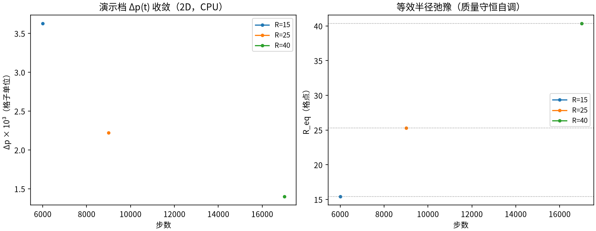
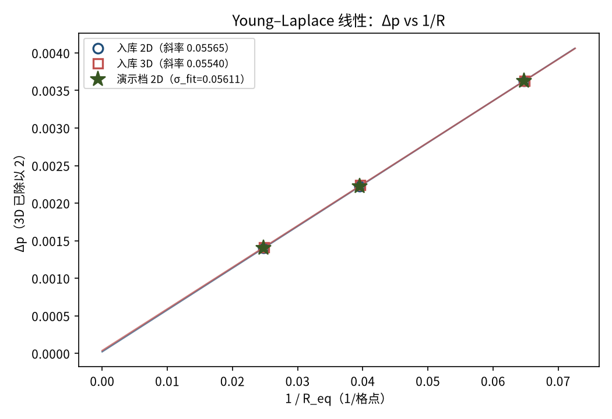
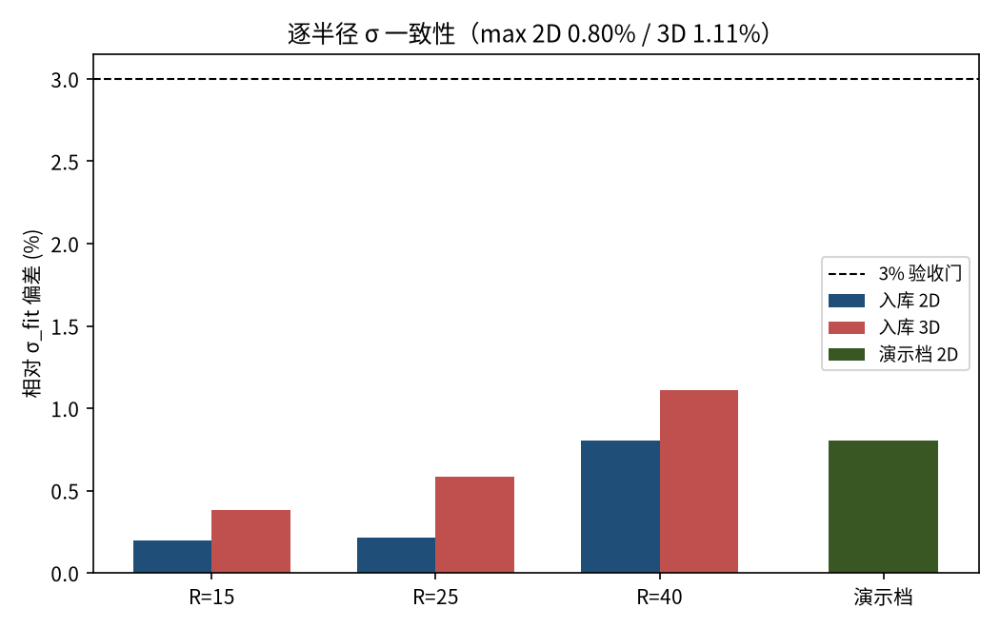

# 静态液滴 Young–Laplace 定律（表面张力标定）（laplace_droplet）

> Static Droplet Young-Laplace Law (SCMP Surface Tension)

**摘要** — 周期域中心一个 SC94 单组分伪势液滴弛豫到稳态后，液内外压差满足 Δp = σ/R（2D 圆柱）/ 2σ/R（3D 球）。三半径扫描（R = 15/25/40）下 2D 有效表面张力 σ_eff = 0.056112（逐半径偏差 ≤0.80%、R² = 1.0000000、截距占比 0.63%），3D σ_eff = 0.056170（≤1.11%、R² = 0.999982、截距占比 1.06%），两维相互一致 0.1%——Young–Laplace 线性在伪势模型中成立，全部门槛通过（verified = True）。

## 1. Benchmark 介绍

Young–Laplace 定律是表面张力的定义性检验：界面的曲率与两侧压差成正比，比例系数即表面张力 σ。对模拟多相流的任何方法，静态液滴的 Δp·R 常数性是界面物理自洽的最低门槛，也是为其它界面基准（液滴振荡、接触角等）标定 σ 的标准做法。

本基准在 SC94 单组分伪势模型上做 2D（D2Q9 圆柱）与 3D（D3Q19 球）双维验证：Δp 由稳态密度场经 EOS p = ρ/3 + G_eff·ψ²/6 直接计算，无外推、无人工修正；半径取实测等效半径 R_eq，压力取远离弥散界面的环带均值。

工程注记（库符号约定）：库的伪势力采用后向 gather ψ(x−c)，与标准 SC94 的前向 gather ψ(x+c) 恰好反号，因此库参数 G = +5 实现标准吸引耦合 G_eff = −5。这是自洽的库约定而非缺陷；曾尝试改前向 gather 在 G=±5 下均发散，已回退不改库（详见档案 README）。

### 物理与数学背景

SC94 单组分伪势格子 Boltzmann：D2Q9 / D3Q19 格子、BGK 碰撞、伪势力 F = −G_eff·ψ(ρ)·Σᵢwᵢψ(ρ(x+cᵢ))cᵢ，周期域拉氏流迁；非理想 EOS p = ρ/3 + G_eff·ψ²/6 产生液气相分离与表面张力。

```
Young–Laplace：2D Δp = σ/R_eq（圆柱）；3D Δp = 2σ/R_eq（球）
```

```
逐半径表面张力：σ_i = Δp·R_eq（2D）/ Δp·R_eq/2（3D）
```

```
过原点拟合：σ_eff = Σ(Δp/R_eq) / Σ(1/R_eq²)（判据基准）
```

```
自由截距线性拟合：Δp = a·(1/R_eq) + b（R² 与 |b|/(a/R_max) 入判据）
```

**参考解** — Young (1805) / Laplace (1806) 毛细静力学；判据为逐半径 σ 一致性 ≤3%、R² ≥ 0.999、截距占比 ≤3%。

**参考文献**

- Young T. (1805), An essay on the cohesion of fluids, Phil. Trans. R. Soc. 95, 65.
- Shan X., Chen H. (1993), Lattice Boltzmann model for simulating flows with multiple phases and components, Phys. Rev. E 47, 1815.
- Zhang R., Chen H. (2003), Lattice Boltzmann method for simulations of liquid-vapor thermal flows, Phys. Rev. E 67, 066711（伪势 σ 标定惯例）.

## 2. 计算条件设置

正式档计算条件取自入库 result.json（程序化注入，下同）。

| 参数 | 取值 | 说明 |
|---|---|---|
| 模型 | SCMP SC94 单组分伪势 | ψ = 1 − e^(−ρ)，物理 G_eff = −5.0（库参数 G = +5.0，后向 gather 符号约定，非 bug） |
| 碰撞核 / 流迁 | 2D: collide_sc_single_component + stream（D2Q9）；3D: collide_sc_single_component_3d + stream3d（D3Q19） | tensorlbm.multiphase / multiphase3d / solver / solver3d（零手写物理） |
| τ / 精度 | 1.0 / float32 | ν = 1/6 |
| 半径（正式档） | R = 15 / 25 / 40 格 | 域 L = 4R 周期（60/100/160；3D 同） |
| 初场 | tanh 液滴剖面 W=4 | 离散共存密度 ρ_l=1.957、ρ_v=0.1596（实测；连续 Maxwell 值仅对照） |
| EOS（测量用） | p = ρ/3 + G_eff·ψ²/6 | 标准约定 G_eff=−5.0，与所加伪势力自洽 |
| 稳态判据 | Δp 相对漂移 < 2e-4 且 R_eq 漂移 < 2e-3 | 采样间隔 1000 步，min 6000 步；测量取末 3 采样均值 |
| 测量口径 | 0.5R_eq 内 / 1.5R_eq 外环带 | 避开弥散界面；R_eq 由中密度阈液核面积反推 |

## 3. 软件使用步骤

**环境** — Python ≥ 3.11；依赖 torch / numpy / matplotlib；仓库 src 可导入（pip install -e . 或 PYTHONPATH=<repo>/src）

**步骤 1**：获取仓库并进入根目录

```bash
git clone https://github.com/cxs503/TensorLBM.git && cd TensorLBM
```

**步骤 2**：安装/指向 tensorlbm 包

```bash
pip install -e .   # 或 export PYTHONPATH=$PWD/src
```

**步骤 3**：2D 三半径扫描（CPU 约 1-2 分钟）

```bash
python benchmarks/verified/laplace_droplet/run.py --dims 2 --device2d cpu --out /tmp/laplace_2d
```

**步骤 4**：全量（含 3D 轨，GPU 约 10 分钟；无 GPU 时 3D 在 CPU 上慢约百倍）

```bash
python benchmarks/verified/laplace_droplet/run.py --dims 2,3 --device3d cuda:0 --out <dir>
```

### 场量可视化演示脚本

2D 场量可视化演示：与正式档同一组库入口、同一协议（正式三半径 R=15/25/40、同一稳态判据），纯 CPU 复跑约 538 s；输出三半径 Δp(t) 收敛史与 R=40 终态密度/压力场。演示档数字即真实 2D 计算结果，与入库 2D 档可直接对照；3D 数字一律取自入库扫描。

```bash
python docs/benchmarks/demos/laplace_droplet_demo.py --radii 15,25,40 --out demo.npz
```

## 4. 计算结果

**表 1 2D（D2Q9）逐半径结果：入库档 + 演示档复跑**

| 档 | R_eq | Δp | σ_i = Δp·R_eq | 相对 σ_fit 偏差 |
|---|---|---|---|---|
| R_init=15 | 15.441 | 0.003627 | 0.05600 | +0.20% |
| R_init=25 | 25.288 | 0.002224 | 0.05623 | +0.22% |
| R_init=40 | 40.343 | 0.001402 | 0.05656 | +0.80% |
| 演示档复跑（CPU，逐位） | 15.441 | 0.003627 | 0.05600 | 0.20% |
| 演示档复跑（CPU，逐位） | 25.288 | 0.002224 | 0.05623 | 0.22% |
| 演示档复跑（CPU，逐位） | 40.343 | 0.001402 | 0.05656 | 0.80% |

*入库来源：benchmarks/verified/laplace_droplet/result.json（verified_date = 2026-08-18）。演示档为 CPU 复跑：三半径 R_eq/Δp/稳态步数与入库 2D 档逐位一致（bitwise，确定性复现），稳态触发 = True，步数 [6000, 9000, 17000]。偏差列口径同入库：|σ_i − σ_eff|/σ_eff。*

**表 2 3D（D3Q19）逐半径结果（入库档，GPU）**

| 档 | R_eq | Δp | σ_i = Δp·R_eq/2 | 相对 σ_fit 偏差 |
|---|---|---|---|---|
| R_init=15 | 15.424 | 0.007256 | 0.05596 | +0.38% |
| R_init=25 | 25.249 | 0.004475 | 0.05650 | +0.58% |
| R_init=40 | 40.255 | 0.002822 | 0.05679 | +1.11% |

*入库 σ_eff(3D) = 0.056170，R² = 0.999982。*



*图 2 演示档收敛史：左=Δp(t)（三半径均快速弛豫到稳定平台，半径越小压差越大——Laplace 律的直接视觉证据）；右=R_eq(t)（质量守恒下液滴自调平衡半径）。*


*图 1 演示档 R=40 终态：左=密度场（白线为中密度界面，液核 ρ≈1.945、气相 ρ≈0.1581）；中=中线密度剖面（tanh 弥散界面，宽约 4 格）；右=EOS 压力剖面（液内高压平台与气外低压之差即 Δp 的来源）。*

## 5. 与文献 / 解析解的比较

**表 3 与 Young–Laplace 定律的比较**

| 量 | 入库档 | 演示档复跑 | 口径说明 |
|---|---|---|---|
| σ_eff（2D 过原点拟合） | 0.056112 | 0.056112 | 2D: σ_i = Δp·R_eq；入库 vs 演示档复跑 |
| σ_eff（3D 过原点拟合） | 0.056170 | — | 3D: σ_i = Δp·R_eq/2（球）；入库档（GPU） |
| 2D vs 3D σ_eff 相对差 | 0.10% | — | D2Q9/D3Q19 各向异性在本参数下影响量级 |
| 自由截距线性拟合 R² | 1.0000000 | — | 2D 截距占比 0.63%（门 ≤3%） |
| 最大逐半径 σ 偏差 | 0.80% | 0.80% | 门 ≤3%；3D 见表 3 |

*判定门：逐半径 σ 偏差 ≤3%（2D max 0.80%、3D max 1.11%）、R² ≥ 0.999、截距占比 ≤3%（2D 0.63%、3D 1.06%）——全过。*



*图 3 Young–Laplace 线性检验：Δp vs 1/R_eq（3D 已除以 2 归一到同一直线）。入库 2D 斜率（自由拟合）0.05565、3D 0.05540；演示档 2D 点（星标）落在入库直线上（σ_fit=0.05611，逐半径最大偏差 0.80%）。*



*图 4 逐半径 σ 一致性：入库 2D/3D 六点全部远低于 3% 验收门（2D max 0.80%、3D max 1.11%），演示档 CPU 复跑（与入库 2D 档逐位一致）max dev 0.80%——σ 的 R 无关性（Laplace 线性）成立。*

- 误差定义：σ_i 相对过原点拟合 σ_eff 的偏差；判据含 R² 与截距占比两条辅助门，全部针对「σ 是否与 R 无关」这一物理命题。
- 实测伪速度（SC 速度-平移格式的质量指标）max|u| ≈ 0.137-0.140，质量漂移 ≤ 2e-4（周期流步守恒）；这些是伪势模型的已知特性而非误差源。
- 离散共存密度（1.957/0.1596，密度比约 12:1）与连续 EOS Maxwell 构造值（1.7505/0.0493）不同属预期——格子离散效应，仅初场用途。

## 6. 复现说明

```bash
python benchmarks/verified/laplace_droplet/run.py --dims 2,3 --device2d cpu --device3d cuda:0 --out <dir>
```

**预期结果** — 2D：σ_eff ≈ 0.056112（max dev 0.80%、R² 1.0000000）；3D：σ_eff ≈ 0.056170（max dev 1.11%）；verified = True

**参考耗时** — 2D CPU 约 1-2 分钟；3D GPU 约 10 分钟（本演示档 2D 复跑实测 538 s）

**入库位置** — `benchmarks/verified/laplace_droplet`

---

*本教程由 TensorLBM benchmark 档案自动生成，判据数字均取自入库 `result.json` 机器档案；演示图为缩短时长的可视化档，定量结论以存档扫描为准。*
