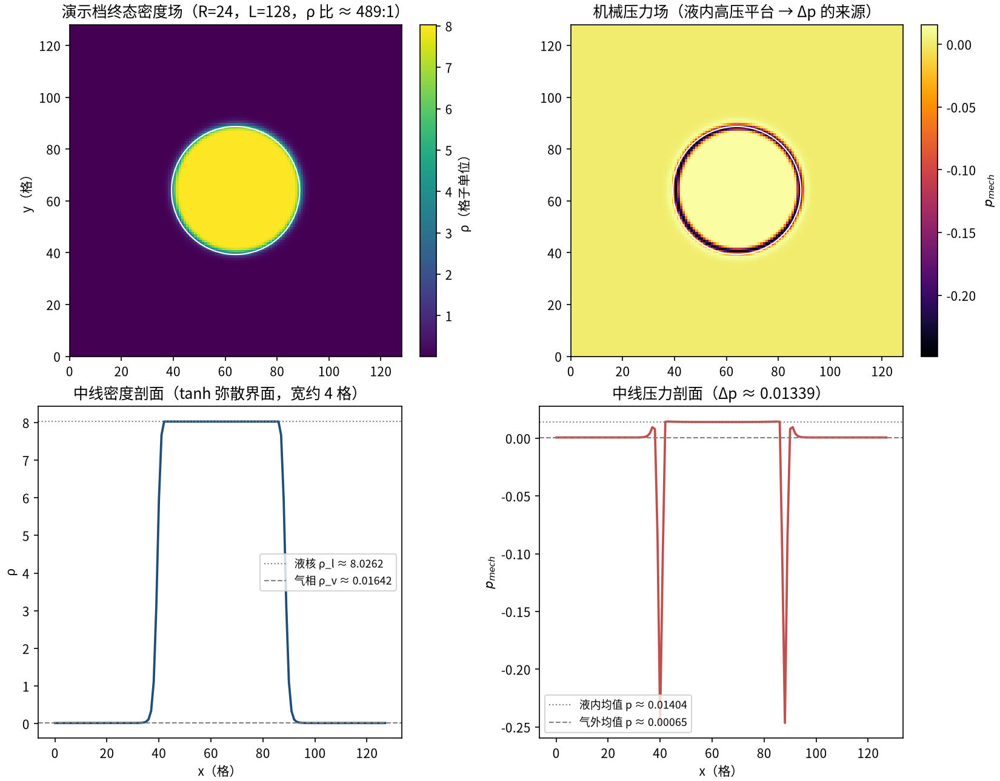
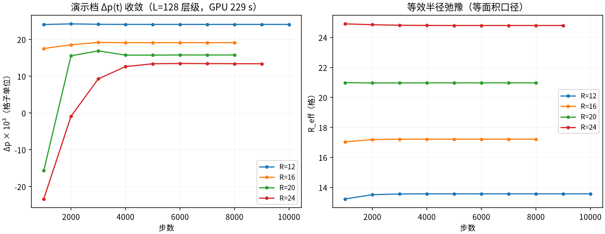
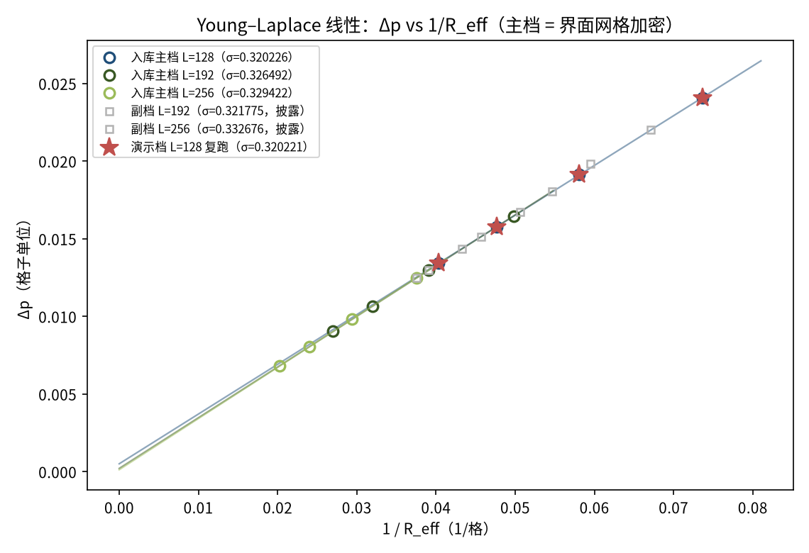
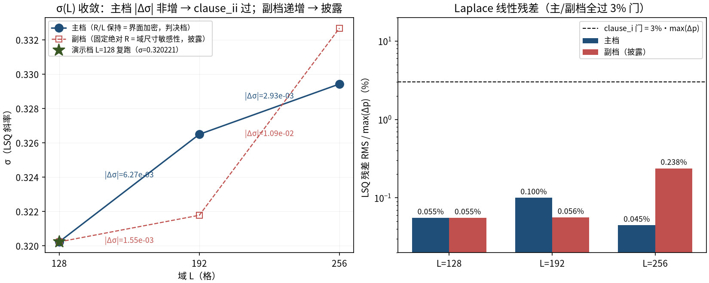

# PR 状态方程高密度比伪势液滴 Young–Laplace：σ 全自测与界面加密收敛（laplace_pr_eos）

> High-Density-Ratio PR-EOS Pseudopotential Droplet Young-Laplace: Self-Measured Sigma and Interface Refinement Convergence

**摘要** — Peng–Robinson 状态方程伪势单组分模型（T_r = 0.55，修正符号 ψ² = 2(ρcs² − p_EOS)/cs²、G = +1、EDM 精确差分力）在周期域圆形液滴上自测表面张力：每档 4 个半径作 ΔP vs 1/R_eff 线性拟合（LSQ、自由截距），主档三档界面加密 L = 128/192/256 得 σ = 0.320226 → 0.326492 → 0.329422，|Δσ| 非增（6.27e-03 → 2.93e-03）、逐档残差 RMS/max(Δp) ≤ 0.0999%（门 3%），24/24 run 稳定且质量漂移率 ≤ 7.83e-09/步，稳态密度比 400–557（≥100 目标）——σ 完全由模拟自身压差提取，零外部参考输入，主档双条款 PASS（pass_both = True）。

## 1. Benchmark 介绍

Young–Laplace 定律（ΔP = σ/R，2D 圆柱液滴）是界面方法表面张力自洽性的定义性检验。与既有 laplace_droplet 案（SC94 多项式伪势、密度比≈12:1）相比，本案例把同一检验推进到工程上更难的参数区：Peng–Robinson真实气体状态方程、T_r = 0.55 高密度比共存的伪势单组分模型——这正是液滴蒸发、沸腾、油水输运等应用的基础物理。

方法学上本基准强调「σ 全自测」：表面张力不是对任何文献值标定，而是每档由 4 个半径的 ΔP vs 1/R_eff 线性拟合斜率提取，验证目标是 Laplace 线性成立（clause_i 残差门）与 σ 随界面网格加密收敛（clause_ii |Δσ| 非增）两条内禀判据。机械压差由 p_mech = ρcs² − (G/2)cs²ψ² 直接场量平均得到——修正符号伪势与 G = +1 配对使 p_mech = p_EOS 逐点成立，压差测量无任何外推。

库依赖：本目录与库修正同源——tensorlbm.multiphase 新增修正符号伪势工厂 make_psi_eos（YS2006 逐字参数 a = 0.0408163、b = 0.0952381、R = 1），并为 collide_sc_single_component 增加 opt-in forcing 参数（"edm" 精确差分；默认 "sc" 与补丁前实现逐位相同，回归测试锁定）。冻结的验收文本对「每档 R 阶梯」存在两种读法，处理方式是在出数之前声明歧义、双跑双报：主档（判决）= R/L 保持即界面加密；副档（披露）= 固定绝对 R 放大域。副档 σ 随 L 单调上升（|Δσ| = 1.55e-03 → 1.09e-02 递增），说明该参数点 σ 对域尺寸仍敏感——界面加密收敛与域尺寸收敛是两个独立方向，副档即域尺寸方向的如实披露，不参与判决。

### 物理与数学背景

PR EOS 伪势单组分格子 Boltzmann：D2Q9 格子、BGK 碰撞、EDM 精确差分伪势力，周期域。非理想 EOS p_EOS = ρRT/(1−bρ) − aρ²/(1+2bρ−b²ρ²) 经修正符号伪势 ψ² = 2(ρcs² − p_EOS)/cs² 引入。

```
Young–Laplace（2D 圆柱液滴）：ΔP = σ/R_eff
```

```
伪势与机械压：ψ² = 2(ρcs² − p_EOS(ρ; T))/cs²（clamp ≥ 0），p_mech = ρcs² − (G/2)cs²ψ²（G = +1 时 p_mech = p_EOS）
```

```
PR EOS：p_EOS = ρRT/(1 − bρ) − aρ²/(1 + 2bρ − b²ρ²)，a = 2/49、b = 2/21、R = 1（YS2006 表）
```

```
等面积半径：R_eff = √(Σ(ρ − ρ_v)/(π(ρ_l − ρ_v)))
```

```
σ 提取：ΔP = σ·(1/R_eff) + b 的 LSQ 自由截距拟合（每档 4 半径）
```

```
判据：clause_i 残差 RMS ≤ 3%·max(ΔP)；clause_ii |σ(L_hi) − σ(L_lo)| 跨三档非增
```

**参考解** — Young (1805) / Laplace (1806) 毛细静力学（ΔP = σ/R）。本基准不对任何文献 σ 值——σ 由模拟自身压差提取，判据为内禀一致性（线性 + 网格收敛）。等面积 Maxwell 构造锁值（ρ_l = 7.997836、ρ_v = 0.064905、p_sat 由档案携带）仅作初场输入。

**参考文献**

- Young T. (1805), An essay on the cohesion of fluids, Phil. Trans. R. Soc. 95, 65
- Peng D.-Y., Robinson D. B. (1976), A new two-constant equation of state, Ind. Eng. Chem. Fundam. 15, 59
- Yuan P., Schaefer L. (2006), Equations of state in a lattice Boltzmann model, Phys. Fluids 18, 042101（EOS 参数表）
- Kupershtokh A. L. (2004); Li Q., Kang Q., Francoeur M. L., He Y. L. (2012)（EDM 精确差分力）

## 2. 计算条件设置

正式档计算条件取自入库 result.json 与 run.py 常量（程序化注入，下同）；EOS 参数 a/b/R 由库函数签名默认值程序化读取。

| 参数 | 取值 | 说明 |
|---|---|---|
| 问题 | PR EOS 高密度比伪势单组分静态液滴 Laplace 律 | 周期 L×L 域中心圆形液滴弛豫到稳态，ΔP = ⟨p_mech⟩_core − ⟨p_mech⟩_far |
| EOS / 温度 | PR（a=0.0408163、b=0.0952381、R=1），T = 0.04010547（T_r = 0.55，T_c = 0.07291904） | YS2006 参数表；a/b/R 取自库函数签名默认值（程序化） |
| 伪势 | 修正符号 ψ² = 2(ρcs² − p_EOS)/cs²（clamp ≥ 0），G = +1.0 | 库后向 gather 约定下 G>0 为吸引；p_mech = ρcs² − (G/2)cs²ψ² = p_EOS |
| 力 / 碰撞 | forcing = edm（精确差分 EDM），τ = 1.0，float32，周期边界 | collide_sc_single_component(forcing="edm") + stream（D2Q9） |
| 初值 | tanh 液滴（界面宽 4），ρ_l = 7.997836 / ρ_v = 0.064905 | 等面积 Maxwell 锁值（连续共存比 123.2，ρ_cross = 9.70818） |
| 半径 / 域（主档） | 基 R = 12/16/20/24 @L=128 → R/L 保持缩放到 L = 128/192/256 | 主档 = 界面网格加密（判决）；副档 = 固定绝对 R 放大域（披露） |
| 稳态判据 | ρ_l/ρ_v 相对漂移 ≤ 1e-5（min 4000 / max 40000 步，采样 1000） | 触发后取末 5 采样点均值 |
| 测量口径 | core = r ≤ 0.5·R_eff，far = r ≥ 0.80·L/2；R_eff = 等面积半径 | 两轮带定义精化，避开弥散界面 |
| 判据门 | clause_i：逐 L 档 LSQ 残差 RMS ≤ 3%·max(Δp)；clause_ii：\|σ(L_hi) − σ(L_lo)\| 跨三档非增 | PASS 需两条款同时成立（prereg §5(b) 冻结） |

## 3. 软件使用步骤

**环境** — Python ≥ 3.11；依赖 torch / numpy / matplotlib；仓库 src 可导入（pip install -e . 或 PYTHONPATH=<repo>/src）

**步骤 1**：获取仓库并进入根目录

```bash
git clone https://github.com/cxs503/TensorLBM.git && cd TensorLBM
```

**步骤 2**：安装/指向 tensorlbm 包

```bash
pip install -e .   # 或 export PYTHONPATH=$PWD/src
```

**步骤 3**：全量复现（主档 + 副档共 24 run；GPU 约 6 分钟量级，CPU 更慢）

```bash
python benchmarks/verified/laplace_pr_eos/run.py --device cpu --out /tmp/laplace_pr_eos
```

**步骤 4**：同上（GPU 档；入库 wall 合计 330 s）

```bash
python benchmarks/verified/laplace_pr_eos/run.py --device cuda:0 --out /tmp/laplace_pr_eos
```

### 场量可视化演示脚本

场量可视化演示：与正式档同一组库入口（make_psi_eos + collide_sc_single_component(forcing="edm") + stream）、同一稳态判据与测量口径，完整复跑判决主档的 L=128 层级（R = 12/16/20/24，GPU 约 229 s）；输出终态密度/机械压力云图、中线剖面与四半径收敛史。演示档与入库 L=128 主档逐半径 dp/R_eff 数值一致（3/4 半径逐位相同，最大相对差 2.8e-05，构建时断言 ≤1e-4），σ(L=128) 演示档 0.320221 vs 入库 0.320226（差 0.002%）；正式档覆盖主/副 24 run 与 L = 192/256 档，这些数字一律取自入库扫描（缩短维度 = 只跑一个 L 层级）。

```bash
python docs/benchmarks/demos/laplace_pr_eos_demo.py --radii 12,16,20,24 --L 128 --out demo.npz
```

## 4. 计算结果

**表 1 入库主档逐 L 档结果（R/L 保持 = 界面加密）+ 副档披露**

| 量 | L=128 | L=192 | L=256 | 说明 |
|---|---|---|---|---|
| σ（LSQ 斜率） | 0.320226 | 0.326492 | 0.329422 | 判决主档（R/L 保持） |
| 残差 RMS / max(ΔP) | 0.0555% | 0.0999% | 0.0446% | clause_i 门 ≤ 3%（富余 ≥ 30×） |
| 至下一档 \|Δσ\| | 6.27e-03 | 2.93e-03 | — | 非增 → clause_ii 过 |
| 副档 σ（披露） | 0.320226 | 0.321775 | 0.332676 | \|Δσ\| 递增（1.55e-03 → 1.09e-02）→ 域尺寸敏感，如实披露 |
| 副档残差（披露） | 0.0555% | 0.0562% | 0.2376% | clause_i 仍全过 |

*来源：benchmarks/verified/laplace_pr_eos/result.json verdict.primary / verdict.secondary（生成 2026-10-01，v1.1；clause_i = True、clause_ii = True、pass_both = True）。*

**表 2 演示档 L=128 层级逐半径复跑（GPU，229 s）**

| 半径 | 步数 | R_eff | Δp | 稳态 ρ 比 | σ_i = Δp·R_eff |
|---|---|---|---|---|---|
| R=12 | 10000 | 13.575 | 0.024088 | 399.9 | 0.326998 |
| R=16 | 8000 | 17.218 | 0.019129 | 438.5 | 0.329366 |
| R=20 | 8000 | 20.976 | 0.015764 | 467.1 | 0.330674 |
| R=24 | 9000 | 24.801 | 0.013418 | 488.7 | 0.332783 |

*演示档与入库 L=128 主档四点半径 dp/R_eff 数值一致（3/4 半径逐位相同，最大相对差 2.8e-05）；LSQ 拟合 σ = 0.320221、残差 RMS/max(Δp) = 0.0551%，与入库 L=128 档（表 1 首列）同判。*



*图 1 演示档 R=24 终态场量：左上=密度场（白线为中密度界面，液核 ρ ≈ 8.026、气相 ρ ≈ 0.0164，稳态密度比 ≈ 489:1）；右上=机械压力场（液内高压平台与气外低压之差即 Δp）；下=中线密度/压力剖面（tanh 弥散界面宽约 4 格）。*



*图 2 演示档收敛史：左=Δp(t)（四半径均弛豫到稳定平台，半径越小压差越大——Laplace 律的直接视觉证据）；右=R_eff(t)（质量守恒下液滴自调平衡半径，稳态步数 8000–10000）。*

## 5. 与文献 / 解析解的比较

**表 3 判决条款与监视量（入库档，机器值）**

| 量 | 实测 | 说明 |
|---|---|---|
| clause_i（残差门） | 三档全过（实测 0.0446%–0.0999%） | 门 ≤ 3%·max(Δp) |
| clause_ii（\|Δσ\| 非增） | 6.27e-03 → 2.93e-03 非增 → 过 | bool = True |
| 判决 | pass_both = True（主档双条款） | 入库 benchmarks/verified/laplace_pr_eos（result.json v1.1） |
| 稳定性 / 质量守恒 | 24/24 stable；质量漂移率 max 7.83e-09/步 | 门 ≤ 5e-08/步（周期流迁） |
| ψ 定义域 | clamp 触发 0/24（ρ_max < ρ_cross = 9.70818） | 修正符号伪势全程处于 EOS 定义域内 |
| sim ρ 比（披露列） | 399.9 – 556.7 | ≥100 目标达成；Maxwell 连续锁值 123.2 仅作初场（离散共存漂移属预期） |
| 伪速度（披露） | max\|u\| = 0.206 | 伪势模型已知特性（速度-平移格式质量指标），非误差源 |
| 确定性复核 | L=128 主/副 4 对重跑逐位相同 = True | 同机同码确定性 |
| 冻结文本歧义处理 | 双读声明在出数之前，双跑、无事后选择 | 主档（gated）= R/L 保持；副档 = 域尺寸方向披露 |



*图 3 Young–Laplace 线性检验：Δp vs 1/R_eff。入库主档三档（σ = 0.320226/0.326492/0.329422，实线为result.json 存档的 LSQ 拟合）；副档（灰，披露）在固定绝对R 下随域增大整体抬升；演示档 L=128 复跑（星标）落在入库主档 L=128 直线上。*



*图 4 σ(L) 收敛判决：左=主档 |Δσ| = 6.27e-03 → 2.93e-03 非增（clause_ii 过）、副档 |Δσ| = 1.55e-03 → 1.09e-02 递增（域尺寸方向如实披露）；右=逐档 LSQ 残差 RMS/max(Δp)，主/副档全过 3% 门（对数轴）。*

- 主档判决：clause_i 三档残差 0.0555%/0.0999%/0.0446%（门 3%，富余 30 倍以上）+ clause_ii 非增 → pass_both = True。σ 由 0.320226（L=128）收敛到 0.329422（L=256），界面加密方向收敛中的量级即该 EOS 参数点的 σ 数值（不对文献值）。
- 副档机制注记：固定液滴（R = 12–24）增大域时 σ 随 L 单调升高，说明该参数点 σ 对域尺寸仍敏感——界面加密收敛（主档）与域尺寸收敛是两个独立方向；这是域尺寸方向的披露而非判决失败（clause_i 在副档仍全过：0.0555%/0.0562%/0.2376%）。
- 高密度比实现要点：连续 Maxwell 锁值比 123.2 只是初场——格子离散使稳态自发漂移到 400–557:1 的离散共存（与 laplace_droplet 案的 12:1 同类现象）；全程 ρ_max < ρ_cross = 9.70818，修正符号伪势的 clamp 分支零触发，机械压口径 p_mech = p_EOS 全程成立。
- EDM 力与修正符号伪势同源入库（make_psi_eos 工厂 + collide_sc_single_component 的 opt-in forcing 参数；默认 "sc" 分支与补丁前逐位相同，由 tests/test_multiphase_psi_eos.py 锁定），既有旧符号psi_peng_robinson 保持向后兼容。
- 演示档口径：完整复跑主档 L=128 一个层级（4 run），正式档为主/副两读法 24 run；L=192/256 与副档数字一律取自入库 result.json（缩短维度 = L 层级覆盖）。伪速度 max|u| ≈ 0.204（入库同量级 0.206），伪势模型已知特性而非误差源。

## 6. 复现说明

```bash
python benchmarks/verified/laplace_pr_eos/run.py --device cuda:0 --out /tmp/laplace_pr_eos
```

**预期结果** — 主档 σ = 0.320226 → 0.326492 → 0.329422（|Δσ| 6.27e-03 → 2.93e-03 非增），残差 RMS/max(Δp) ≤ 0.0999%；clause_i = True、clause_ii = True、pass_both = True；24/24 run 稳定

**参考耗时** — 入库实测合计 330 s（GPU 档，主+副 24 run）；演示档 L=128 层级 4 run GPU 229 s

**入库位置** — `benchmarks/verified/laplace_pr_eos`

---

*本教程由 TensorLBM benchmark 档案自动生成，判据数字均取自入库 `result.json` 机器档案；演示图为缩短时长的可视化档，定量结论以存档扫描为准。*
