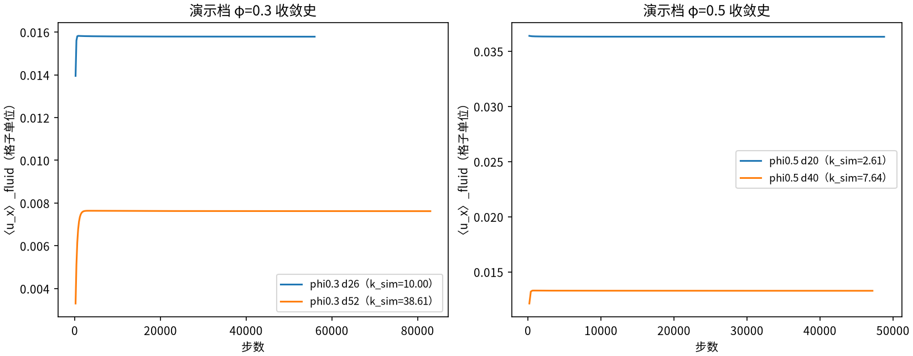
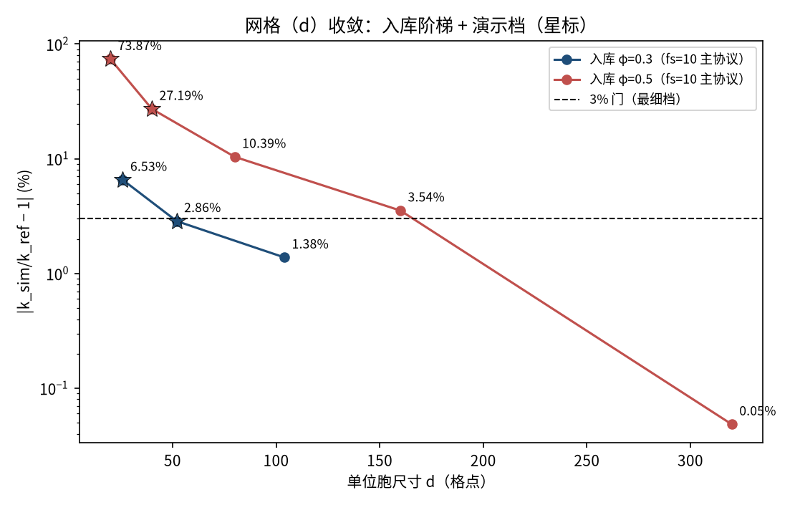
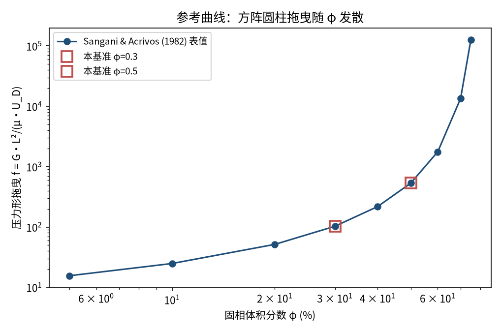
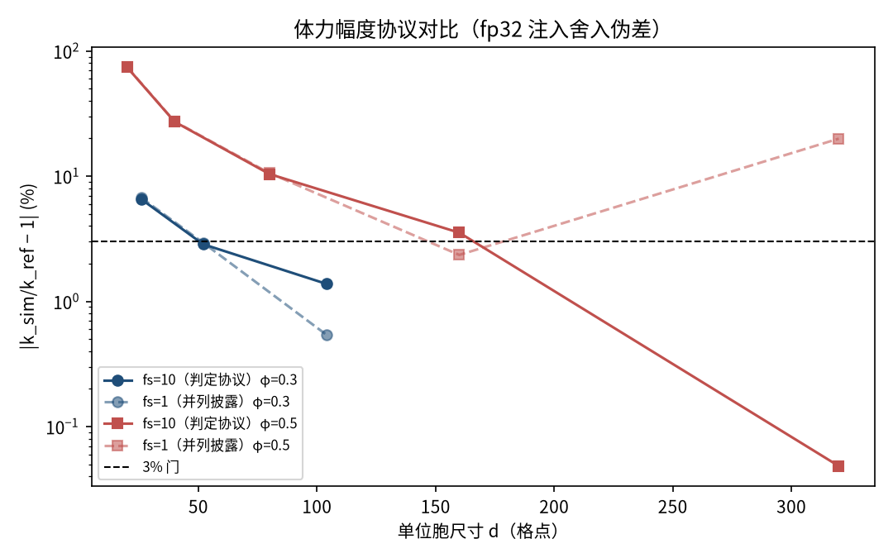

# 周期圆柱方阵渗透率（Sangani–Acrivos 1982）（permeability）

> Permeability of a Periodic Square Cylinder Array (Sangani & Acrivos, 1982)

**摘要** — 单相 Stokes 渗流标准问题：周期单位胞内一根圆柱，流体域掩码体力驱动，k_sim = ν·⟨u_x⟩_fluid/a 对 Sangani & Acrivos (1982) 多极级数压力形拖曳表的k_ref = d²/((1−φ)·f)。fs=10 主协议下 φ=0.3（d=26/52/104）误差链 6.53% → 2.86% → 1.38%、φ=0.5（d=20/40/80/160/320）73.87% → 27.19% → 10.39% → 3.54% → 0.05%，两链严格单调、最细档 1.3797% / 0.0484% ≤3%（入库总判 PASS）。真实模拟、无外推、无重标定（extrap = none）。

## 1. Benchmark 介绍

多孔介质渗透率把「细观几何」与「宏观 Darcy 定律」直接相连：对周期性圆柱方阵，Sangani & Acrivos (1982) 用多极级数法给出了任意体积分数下的精确拖曳系数，是二维 Stokes 渗流的事实标准参考（Basilisk 教学 cylinders.c 同表）。对 LBM，该问题同时检验：周期流迁、反弹边界、体力驱动与 Stokes 极限（Ma、Re 足够小）的守恒链。

口径要点（本档案 2026-09-21 修订后）：Sangani 的 f 是压力形拖曳（含圆柱投影面上的幻影压力），流体域掩码体力与均匀压力梯度 G=a 产生同一速度场，故 k_sim = ν·⟨u_x⟩_fluid/a 对应 k_ref = d²/((1−φ)·f)。冻结预注册通道（k_ref = d²/f）仍并列报告以保透明。

数值注记（fp32 注入舍入）：体力幅度 a_body ∝ d⁻³，d=320、fs=1 时每模式增量 3a ≈ 1.4×fp32 ε 落入 ulp 网格，实际/名义注入比 r = 1.185 恰等于该档k 观测超出比——fs=1/8/10 三尺度闭合 k_true 散布 0.044%。判定因此采用 fs=10 协议（全档注入增量 3a/ε ≥ 14、Re_cell 0.50–0.64 保持 Stokes 区）。

### 物理与数学背景

Stokes 极限下的周期渗流：−∇p + μ∇²u + ρa = 0、∇·u = 0（固体 u=0），Darcy 定律 ⟨u⟩ = (k/μ)·G；LBM 侧为 D2Q9 BGK + 周期流迁 + 胞元反弹 + 流体域掩码体力。

```
Sangani 压力形拖曳：f = G·L²/(μ·U_D)（U_D = 流体域平均速度 ×(1−φ) 折算）
```

```
k_ref = d² / ((1−φ)·f_table)
```

```
k_sim = ν·⟨u_x⟩_fluid / a（a 为掩码体力幅度）
```

```
误差判据：err = |k_sim/k_ref − 1|，逐 φ 严格单调下降 + 最细档 ≤3%
```

**参考解** — Sangani & Acrivos (1982) Table 1（φ: 0.05→0.75，f: 15.56→1.263e5），与 Basilisk cylinders.c 逐字一致；归一化 k_ref 经独立 FD/MAC Stokes 解算器交叉验证（N=320 连续介质解 err 1.92% 单调收敛）。

**参考文献**

- Sangani A.S., Acrivos A. (1982), Slow flow past periodic arrays of cylinders with application to heat transfer, Int. J. Multiphase Flow 8(2), 193-206（DOI 10.1016/0301-9322(82)90029-5）.
- Didarul Islam M.R., et al. (2021), Fluids 6(9), 334（表值数字级交叉）.
- Darcy H. (1856), Les Fontaines Publiques de la Ville de Dijon.

## 2. 计算条件设置

正式档计算条件取自入库 result.json（程序化注入，下同）。

| 参数 | 取值 | 说明 |
|---|---|---|
| 模型 | D2Q9 BGK 单相 Stokes 渗流 | tensorlbm.solver.collide_bgk + stream（周期） |
| 固体处理 | bounce-back 胞元反弹 | tensorlbm.boundaries.bounce_back_cells |
| 驱动 | 流体域掩码体力 a（沿 x） | tensorlbm.turbulent_channel._apply_body_force_2d；步序 collide → stream → 掩码体力 → 反弹 |
| τ / ν | 1.0 / 0.166667 | ν = (τ−1/2)/3 = 1/6 |
| 雷诺数 | Re_target = 0.05（fs=10 时 Re_cell 0.50–0.64） | Stokes 区；Ma ≤ 0.169 |
| 几何 | d×d 周期单位胞内一根圆柱 R = d·√(φ/π) | 周期折叠距离布尔掩码（几何非物理核） |
| 渗透率 | k_sim = ν·⟨u_x⟩_fluid / a | 测量窗 = 末 20 采样（4000 步）均值 |
| 参考 | Sangani & Acrivos (1982) 压力形 f 表 | k_ref = d²/((1−φ)·f)；Sangani & Acrivos 1982, Int. J. Multiphase Flow 8(2):193-206 |
| 判定 | err strictly decreasing with refinement per phi AND finest <= 3% | 主协议 fs=10；入库总判 = PASS |

## 3. 软件使用步骤

**环境** — Python ≥ 3.11；依赖 torch / numpy / matplotlib；仓库 src 可导入（pip install -e . 或 PYTHONPATH=<repo>/src）

**步骤 1**：获取仓库并进入根目录

```bash
git clone https://github.com/cxs503/TensorLBM.git && cd TensorLBM
```

**步骤 2**：安装/指向 tensorlbm 包

```bash
pip install -e .   # 或 export PYTHONPATH=$PWD/src
```

**步骤 3**：单案快速体验（φ=0.3、d=52，CPU 数十秒）

```bash
python benchmarks/verified/permeability/run.py case --phi 0.3 --d 52 --force-scale 10 --device cpu
```

**步骤 4**：正式阶梯（需空闲 CUDA 设备，d320 约 40 分钟）+ 汇总 result.json

```bash
python benchmarks/verified/permeability/run.py ladder --phi 0.5 --force-scale 10 --device cuda:0 && python benchmarks/verified/permeability/run.py report
```

### 场量可视化演示脚本

场量可视化演示：与正式档同一组库入口、同一 fs=10 协议的四案迷你阶梯（φ=0.3 d=26/52、φ=0.5 d=20/40；正式档为 3+5 档全阶梯），纯 CPU 合计约 4 分钟；输出掩码几何、终态速度场与 ⟨u_x⟩_fluid 收敛史。演示档四案实测 err：6.54%、2.86%、73.87%、27.19%（d=26/52 与入库同档位一致；φ=0.5 粗档窄缝仅数格点、离散误差大是分辨率事实），判据数字一律取自入库扫描。

```bash
python docs/benchmarks/demos/permeability_demo.py --cases 0.3:26,0.3:52,0.5:20,0.5:40 --out demo.npz
```

## 4. 计算结果

**表 1 入库阶梯结果（fs=10 主协议，全 8 档）**

| 档 | φ_actual | k_sim | k_ref | err | err_B（诊断） | Re_cell | 步数 |
|---|---|---|---|---|---|---|---|
| d=26 | 0.2914 | 9.9981 | 9.3850 | 6.5335% | 2.63% | 0.54 | 64k |
| d=52 | 0.2977 | 38.6135 | 37.5399 | 2.8598% | 1.85% | 0.52 | 86k |
| d=104 | 0.2996 | 152.2314 | 150.1597 | 1.3797% | 1.23% | 0.51 | 71k |
| d=20 | 0.4825 | 2.6119 | 1.5022 | 73.8696% | 56.03% | 0.90 | 48k |
| d=40 | 0.4956 | 7.6425 | 6.0088 | 27.1874% | 23.86% | 0.64 | 57k |
| d=80 | 0.4995 | 26.5326 | 24.0353 | 10.3903% | 10.08% | 0.55 | 96k |
| d=160 | 0.5000 | 99.5399 | 96.1412 | 3.5351% | 3.58% | 0.52 | 58k |
| d=320 | 0.5001 | 384.3787 | 384.5648 | 0.0484% | 0.09% | 0.50 | 71k |

*来源：benchmarks/verified/permeability/result.json（created 2026-09-20T22:52:03Z）。err_B 为 φ_actual 对数插值诊断通道（非判据）；步数为实际运行值（稳态提前停）。*



*图 2 演示档 ⟨u_x⟩_fluid 收敛史：四案均从零发展到稳态平台（φ=0.5 档因窄缝强阻滞发展更慢、终值更小——渗透率数量级差异的直接体现）。*


*图 1 演示档（φ=0.3，d=52）：左=周期单位胞几何（蓝=流体，白=圆柱实心；红虚线为名义半径圆——楼梯化边界即 φ_actual 与名义 φ 的微小差异来源）；右=终态速度幅值与流线（绕流驻滞点 + 上下窄缝射流，体力沿 x 驱动；固体格点速度置 NaN，流线在圆柱边界断开——固体内速度无定义）。*

## 5. 与文献 / 解析解的比较

**表 2 与 Sangani–Acrivos 参考的比较 / 协议与敏感性**

| 项 | 结果 | 要点 | 说明 |
|---|---|---|---|
| fs=10 协议（判定） | PASS | φ=0.3 与 φ=0.5 全过 | PASS iff err strictly decreases with refinement for every ph…… |
| fs=1 协议（并列披露） | FAIL | φ=0.5 细档非单调（d320 19.92%） | fp32 注入舍入伪差：a_body ∝ d⁻³ 落入 ulp 网格（详见数值注记） |
| S1 力线性（Stokes 不变性） | 见档案 | 容差 0.1% | 粗档 0.02–0.16%；d104/d160 边缘 1.16–1.93%、d320(fs1) 16.65% 同舍入伪差 |
| S2 测量窗 | PASS | 末 2000 vs 8000 步差 ≤0.05% | 四档 0.0026%–0.0014%（稳态充分） |



*图 3 网格（d）收敛（入库档 + 演示档星标）：φ=0.3 链 6.53% → 2.86% → 1.38%、φ=0.5 链 73.87% → 27.19% → 10.39% → 3.54% → 0.05%，两链严格单调，最细档双双进入 3% 门。窄缝 O(1/d) 离散误差是粗档偏高的物理来源（φ=0.5 时圆柱间隙仅数格点）。*



*图 4 参考曲线：Sangani & Acrivos (1982) 压力形拖曳 f(φ) 在 φ→φ_max 发散（方阵密堆积前渗透率骤降）；本基准取 φ=0.3/0.5 两个代表点（方框；表值 f = 102.90 / 532.55，对应 k_ref 归一化（1−φ） 因子差异 2.4×）。*



*图 5 体力幅度协议对比（入库）：fs=10（判定协议，实线）两链干净单调；fs=1（虚线）φ=0.5 链在 d=320 反跳至 19.92%——fp32 注入舍入伪差（a_body ∝ d⁻³ 落入 ulp 网格），fs=1/8/10 三尺度闭合同一 k_true，故判定采用 fs=10。*

- 误差定义：err = |k_sim/k_ref − 1|，k_ref = d²/((1−φ)·f_table)（名义几何，无有效半径重标定；φ_actual 插值通道 err_B 并列披露）；判据 = 逐 φ 严格单调 + 最细档 ≤3%。
- 质量指标：fp32 质量漂移 3.6e-5–1.7e-4（fs10 链）、uy 对称比 0.43–0.45、全档稳态触发。
- d320(fs10) 档 0.0484% 含真实离散误差（+1.2%）与注入亏缺（−1.24%）的部分抵消，判定按实测值不做校正；d160 档 3.54% 超最细档门但不在最细位置（判定规则为最细档 ≤3% + 全链单调）。

## 6. 复现说明

```bash
python benchmarks/verified/permeability/run.py ladder --phi 0.3 --force-scale 10 --device cuda:0 && python benchmarks/verified/permeability/run.py ladder --phi 0.5 --force-scale 10 --device cuda:0 && python benchmarks/verified/permeability/run.py report
```

**预期结果** — φ=0.3 链 err：6.5335% → 2.8598% → 1.3797%；φ=0.5 链 err：73.8696% → 27.1874% → 10.3903% → 3.5351% → 0.0484%；两链单调 + 最细档 ≤3%；总判 = PASS

**参考耗时** — GPU 全阶梯两 φ 合计数小时（d320 单档约 40 分钟、71k 步）；本演示档 CPU 四案实测 4 分钟

**入库位置** — `benchmarks/verified/permeability`

---

*本教程由 TensorLBM benchmark 档案自动生成，判据数字均取自入库 `result.json` 机器档案；演示图为缩短时长的可视化档，定量结论以存档扫描为准。*
