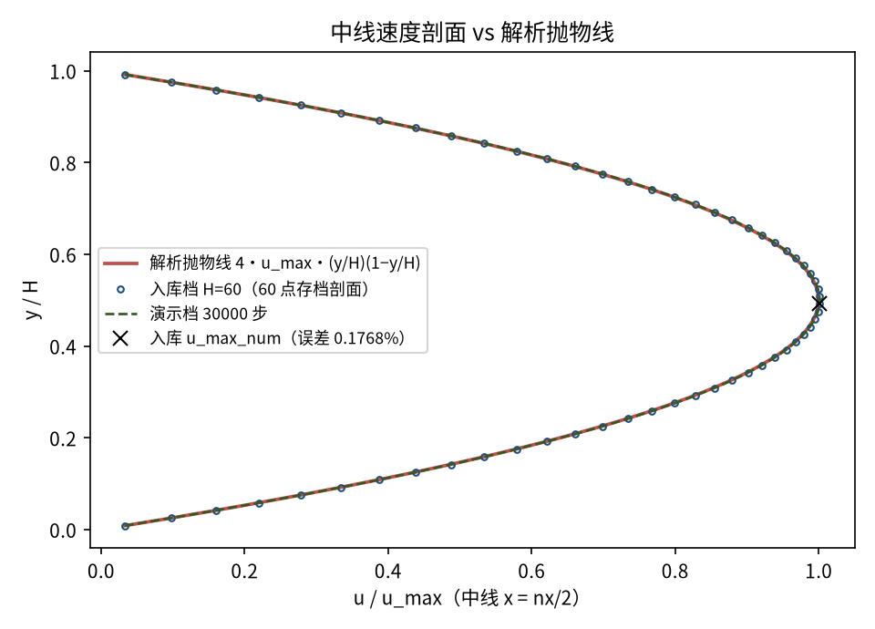
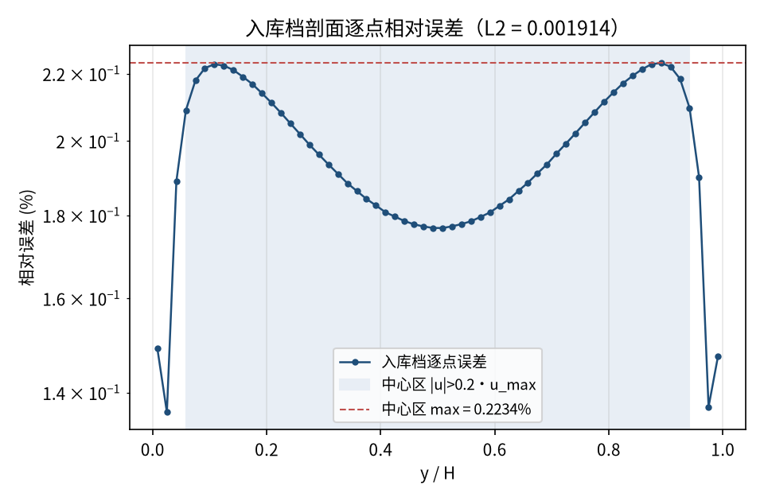
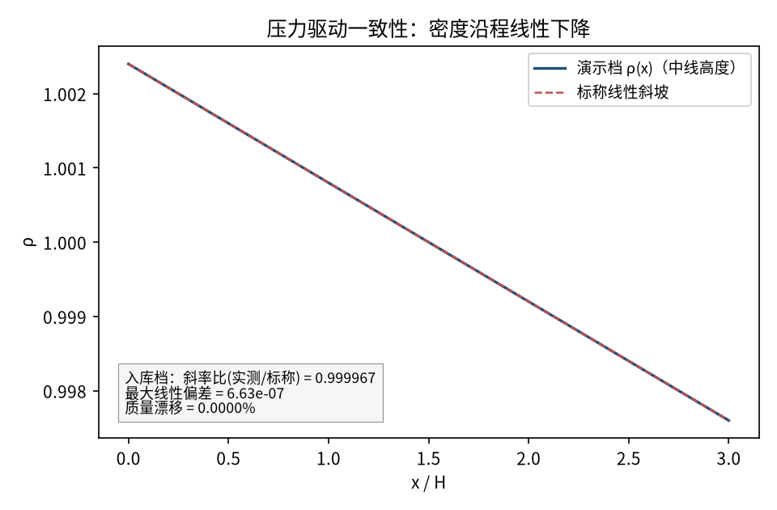

# 二维 Poiseuille 流（压力差驱动）— 解析抛物线剖面验证（poiseuille_2d）

> 2D Pressure-Driven Poiseuille Flow (Analytic Parabolic Profile)

**摘要** — TensorLBM D2Q9 BGK 求解器在压差驱动平行平板间 fully-developed 层流上的直接验证：Zou/He 压力入口/出口 + pre-streaming 半程反弹壁面，H=60 存档档中线 60 点剖面 L2 相对误差 0.001914、u_max 误差 0.1768%、中心区最大误差 0.2234%，压力梯度斜率比 0.999967，质量漂移 0.0000%。

## 1. Benchmark 介绍

平面 Poiseuille 流是压力差驱动的平行平板间充分发展层流：稳态解为精确抛物线剖面 u(y) = 4·u_max·(y/H)(1−y/H)，最大速度在通道中心，u_max = 1.5·ū。它是检验压力（密度）边界条件与壁面无滑移处理的最经典内部流基准之一。

本案例的关键测试点是 Zou/He 压力边界对：入口施加 ρ_in、出口施加 ρ_out（出口用库函数 zou_he_outlet_pressure，入口为其标准教材镜像，Zou & He 1997），配合上下壁 pre-streaming 半程反弹——该变体将无滑移壁面精确置于y=0.5 与 y=ny−1.5，消除 BGK 半程反弹的壁面滑移误差（post-streaming 变体在同配置下 u_max 偏高约 8-9%）。

驱动压差与数值解自洽：沿程密度线性下降的实测斜率与标称值之比 0.999967，为 LBM 压力-密度关系 p=ρ·cs² 与 Ma≈0.069 低压缩极限的直接检验。真实模拟、无外推（extrap: none）。

### 物理与数学背景

不可压 Navier–Stokes 方程的格子 Boltzmann 离散：D2Q9 格子、BGK 单弛豫碰撞、拉格朗日流迁；Zou/He 压力边界 + 半程反弹壁面。

```
u(y) = Δp/(2νL) · (y² − H·y) = 4·u_max·(y/H)·(1 − y/H)
```

```
u_max = Δp·H²/(8·ν·L)，Δp = (ρ_in − ρ_out)·cs²，cs² = 1/3
```

```
Δρ = 24·ν·u_max/(cs²·H)（L = nx = 3H 代入）
```

```
ν = (τ − 0.5)/3，Re = ū·H/ν，ū = (2/3)·u_max
```

**参考解** — 充分发展层流抛物线剖面（Hagen-Poiseuille 二维形式，教科书精确解）；半程反弹有效壁位 y=0.5 与 y=ny−1.5，有效缝高 H=ny−2。

**参考文献**

- Zou, Q. & He, X. (1997). On pressure and velocity boundary conditions for the lattice Boltzmann BGK model. Phys. Fluids 9, 1591-1598.
- Ginzburg, I. (2008). Two-relaxation-time lattice Boltzmann scheme. Commun. Comput. Phys. 3(2), 419-453.

## 2. 计算条件设置

存档档计算条件取自入库 result.json（程序化注入，下同）。

| 参数 | 取值 | 说明 |
|---|---|---|
| 格子 / 碰撞 | D2Q9 / BGK | tensorlbm.solver.collide_bgk + stream |
| 边界处理 | Zou/He 压力入口 + 出口 + 半程反弹 | 入口为标准教材镜像（~10 行）；出口 boundaries.zou_he_outlet_pressure（库）；上下壁 pre-streaming 半程反弹 |
| 驱动 | 压力差 | ρ_in=1.0024 > ρ_out=0.9976，dp=Δρ·cs² |
| 网格 | ny=62 × nx=180 | 有效缝高 H=ny−2=60，L/H=3.0 |
| τ / ν | 0.8 / 0.100 | ν=(τ−0.5)/3 |
| Re / Ma | 16.0 / 0.0693 | Re=ū·H/ν，Ma=u_max/c_s |
| 步数（存档档） | 40800 | ≥10000 步后漂移<1e-5 判稳 |

## 3. 软件使用步骤

**环境** — Python ≥ 3.11；依赖 torch / numpy / matplotlib；仓库 src 可导入（pip install -e . 或 PYTHONPATH=<repo>/src）

**步骤 1**：获取仓库并进入根目录

```bash
git clone https://github.com/cxs503/TensorLBM.git && cd TensorLBM
```

**步骤 2**：安装/指向 tensorlbm 包

```bash
pip install -e .   # 或 export PYTHONPATH=$PWD/src
```

**步骤 3**：单档快速复现（H=40，CPU，约半分钟）

```bash
python benchmarks/verified/poiseuille_2d/run.py single 40 case_h40.json --device cpu
```

**步骤 4**：多档网格扫描（入库存档为 H=60 档）

```bash
python benchmarks/verified/poiseuille_2d/run.py scan poiseuille_scan --H 20 40 60 --tau 0.8 --umax 0.04 --device cpu
```

### 场量可视化演示脚本

场量可视化演示：与存档档同一组库入口、同几何（62×180），步数缩短为 30000（存档档 40800 步判稳），CPU 约 55 s；输出速度场/压力场/中线剖面/沿程密度线。判据数字一律取自入库存档，演示档仅用于可视化。

```bash
python docs/benchmarks/demos/poiseuille_2d_demo.py --H 60 --steps 30000 --out demo.npz
```

## 4. 计算结果

**表 1 入库存档结果（H=60 单档存档）**

| 量 | 数值 | 备注 |
|---|---|---|
| u_max（数值 / 该行解析） | 0.04006 / 0.03999 | 峰值行实测 vs 解析（判据量，误差 0.1768%） |
| 剖面 L2 相对误差 | 0.001914 | 全剖面 60 点（判据量） |
| 中心区最大相对误差 | 0.2234% | \|u\|>0.2·u_max 区域（判据量） |
| 压力梯度斜率比 | 0.999967 | 实测/标称；最大线性偏差 6.63e-07 |
| 质量漂移 | 0.0000% | 初末质量差/初质量 |
| 稳态 / 有限性 | True / True | 漂移判据 + 全场有限 |
| 耗时 | 55.9 s | 存档档（40800 步） |

*来源：benchmarks/verified/poiseuille_2d/result.json（存档含 60 点 u_profile / u_analytic 数组）。*


*图 1 演示档（62×180 × 30000 步，CPU）场量：左=速度幅值与流线（抛物线剖面、平直流线，入口段迅速充分发展）；右=压力场 p′=(ρ−1)/3（沿程线性压降，等压线为等距竖直条纹，即恒定驱动压力梯度）。*

## 5. 与文献 / 解析解的比较

**表 2 与解析抛物线剖面的比较（入库判据）**

| 量 | 数值 | 参考/说明 |
|---|---|---|
| u_max 误差 | 0.1768% | 参考解析 0.03999（同行为准） |
| 剖面 L2 / 中心 max | 0.001914 / 0.2234% | 存档 60 点数组 vs 解析抛物线 |
| 压力梯度一致性 | 0.999967 | Δp 驱动与实测沿程密度斜率一致（马赫数压缩性残余 ~1e-5） |



*图 2 中线速度剖面 vs 解析抛物线：红实线=解析，蓝圈=入库 60 点存档剖面（u_max 误差 0.1768%），绿虚线=演示档曲线，×=存档峰值点。三条曲线在图幅内重合。*



*图 3 入库档剖面逐点相对误差（对数纵轴）：中心区最大 0.2234%，全剖面 L2 = 0.001914；误差峰值出现在近壁高梯度区。*



*图 4 压力驱动一致性（演示档）：中线高度密度 ρ(x) 沿程线性下降；入库档斜率比（实测/标称）= 0.999967，最大线性偏差 6.63e-07，质量漂移 0.0000%。*

- 误差定义：u_max 误差取峰值行数值 vs 同行解析值；L2 为 60 点存档剖面整体相对误差；中心区 max 取 |u|>0.2·u_max。验收口径：全部 ≤1%（本库存档远低于该门）。
- 本案例为单档 H=60 存档（result.json）；网格阶梯扫描入口见 run.py scan（--H 20 40 60）。演示档与存档档同几何同参数，仅缩短步数。
- 真实模拟（无外推、无人工修正、extrap: none），直接观测量对解析解。

## 6. 复现说明

```bash
python benchmarks/verified/poiseuille_2d/run.py single 60 case_h60.json --tau 0.8 --umax 0.04 --device cpu
```

**预期结果** — u_max 误差 0.1768%，剖面 L2 0.001914，中心区 max 0.2234%，斜率比 0.999967，质量漂移 0.0000%

**参考耗时** — 约 56 s（CPU；GPU 更快）

**入库位置** — `benchmarks/verified/poiseuille_2d`

---

*本教程由 TensorLBM benchmark 档案自动生成，判据数字均取自入库 `result.json` 机器档案；演示图为缩短时长的可视化档，定量结论以存档扫描为准。*
