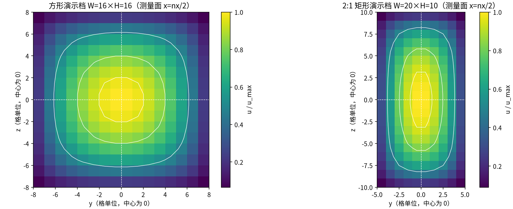
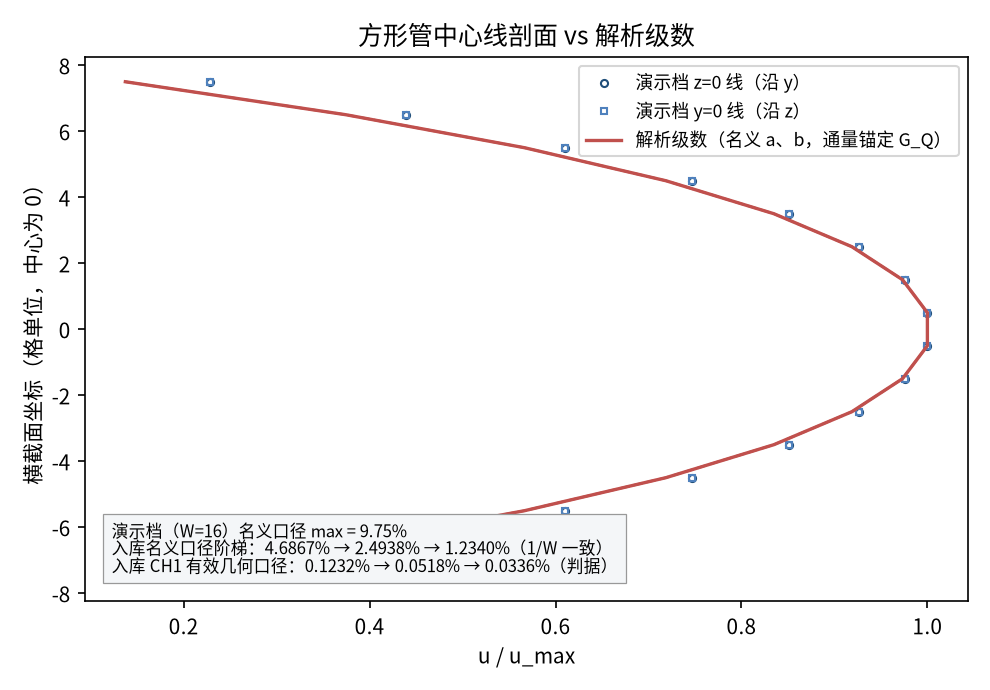
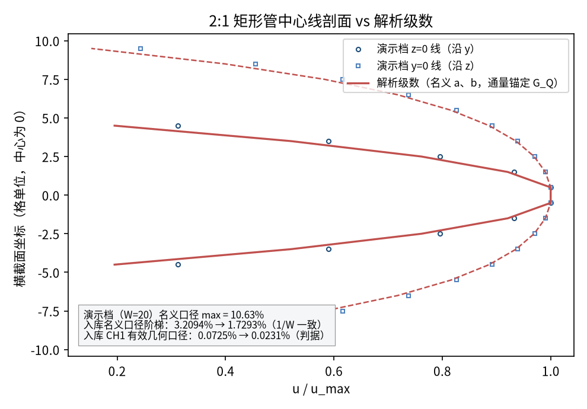
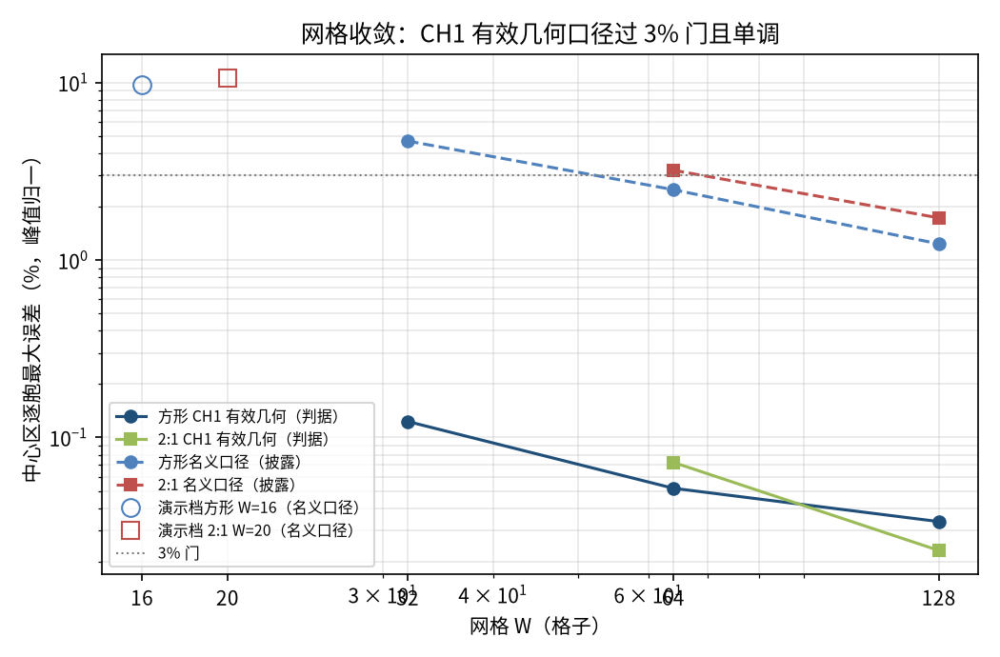
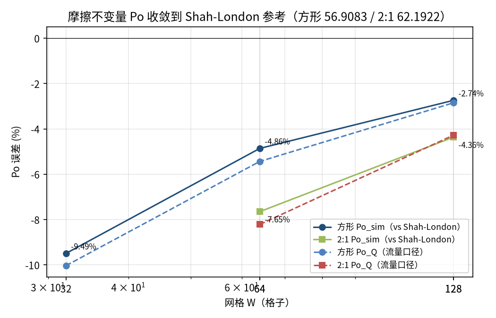

# 方形与 2:1 矩形管 Poiseuille 流（3D D3Q19）— 双重奇正弦级数与 Shah-London 不变量验证（poiseuille_3d_duct）

> 3D Duct Poiseuille Flow, Square and 2:1 Rectangular (Double Odd-Sine Series)

**摘要** — TensorLBM D3Q19 BGK 求解器在方形（aspect=1.0，W=32/64/128）与 2:1 矩形（aspect=0.5，W=64/128）截面管流上的直接验证：主判据 CH1 对实测 2D 剖面在 (G, da, db) 上拟合精确级数解，中心区逐胞误差 方形 0.1232% → 0.0518% → 0.0336%、2:1 0.0725% → 0.0231%（≤3% 且单调）；有效半宽偏移 da/db≈+0.43~+0.46 网格无关（spread<0.05）；摩擦不变量 Po 收敛到 Shah-London 参考（方形 56.9083、2:1 62.1922）：Po_sim 误差方形 -9.4922% / -4.8615% / -2.7403%、2:1 -7.6499% / -4.3643%；两个子档入库判定均为 verified。

## 1. Benchmark 介绍

非圆截面管流没有初等函数解，但有精确的级数解：充分发展层流满足泊松方程 −ν∇²u = G（常数驱动梯度），在矩形 (-a,a)×(-b,b) 上解为双重奇正弦级数（本教程与验证档使用同一实现，含逐项解析积分 I0）。方形与 2:1 矩形是 Shah-London 摩擦不变量有文献基准值的两个标准形状。

本案例的核心方法点是有效几何反演（CH1）：全四壁半程反弹把无滑移面放在离散壁位上，数字管不是名义 (a,b) 的矩形。对实测 2D 剖面在 (G, da, db) 三参数上做加权 LSQ（粗扫描 + 交替黄金分割），G 由通量解析锚定 G_Q=ν·Q_meas/I0(a_eff,b_eff)，拟合区 u>0.2·u_max；主判据 = 中心区逐胞 max（峰值归一）。名义口径 CH2（不做几何修正）作为披露：方形 4.6867% → 2.4938% → 1.2340%、2:1 3.2094% → 1.7293%（一阶 1/W 收敛，粗档 >3%——正是 CH1 所吸收的楼梯几何偏移）。

第二组证据是不变量交叉核对：摩擦系数 Po（由实测压降与流量给出）对 Shah-London 级数参考（代码内重算并断言），峰值/均值速度比 umax/umean 方形 = 2.09626（文献 2.09626），G_fit/G_Q 与 G_int/G_Q 一致到 1e-3 量级。

工程注记：入口发展长度 Le ∝ u_in·W²，存档将 u_in 从 0.02 修订为 0.005 以保证最细档测量面在充分发展区；全部边界与碰撞走 tensorlbm 公共入口（solver3d / d3q19 / boundaries3d），extrap: none。

### 物理与数学背景

充分发展截面流泊松方程 −ν(∂²u/∂y²+∂²u/∂z²) = G 的格子 Boltzmann 离散：D3Q19、BGK、周期流迁；Zou/He 速度入口 + 压力出口 + 全四壁半程反弹（post-streaming）。

```
u(y,z) = (G/ν)·S(y,z)，S = ΣΣ 16/(π²·mn·λ)·sin(πm(z+a)/2a)·sin(πn(y+b)/2b)，λ = (πm/2a)²+(πn/2b)²（m,n 奇数）
```

```
I0 = ∫∫S dA（逐项解析）；G_nom = ν·u_in·4ab/I0（u_mean=u_in）
```

```
G_Q = ν·Q_meas/I0(a_eff,b_eff)（通量锚定，CH1 用）
```

```
Po = 2·Dh²·G/(ν·ū)（Dh=4ab/(a+b)）；方形 Po=56.9083，2:1 Po=62.1922（Shah-London 1978）
```

```
入口发展长度 Le ∝ u_in·W²（u_in 修订 0.02→0.005 的依据）
```

**参考解** — 矩形截面级数解为教科书精确解（Shah & London 1978 Laminar Flow Forced Convection in Ducts 的基准形状）；da/db 为半程反弹楼梯几何的有效偏移（≈+0.45 格，网格无关）。

**参考文献**

- Shah, R.K. & London, A.L. (1978). Laminar Flow Forced Convection in Ducts（方形/矩形 Po 与 umax/umean 基准表）.
- White, F.M. Viscous Fluid Flow（矩形截面级数解章节）.
- Zou, Q. & He, X. (1997). Phys. Fluids 9, 1591-1598（进出口边界）.

## 2. 计算条件设置

正式档计算条件取自两份入库 result.json（程序化注入，下同）。

| 参数 | 取值 | 说明 |
|---|---|---|
| 格子 / 碰撞 | D3Q19 / bgk | tensorlbm.solver3d.collide_bgk3d + stream3d |
| 驱动 | 均匀速度入口 | u_in=0.005（正式档；原 0.02 修订为 0.005，入口段 Le∝u_in·W²） |
| 边界处理 | Zou/He 入口/出口 + 全四壁反弹 | boundaries3d.zou_he_inlet_velocity_3d / zou_he_outlet_pressure_3d / bounce_back_cells_3d；壁面格 y=0/H+1、z=0/W+1（半程反弹） |
| τ / ν | 0.8 / 0.10 | ν=(τ−0.5)/3 |
| 几何（方形） | fluid y∈[1,W], z∈[1,W] | nx=4W（L/W=4），存档 W=32 / 64 / 128 |
| 几何（2:1） | fluid y∈[1,W/2], z∈[1,W] | nx=4W，存档 W=64 / 128 |
| 比较口径 CH1（主判据） | 有效几何级数 LSQ | 对实测 2D 剖面在 (G, da, db) 上加权 LSQ 拟合精确双重奇正弦级数（G 解析锚定通量 G_Q=νQ/I0），拟合区 u>0.2u_max；度量=中心区逐胞 max（峰值归一） |
| 比较口径 CH2（直接） | 名义 (a,b) 级数 | G_nom=ν·u_in·4ab/I0（u_mean=u_in）；披露口径 |
| 外推 | none | 真实模拟直接观测量对解析级数 |

## 3. 软件使用步骤

**环境** — Python ≥ 3.11；依赖 torch / numpy / matplotlib；仓库 src 可导入（pip install -e . 或 PYTHONPATH=<repo>/src）

**步骤 1**：获取仓库并进入根目录

```bash
git clone https://github.com/cxs503/TensorLBM.git && cd TensorLBM
```

**步骤 2**：安装/指向 tensorlbm 包

```bash
pip install -e .   # 或 export PYTHONPATH=$PWD/src
```

**步骤 3**：方形单档快速复现（W=32，CPU，约 1-2 分钟）

```bash
python benchmarks/verified/poiseuille_3d_duct/run.py single 32 case_w32.json --aspect 1.0 --u-in 0.005 --device cpu
```

**步骤 4**：方形正式三档扫描（与入库主档同参数）

```bash
python benchmarks/verified/poiseuille_3d_duct/run.py scan duct_scan --W 32 64 128 --aspect 1.0 --u-in 0.005 --device cpu
```

**步骤 5**：2:1 矩形正式两档扫描（与入库子档 duct_ar05 同参数）

```bash
python benchmarks/verified/poiseuille_3d_duct/run.py scan duct_ar05_scan --W 64 128 --aspect 0.5 --u-in 0.005 --device cpu
```

### 场量可视化演示脚本

场量可视化演示：与正式档同一组库入口，一个脚本跑两个缩网格演示档（方形 W=16×H=16 与 2:1 W=20×H=10，正式档 W=32/64/128 与 64/128），级数初始化 + 5000 步 + 末 400 步时间平均，CPU 合计约 45 s；输出两横截面速度场与中心线剖面对比。判据数字一律取自入库存档，演示档仅用于可视化（演示档名义口径 max 9.75% / 10.63%，与入库名义阶梯的 1/W 外推一致）。

```bash
python docs/benchmarks/demos/poiseuille_3d_duct_demo.py --steps 5000 --out demo.npz
```

## 4. 计算结果

**表 1 方形管入库三档扫描（aspect=1.0，W=32/64/128，主档 result.json）**

| 量 | W=32 | W=64 | W=128 |
|---|---|---|---|
| Re | 1.6 | 3.2 | 6.4 |
| 步数（判稳） | 250000 | 250000 | 268000 |
| CH1 eff max（判据量） | 0.1232% | 0.0518% | 0.0336% |
| CH1 eff L2 | 0.1270% | 0.0377% | 0.0225% |
| 名义 max（披露） | 4.6867% | 2.4938% | 1.2340% |
| 名义 L2（披露） | 3.6012% | 1.9552% | 0.9730% |
| da = a_eff − a | 0.4285 | 0.4502 | 0.4640 |
| db = b_eff − b | 0.4285 | 0.4502 | 0.4642 |
| G_fit / G_Q | 1.00126 | 1.00033 | 1.00012 |
| G_int / G_Q | 1.00600 | 1.00607 | 1.00112 |
| Po_sim 误差 | -9.4922% | -4.8615% | -2.7403% |
| Po_Q 误差 | -10.0318% | -5.4353% | -2.8490% |
| 质量漂移 | 0.1658% | 0.0777% | 0.0471% |
| 耗时（s） | 63.8 | 142.6 | 1688.9 |

*来源：benchmarks/verified/poiseuille_3d_duct/result.json（verdict = verified）。*

**表 2 2:1 矩形管入库两档扫描（aspect=0.5，W=64/128，子档 duct_ar05/result.json）**

| 量 | W=64 | W=128 |
|---|---|---|
| Re | 2.1 | 4.3 |
| 步数（判稳） | 250000 | 255000 |
| CH1 eff max（判据量） | 0.0725% | 0.0231% |
| CH1 eff L2 | 0.0785% | 0.0227% |
| 名义 max（披露） | 3.2094% | 1.7293% |
| 名义 L2（披露） | 2.6529% | 1.3633% |
| da = a_eff − a | 0.4319 | 0.4413 |
| db = b_eff − b | 0.4214 | 0.4261 |
| G_fit / G_Q | 1.00078 | 1.00020 |
| G_int / G_Q | 1.00616 | 0.99908 |
| Po_sim 误差 | -7.6499% | -4.3643% |
| Po_Q 误差 | -8.2152% | -4.2764% |
| 质量漂移 | 0.2488% | 0.1355% |
| 耗时（s） | 83.6 | 536.7 |

*来源：benchmarks/verified/poiseuille_3d_duct/duct_ar05/result.json（verdict = verified）。*



*图 1 演示档测量面（x=nx/2）速度幅值归一化：左=方形 W=16×H=16，右=2:1 矩形 W=20×H=10；白实线为 0.5/0.8/0.95 u_max 等值线（方形接近圆角方形、2:1 呈椭圆化角部拉伸），白虚线为中心线（剖面图取样处）。*

## 5. 与文献 / 解析解的比较

**表 3 与解析级数及 Shah-London 不变量的比较（两子档）**

| 量 | 方形（aspect=1.0） | 2:1（aspect=0.5） | 参考/说明 |
|---|---|---|---|
| Po 参考（Shah-London） | 56.9083 | 62.1922 | 代码内级数重算（run.py duct_Po），对文献常量断言 <0.01 |
| umax/umean 不变量（方形） | 2.09626 | — | Shah-London 2.09626（级数重算断言 <2e-4） |
| CH1 eff 单调 | True | True | 两子档全部单调下降且 ≤3% |
| 名义口径单调 | True | True | 单调但方形 W=32/64 与 2:1 W=64 >3%（披露，不作判据） |
| da spread / db spread（方形） | 0.0355 / 0.0357 | — | bound 0.05：True |
| da spread / db spread（2:1） | — | 0.0094 / 0.0047 | bound 0.05：True |
| 入库判定 | verified | verified | passed_eff_3pct_monotone = True / True |

*主判据 = CH1 有效几何口径中心区逐胞 max（峰值归一）≤3% 且单调；名义口径与 Po 误差为交叉核对/披露项。*



*图 2 方形管中心线剖面 vs 解析级数：符号=演示档（W=16）z=0 与 y=0 两条中心线（二者重合=方形对称性自检），红实/虚线=名义 (a,b) 级数（通量锚定 G_Q）；演示档粗网格的名义口径偏差 9.75% 与入库名义阶梯 4.6867% → 2.4938% → 1.2340% 呈 1/W 一致；入库 CH1 判据 0.1232% → 0.0518% → 0.0336%。*



*图 3 2:1 矩形管中心线剖面 vs 解析级数：z=0（长轴）与 y=0（短轴）两条中心线符号=演示档（W=20×H=10），红实/虚线=名义级数；两轴剖面角部行为不同（短轴更尖）。演示档名义口径偏差 10.63%；入库名义阶梯 3.2094% → 1.7293%；入库 CH1 判据 0.0725% → 0.0231%。*



*图 4 网格收敛（对数-对数）：CH1 有效几何口径（实线，判据）方形 0.1232% → 0.0518% → 0.0336%、2:1 0.0725% → 0.0231% 全部 ≤3% 且单调；名义口径（虚线，披露）一阶 1/W 收敛，空心大符号为两个演示档名义口径点，恰落在入库阶梯的外推线上。*



*图 5 摩擦不变量 Po 收敛：Po_sim 误差方形 -9.4922% / -4.8615% / -2.7403%、2:1 -7.6499% / -4.3643%（点线为流量口径 Po_Q），随网格细化趋于 0；参考为 Shah-London 级数值（代码内重算断言）：方形 56.9083、2:1 62.1922。*

- 主判据验收：CH1 中心区逐胞 max ≤3% 且单调——两个子档全部满足（方形 0.1232% → 0.0518% → 0.0336%；2:1 0.0725% → 0.0231%；passed_eff_3pct_monotone = True / True）。
- 名义口径如实披露（一阶 1/W，粗档 >3%）：正是 CH1 有效几何反演所吸收的楼梯几何偏移；da/db≈+0.43~+0.46 且 spread<0.05（网格无关，bound 判定通过）。
- 演示档（W=16 / W=20×H=10）名义口径 9.7%/10.6% 与入库名义阶梯的 1/W 外推一致，仅用于可视化；不参与任何判据。
- 入口发展长度 Le∝u_in·W²：存档 u_in=0.005（自 0.02 修订）保证最细档测量面充分发展；umax/umean 方形不变量 2.09626（Shah-London 2.09626，代码内断言核对）。
- 真实模拟（extrap: none），直接观测量（速度场/压降/流量）对解析级数与文献不变量。

## 6. 复现说明

```bash
python benchmarks/verified/poiseuille_3d_duct/run.py scan duct_scan --W 32 64 128 --aspect 1.0 --u-in 0.005 --device cpu && python benchmarks/verified/poiseuille_3d_duct/run.py scan duct_ar05_scan --W 64 128 --aspect 0.5 --u-in 0.005 --device cpu
```

**预期结果** — 方形 CH1 0.1232% → 0.0518% → 0.0336%；2:1 CH1 0.0725% → 0.0231%；da 方形 0.4285 / 0.4502 / 0.4640；Po_sim 方形 -9.4922% / -4.8615% / -2.7403%、2:1 -7.6499% / -4.3643%；verdict = verified / verified

**参考耗时** — 方形三档 CPU 合计约 30 分钟（最细档 1689 s）；2:1 两档约 10 分钟；GPU 显著更快

**入库位置** — `benchmarks/verified/poiseuille_3d_duct`、`benchmarks/verified/poiseuille_3d_duct/duct_ar05`

---

*本教程由 TensorLBM benchmark 档案自动生成，判据数字均取自入库 `result.json` 机器档案；演示图为缩短时长的可视化档，定量结论以存档扫描为准。*
