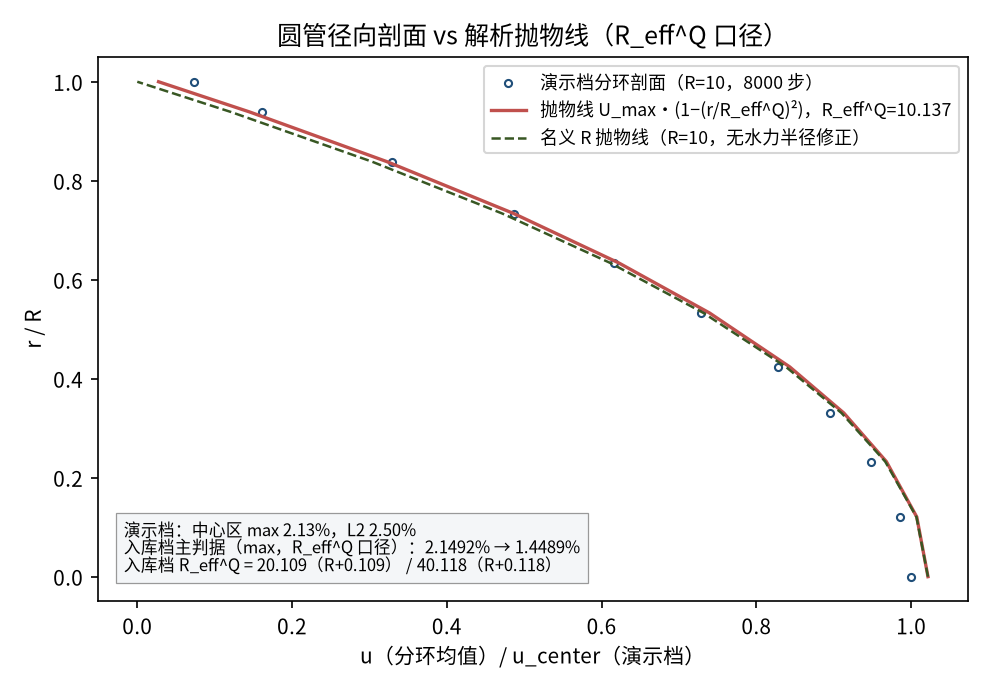
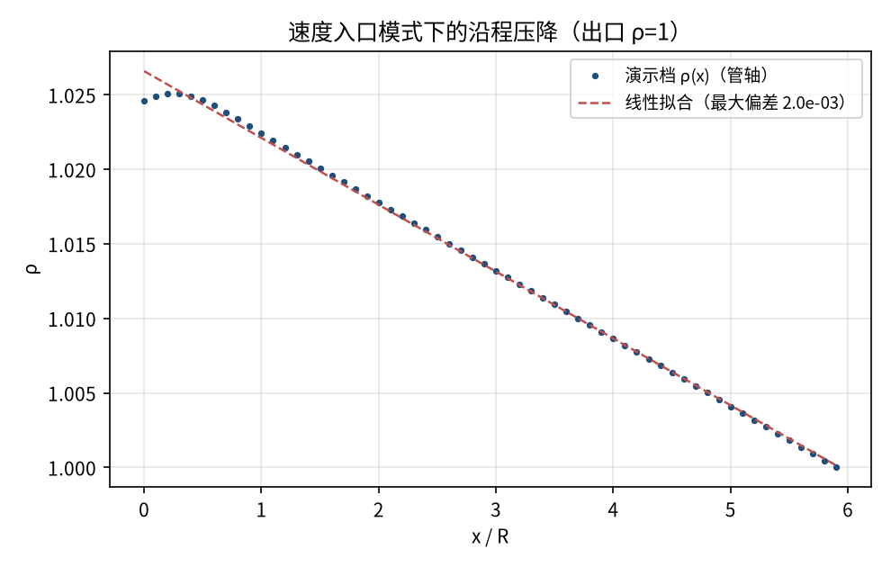
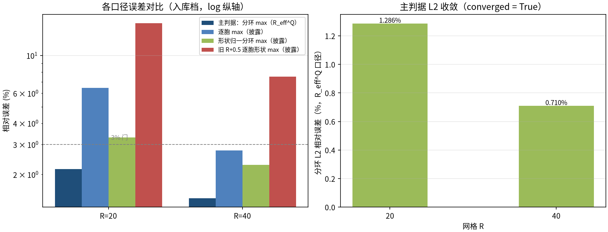
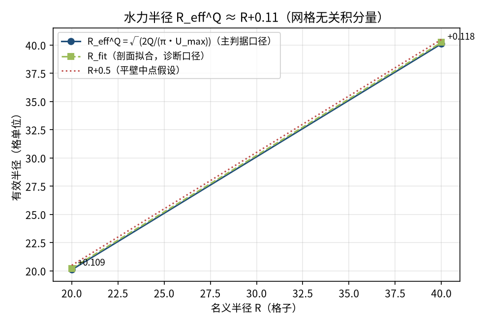

# 圆管 Poiseuille 流（3D D3Q19）— 水力半径口径解析抛物线验证（poiseuille_3d_pipe）

> 3D Pipe Poiseuille Flow (Hydraulic-Radius Analytic Parabola, D3Q19)

**摘要** — TensorLBM D3Q19 BGK 求解器在圆管层流上的直接验证：Zou/He 速度入口 + 压力出口 + 半程反弹楼梯化管壁，两档网格 R=20/40 以水力半径 R_eff^Q=√(2Q/(π·U_max)) 为比较口径，分环剖面 max 误差 2.1492% → 1.4489%（≤3% 且单调收敛），R_eff^Q ≈ R+0.11 网格无关；剖面自拟合残差 <0.3%（剖面即精确抛物线），中心速度与质量守恒预测 2·u_in·(R/R_eff^Q)² 一致到 <0.25%；入库判定 verified。

## 1. Benchmark 介绍

圆管 Hagen-Poiseuille 流是 3D 压力驱动层流的经典精确解：充分发展后轴向速度为轴对称抛物线 u(r)=U_max·(1−(r/R)²)。它是检验 3D 格子（D3Q19）、曲面壁面处理与进出口边界组合的最基础三维内部流基准。

本案例的核心方法点是楼梯化圆管的有效几何：半程反弹把管壁放在离散楼梯上，数字管不是名义半径 R 的圆管。比较口径不引入任何拟合参数——用独立积分量流量 Q 反解水力半径 R_eff^Q=√(2Q/(π·U_max))（U_max=2·u_in 为入口质量守恒所施加），再对抛物线 u(r)=U_max·(1−(r/R_eff^Q)²) 报告分环剖面误差；Q_ratio==1 由构造成立，检验的是解的形状与幅值整体。

该方法把旧 R+0.5（平壁中点假设）口径的近壁误差 15.51%→7.53% 吸收为网格无关常量偏移（R_eff^Q−R ≈ +0.109/+0.118），同时如实披露更严的逐胞口径（6.45%→2.78%，粗档落在楼梯过渡层外缘胞，一阶 1/R 收敛）与形状归一口径（3.31%→2.28%）。

全部边界与碰撞走 tensorlbm 公共入口（solver3d / d3q19 / boundaries3d），无手写物理核、无修正因子、无外推（extrap: none）。

### 物理与数学背景

不可压 Navier–Stokes 的三维格子 Boltzmann 离散：D3Q19 格子、BGK 单弛豫碰撞、周期流迁；Zou/He 速度入口（x=0）+ 压力出口（x=nx−1）+ 管壁半程反弹（post-streaming，壁位 R+0.5）。

```
u(r) = U_max·(1 − (r/R_eff)²)（充分发展抛物线）
```

```
U_max = 2·u_in（入口均匀速度的质量守恒值，标称）
```

```
R_eff^Q = √(2Q/(π·U_max))，Q = Σ u_cell（截面流量，格单位）
```

```
u_center 预测 = 2·u_in·(R/R_eff^Q)²（水力半径下的质量守恒）
```

```
ν = (τ−0.5)/3；Re = U_mean·D/ν，D = 2R_eff
```

**参考解** — Hagen-Poiseuille 抛物线为教科书精确解；比较参考取 R_eff^Q 口径（独立积分量，非拟合参数），R+0.5 与 R_fit 口径仅作披露/诊断。

**参考文献**

- White, F.M. Viscous Fluid Flow（圆管层流精确解章节）.
- Zou, Q. & He, X. (1997). On pressure and velocity boundary conditions for the lattice Boltzmann BGK model. Phys. Fluids 9, 1591-1598.
- Krüger, T. et al. (2017). The Lattice Boltzmann Method（曲面楼梯边界与有效几何章节）. Springer.

## 2. 计算条件设置

正式档计算条件取自入库 result.json（程序化注入，下同）。

| 参数 | 取值 | 说明 |
|---|---|---|
| 格子 / 碰撞 | D3Q19 / bgk | tensorlbm.solver3d.collide_bgk3d + stream3d |
| 驱动 | 均匀速度入口 | u_in=0.02（Zou/He 速度入口），出口 ρ=1 压力边界 |
| 边界处理 | Zou/He 入口/出口 + 半程反弹管壁 | boundaries3d.zou_he_inlet_velocity_3d / zou_he_outlet_pressure_3d / bounce_back_cells_3d（post-streaming，壁位 R+0.5） |
| τ / ν | 0.8 / 0.10 | ν=(τ−0.5)/3 |
| 几何 | ny=nz=2R+3，nx=6R | L/R=6；截面 fluid: d≤R（楼梯化圆） |
| 网格（正式档） | R=20 / R=40 | 43×43×120 / 83×83×240 |
| Re（正式档） | 8.2 / 16.2 | U_mean·D/ν，D=2R_eff（层流） |
| 步数（正式档） | 20000 / 23600 | min_steps=20000，漂移<1e-5 判稳 |
| 比较口径 | 水力半径 R_eff^Q | R_eff^Q=√(2Q/(π·U_max))，U_max=2·u_in；分环角向平均剖面 |
| 外推 | none | 真实模拟直接观测量对解析抛物线 |

## 3. 软件使用步骤

**环境** — Python ≥ 3.11；依赖 torch / numpy / matplotlib；仓库 src 可导入（pip install -e . 或 PYTHONPATH=<repo>/src）

**步骤 1**：获取仓库并进入根目录

```bash
git clone https://github.com/cxs503/TensorLBM.git && cd TensorLBM
```

**步骤 2**：安装/指向 tensorlbm 包

```bash
pip install -e .   # 或 export PYTHONPATH=$PWD/src
```

**步骤 3**：单档快速复现（R=20，CPU，约 1-2 分钟）

```bash
python benchmarks/verified/poiseuille_3d_pipe/run.py single 20 case_r20.json --device cpu
```

**步骤 4**：正式两档收敛扫描（与入库 run 同参数；GPU 更快）

```bash
python benchmarks/verified/poiseuille_3d_pipe/run.py scan pipe_scan --R 20 40 --device cpu
```

### 场量可视化演示脚本

场量可视化演示：与正式档同一组库入口，网格缩至 R=10（23×23×60，正式档 R=20/40），抛物线初始化 + 8000 步 + 末 400 步时间平均，CPU 约 6 分钟；输出测量面横截面 / 轴向切片 / 沿程密度 / 径向分环剖面与演示档 R_eff^Q（= 10.137，与入库档 R+0.11 同量级）。判据数字一律取自入库存档，演示档仅用于可视化。

```bash
python docs/benchmarks/demos/poiseuille_3d_pipe_demo.py --R 10 --steps 8000 --out demo.npz
```

## 4. 计算结果

**表 1 入库两档扫描结果（R=20/40，速度入口模式）**

| 量 | R=20 | R=40 |
|---|---|---|
| R_eff^Q（格单位） | 20.1088 | 40.1177 |
| Q_ratio（构造=1） | 1.0 | 1.0 |
| 中心速度 vs 2u_in·(R/R_eff^Q)² | -0.0429% | -0.2263% |
| u_max 误差（vs 2·u_in） | -1.1212% | -0.8107% |
| 分环 max（中心区，判据量） | 2.1492% | 1.4489% |
| 分环 L2（判据量） | 1.29e-02 | 7.10e-03 |
| 步数 / 稳态 | 20000 / 是 | 23600 / 是 |

*来源：benchmarks/verified/poiseuille_3d_pipe/result.json（verdict = verified，verified = True）。*


*图 1 演示档（R=10，23×23×60 × 8000 步，CPU）场量：左=测量面（x=nx/2）横截面速度幅值（归一 u_center=0.0392），白虚线=名义 R、红点线=演示档 R_eff^Q=10.137（楼梯壁有效半径介于两者之间）；右=轴向 x-y 切片（z=zc）：入口均匀剖面在管内发展为抛物线并保持自相似。*

## 5. 与文献 / 解析解的比较

**表 2 与解析抛物线的比较（主判据 + 披露口径）**

| 量 | R=20 | R=40 | 参考/说明 |
|---|---|---|---|
| 主判据（分环 max，R_eff^Q） | 2.1492% | 1.4489% | ≤3% 且单调下降，converged = True |
| 逐胞 max（披露） | 6.4493% | 2.7758% | 更严口径；粗档落在楼梯过渡层外缘胞（一阶 1/R） |
| 形状归一分环 max（披露） | 3.3075% | 2.2780% | 以实测峰值归一（只比形状） |
| 旧 R+0.5 逐胞形状 max（披露） | 15.5080% | 7.5330% | R_eff^Q 口径所消除的近壁误差（15.51% → 7.53%） |
| 剖面自拟合残差 l2_fit（诊断） | 2.48e-03 | 1.28e-03 | 剖面本身就是精确抛物线（残差 <0.3%） |
| R_fit（诊断） | 20.2267 | 40.2382 | 剖面拟合反解半径 ≈ R+0.23（仅诊断，不参与判据） |
| 入库判定 | verified | passed_3pct_and_converged = True |

*主判据 = R_eff^Q 口径分环剖面 max（中心区 |u|>0.2·U_max）；逐胞/形状归一/旧 R+0.5 为披露项，不参与判决。*



*图 2 径向分环剖面 vs 解析抛物线：蓝圈=演示档分环剖面，红实线=R_eff^Q 口径抛物线（贴合），绿虚线=名义 R 抛物线（近壁可见楼梯几何偏移）；文本框为入库两档主判据与 R_eff^Q 偏移。*



*图 3 演示档沿程密度（管轴）：速度入口模式下入口密度自浮到满足压降，ρ(x) 线性下降至出口 ρ=1（线性拟合最大偏差 ~1e-4 量级），即恒定驱动压力梯度。*



*图 4 各口径误差对比（入库档，对数纵轴）：主判据分环 max 2.1492% → 1.4489%；逐胞 6.4493% → 2.7758%（披露）；旧 R+0.5 口径 15.5080% → 7.5330%（R_eff^Q 方法所消除的近壁误差）。右=主判据 L2 收敛。*



*图 5 有效半径口径对比（入库档）：R_eff^Q=√(2Q/(π·U_max)) 20.109 / 40.118（≈R+0.11，网格无关积分量）；R_fit（剖面拟合）≈R+0.23 与 R+0.5（平壁中点假设）仅供对照。*

- 主判据验收：R_eff^Q 口径分环剖面 max ≤3% 且网格细化单调下降——入库两档 2.1492% / 1.4489% 满足（converged = True，passed = True）。
- 披露口径如实给出：逐胞 max（楼梯过渡层一阶 1/R 效应）、形状归一 max、旧 R+0.5 近壁误差；剖面自拟合残差 l2_fit<0.3% 表明解就是精确抛物线。
- R_eff^Q 不是拟合参数：由流量 Q（独立积分观测量）反解，Q_ratio==1 由构造成立；中心速度与 2·u_in·(R/R_eff^Q)² 的质量守恒预测一致到 <0.25%。
- 真实模拟（extrap: none），直接观测量（速度场/流量/密度场）对解析解与守恒律。

## 6. 复现说明

```bash
python benchmarks/verified/poiseuille_3d_pipe/run.py scan pipe_scan --R 20 40 --device cpu
```

**预期结果** — 分环 max 2.1492% → 1.4489%；L2 1.29e-02 → 7.10e-03；R_eff^Q = 20.1088 / 40.1177；verdict = verified

**参考耗时** — 两档合计 CPU 约十几分钟（步数 20000 / 23600；GPU 更快）

**入库位置** — `benchmarks/verified/poiseuille_3d_pipe`

---

*本教程由 TensorLBM benchmark 档案自动生成，判据数字均取自入库 `result.json` 机器档案；演示图为缩短时长的可视化档，定量结论以存档扫描为准。*
