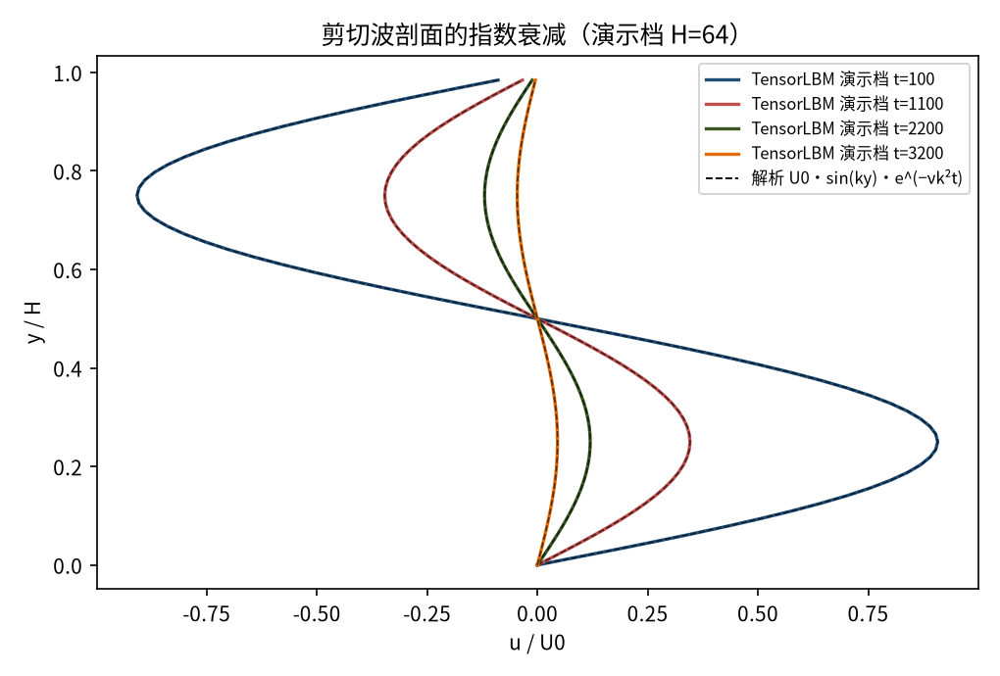
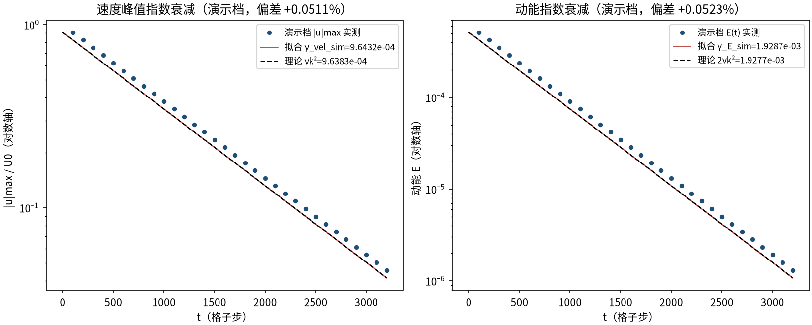
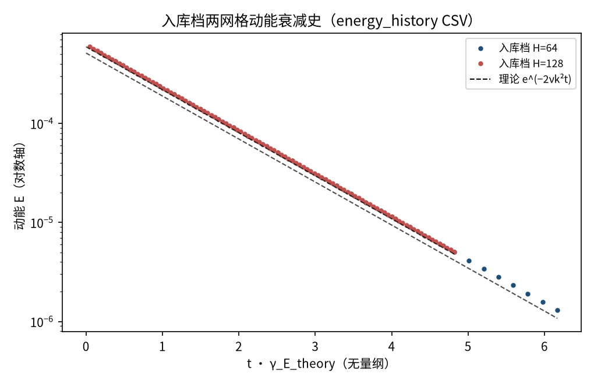
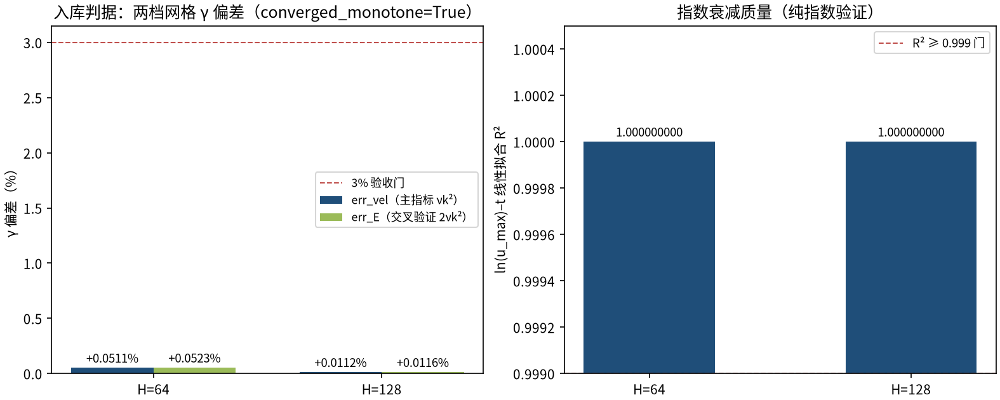

# 衰减剪切波：单 Fourier 模的粘性耗散（shear_wave_decay）

> Decaying Shear Wave — Viscous Dissipation of a Single Fourier Mode

**摘要** — TensorLBM D2Q9 BGK 求解器对不可压 NS 精确解 u=U0·sin(ky)·e^(−νk²t) 的直接验证：纯剪切 u·∇u≡0、无涡拉伸，只测线性粘性衰减率。入库两档网格（H=64/128）速度衰减率偏差 +0.0511% → +0.0112%（H 翻倍降约 4.5×，单调收敛），动能衰减率交叉验证 +0.0523% → +0.0116%，全部远低于 3% 门且 R²≈1（verified = True）。

## 1. Benchmark 介绍

衰减剪切波是粘性耗散的最纯基准：周期域上单 Fourier 模 (0, k) 的初始速度 u=U0·sin(ky)、v≡0。因为 u·∇u ≡ 0（非线性项恒为零、无涡拉伸），它是不可压Navier–Stokes 方程的精确解，速度按 e^(−νk²t) 指数衰减、动能按 e^(−2νk²t) 衰减——衰减率只由 ν 和 k 决定，任何数值耗散都会直接进入 γ_sim 与 γ_theory 的偏差。

它与 Taylor–Green 涡构成一对互补的耗散基准：TG 的波矢是 (±k,±k)（|κ|²=2k²），剪切波单模 (0,k)（|κ|²=k²）。剪切波无非线性项，衰减更贴近解析，是标定BGK 离散等效粘度是否等于 (τ−0.5)/3 的最干净测试。

实测偏差符号本身有物理信息：本案例 γ_sim 略大于理论（+0.05%→+0.01%，随网格加密消失），而 2D TG 为 −0.035%（略小）——不同波矢/模态的 BGK 离散修正方向不同，数值如实记录、不做任何人工修正。

### 物理与数学背景

不可压 Navier–Stokes 在单剪切模下的精确线性解的格子 Boltzmann 离散：D2Q9、BGK 碰撞、全周期流迁。

```
u(x,y,t) = U0·sin(k·y)·e^(−νk²t)，v ≡ 0，k = 2π/H
```

```
ν = (τ − 1/2)/3（格子单位）
```

```
速度衰减率 γ_vel = νk²（主指标）；动能衰减率 γ_E = 2νk²（交叉验证）
```

```
γ_sim = −d(ln|u|max)/dt 与 −d(lnE)/dt（最小二乘线性拟合）
```

**参考解** — 不可压 NS 线性粘性衰减（Fourier 模态衰减，标准结果）；LBM 粘性测量标准测试（Krüger et al. validation 章节）。

**参考文献**

- Krüger A. et al., The Lattice Boltzmann Method, Springer (2017), validation: shear wave decay.
- Qian Y., d’Humières D., Lallemand P. (1992), Lattice BGK models for Navier-Stokes equation, Europhys. Lett. 17, 479.

## 2. 计算条件设置

正式档计算条件取自入库 result.json（程序化注入，下同）。

| 参数 | 取值 | 说明 |
|---|---|---|
| 格子 / 碰撞 | D2Q9 / BGK | tensorlbm.solver.collide_bgk + stream（周期 wrap 内建，步序 stream→collide） |
| 初始场 | u = U0·sin(2πy/H)，v=0，ρ=1 | f = equilibrium(ρ, ux, uy)（feq 初值） |
| 弛豫 / 粘度 | tau=0.8 ⇒ ν=0.1 | 直接用 ν 定 τ，不经 Re |
| 波数 | k = 2π/H（H=64 → 0.09817；H=128 → 0.04909） | 单 Fourier 模 (0,k)，\|κ\|²=k² |
| 速度幅值 | U0 = 0.05 | Ma ≈ 0.087，压缩性误差 O(Ma²) |
| 步数 | H=64: 3200；H=128: 10000 | auto：u_max/U0 → e⁻³，每 100 步记录 |
| 精度 / 设备 | float32 / CPU | 入库档耗时 2.0s + 13.2s |
| 验收门 | \|γ_sim/γ_theory − 1\| ≤ 3% 且随 H 收敛 | R² ≥ 0.999 指数性检查 |

## 3. 软件使用步骤

**环境** — Python ≥ 3.11；依赖 torch / numpy / matplotlib；仓库 src 可导入（pip install -e . 或 PYTHONPATH=<repo>/src）

**步骤 1**：获取仓库并进入根目录

```bash
git clone https://github.com/cxs503/TensorLBM.git && cd TensorLBM
```

**步骤 2**：安装/指向 tensorlbm 包

```bash
pip install -e .   # 或 export PYTHONPATH=$PWD/src
```

**步骤 3**：单案例快速复现（H=64，CPU 秒级）

```bash
python benchmarks/verified/shear_wave_decay/run.py --n 64 --steps 1000
```

**步骤 4**：完整两档网格 benchmark（H=64/128），写出判定 result.json

```bash
python benchmarks/verified/shear_wave_decay/run.py --device cpu
```

### 场量可视化演示脚本

非定常演化演示：与入库档同物理参数（H=64、tau=0.8、U0=0.05）CPU 真跑约 2.9 s（3200 步），输出多时刻 u(y) 剖面、场快照与能量/峰值速度历史；判据数字一律取自入库扫描。

```bash
python docs/benchmarks/demos/shear_wave_decay_demo.py --n 64 --tau 0.8 --u0 0.05 --steps 3200 --out demo.npz
```

## 4. 计算结果

**表 1 入库扫描结果（两档网格）**

| 网格 | γ_vel_sim | γ_vel_theory=νk² | err_vel | err_E | R² |
|---|---|---|---|---|---|
| H=64 | 9.643210e-04 | 9.638286e-04 | +0.0511% | +0.0523% | 1.000000000 |
| H=128 | 2.409842e-04 | 2.409571e-04 | +0.0112% | +0.0116% | 1.000000000 |

*来源：benchmarks/verified/shear_wave_decay/result.json（verified = True，tol = 3%）。*

## 5. 与文献 / 解析解的比较

**表 2 交叉验证与守恒诊断**

| 量 | 数值 | 说明 |
|---|---|---|
| 动能衰减交叉验证（H=64） | γ_E_sim=1.928665e-03 vs 2νk²=1.927657e-03 | 偏差 +0.0523%（速度/能量两口径自洽） |
| 半窗口斜率一致性（H=64） | 9.643236e-04 / 9.643164e-04 | 前后半窗拟合斜率一致 ⇒ 纯指数衰减，非拟合假象 |
| 初值实测（H=64） | u_max0_meas=0.050000001（理论 0.05） | E0_meas=0.0005148（理论 U0²/4=0.0006250） |
| 质量守恒 | H=64 2.0e-05 / H=128 9.2e-05 | 相对漂移（周期域 + BGK 守恒碰撞） |
| 偏差符号（与 TG 对照） | γ_sim 略大于 γ_theory（+0.05%→+0.01%） | 2D TG 为 −0.035%（略小）：不同波矢模态的 BGK 离散修正方向不同，如实记录 |



*图 1 演示档（H=64）多时刻 u(y) 剖面（实线）与解析 U0·sin(ky)·e^(−νk²t)（虚线）：形状（正弦条带）不变、幅值指数衰减。*


*图 2 演示档场快照（ux/U0，红正蓝负）：剪切条带沿 y 分布、沿 x 严格均匀（周期域 + 流向无梯度），幅值随时间衰减。*



*图 3 演示档衰减率拟合：左=|u|max 对数轴，拟合斜率 γ_vel_sim=9.6432e-04 对理论 νk²=9.6383e-04（偏差 +0.0511%）；右=动能 E，拟合对 2νk²（偏差 +0.0523%）——演示档即为完整周期域真实模拟，拟合质量与入库档同型。*



*图 4 入库档两网格的动能衰减史（程序化读取 energy_history_H*.csv，横轴以 1/γ_E_theory 无量纲化）：两档斜率一致且与理论线（黑虚线）重合。*



*图 5 入库判据数字：左=两档网格 γ_vel/γ_E 偏差（+0.0511% → +0.0112%，随 H 单调下降，converged_monotone = True）；右=ln(u_max)–t 线性拟合 R²（≥0.999 门，实测 9 个 9）。*

- 误差定义：γ_sim/γ_theory − 1（速度主指标 νk² + 动能交叉验证 2νk²），验收门 3% 且 |err| 随 H 单调下降；指数性检查 R² ≥ 0.999 + 前后半窗斜率一致。
- 测量协议：u_max 与动能 E 每 100 步由 macroscopic 实测记录，无任何外推/修正；补充扫描（scan_summary.json）覆盖 U0 敏感性与 float64 精度检查。
- 本案例为直接观测量对解析解（无任何模型修正或重标定），符合严格入库标准。

## 6. 复现说明

```bash
python benchmarks/verified/shear_wave_decay/run.py --device cpu
```

**预期结果** — err_vel：+0.0511% → +0.0112%；err_E：+0.0523% → +0.0116%（全部 ≤3%、单调收敛、R²≥0.999，verified=True）

**参考耗时** — 约 15 s 合计（入库档 CPU 实测）

**入库位置** — `benchmarks/verified/shear_wave_decay`

---

*本教程由 TensorLBM benchmark 档案自动生成，判据数字均取自入库 `result.json` 机器档案；演示图为缩短时长的可视化档，定量结论以存档扫描为准。*
