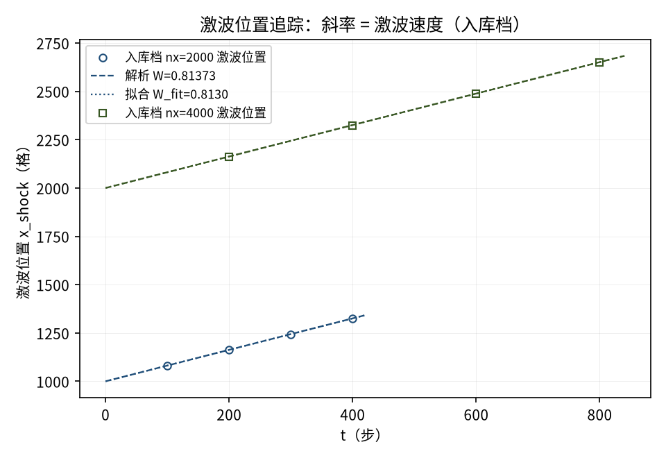
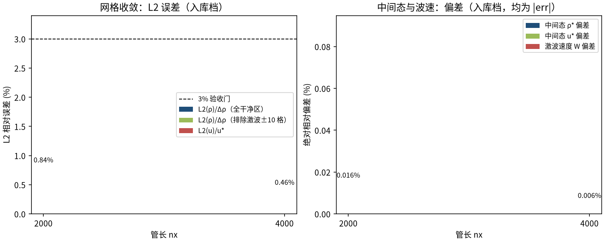

# 等温 Sod 激波管（D2Q9 可压缩 Riemann 问题）（sod_shock_tube）

> Isothermal Sod Shock Tube (D2Q9 Compressible Riemann Problem)

**摘要** — TensorLBM D2Q9 BGK 求解器在密度比 4:1 激波管上对等温 Riemann 精确解的直接验证：两档管长 nx=2000/4000 密度 L2 误差 0.84% → 0.46% 单调收敛，激波速度偏差 |-0.029%|、中间态偏差 ≤0.05%，全部指标 ≤3%（入库 verified = True）。

## 1. Benchmark 介绍

激波管（Sod 问题）是可压缩流体力学最经典的 Riemann 问题：初始膜片两侧密度/压力不同，撤膜后左行稀疏波、中间均匀态、右行激波三段结构自解析可解，是检验可压缩求解器波系捕捉能力的标准算例。

关键口径：D2Q9 平衡态强制等温状态方程 p=ρ/3（cs²=1/3，无能量方程、温度固定），因此正确参考解是等温 Riemann 解（激波 + 稀疏波，无接触间断），而经典 γ=1.4 Sod 解物理上不适用——这是本案例最重要的方法论结论，已在 README 与 result.json 双重披露。

本配置密度比 4:1（ρ_L=1.0/ρ_R=0.25，u=0），解析中间态 ρ*=0.49662、u*=0.40410（Ma_mid=0.700），激波速度 W=0.81373<1（格点最大离散速度），全波系在 D2Q9 可表示域内。库路径为零手写物理：d2q9.equilibrium / macroscopic + solver.collide_bgk / stream，周期边界由 stream() 原生模运算 gather 支持。

### 物理与数学背景

等温 Euler 方程的格子 Boltzmann 离散：D2Q9 格子、BGK 单弛豫碰撞、拉格朗日流迁；宏观 p=ρ·cs²=ρ/3。

```
激波密度比 r 满足 ln(ρ_L/(r·ρ_R)) = (r−1)/√r（等温 Rankine–Hugoniot）
```

```
中间态：ρ* = r·ρ_R，u* = cs·(r−1)/√r；激波速度 W = cs·√r
```

```
稀疏波扇：头波 s=−cs、尾波 s=u*−cs，扇内 ρ = ρ_L·exp(−(s+cs)/cs)
```

```
τ = 0.8 → ν = (τ−0.5)/3 = 0.1
```

**参考解** — 等温 Riemann 精确解（自算，正式档 run.py 的 iso_riemann / ana_profile 实现，本教程逐字复用）；干净区口径 [cs·t, nx−W·t]（排除周期边界的镜像 Riemann 波系）。

**参考文献**

- Sod G.A. (1978), A survey of several finite difference methods for systems of nonlinear hyperbolic conservation laws, J. Comput. Phys. 43, 1-107（原始 Sod 问题）.
- 等温 Riemann 解与 LBM 等温 EOS 口径：本库 benchmarks/verified/sod_shock_tube/run.py 模块 docstring（自算解析参考）.

## 2. 计算条件设置

正式档计算条件取自入库 result.json（程序化注入，下同）。

| 参数 | 取值 | 说明 |
|---|---|---|
| 初始间断 | ρ_L=1.0 / ρ_R=0.25 | x=nx/2，密度比 4:1，u=0，f=feq 精确单元跳变 |
| 晶格 / 碰撞 | D2Q9 BGK | tensorlbm.solver.collide_bgk / stream |
| τ（ν） | 0.8 | ν=(τ−0.5)/3=0.1 |
| 横向 | ny=4（y 向均匀） | stream() 原生周期 gather |
| 参考解 | 等温 Riemann 精确解 | p=ρ/3（D2Q9 等温 EOS），自算解析解 |
| 解析中间态 | ρ*=0.49662、u*=0.40410 | Ma_mid=u*/cs=0.700 |
| 解析激波速度 | W=0.81373 | W=cs·√r < 1（格点稳定性上界） |

## 3. 软件使用步骤

**环境** — Python ≥ 3.11；依赖 torch / numpy / matplotlib；仓库 src 可导入（pip install -e . 或 PYTHONPATH=<repo>/src）

**步骤 1**：获取仓库并进入根目录

```bash
git clone https://github.com/cxs503/TensorLBM.git && cd TensorLBM
```

**步骤 2**：安装/指向 tensorlbm 包

```bash
pip install -e .   # 或 export PYTHONPATH=$PWD/src
```

**步骤 3**：全量复现（两档网格 + 声学补充，CPU 96 核约 1-2 分钟），写出 result.json 与 profiles_nx*.npz

```bash
python benchmarks/verified/sod_shock_tube/run.py
```

### 场量可视化演示脚本

波系结构可视化演示：与正式档同一组库入口与步进链（stream→collide_bgk），缩短管长与演化时间（nx=1000、t≤200，CPU 约 0.2 s），完整保留稀疏波/中间态/激波结构并输出多时刻ρ/u 剖面；判据数字一律取自入库扫描。

```bash
python docs/benchmarks/demos/sod_shock_tube_demo.py --nx 1000 --steps 200 --out demo.npz
```

## 4. 计算结果

**表 1 入库扫描结果（nx=2000 t=400 / nx=4000 t=800）**

| 指标 | nx=2000 | nx=4000 | 备注 |
|---|---|---|---|
| L2(ρ)/Δρ（全干净区） | 0.84% | 0.46% | 判据量，干净区 [cs·t, nx−W·t] |
| L2(ρ) 排除激波±10 格 | 0.42% | 0.27% | 平滑区（稀疏波扇+平台） |
| L2(u)/u* | 1.81% | 0.87% | 速度剖面 |
| 激波速度 W_fit | 0.8130 | 0.8135 | 解析 W=0.8137 |
| 激波速度偏差 | -0.090% | -0.029% | 判据量（符号保留） |
| 中间态 ρ* 偏差 | -0.016% | -0.006% | 解析 ρ*=0.49662 |
| 中间态 u* 偏差 | -0.041% | -0.025% | 解析 u*=0.40410 |
| 激波局部振荡幅值 | 2.77% | 2.63% | 相对 Δρ（BGK 无限制器） |
| 稳定性 | 稳定（无 NaN/负密度） | 稳定（无 NaN/负密度） | first_bad_step = None / None |

*来源：benchmarks/verified/sod_shock_tube/result.json（verified = True）。*


*图 1 演示档（nx=1000，t=50→200 步）密度波系演化 vs 等温 Riemann 精确解：左行稀疏波扇、中间平台 ρ*、右行激波逐时刻吻合；演示档仅缩短管长/演化时间，初始条件与碰撞链和正式档完全相同；灰带 = 周期 x 边界镜像波系区（单 Riemann 解不适用，不入比较）。*

## 5. 与文献 / 解析解的比较

**表 2 与等温 Riemann 精确解的比较（入库档）**

| 量 | nx=2000 | nx=4000 | 说明 |
|---|---|---|---|
| L2(ρ) 收敛 | 0.84% → 0.46% | 单调下降（判据：不随分辨率增大） |
| 全指标 ≤3% | 是 | L2(ρ)/L2(u)/W/ρ*/u* 均在 3% 门内 → verified = True |
| 中间态实测 | ρ=0.49654（t=400） | ρ=0.49659（t=800）；解析 ρ*=0.49662 |
| 稀疏波扇内点 | t=800 实测 x=1600：ρ=0.873 vs 解析 0.875 | u=0.0785 vs 解析 0.0775（README 存档记录） |

**表 3 声学补充验证（弱可压缩 Ma<0.3，入库档）**

| 初始扰动 ε | Ma_mid | 波速偏差 | u* 偏差 | L2(ρ)/Δρ |
|---|---|---|---|---|
| ε=0.01（线性声学） | 0.010 | -0.042% | -0.19% | 1.89% |
| ε=0.25 | 0.256 | +0.094% | -0.04% | 0.79% |

*小扰动激波管 ρ_L=1±ε：现有库原生支持弱可压缩声学，波速与线性声学理论 cs 偏差 <0.1%。*

![图 2 入库档 nx=2000 最终剖面（t=400）vs 等温 Riemann 精确解：左=密度（稀疏波扇内逐点吻合），右=速度（中间态平台u* 与激波跃变位置吻合；灰带 = 周期 x 边界镜像波系区（含激波抹宽余量），单 Riemann 解不适用、不入比较，判据只在干净窗 [cs·t, nx−W·t] 内）。](figs/sod_shock_tube/cmp_profile_final.png)

*图 2 入库档 nx=2000 最终剖面（t=400）vs 等温 Riemann 精确解：左=密度（稀疏波扇内逐点吻合），右=速度（中间态平台u* 与激波跃变位置吻合；灰带 = 周期 x 边界镜像波系区（含激波抹宽余量），单 Riemann 解不适用、不入比较，判据只在干净窗 [cs·t, nx−W·t] 内）。*



*图 3 激波位置追踪（入库档）：x_shock(t) 线性拟合斜率 W_fit=0.8130/0.8135，与解析斜率 W=0.8137 几乎重合（偏差 -0.090% / -0.029%）。*



*图 4 网格收敛（入库判据数字）：L2(ρ) 0.84% → 0.46% 单调下降；中间态 ρ*/u* 与波速 W 偏差均在 0.05% 量级，远低于 3% 验收门。*

- 误差定义：密度按跳跃 Δρ=ρ_L−ρ_R 归一、速度按 u* 归一的 L2 相对误差，只在干净区 [cs·t, nx−W·t] 内计算（周期 x 边界在 x=0 产生镜像 Riemann 问题，其波系被该窗口排除）。
- 记录的模型固有限制：等温 EOS（无接触间断/激波熵增）；单一激波密度比r<3（W<1 格点速度上界，8:1 管 step 50 内发散）；BGK 无限制器，激波局部振荡 ~2.6%Δρ；τ≥0.65 才稳定（4:1 管）。
- 本案例为直接观测量对自算解析参考（无任何模型修正或重标定），符合严格入库标准。

## 6. 复现说明

```bash
python benchmarks/verified/sod_shock_tube/run.py
```

**预期结果** — L2(ρ) 0.84% → 0.46%（单调）；W 偏差 -0.090%/-0.029%；ρ* 偏差 -0.016%/-0.006%；u* 偏差 -0.041%/-0.025%（全部 ≤3%）

**参考耗时** — CPU（96 核，torch 32 线程）全量约 1-2 分钟

**入库位置** — `benchmarks/verified/sod_shock_tube`

---

*本教程由 TensorLBM benchmark 档案自动生成，判据数字均取自入库 `result.json` 机器档案；演示图为缩短时长的可视化档，定量结论以存档扫描为准。*
