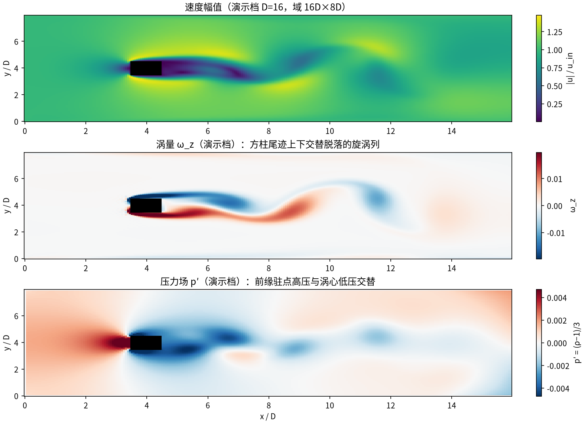
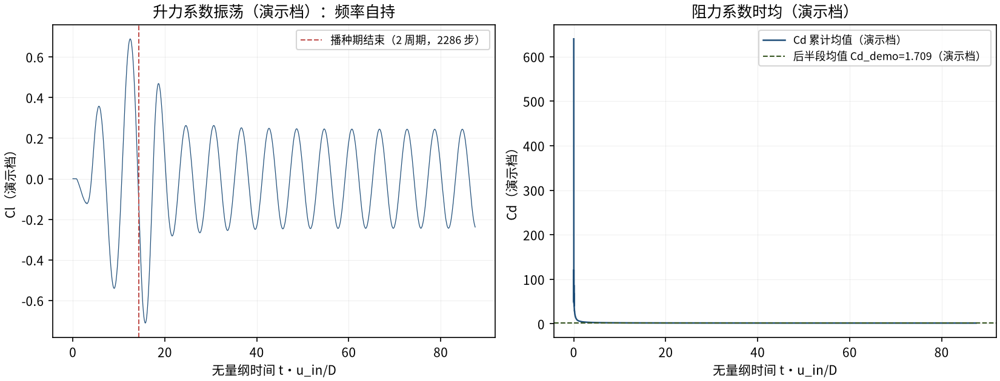
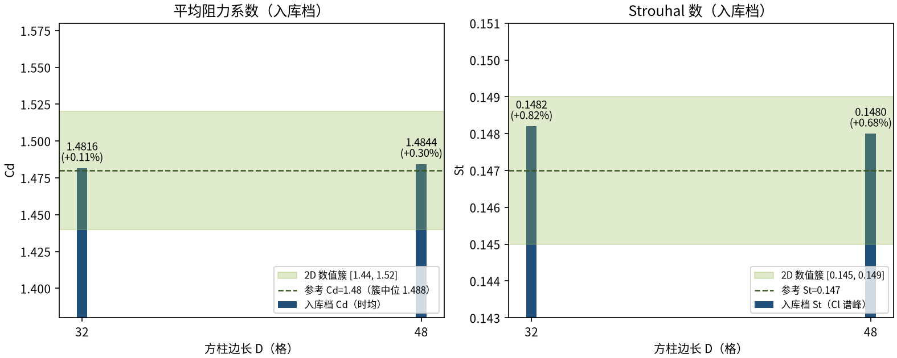

# 自由流方柱绕流 Re=100：涡脱落对 2D 数值簇验证（square_cylinder）

> Flow Past a Square Cylinder at Re=100: Vortex Shedding vs the 2D Free-Stream Numerical Cluster

**摘要** — TensorLBM D2Q9 MRT 求解器在自由流方柱（正置）Re=100 涡脱落上对 2D 自由流低阻塞数值簇的验证：域 40D×40D（阻塞比 2.5%）、下游 10D sponge、入口 2 周期播种（St_seed=0.14），两档网格 D=32/48 时均 Cd 1.4816/1.4844（+0.11%/+0.30%）、St 0.1482/0.1480（+0.82%/+0.68%），全指标 ≤3% 且网格跨度 Cd 0.19% / St 0.14%（入库 verified = True，2026-09-29）。

## 1. Benchmark 介绍

方柱绕流与前述圆柱族同属钝体涡脱落，但分离点固定在前缘角点（不依赖曲面逆压梯度自适应），剪切层自角点直接喷出，St 与 Cd 对来流条件更不敏感。Re=100 处于该几何的二维涡脱区间（展向三维失稳阈值 Re≈160），量兴趣为时均阻力系数 Cd 与涡脱 Strouhal 数 St=f·D/u。

参考口径是本案例的核心裁定（入库 REFERENCE_AUDIT.md 14 点逐表核对）：早期版本对 Okajima 1982 实验（St≈0.143-0.145）与无出处的 Cd≈1.6 打分判 FAIL；审计裁定 2D 求解器不得对 3D 有限展向实验打分（2D 压制展向失稳，系统性抬高 St），且本求解器为 40D 域、阻塞比 2.5% 的低阻塞自由流配置，也不得对标通道（Sohankar 1997 Cd≈2.05）或小域（Sharma & Eswaran 2004 Cd=1.57）数据。最终采用 2D 自由流低阻塞数值簇：Cd_ref=1.48（[1.44, 1.52]，中位 1.488）、St_ref=0.147（[0.145, 0.149]），来源为五篇文献的原表数字。

工程链整体复用 cylinder_re100 验证案（播种 + sponge + MRT tau_field + far_field + Ladd 测力 + FFT 提谱），仅把圆形掩码换为 half-way BB 方块掩码（有效边长精确 = D）。入库记录还显示播种频率 0.14 ≠ 终态 St≈0.148——播种只负责打破对称，频率由流场自选；这是涡街类基准「触发而非锁定」原则的直接证据。

### 物理与数学背景

不可压 Navier–Stokes 方程的格子 Boltzmann 离散：D2Q9 格子、MRT（多弛豫时间）碰撞算子（支持 tau_field 逐格弛豫 = sponge）、拉格朗日流迁。

```
Re = u_in·D / ν，ν = (τ−0.5)/3（D 为方柱边长格数）
```

```
St = f·D / u_in（涡脱频率 f 由 Cl 序列 FFT 谱峰 + 抛物线插值提取；滞回过零独立交叉验证）
```

```
Cd = Fx / (0.5·ρ·u_in²·D)（Ladd 动量交换，表面格求和）
```

```
sponge：τ_eff(x) = τ·(1 + α·σ(x))，σ 平方渐变 0→1，α=10
```

```
方块掩码：x0..x1 覆盖 D 格 + half-way BB → 有效边长精确 = D
```

**参考解** — 2D 自由流低阻塞数值簇（α=0°、正置）：Cd=1.48（[1.44, 1.52]，中位 1.488）、St=0.147（[0.145, 0.149]）。不适用：Okajima 1982 实验（3D 有限展向）、Sohankar 1997 通道（高阻塞 Cd≈2.05）、Sharma & Eswaran 2004 小域（Cd=1.57）。

**参考文献**

- Okajima A. (1982), Strouhal numbers of rectangular cylinders, J. Fluids Eng. 104, 106-113（实验 St 0.143-0.145——上下文参考，非 2D 求解器打分口径）
- Sohankar A. et al., arXiv:2411.03124v4 Table 1（Re=100: Sohankar 1.46/0.147、Yoon 1.44/0.145、Present 1.48/0.147）
- arXiv:2309.09197 Table 2（Sohankar 1.477/0.146、Sahu 1.488/0.149、Sen 1.530/0.145、Present 1.495/0.145）
- arXiv:2308.08085v3 Tables 7-8（uniform 1.500 / AMR 1.511、St 0.1472、Fakhari & Lee 1.51/0.149、González 1.50/0.145）
- arXiv:2404.12123（Present 1.476）；arXiv:2405.12834（1.47-1.55 / 0.145-0.148）

## 2. 计算条件设置

正式档计算条件取自入库 result.json 与侧车 case_D32/D48.json（程序化注入，下同）。

| 参数 | 取值 | 说明 |
|---|---|---|
| 问题 | 自由流方柱（正置）绕流 Re=100（涡脱落） | 前缘角点固定分离；2D 区间（该几何展向失稳阈值 Re≳160） |
| 域（正式档） | 40D×40D（阻塞比 2.5%） | 方块中心距入口 10D；阻塞比 2.5% |
| 晶格 / 碰撞 | D2Q9 MRT (tau_field sponge)（tau_field 逐格弛豫 = sponge） | tensorlbm.solver.collide_mrt / stream |
| 远场边界 | far_field_bc_2d | 入口/两侧自由流 Dirichlet + 出口零梯度 + 方块反弹 |
| sponge 层 | 下游 10D，平方渐变，α=10 | D32 档 x0=960、宽 320 格；τ_eff = τ·(1+α·σ) |
| 播种 | St_seed=0.14、10% 振幅、入口整列、2 周期 | seed_steps 9143 / 13714；对称破缺后频率自选 |
| u_in / τ | 0.05；τ = 3·u·D/Re+0.5 | D=32 → 0.548；D=48 → 0.572（ν = u·D/Re） |
| 掩码 | half-way BB 方块掩码（有效边长精确 = D） | x0..x1 覆盖 D 格，壁在格界外 0.5 |
| 测力 | Ladd 动量交换（表面格） | post-stream、pre-bounce-back 采样 |
| 步数（正式档） | 60000 / 90000 | 时均窗 = 后 50%；St 由 Cl 序列 FFT 谱峰提取 |

## 3. 软件使用步骤

**环境** — Python ≥ 3.11；依赖 torch / numpy / matplotlib；仓库 src 可导入（pip install -e . 或 PYTHONPATH=<repo>/src）

**步骤 1**：获取仓库并进入根目录

```bash
git clone https://github.com/cxs503/TensorLBM.git && cd TensorLBM
```

**步骤 2**：安装/指向 tensorlbm 包

```bash
pip install -e .   # 或 export PYTHONPATH=$PWD/src
```

**步骤 3**：单档复现（D=32；GPU 数分钟量级，CPU 需数小时）

```bash
python benchmarks/verified/square_cylinder/run.py --D 32 --steps 60000 --device cuda:0
```

**步骤 4**：两档网格（D=32/48）批量运行并写出判定 result.json（入库口径为 SDAA 主机，CUDA 可换 --device）

```bash
python benchmarks/verified/square_cylinder/run.py --D 32 48 --steps 60000 90000 --device cuda:0 --out result.json
```

### 场量可视化演示脚本

涡街瞬态可视化演示：与正式档同一组库入口与步进链（collide_mrt tau_field + far_field_bc_2d + 播种），缩域缩径（D=16、域 16D×8D、u_in=0.1，正式档 D=32/48、40D×40D、u_in=0.05），14000 步 GPU 约 10 s；输出 |u|/涡量/p′ 瞬态场与 Cd/Cl 序列。演示档因阻塞比升高（12.5% vs 正式档 2.5%）与粗径阶梯，Cd_demo=1.709、St_demo=0.1653 系统性偏高，仅用于展示涡脱形态与频率自持；定量判据一律取入库扫描。

```bash
python docs/benchmarks/demos/square_cylinder_demo.py --D 16 --steps 14000 --out demo.npz
```

## 4. 计算结果

**表 1 入库扫描结果（域 40D×40D，u_in=0.05）**

| 量 | D=32 | D=48 | 参考/说明 |
|---|---|---|---|
| Cd（时均） | 1.4816 | 1.4844 | 参考 1.48（簇 [1.44, 1.52]，中位 1.488） |
| Cd 误差 | +0.11% | +0.30% | 判据量（≤3%） |
| St（Cl 谱峰） | 0.1482 | 0.1480 | 参考 0.147（簇 [0.145, 0.149]） |
| St 误差 | +0.82% | +0.68% | 判据量（≤3%） |
| St（过零交叉验证） | 0.1473 | 0.1468 | 滞回过零独立口径（与谱峰一致） |
| Cl 幅值 | 0.2906 | 0.2953 | 涡脱充分建立的标志 |
| 步数 | 60000 | 90000 | 两档独立运行 |

*来源：benchmarks/verified/square_cylinder/result.json + 侧车 case_D32/D48.json（verified = True，2026-09-29）。*



*图 1 演示档（D=16，域 16D×8D，14000 步，GPU）涡街瞬态场量：上=速度幅值（角点剪切层与尾流减速区），中=涡量 ω_z（上下交替脱落的旋涡列），下=压力场 p′（前缘驻点高压与涡心低压交替）。*



*图 2 演示档力系数历史：左=Cl（播种期结束后自持等幅振荡，FFT 谱峰 St_demo=0.1653，与播种频率 0.14 不同 = 频率由流场自选）；右=Cd 累计均值收敛到 Cd_demo=1.709（演示档，受阻塞比与粗径影响偏高）。*

## 5. 与文献 / 解析解的比较

**表 2 与 2D 自由流数值簇的比较与收敛判定（入库档）**

| 量 | 值 | 说明 |
|---|---|---|
| Cd 收敛 | 1.4816 → 1.4844 | 误差 +0.11% → +0.30%（均在簇内） |
| St 收敛 | 0.1482 → 0.1480 | 误差 +0.82% → +0.68%（均在簇内） |
| 网格跨度 | Cd 0.19% / St 0.14% | 验收条款：两档各自 ≤3% 且网格跨度 ≤3%（均满足） |
| 最保守簇边复核 | +2.9%/+3.1%（仍 ~3%） | 对簇最保守边（Cd=1.44、St=0.145）仍 ~3% |
| 判定 | verified = True | 入库 2026-09-29（run_date 2026-08-20） |



*图 3 网格收敛（入库判据数字）：Cd 1.4816→1.4844、St 0.1482→0.1480，误差均落在 2D 数值簇（绿色带）内，网格跨度 Cd 0.19% / St 0.14%（条款 ≤3%）。*

- 验收条款：两档网格 Cd/St 误差各自 ≤3% 且网格跨度 ≤3%（非「误差随细化单调下降」）。入库 result.json 明确记录 err_decreased=false：D=32 的 +0.11% 恰比 D=48 的 +0.30% 更靠近簇心，属簇内摆动而非发散（convergence.err_decreased_note 全文存档）。
- 对最保守簇边（Cd=1.44、St=0.145）复核：误差 +2.9%/+3.1%——仍 ~3%，参考取簇心时结论对簇边稳健。
- 演示档口径：D=16 缩径 + 16D×8D 缩域使阻塞比升至 12.5%（正式档 2.5%），Cd_demo/St_demo 系统性偏高，仅证明涡脱形态与频率自持；定量结论以入库 D=32/48 档为准。
- 本案例为直接观测量对数值簇参考（无任何模型修正或重标定），符合严格入库标准；工程链（播种 + sponge + MRT tau_field）原样复用 cylinder_re100 案，掩码换为 half-way BB 方块（有效边长精确 = D）。

## 6. 复现说明

```bash
PYTHONPATH=src python benchmarks/verified/square_cylinder/run.py --D 32 48 --steps 60000 90000 --compile-mode eager --device sdaa:0
```

**预期结果** — D=32: Cd=1.4816（+0.11%）、St=0.1482（+0.82%）；D=48: Cd=1.4844（+0.30%）、St=0.1480（+0.68%）（均 ≤3%）

**参考耗时** — 入库实测（SDAA）146 s（D=32）+ 553 s（D=48）；CUDA 主机更快（演示档 GPU 10 s / 14000 步 @ D=16 缩域）

**入库位置** — `benchmarks/verified/square_cylinder`

---

*本教程由 TensorLBM benchmark 档案自动生成，判据数字均取自入库 `result.json` 机器档案；演示图为缩短时长的可视化档，定量结论以存档扫描为准。*
