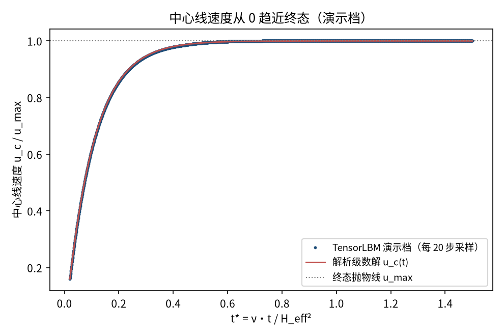
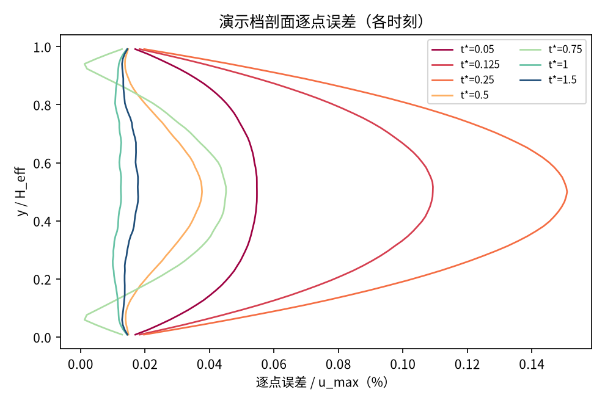
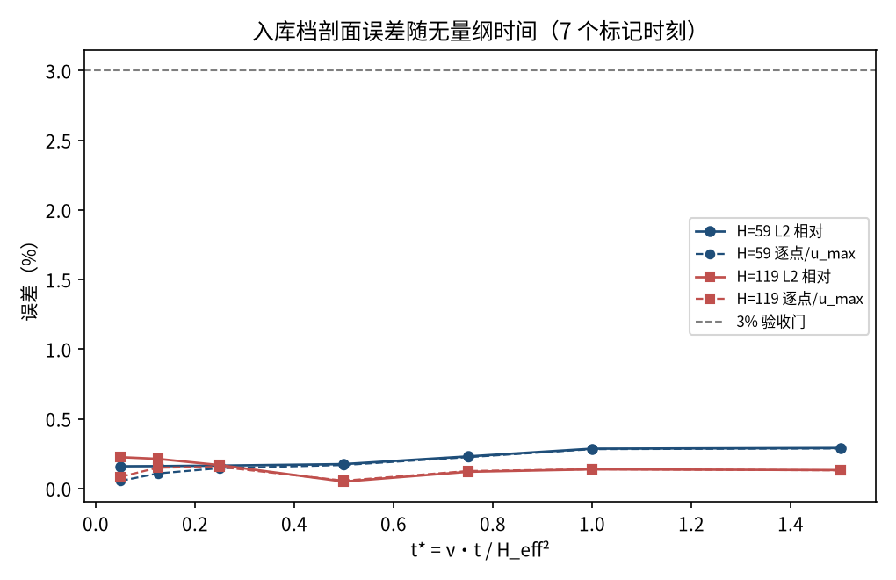
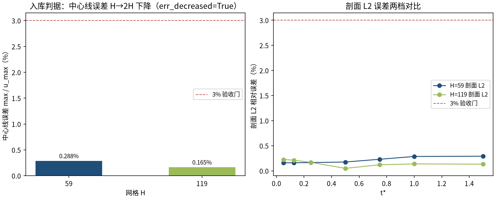

# 启动 Poiseuille 流：突加恒定压力梯度的通道瞬态（startup_poiseuille）

> Startup Poiseuille Flow — Suddenly Applied Pressure Gradient

**摘要** — TensorLBM D2Q9 BGK 求解器对启动 Poiseuille 流 Fourier 级数瞬态解的直接验证：通道内静止流体在 t=0 突加恒定流向体力，剖面从平坦逐步演化到抛物线。入库两档网格（H=59/119）中心线误差 max 0.288% → 0.165%（单调下降），7 个 t* 标记时刻剖面 L2 / 逐点误差全部 ≤ 0.291%，远低于 3% 门，入库判定 pass = True。

## 1. Benchmark 介绍

启动 Poiseuille 流是最经典的瞬态内流基准：平面通道内流体静止，t=0 时刻突加恒定流向压力梯度（体力 a = const），剖面在粘性扩散下从 0 逐步长成抛物线 u_max·4y′(1−y′)。瞬态解为奇谐波 Fourier 级数（Pedley; Ethier & Critchley）： u(y,t) = u_max·[4ŷ(1−ŷ) − (32/π³)·Σ_{n odd}(1/n³)·sin(nπŷ)·e^(−n²π²νt/H²)]。

该解与 Womersley 构成一对互补的瞬态/周期基准：它检验从静止初始化起每一步的扩散动力学（无跳过窗口、无周期平均），是体力驱动 + 半程反弹壁面组合在非定常工况下的直接验证。t* = νt/H² 为无量纲时间，级数在 t*→0 用 Fourier 恒等式回到 u=0、t*→∞ 回到抛物线（两极限均经独立数值核查）。

实现注记（README 记录的开发教训）：全场公式的稳态部分是 4ŷ(1−ŷ) 抛物线，而常被引用的 Pedley 形式 1−(32/π³)Σ… 是中心线特例，混用会差一个抛物线形状；指数必须写成本征值形式 (nπ/H)²·νt。解析实现靠 t→0/t→∞ 两个极限与 PDE 残差归一化核查锁定。

### 物理与数学背景

一维扩散方程在恒定源项下的瞬态解（热算子模态叠加）的格子 Boltzmann 离散：D2Q9、BGK 碰撞、体力注入 + 周期流迁。

```
u(y,t) = u_max·[ 4ŷ(1−ŷ) − (32/π³)·Σ_{n odd} (1/n³)·sin(nπŷ)·e^(−n²π²νt/H²) ]
```

```
ŷ = y/H，u_max = a·H²/(8ν)，t* = ν·t/H²
```

```
t→0⁺：Fourier 恒等式使 u→0；t→∞：退回抛物线 u_max·4ŷ(1−ŷ)
```

```
级数 float64 求值，奇 n 至 999，指数裁剪 700 防下溢
```

**参考解** — 经典 Fourier 级数瞬态解（Pedley；Ethier & Critchley；Fachinotti & Le Bot）。解析实现经 t→0/t→∞ 双极限核查与归一化 PDE 残差核查。

**参考文献**

- Pedley T.J., The Fluid Mechanics of Large Blood Vessels, CUP (1980).
- Ethier C.R., Critchley S. (1985), On the use of the Womersley equation for pulsatile flow, J. Biomech. Eng.
- Fachinotti O.I., Le Bot O. (2019), On the accuracy of the start-up Poiseuille flow series solution.

## 2. 计算条件设置

正式档计算条件取自入库 scan_out/result.json（程序化注入，下同）。

| 参数 | 取值 | 说明 |
|---|---|---|
| 格子 / 碰撞 | D2Q9 / BGK | tau=0.8（nu=0.1），tensorlbm.solver.collide_bgk + stream |
| 驱动 | 恒定体力 a（t=0 突加） | a = 8·ν·u_max/H_eff² = 6.895e-06（库 _apply_body_force_2d） |
| 壁面 | 预流半程 bounce-back | f_pre[OPPOSITE] 于壁行；无滑移面 y=0.5/ny−1.5，H_eff=ny−2 |
| 网格 | H=59 / 119（ny=61/121，nx=16） | x 周期（stream 内建） |
| 定标 | u_max = 0.03 | 解析终态中心线速度（Ma=0.052） |
| 瞬态处理 | 无跳过窗口 | 瞬态本身即被测对象：t=0 静止起跑，力从第一步恒定 |
| 标记时刻 | t* = νt/H² ∈ 7 档（0.05–1.5） | 中心线每 20 步采样（t* ≥ 0.02 起） |
| 验收门 | 中心线 / 剖面 L2 / 逐点 ≤ 3% | 全部以 u_max 归一 |
| 运行设备 | GPU（入库档）；CPU（演示档） | 入库档合计约 5 分钟 |

## 3. 软件使用步骤

**环境** — Python ≥ 3.11；依赖 torch / numpy / matplotlib；仓库 src 可导入（pip install -e . 或 PYTHONPATH=<repo>/src）

**步骤 1**：获取仓库并进入根目录

```bash
git clone https://github.com/cxs503/TensorLBM.git && cd TensorLBM
```

**步骤 2**：安装/指向 tensorlbm 包

```bash
pip install -e .   # 或 export PYTHONPATH=$PWD/src
```

**步骤 3**：单档快速复现（H=59，CPU 约 1–2 分钟）

```bash
python benchmarks/verified/startup_poiseuille/run.py single 59 case.json --device cpu
```

**步骤 4**：正式两档网格收敛扫描，写出判定 result.json

```bash
python benchmarks/verified/startup_poiseuille/run.py scan scan_out --H 59 119 --device cpu
```

### 场量可视化演示脚本

非定常演化演示：与入库档同参数（H=59、tau=0.8、u_max=0.03）CPU 真跑约 20 s（52,235 步到 t*=1.5），输出 7 个 t* 标记时刻的 u(y) 剖面与中心线速度历史（每 20 步采样）；判据数字一律取自入库扫描。

```bash
python docs/benchmarks/demos/startup_poiseuille_demo.py --H 59 --tau 0.8 --umax 0.03 --out demo.npz
```

## 4. 计算结果

**表 1 入库扫描结果（两档网格）**

| 网格 | 中心线 max/u_max | 剖面 L2 max | 剖面逐点/u_max | 总步数 | 耗时 |
|---|---|---|---|---|---|
| H=59 | 0.288% | 0.291% | 0.288% | 52,235 | 67s |
| H=119 | 0.165% | 0.225% | 0.155% | 212,435 | 257s |

*来源：benchmarks/verified/startup_poiseuille/scan_out/result.json（status = VERIFIED）。中心线误差为入库判定主指标。*

## 5. 与文献 / 解析解的比较

**表 2 与解析级数解的比较（7 个标记时刻）**

| 时刻 | H=59 L2 | H=119 L2 | H=59 逐点/u_max | H=119 逐点/u_max |
|---|---|---|---|---|
| t*=0.05 | 0.160% | 0.225% | 0.055% | 0.084% |
| t*=0.125 | 0.161% | 0.213% | 0.108% | 0.150% |
| t*=0.25 | 0.165% | 0.168% | 0.146% | 0.155% |
| t*=0.5 | 0.175% | 0.050% | 0.169% | 0.056% |
| t*=0.75 | 0.230% | 0.120% | 0.225% | 0.126% |
| t*=1 | 0.286% | 0.138% | 0.283% | 0.139% |
| t*=1.5 | 0.291% | 0.133% | 0.288% | 0.131% |


*图 1 演示档（H=59）启动瞬态剖面演化：t*=0.05 时只有壁面附近被粘性扩散拖动、中心几乎静止；随 t* 增长剖面逐步长成抛物线（虚线为对应时刻的解析级数解，全程重合）。*



*图 2 演示档中心线速度 u_c/u_max 随 t* 的趋近过程：数值采样点（蓝点）与解析级数解（红线）全程吻合，最终趋近 1（终态抛物线）。*



*图 3 演示档剖面逐点误差（以 u_max 归一）：早期时刻误差集中在中心区（扩散前沿尚未到达），后期全域收敛到千分位以下。*



*图 4 入库档两网格的剖面 L2 与逐点误差随 t*：7 个标记时刻全部远低于 3% 门，H=119（红）整体低于 H=59（蓝）。*



*图 5 入库判据数字：左=中心线误差 H=59 → H=119 单调下降（0.288% → 0.165%，err_decreased = True）；右=两档剖面 L2 逐时刻对比。*

- 误差定义：中心线 max|u_c_num−u_c_ana|/u_max（t* ≥ 0.02，每 20 步采样）；剖面 L2 相对误差与逐点 max/u_max 在 t* ∈ 7 档标记时刻。验收门全部 3%。
- 库缺口如实记录（与 Womersley 同款）：solver.py 无公开 D2Q9 体力入口（用库自用通道驱动函数 _apply_body_force_2d）；库壁面函数全程 BB 在本 case 误差约 4 倍且收敛更慢（H=29 实测 1.27% vs 半程范式 0.08%），沿用 verified/poiseuille_2d 预流半程 BB 范式。
- 本案例为直接观测量对解析解（无任何模型修正或重标定），符合严格入库标准。

## 6. 复现说明

```bash
python benchmarks/verified/startup_poiseuille/run.py scan scan_out --H 59 119 --device cpu
```

**预期结果** — 中心线误差 0.288% → 0.165%（单调下降，全部 ≤3%，passed=True）；剖面 L2 max：H=59 0.291% / H=119 0.225%

**参考耗时** — 入库档合计约 5 分钟（GPU 实测；CPU 演示档 H=59 约 20 s）

**入库位置** — `benchmarks/verified/startup_poiseuille`

---

*本教程由 TensorLBM benchmark 档案自动生成，判据数字均取自入库 `result.json` 机器档案；演示图为缩短时长的可视化档，定量结论以存档扫描为准。*
