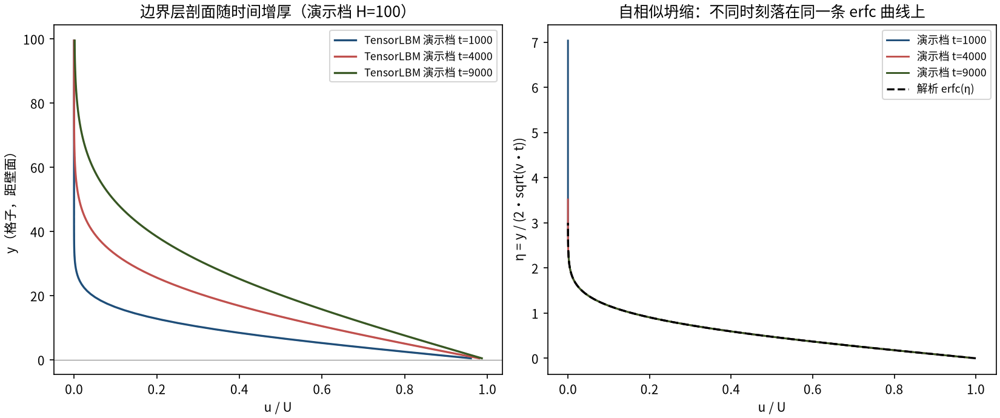
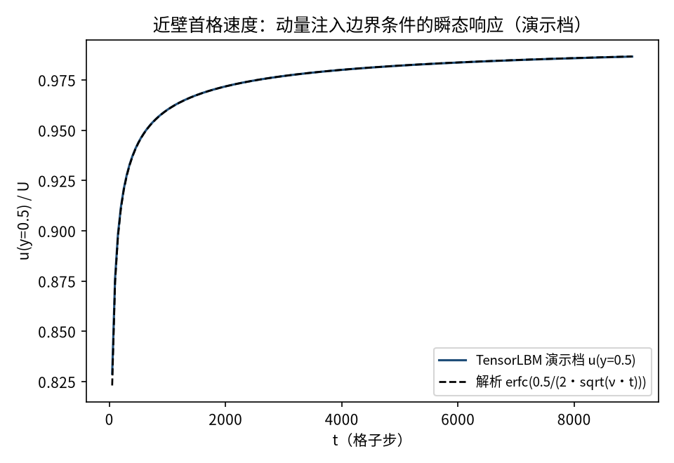
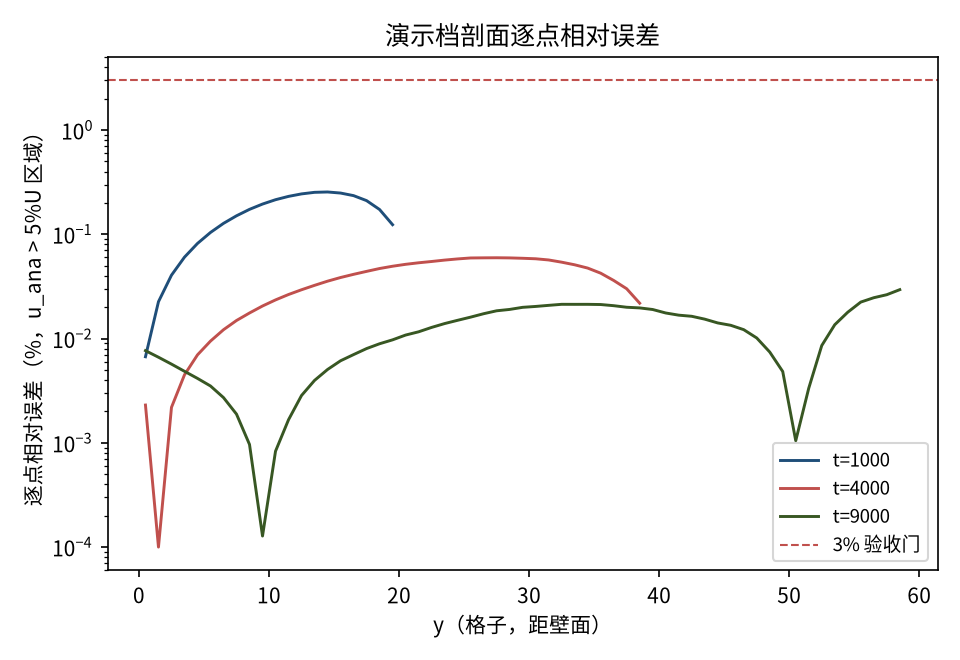
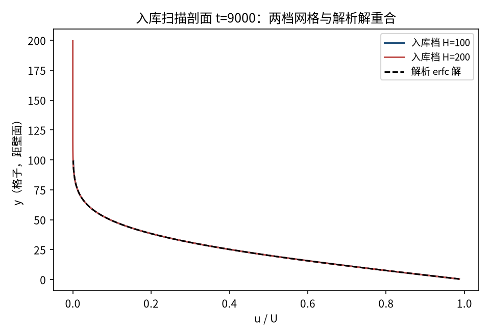
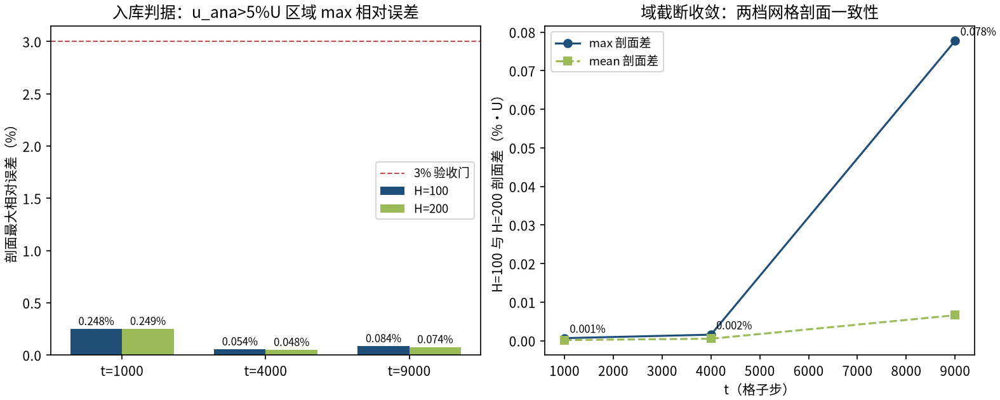

# Stokes 第一问题：平板突然起动的边界层增长（erfc 解）（stokes_first）

> Stokes First Problem — Suddenly Started Plate (erfc Solution)

**摘要** — TensorLBM D2Q9 BGK 求解器对 Stokes 第一问题（Rayleigh 问题）时变解析解的直接验证：下壁 t=0 突然以 U=0.05 运动，剖面 u(y,t)=U·erfc(y/(2·sqrt(νt)))。入库两档网格（H=100/200）三个时刻（t=1000/4000/9000）最大相对误差max 相对误差 H=100：0.248% / 0.054% / 0.084%；全部远低于 3% 门，两档剖面差 ≤ 0.078%·U（域截断收敛），入库判定 pass = True。

## 1. Benchmark 介绍

Stokes 第一问题（又称 Rayleigh 问题）是粘性扩散最基础的非定常基准：半无限静止流体中，y=0 处无限平板在 t=0 突然以恒速 U 沿 x 运动，流场仅依赖 (y, t)，满足一维扩散方程 ∂u/∂t = ν∂²u/∂y²，解析解为误差函数补形式 u = U·erfc(y/(2·sqrt(νt)))。

该解是 LBM 时变边界层的标准验证：它同时检验数值粘度是否等于 (τ−0.5)/3、扩散传播速度是否正确、以及移动壁动量注入边界条件的瞬态响应。边界层厚度 δ = sqrt(ν·t) 随时间增厚，不同时刻的剖面按 η = y/(2·sqrt(νt)) 坍缩到同一条 erfc 曲线（自相似性）。

工程要点（入库前的关键诊断）：erfc 解是半无限域解，有限域必须满足 H ≳ 4·delta 才能忽略顶边界。无滑移顶壁在 4δ>H 时产生域截断误差（H=100、tau=0.8、t=9000 时达 10.5%）；本案例采用 tau=0.65（ν=0.05，t=9000 时 δ=21.2、4δ=85<H=100）并以上壁自由滑移镜面反射实现应力自由远场，消除截断误差后以两档网格收敛入库。

### 物理与数学背景

一维扩散方程（Navier–Stokes 在本问题下的精确退化形式）的格子 Boltzmann 离散：D2Q9 格子、BGK 碰撞、x 向周期流迁。

```
u(y,t) = U · erfc( y / (2·sqrt(ν·t)) )
```

```
ν = (τ − 1/2)/3，t 为格子步数
```

```
边界层厚度 δ = sqrt(ν·t)；自相似变量 η = y/(2·sqrt(νt))
```

```
移动壁半程反弹：f_new[opp(i)] = f_pre[i] − 2·w_i·ρ_w·(c_i·u_w)/cs²
```

**参考解** — Stokes (1851) 第一问题 erfc 解；见 Krüger et al., The Lattice Boltzmann Method 解析解章节及 Batchelor §4.3。

**参考文献**

- Stokes G.G. (1851), On the effect of the internal friction of fluids on the motion of pendulums, Trans. Camb. Phil. Soc. 9.
- Krüger A. et al., The Lattice Boltzmann Method, Springer (2017), analytic solutions for unsteady flows.
- Batchelor G.K., An Introduction to Fluid Dynamics, §4.3.

## 2. 计算条件设置

正式档计算条件取自入库 result.json（程序化注入，下同）。

| 参数 | 取值 | 说明 |
|---|---|---|
| 格子 / 碰撞 | D2Q9 / BGK | tensorlbm.solver.collide_bgk + stream |
| 弛豫 τ / ν | 0.65 / 0.05 | ν = (τ−0.5)/3（格子单位） |
| 平板速度 U | 0.05 | Ma = U/c_s = 0.0866，压缩性误差 O(Ma²)≈0.75% |
| 边界处理 | 下壁移动半程 BB + 上壁镜面自由滑移 | pre-streaming 范式：动量注入反弹 + SPECULAR 置换 |
| 域 / 网格 | ny=H+2, nx=8；H=100/200 | x 周期（stream 内建），y 有限域 + 壁行 |
| 记录时刻 | 1000 / 4000 / 9000 | t 为格子步数 |
| 验收门 | max 相对误差 ≤ 3% | u_ana > 5%·U 区域（避免 erfc 尾部放大） |
| 运行设备 | CPU（float32） | 入库档耗时 129s + 129s |

## 3. 软件使用步骤

**环境** — Python ≥ 3.11；依赖 torch / numpy / matplotlib；仓库 src 可导入（pip install -e . 或 PYTHONPATH=<repo>/src）

**步骤 1**：获取仓库并进入根目录

```bash
git clone https://github.com/cxs503/TensorLBM.git && cd TensorLBM
```

**步骤 2**：安装/指向 tensorlbm 包

```bash
pip install -e .   # 或 export PYTHONPATH=$PWD/src
```

**步骤 3**：单档快速复现（约 2 分钟，CPU）

```bash
python benchmarks/verified/stokes_first_problem/run.py single 100 case_H100.json --tau 0.65 --U 0.05 --device cpu
```

**步骤 4**：正式两档网格收敛扫描，写出判定 result.json

```bash
python benchmarks/verified/stokes_first_problem/run.py scan scan_out --H 100 200 --tau 0.65 --U 0.05 --device cpu
```

### 场量可视化演示脚本

非定常演化演示：与入库档完全同参数（H=100、tau=0.65、U=0.05）的 CPU 真跑（4 s），输出三个时刻的 u(y) 剖面与近壁首格速度历史；判据数字一律取自入库扫描，演示档用于可视化时间演化。

```bash
python docs/benchmarks/demos/stokes_first_demo.py --H 100 --tau 0.65 --U 0.05 --out demo.npz
```

## 4. 计算结果

**表 1 入库扫描结果（两档网格 × 三时刻）**

| 时刻 | δ=sqrt(νt) | H=100 max 相对误差 | H=200 max 相对误差 | 两档剖面差 |
|---|---|---|---|---|
| t=1000 | 7.07 | 0.248% | 0.249% | 0.001%·U |
| t=4000 | 14.14 | 0.054% | 0.048% | 0.002%·U |
| t=9000 | 21.21 | 0.084% | 0.074% | 0.078%·U |

*来源：benchmarks/verified/stokes_first_problem/result.json（status = VERIFIED）。误差口径：u_ana > 5%·U 区域的逐点相对误差最大值。*



*图 1 演示档（H=100，与入库档同参数）剖面时间演化：左=三个时刻的 u(y) 剖面（实线 TensorLBM，虚线解析 erfc 解）；右=按 η=y/(2·sqrt(νt)) 归一后三个时刻坍缩到同一条 erfc 曲线——扩散自相似性被数值解精确复现。*



*图 2 演示档近壁首格速度 u(y=0.5) 随时间从 0 趋向 U 的瞬态过程：移动壁动量注入边界条件（半程 BB + O(U) 修正项）与解析 erfc(0.5/(2·sqrt(νt))) 全程吻合。*



*图 3 演示档剖面逐点相对误差（对数纵轴）：全时刻全区域低于 0.3%，远低于 3% 验收门（红虚线）。*

## 5. 与文献 / 解析解的比较

**表 2 与解析解的比较及守恒诊断**

| 量 | 数值 | 说明 |
|---|---|---|
| 剖面 L2 相对误差（H=100, t=9000） | 0.00035 | 全剖面归一化 L2 |
| max 绝对误差 / U（H=100, t=9000） | 0.0649% | 绝对量口径（与 3% 相对门互补） |
| 近壁首格 u(y=0.5)（H=100, t=9000） | 0.04933 | 解析 erfc(0.5/(2·sqrt(νt)))·U = 0.04934 |
| 顶行速度 u_top（H=100, t=9000） | 7.80e-05 | 解析 4.55e-05（自由滑移远场下残余极小） |
| 质量漂移 / 有限性 | 9.918e-03% / finite=True | H=200：1.032e-02% / finite=True |



*图 4 入库档 t=9000 剖面：H=100 与 H=200 两档网格（实线）与解析 erfc 解（虚线）在画图分辨率下重合。*



*图 5 入库判据数字：左=三时刻两档网格最大相对误差（3% 门内，且 H 加倍不劣化，converged = True）；右=两档剖面最大/平均差（%·U），域截断随网格加密一致收敛。*

- 误差定义：u_ana > 5%·U 区域的逐点相对误差 max_y |u_num−u_ana|/u_ana（erfc 尾部u_ana→0 会放大除零，先掩模）；验收门 3% 且两档网格收敛。
- 入库参数 tau=0.65 的选择依据半无限域截断判据 H ≳ 4·delta（详见 README 诊断表：tau=0.8 时 H=100 截断误差 10.5%，H=200 或 tau=0.65 后降至 0.1% 以下）。
- 本案例为直接观测量对解析解（无任何模型修正或重标定），符合严格入库标准。

## 6. 复现说明

```bash
python benchmarks/verified/stokes_first_problem/run.py scan scan_out --H 100 200 --tau 0.65 --U 0.05 --device cpu
```

**预期结果** — max 相对误差 H=100：0.248% / 0.054% / 0.084%；H=200：0.249% / 0.048% / 0.074%（全部 ≤3%，converged=True，passed=True）

**参考耗时** — 约 258 s 合计（入库档 CPU 实测）

**入库位置** — `benchmarks/verified/stokes_first_problem`

---

*本教程由 TensorLBM benchmark 档案自动生成，判据数字均取自入库 `result.json` 机器档案；演示图为缩短时长的可视化档，定量结论以存档扫描为准。*
