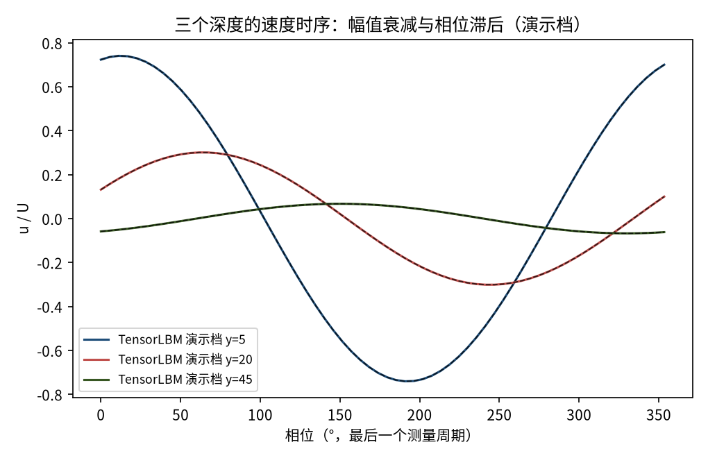
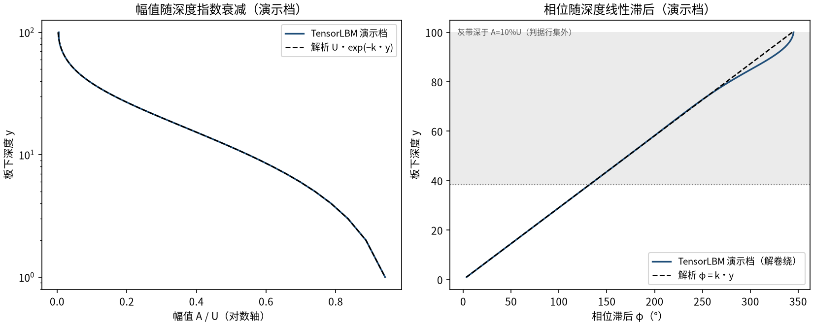
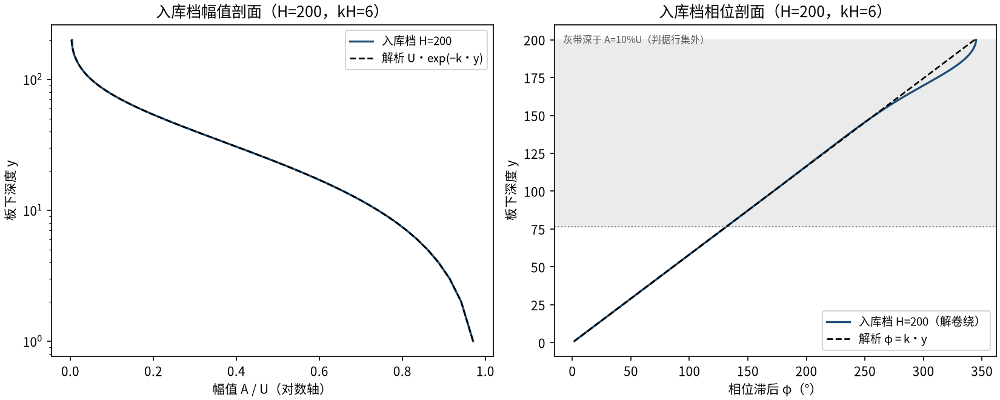
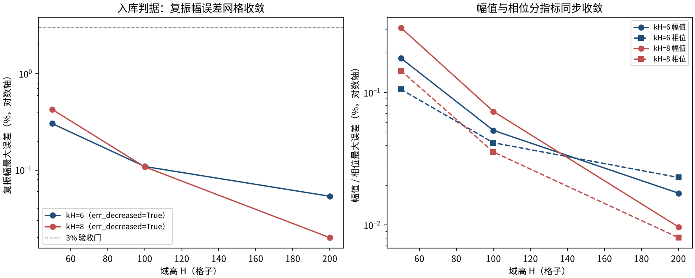

# Stokes 第二问题：振荡平板的受迫振荡边界层（stokes_second）

> Stokes Second Problem — Oscillating Plate (Stokes Layer)

**摘要** — TensorLBM D2Q9 BGK 求解器对 Stokes 第二问题稳态周期解析解的直接验证：平板在自身平面内以 u=U·cos(ωt) 谐波振荡，流体速度 u(y,t)=U·e^(−ky)·cos(ωt−ky)，k=sqrt(ω/2ν)。入库6 配置（kH=6/8 × H=50/100/200）复振幅最大误差 0.425%（最粗档）→ 0.020%（最细档），全部远低于 3% 门，两条 kH 线三档网格严格单调收敛（err_decreased = True），入库判定 pass = True。

## 1. Benchmark 介绍

Stokes 第二问题是振荡边界层的经典基准：半无限流体中无限平板以 u_w(t)=U·cos(ωt) 在自身平面内谐波振荡。稳态周期解析解（Batchelor；Landau–Lifshitz §24）为 u(y,t) = U·e^(−ky)·cos(ωt−ky)，k = sqrt(ω/(2ν))：幅值随深度指数衰减、相位线性滞后，皆由单一穿透波数 k 决定。

该解同时检验时变边界条件、周期稳态的到达过程与幅值/相位两个独立观测通道，是脉动流（Womersley 族）的前置验证。物理上它就是血管/流动管道中的 Stokes 层。

本案例的核心工程发现：远场边界必须取自由滑移（镜面反射）。无滑移远壁会污染这族物理的衰减尾部——同 k 深域对照显示壁在 6 个衰减长度时误差 2.65%、18 个衰减长度时 0.064%（40 倍消失），且该误差对 (H, τ) 细化均不可再细化（2.4–3.4% 地板）；换自由滑移远场后H=50 粗网格误差即降至 0.303% 并正常随加密收敛。

### 物理与数学背景

一维扩散方程的谐波受迫稳态解（Stokes 层）的格子 Boltzmann 离散：D2Q9、BGK 碰撞、x 向周期流迁。

```
u(y,t) = U · exp(−k·y) · cos(ω·t − k·y)
```

```
k = sqrt(ω / (2ν))，ν = (τ − 1/2)/3，Ma = U·sqrt(3)
```

```
测量：phasor 解调 U(y) = (2/N)·Σ u(y,t)·e^(−iωt)，A=|U|，φ=−arg U
```

```
复振幅误差 = max |U_num/U_ana − 1|（A_ana ≥ 10%U 行集）
```

**参考解** — Batchelor §4.3；Landau & Lifshitz §24 稳态周期解。深度自板节点起算：y(row) = (ny−1) − row（Zou/He 在边界节点规定速度）。

**参考文献**

- Batchelor G.K., An Introduction to Fluid Dynamics, §4.3 (Stokes layer).
- Landau L.D., Lifshitz E.M., Fluid Mechanics, §24.
- Zou Q., He X. (1997), On pressure and velocity boundary conditions for the lattice Boltzmann BGK model, Phys. Fluids 9, 1591-1598.

## 2. 计算条件设置

正式档计算条件取自入库 scan_out/result.json（程序化注入，下同）。

| 参数 | 取值 | 说明 |
|---|---|---|
| 格子 / 碰撞 | D2Q9 / BGK | tau=0.8（ν=0.1），tensorlbm.solver.collide_bgk + stream |
| 振荡板速度 | u_lid(t)=U·cos(ωt)，U=0.05 | Ma = U·sqrt(3) ≈ 0.087 |
| 平板边界 | 顶行 Zou/He 移动盖 | tensorlbm.lid_driven_cavity.zou_he_moving_lid，每步时变标量 |
| 远场边界 | 底行自由滑移镜面反射 | SPECULAR 置换（无滑移远壁会造成 ~2.7% 不可细化地板，见 README 证据链） |
| 网格 | H=50/100/200 × nx=8 | kH = k·H = 6 / 8 两条扫描线，k = kH/H |
| 瞬态处理 | 跳过 10–17 个整周期后测 4 个整周期 | phasor 解调只在完整周期上进行 |
| 验收门 | 幅值/相位/复振幅 max 误差 ≤ 3% | 行集：A_ana ≥ 10%U；相位另加 φ_ana ≥ 1 rad |
| 运行设备 | GPU（入库档）；CPU（演示档） | 入库档 6 配置合计约 23 分钟 |

## 3. 软件使用步骤

**环境** — Python ≥ 3.11；依赖 torch / numpy / matplotlib；仓库 src 可导入（pip install -e . 或 PYTHONPATH=<repo>/src）

**步骤 1**：获取仓库并进入根目录

```bash
git clone https://github.com/cxs503/TensorLBM.git && cd TensorLBM
```

**步骤 2**：安装/指向 tensorlbm 包

```bash
pip install -e .   # 或 export PYTHONPATH=$PWD/src
```

**步骤 3**：单配置快速复现（H=100 kH=6，CPU 约 1 分钟）

```bash
python benchmarks/verified/stokes_second_problem/run.py single 100 6 case.json --device cpu
```

**步骤 4**：正式 6 配置网格收敛扫描，写出判定 result.json

```bash
python benchmarks/verified/stokes_second_problem/run.py scan scan_out --H 50 100 200 --kH 6 8 --device cpu
```

### 场量可视化演示脚本

非定常演化演示：与入库档同参数（H=100、kH=6、tau=0.8）CPU 真跑约 51 s（122,178 步 = 跳过 87,270 + 测量 4 个整周期），输出 8 相位瞬时剖面、幅值/相位剖面（phasor 解调）与三深度一个周期内的速度时序；判据数字一律取自入库扫描。

```bash
python docs/benchmarks/demos/stokes_second_demo.py --H 100 --kH 6 --tau 0.8 --U 0.05 --out demo.npz
```

## 4. 计算结果

**表 1 入库扫描结果（kH × H 共 6 配置）**

| 扫描线 | 网格 | 幅值 max | 相位 max（rel；abs） | 复振幅 max | 总步数 |
|---|---|---|---|---|---|
| kH=6 | H=50 | 0.182% | 0.106%（0.14°） | 0.303% | 30,548 |
| kH=6 | H=100 | 0.052% | 0.042%（0.05°） | 0.109% | 122,178 |
| kH=6 | H=200 | 0.017% | 0.023%（0.03°） | 0.053% | 488,698 |
| kH=8 | H=50 | 0.310% | 0.147%（0.17°） | 0.425% | 25,767 |
| kH=8 | H=100 | 0.072% | 0.036%（0.05°） | 0.108% | 103,089 |
| kH=8 | H=200 | 0.010% | 0.008%（0.01°） | 0.020% | 412,335 |

*来源：benchmarks/verified/stokes_second_problem/scan_out/result.json（status = VERIFIED）。复振幅误差为入库判定主指标。*

## 5. 与文献 / 解析解的比较

**表 2 与解析解的比较及边界诊断**

| 量 | 数值 | 说明 |
|---|---|---|
| 最差配置（6 档中） | kH=8 / H=50 | 幅值 0.310%，相位 0.147%（0.17°），复振幅 0.425% |
| 最好配置（6 档中） | kH=8 / H=200 | 幅值 0.010%，相位 0.008%（0.01°），复振幅 0.020% |
| 边界行诊断（H=100, kH=6） | 板行幅值比 1.00004 | 远场行幅值 0.0047·U（应≈0） |
| 质量漂移（最差档） | 0.369% | Zou/He 盖在边界节点调节密度，非严格守恒（cavity 机制已知性质） |
| 掩模行数（H=100, kH=6） | 幅值 38 行 / 相位 22 行 | 先验固定掩模，各网格一致 |


*图 1 演示档（H=100，kH=6）一个周期内 8 个相位的瞬时速度剖面（实线）与解析解（虚线）：幅值指数衰减与相位滞后逐相位吻合。*



*图 2 演示档三个深度（板下 5/20/45 格）一个周期内的速度时序（实线）与解析解（虚线）：浅处幅值大、深处幅值小且相位明显滞后。*



*图 3 演示档 phasor 解调结果：左=幅值随深度指数衰减（对数轴上为直线，与 U·exp(−k·y) 重合）；右=相位滞后随深度线性增长（斜率 k，360° 解卷绕并对齐解析支路显示；灰带深于 A=10%U，不入判据行集）。*



*图 4 入库档 H=200（kH=6）幅值与相位剖面：四十年格的衰减动态范围内数值与解析解在双轴上重合（相位按 360° 解卷绕并对齐解析支路显示；灰带深于 A=10%U 判据截止，深处相位仅作形态展示）。*



*图 5 入库判据数字：左=复振幅误差沿两条 kH 线随 H 单调下降（每档加密降约 2.5–5×，全部 ≤3% 门内）；右=幅值/相位分指标同步收敛。*

- 误差定义：复振幅 max |U_num/U_ana − 1|（行集 A_ana ≥ 10%U）；相位相对误差另要求 φ_ana ≥ 1 rad（板附近解析滞后 →0 处相对相位无意义）；绝对相位误差按度报告。
- 跳过窗口协议：startup 瞬态按 skip = max(10, ceil(8·tau_diff/T)) 个整周期跳过（tau_diff = H²/(π²ν)，实测 skip ≈ 8.6 个 e-fold，残量 ~e^-8.6），测量恰为 4 个整周期；跳过窗口逐配置记录于 case json。
- 本案例为直接观测量对解析解（无任何模型修正或重标定），符合严格入库标准。

## 6. 复现说明

```bash
python benchmarks/verified/stokes_second_problem/run.py scan scan_out --H 50 100 200 --kH 6 8 --device cpu
```

**预期结果** — 复振幅 max：kH=6 线 0.303% → 0.109% → 0.053%；kH=8 线 0.425% → 0.108% → 0.020%（单调下降，全部 ≤3%，passed=True）

**参考耗时** — 入库档 6 配置合计约 3 分钟（GPU 实测；CPU 演示档 H=100 约 51 s）

**入库位置** — `benchmarks/verified/stokes_second_problem`

---

*本教程由 TensorLBM benchmark 档案自动生成，判据数字均取自入库 `result.json` 机器档案；演示图为缩短时长的可视化档，定量结论以存档扫描为准。*
