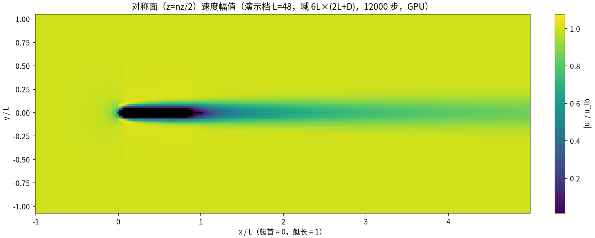
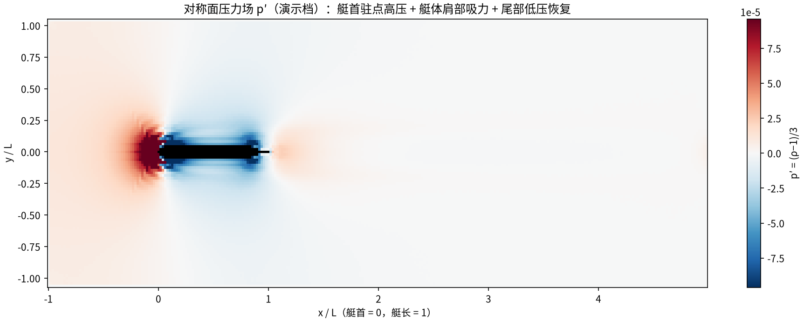
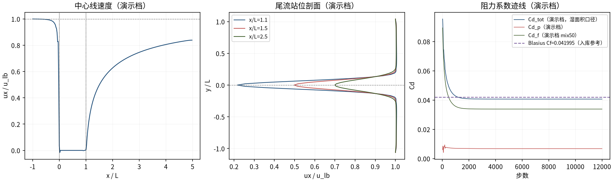
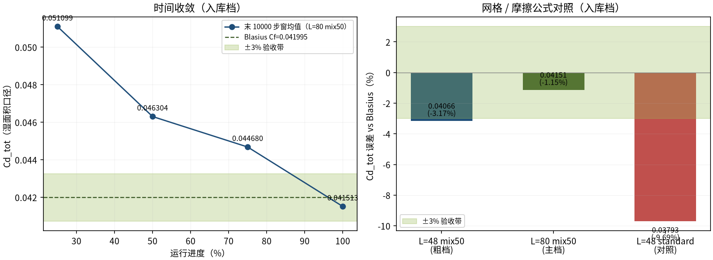

# DARPA SUBOFF 裸艇体 Re=1000：总阻力 Blasius 验证（suboff_re1000）

> DARPA SUBOFF Bare Hull at Re=1000: Total Drag vs Blasius

**摘要** — TensorLBM D3Q19 MRT 求解器经 GeneralSimEngine（PARAMETRIC_SUBOFF）在 DARPA SUBOFF 裸艇体 Re=1000 上对 Blasius 层流平板摩擦系数的验证：主档 L=80（480×169×169，13.71M 胞）真实模拟（无外推）Cd_tot=0.04151（-1.15%），final-field 重算 0.04142（-1.36%），末窗均值单调收敛、网格趋势 L=48 -3.17% → L=80 -1.15%（入库 verified = True，2026-09-29）。

## 1. Benchmark 介绍

DARPA SUBOFF 裸艇体（L=4.356 m、D=0.508 m、L/D=8.57）零攻角均匀来流是潜体阻力的标准几何。Re=1000 为层流范畴，阻力以体壁摩擦为主（本档实测摩擦份额 86.6%），因此采用 Blasius 层流平板摩擦系数作参考、湿面积 S=πDL 归一——这是本库 Re=1000 基准族的统一口径。求解完全走 GeneralSimEngine 共性入口：几何、单位换算、掩码、域、远场 BC 与测力链全部由库模块承担。

参考口径裁定（入库 reference.note 全文存档）：benchmarks/TODO.md 中 B6 的「Ct=0.004（实验）」实为 AFF-8 全尺寸 Re=2e6 总阻力系数（src/tensorlbm/suboff_reference_data.py），不适用于 Re=1000；本 benchmark 统一使用 Blasius 0.041995 口径——历史同口径结果的误差即在此框架内度量。

摩擦公式是达标关键（入库 history_note 存档演化）：体壁摩擦的离散求和有两个界——standard（近壁单元求和，下界）与 faces（voxel 楼梯逐面剪切，上界；纯几何面/体比 +49% 只在真实流场部分实现）。mix50 = 0.5·standard + 0.5·faces 取两界中点。standard 公式在 final-field 同场重算 Cd_tot=0.03785（-9.86%，系统性低估），mix50 修到 -1.36%。测力口径的选择与披露是本案例的方法学要点。

### 物理与数学背景

不可压 Navier–Stokes 方程的三维格子 Boltzmann 离散：D3Q19 格子、MRT 碰撞、half-way bounce-back 壁、拉格朗日流迁；整步链 lbm_step_correct（collide → NoDynamics → BB → stream → far_field_bc_3d）+ 周期性质量修正。

```
Re = u·L/ν = 1000（L=艇长 4.356 m；u=1e-3 m/s、ν=4.356e-06 m²/s）
```

```
Blasius 层流平板：Cf = 1.328/√Re（湿面积 S = π·D·L 归一）
```

```
u_lb=0.05（Ma 限幅单位换算）；ν_lb = u_lb·L_cells/Re → τ = 3·ν_lb + 0.5（L=80 → 0.512）
```

```
Cd_f 离散求和两界：standard（近壁单元，下界）与 faces（楼梯逐面，上界）→ mix50 = 0.5·standard + 0.5·faces（中点）
```

```
Cd_tot = Cd_p + Cd_f；引擎默认迎风面积归一在后处理按 rescale = dpS_front/dpS_wet = 0.029155 重标到湿面积口径
```

**参考解** — Blasius Cf = 1.328/√1000 = 0.041995（Dennis & Chang 类层流平板摩擦律；湿面积 πDL 归一）。不适用：AFF-8 全尺寸 Re=2e6 实验总阻力（~0.004 量级）。

**参考文献**

- Blasius H. (1908), Grenzschichten in Flüssigkeiten mit kleiner Reibung（层流平板摩擦律 Cf = 1.328/√Re）.
- Groves N.C., Huang T.T., Chang M.S. (1989), Geometric characteristics of DARPA SUBOFF models, DTNSRDC/SHD-1298-01（DARPA SUBOFF 几何族）.
- Ladd A.J.C. (1994), Numerical simulations of particulate suspensions via a discretized Boltzmann equation. Part I, J. Fluid Mech. 271, 285-309（动量交换测力）.

## 2. 计算条件设置

正式档计算条件取自入库 result.json（程序化注入，下同）。

| 参数 | 取值 | 说明 |
|---|---|---|
| 问题 | DARPA SUBOFF 裸艇体 Re=1000 总阻力（摩擦+压差） | L=4.356 m、D=0.508 m、L/D=8.57、零攻角均匀来流（层流） |
| 引擎入口 | GeneralSimEngine（PARAMETRIC_SUBOFF） | 几何/单位换算/掩码/域一站构建；suboff_length/radius 参数化 |
| 物理 / 单位 | Re=1000；u_lb=0.05、ν_lb(L80)=0.004、τ(L80)=0.512 | u=1e-3 m/s、ν=4.356e-06 m²/s；Ma 限幅单位换算（τ=3ν+0.5） |
| 网格（主档） | L=80 → 480×169×169（13.71M 胞） | solid 4304、近壁 1928；流向 6L（1L 上游+4L 下游）、侧向 2L+D |
| 碰撞 | D3Q19 MRT | Re≈1000 显式 MRT（无 Smagorinsky 人工黏性） |
| 壁面 | half-way bounce-back | Re<10000 自动 BB（WallTreatment.AUTO） |
| 步进链 | lbm_step_correct + far_field_bc_3d | collide→NoDynamics→BB→stream→BC；质量修正每 200 步 |
| 测力 | 压差+摩擦积分（mix50，p0=near_wall） | extrap='none'；frontal→wetted 重标定 0.029155 |
| 步数 / 采样 | 12000 步；力采样间隔 10 步 | 判据窗 = 末 10000 步（1000 样本）平均 |

## 3. 软件使用步骤

**环境** — Python ≥ 3.11；依赖 torch / numpy / matplotlib；仓库 src 可导入（pip install -e . 或 PYTHONPATH=<repo>/src）

**步骤 1**：获取仓库并进入根目录

```bash
git clone https://github.com/cxs503/TensorLBM.git && cd TensorLBM
```

**步骤 2**：安装/指向 tensorlbm 包

```bash
pip install -e .   # 或 export PYTHONPATH=$PWD/src
```

**步骤 3**：主档复现（L=80 mix50，13.71M 胞；GPU 数小时量级）

```bash
python benchmarks/verified/suboff_re1000/run.py --resolution 80 --steps 12000 --device cuda:0 --collision mrt --friction mix50 --compile-mode default --out results_e2e_suboff_L80_mix50
```

**步骤 4**：粗网格对照档（L=48；standard 公式对照把 --friction 换 standard 即可）

```bash
python benchmarks/verified/suboff_re1000/run.py --resolution 48 --steps 20000 --device cuda:0 --collision mrt --friction mix50 --out results_e2e_suboff_L48_mix50
```

### 场量可视化演示脚本

对称面场量可视化演示：与正式档同一组库入口（GeneralSimEngine PARAMETRIC_SUBOFF，lbm_step_correct 整步链+ mix50 测力），降分辨率到 L=48（=入库粗网格档；主档 L=80）、12000 步、力采样间隔 20 步，GPU 约 93 s（7.8 ms/步）；输出对称面（z=nz/2）|u|/p′ 云图、尾流剖面与 Cd 迹线。演示档 Cd_tot_demo=0.04066 与入库 L=48 档 0.04066 同量级（该档入库判据 -3.17% 为粗网格离散误差），仅用于展示流场结构；定量判据一律取入库扫描。

```bash
python docs/benchmarks/demos/suboff_re1000_demo.py --resolution 48 --steps 12000 --out demo.npz
```

## 4. 计算结果

**表 1 主档结果（L=80 mix50，真实模拟无外推）**

| 量 | 值 | 说明 |
|---|---|---|
| Cd_p（压差） | 0.00556 | drag_pressure_integration（extrap=none，p0=near_wall） |
| Cd_f（摩擦，mix50） | 0.03596 | drag_friction_integration；摩擦占 Cd_tot 86.6% |
| Cd_tot（判据窗均值） | 0.04151 | 末 10000 步窗口平均（主判据） |
| 误差 vs Blasius | -1.15% | 参考 Cf=0.041995（验收 \|err\|≤3%） |
| Cd_tot（末 500 样本窗） | 0.04143 | 稳健性副窗（同样达标） |
| final-field 重算 Cd_tot（mix50） | 0.04142 | 收敛场独立重算，误差 -1.36% |
| 判定 | pass = True | max \|err\| = 1.36% ≤ 3%（2026-09-29 入库） |

*来源：benchmarks/verified/suboff_re1000/result.json（verified = True，2026-09-29；域名 B6_suboff_re1000）。*



*图 1 演示档（L=48，域 6L×(2L+D)，12000 步，GPU）对称面速度幅值云图：艇首驻点减速、艇体肩部加速、尾部边界层/尾流亏损区清晰（黑色 silhouette 为艇体掩码）。*



*图 2 演示档对称面压力场 p′ 云图：艇首驻点高压、前体肩部吸力峰与尾部压力恢复——压差阻力分量（Cd_p）的物理来源（入库主档 Cd_p=0.00556）。*



*图 3 演示档尾流与阻力迹线：左=中心线 ux（艇体上方加速、尾部亏损缓慢恢复）；中=尾流站位剖面 ux(y)（亏损随下游展宽衰减）；右=Cd_tot/Cd_p/Cd_f 迹线对入库 Blasius 参考 0.041995（紫虚线）——演示档收敛到 Cd_demo=0.04066，与入库 L=48 档同量级。*

## 5. 与文献 / 解析解的比较

**表 2 网格 / 摩擦公式对照（入库三档）**

| 配置 | Cd_tot | 误差 vs Blasius | 判定/说明 |
|---|---|---|---|
| L=80 mix50（主档） | 0.04151 | -1.15% | 480x169x169（13.71M 胞）×12000 步——PASS（<3%） |
| L=48 mix50（粗档） | 0.04066 | -3.17% | 288x102x102×20000 步——艇半径仅 ~2.8 格，略超 3%（离散误差） |
| L=48 standard（对照） | 0.03793 | -9.69% | 同 288x102x102，摩擦公式换 standard——系统性低估 （量化 mix50 修复量） |

**表 3 与 Blasius 参考的收敛判定（入库档）**

| 量 | 值 | 说明 |
|---|---|---|
| 时间收敛 | 0.051099 → 0.046304 → 0.044680 → 0.041513 | 末 10000 步窗均值单调下降并趋平（末段漂移 <4e-6/窗，入库 convergence.note） |
| 网格趋势 | L=48 -3.17% → L=80 -1.15% | 误差随分辨率下降（入库 convergence_with_grid.err_decreased=True）：真收敛方案 |
| standard 公式对照 | 0.03785（-9.86%） | final-field 同场重算：standard 求和是摩擦下界，系统性低估 ~10% |
| p0 口径稳健性 | shift < 0.07% | p0 far_field/domain_avg/inlet 切换对 Cd_tot_mix50 的影响（入库 final_field_recheck.note） |
| 参考口径 | Blasius Cf = 1.328/√Re = 0.041995 | 湿面积 S=πDL 归一（Re=1000 族统一口径） |
| 验收 | \|err\| ≤ 3% 且时间收敛窗均值 | 窗口 -1.15% / final-field -1.36% 双口径达标（pass=True） |



*图 4 收敛证据（入库判据数字）：左=末 10000 步窗均值 0.051099→0.041513 单调下降进入 ±3% 验收带；右=网格/公式对照——mix50 L=48 -3.17% → L=80 -1.15%（真收敛趋势），standard 对照 -9.69% 显示 mix50 修复量。*

- mix50 摩擦口径（入库 friction_formula_note 程序化存档）：mix50 = 0.5·cd_f_standard + 0.5·cd_f_faces——standard（近壁单元和）是下界、faces（voxel 楼梯逐面）是上界；纯几何面/体增益 +49%（uniform-field faces/standard = 1.396）只部分实现于真实流场（actual 1.221），故取两界中点。公式选择已全文披露于 result.json。
- 参考口径：Blasius 0.041995 = 本库 Re=1000 基准族统一口径（湿面积 πDL 归一）；TODO.md 的 Ct≈0.004 属 AFF-8 全尺寸 Re=2e6 实验，不适用（入库 reference.note 存档裁定）。
- 时间与网格双收敛：末 10000 步窗均值单调下降且末段漂移 <4e-6/窗（12000 步即时间收敛）；网格趋势误差随分辨率下降（err_decreased=True），与真收敛方案一致。final-field 重算与窗口均值互验（入库 final_field_recheck）。
- 演示档口径：L=48（=入库粗档）+ 12000 步（主档 12000），Cd_demo 仅用于流场可视化与量级互证；定量结论以入库 L=80 主档为准。
- 入库工件 = run.py + result.json；大文件 final_field.pt（约 1.8 GB）不入库（入库 artifacts 字段存档其路径与用途）。

## 6. 复现说明

```bash
python benchmarks/verified/suboff_re1000/run.py --resolution 80 --steps 12000 --device cuda:0 --collision mrt --friction mix50 --compile-mode default --out results_e2e_suboff_L80_mix50
```

**预期结果** — Cd_tot=0.04151（-1.15%）窗口均值 / 0.04142（-1.36%）final-field 重算；Cd_p=0.00556、Cd_f=0.03596（均 ≤3%）

**参考耗时** — 入库实测（SDAA sdaa:2）3.38 h（1015.5 ms/步）；演示档 GPU 93 s（L=48、12000 步、7.8 ms/步）

**入库位置** — `benchmarks/verified/suboff_re1000`

---

*本教程由 TensorLBM benchmark 档案自动生成，判据数字均取自入库 `result.json` 机器档案；演示图为缩短时长的可视化档，定量结论以存档扫描为准。*
