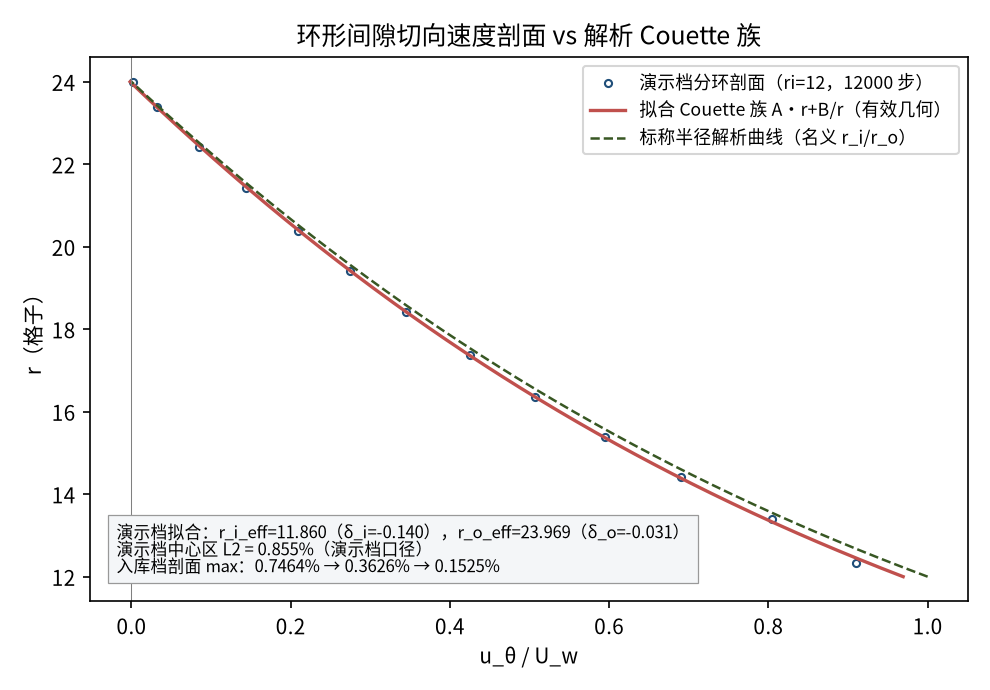
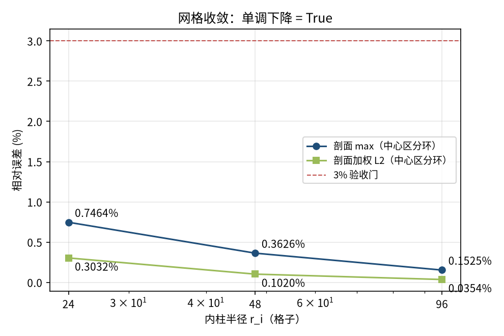
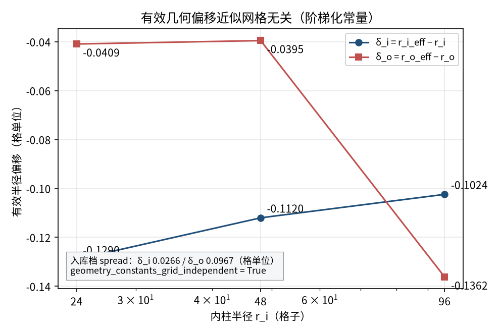
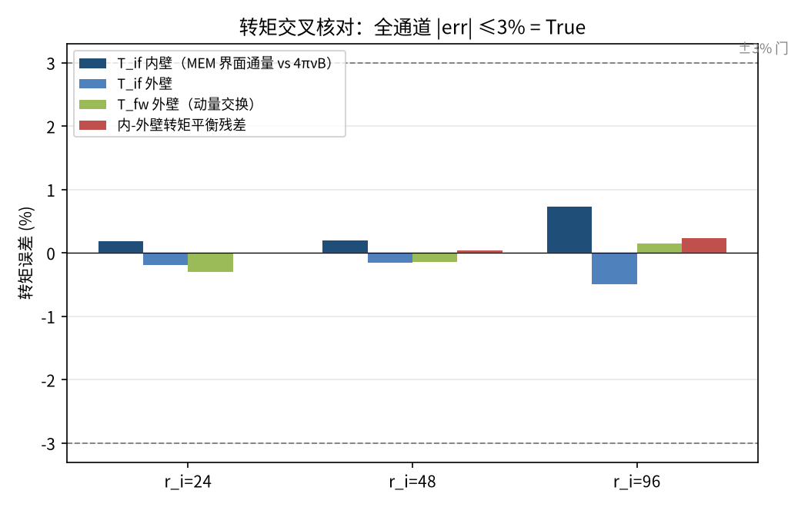

# Taylor-Couette 环形流（内柱旋转）— Couette 族解析剖面与转矩验证（taylor_couette）

> Taylor-Couette Annular Flow (Analytic A·r+B/r Profile and Torque)

**摘要** — TensorLBM D2Q9 BGK 求解器在 η=0.5、Re_i=20 环形 Taylor-Couette 层流上的直接验证：Ladd 动壁反弹（内柱）+ 静态反弹（外柱），三档网格 r_i=24/48/96 分环剖面 max 误差 0.7464% → 0.3626% → 0.1525% 单调下降；有效半径偏移 δ_i/δ_o 为近似网格无关常量（spread 0.0266/0.0967 格）；转矩四通道交叉核对全部 |err|≤3%（all_within_3pct = True），入库判定 verified。

## 1. Benchmark 介绍

Taylor-Couette 流是内外同心圆柱间的旋转剪切流：内柱以 ω_i 旋转、外柱静止，稳态层流解属于精确的 Couette 族 u_θ(r) = A·r + B/r，两个常数由内外壁无滑移条件确定。它同时检验曲面壁面处理（阶梯化圆边界）、旋转动壁动量注入与角动量守恒，是比平面 Couette 更严格的曲面基准。

本案例的关键测试点是阶梯化圆壁的有效几何：LBM 反弹壁落在离散的阶梯半径上，而不是名义的 r_i/r_o。验证口径不是把误差扫进地毯，而是用中心区分环剖面对精确 Couette 族做 2 参数加权最小二乘拟合，反解出有效半径 r_i_eff=√(B/(ω_i−A))、r_o_eff=√(−B/A)，再以拟合解为参考报告剖面误差；同时披露不对几何修正的标称半径口径（2.13% → 0.44%）与逐胞口径（≈2.9% → 1.2%）。

第二组独立证据是转矩：由拟合常数 B 直接给出解析转矩 M = 4πνB（宽圆柱极限），与动量交换法（MEM）界面通量、动壁反弹链路（moving_wall_linkwise_me_force_torque）两条独立数值通道交叉核对，内-外壁转矩平衡残差 +0.2317%（最细档），全部通道 |err|≤3%。

Re_i=20 远低于该 η 的临界值 Re_crit≈68（Esser & Grossmann 1996），流动为稳定的纯环流（无 Taylor 涡）；全部边界与碰撞走 tensorlbm 公共入口（rotating_cylinder / solver / d2q9 / boundaries），extrap: none。

### 物理与数学背景

极坐标下稳态环流的 Navier–Stokes 径向动量与角动量方程的格子 Boltzmann 离散：D2Q9、BGK 单弛豫、周期流迁；内柱 Ladd 动壁反弹 + 外柱静态反弹（外框全固体，流迁周期等效于壁内环绕）。

```
u_θ(r) = A·r + B/r（精确 Couette 族；A、B 由壁面无滑移确定）
```

```
r_o_eff = √(−B/A)（由 u_θ(r_o_eff)=0）；r_i_eff = √(B/(ω_i−A))（由 u_θ(r_i_eff)=ω_i·r_i_eff）
```

```
U_max_ref = ω_i·r_i_eff（内壁线速度，拟合解在该点恒等）
```

```
ω_i = Re_i·ν/r_i²；Re_i = ω_i·r_i²/ν = 20；ν = (τ−0.5)/3 = 0.05
```

```
解析转矩 M = 4πνB（单位轴向长度，B 取拟合值）
```

```
动壁反弹：f_new[q] = f_pre[opp(q)] + 2·w_q·ρ·(c_q·u_wall)/cs²，u_wall=ω_i×(x−c)
```

**参考解** — Couette 族 u=A·r+B/r 为稳态轴对称环流教科书精确解（Kundu & Cohen）；有效阶梯半径把无滑移面钉在楼梯边界上，δ_i、δ_o 近似网格无关。

**参考文献**

- Kundu, P.K. & Cohen, I.M. Fluid Mechanics (轴对称环流精确解章节).
- Ladd, A.J.C. (1994). Numerical simulations of particulate suspensions. J. Fluid Mech. 271, 285-339.
- Esser, A. & Grossmann, S. (1996). Analytic expression for Taylor-Couette stability boundary. Phys. Fluids 8, 1814-1819.
- Ginzburg, I. & d'Humières, D. (1996). Lattice Boltzmann methods for circular Couette flow. Phys. Rev. E 54, 4676.
- Krüger, T. et al. (2017). The Lattice Boltzmann Method (曲面边界与动量交换法章节). Springer.

## 2. 计算条件设置

正式档计算条件取自入库 result.json（程序化注入，下同）。

| 参数 | 取值 | 说明 |
|---|---|---|
| 格子 / 碰撞 | D2Q9 / bgk | tensorlbm.solver.collide_bgk + stream |
| 问题 | 环形 Taylor-Couette层流 η=0.5 | 内柱旋转 / 外柱静止，Re_i=20 << Re_crit≈68（无湍流转变），轴向周期 2D r-θ 平面 |
| 边界处理 | Ladd 动壁反弹 + 静态反弹 | 内柱 d≤r_i：moving_wall_bounce_back（整障碍掩码，u_w 来自 rotating_wall_velocity）；外柱 d>r_o：bounce_back_cells；流迁周期（外框全固体） |
| τ / ν | 0.65 / 0.15 | ν=(τ−0.5)/3=0.05 |
| 网格（正式档） | n=99 / n=195 / n=387 | r_i=24, r_o=48 / r_i=48, r_o=96 / r_i=96, r_o=192 |
| ω_i（正式档） | 1.736e-03 / 4.340e-04 / 1.085e-04 | ω_i = Re_i·ν/r_i²（Re_i≡20 三档同） |
| 步数（正式档） | 40400 / 161400 / 645200 | ≈4–4 倍 t_gap=(r_o−r_i)²/ν 判稳 |
| 比较口径 | 有效阶梯半径 | 中心区分环 2 参数加权 LSQ 拟合 A·r+B/r；r_o_eff=√(−B/A)，r_i_eff=√(B/(ω_i−A)) |
| 外推 | none | 真实模拟直接观测量对解析族 |

## 3. 软件使用步骤

**环境** — Python ≥ 3.11；依赖 torch / numpy / matplotlib；仓库 src 可导入（pip install -e . 或 PYTHONPATH=<repo>/src）

**步骤 1**：获取仓库并进入根目录

```bash
git clone https://github.com/cxs503/TensorLBM.git && cd TensorLBM
```

**步骤 2**：安装/指向 tensorlbm 包

```bash
pip install -e .   # 或 export PYTHONPATH=$PWD/src
```

**步骤 3**：单档快速复现（r_i=24，CPU，数分钟）

```bash
python benchmarks/verified/taylor_couette/run.py single case_ri24.json --ri 24 --device cpu
```

**步骤 4**：正式三档网格收敛扫描（与入库 run 同参数；最细档 CPU 约数小时，建议 GPU）

```bash
python benchmarks/verified/taylor_couette/run.py scan --out-dir tc_scan --ri 24 48 96 --device cpu
```

### 场量可视化演示脚本

场量可视化演示：与正式档同一组库入口，网格缩至 ri=12（n=51，正式档 n=99/195/387），从静止 spin-up 12000 步（≈4.2 t_gap）+ 末 400 步时间平均，CPU 约 7 s；输出切向速度场/矢量场/分环剖面/有效几何拟合。判据数字一律取自入库存档，演示档仅用于可视化。

```bash
python docs/benchmarks/demos/taylor_couette_demo.py --ri 12 --steps 12000 --out demo.npz
```

## 4. 计算结果

**表 1 入库三档扫描结果（r_i=24/48/96，η=0.5，Re_i=20）**

| 量 | r_i=24 | r_i=48 | r_i=96 |
|---|---|---|---|
| 网格 n（=2r_o+3） | 99 | 195 | 387 |
| 步数（判稳） | 40400 | 161400 | 645200 |
| ω_i | 1.736e-03 | 4.340e-04 | 1.085e-04 |
| r_i_eff（拟合） | 23.8710 | 47.8880 | 95.8976 |
| r_o_eff（拟合） | 47.9591 | 95.9605 | 191.8638 |
| δ_i（格单位） | -0.1290 | -0.1120 | -0.1024 |
| δ_o（格单位） | -0.0409 | -0.0395 | -0.1362 |
| 剖面 max（中心区，判据量） | 0.7464% | 0.3626% | 0.1525% |
| 剖面加权 L2（中心区，判据量） | 0.3032% | 0.1020% | 0.0354% |
| 逐胞 max（披露） | 2.8759% | 1.8507% | 1.2441% |
| 稳态 | 是 | 是 | 是 |

*来源：benchmarks/verified/taylor_couette/result.json（verdict = verified，passed_3pct_and_converged = True）。*


*图 1 演示档（n=51 × 12000 步，CPU）场量：左=切向速度 u_θ/U_w（内壁 U_w=ω_i·r_i=0.0833，正值为逆时针；外缘平滑归零）；右=速度幅值与矢量场（环形流线，矢量沿切向）。黑色虚线为名义内外柱半径。*

## 5. 与文献 / 解析解的比较

**表 2 与解析 Couette 族的比较（入库判据 + 披露口径）**

| 量 | r_i=24 | r_i=48 | r_i=96 | 参考/说明 |
|---|---|---|---|---|
| 剖面 max 收敛 | 0.7464% | 0.3626% | 0.1525% | 单调下降 = True，≤3% 门 |
| 剖面 L2 收敛 | 0.3032% | 0.1020% | 0.0354% | 分环角向平均口径 |
| 形状归一（bin 口径，披露） | 1.0138% | 0.4672% | 0.2121% | 以拟合剖面峰值归一（消除幅值偏移） |
| 标称半径 max（披露） | 2.1333% | 0.9740% | 0.4350% | 不对阶梯几何修正的口径（2.13% → 0.44%） |
| 中点半径误差（vs 标称） | -1.6053% | -0.7061% | -0.4451% | 间隙中点 u 值对名义半径解析解 |

*主判据 = 有效几何口径的分环剖面 max 与加权 L2（中心区 u_ref > 0.2·U_max_ref）；形状归一/标称半径/中点为披露项。*

**表 3 转矩交叉核对（vs 解析 M = 4πνB）**

| 通道 | r_i=24 | r_i=48 | r_i=96 | 说明 |
|---|---|---|---|---|
| T_if 内壁（MEM 界面通量） | +0.1851% | +0.2028% | +0.7272% | vs 解析 M = 4πνB（B 取拟合值） |
| T_if 外壁 | -0.1893% | -0.1593% | -0.4954% | 同上，外柱表面 |
| T_fw 外壁（动量交换） | -0.3050% | -0.1479% | +0.1493% | moving_wall_linkwise_me_force_torque 独立通道 |
| 内-外壁转矩平衡残差 | -0.0042% | +0.0434% | +0.2317% | 角动量守恒自检 |
| M_ref（4πνB，格单位） | 0.8263 | 0.8328 | 0.8358 | 拟合 B 直接给出的参考转矩 |
| 全通道 \|err\|≤3% | True | 转矩交叉核对判据 |



*图 2 环形间隙切向速度剖面：蓝圈=演示档分环剖面，红实线=有效几何拟合 Couette 族（演示档 δ_i=-0.140、δ_o=-0.031，与入库档 δ_i≈−0.10~−0.13 同号同量级），绿虚线=标称半径解析曲线（楼梯边界残余偏移可见）；演示档中心区 L2 = 0.855%。文本框含入库三档剖面 max。*



*图 3 网格收敛（入库判据数字）：剖面 max 0.7464% → 0.3626% → 0.1525%，L2 0.3032% → 0.1020% → 0.0354%，单调下降 = True，远低于 3% 门。*



*图 4 有效半径偏移 δ_i=r_i_eff−r_i、δ_o=r_o_eff−r_o（入库档）：随网格细化近似为常量（spread 0.0266 / 0.0967 格单位），说明楼梯化边界几何偏移是系统性的、可被拟合口径吸收。*



*图 5 转矩交叉核对（入库档）：MEM 界面通量（内/外壁）、动量交换动壁链路与内-外壁平衡残差四组通道全部落在 ±3% 门内（all_within_3pct = True）。*

- 主判据（有效几何口径）验收：剖面 max 与加权 L2 ≤3% 且网格细化单调下降——入库三档 0.75%/0.30% → 0.15%/0.04% 全部满足。
- 披露口径不参与判决但全部给出：标称半径 max（2.13%→0.44%）、逐胞 max（2.88%→1.24%）、形状归一（1.01%→0.21%）、中点半径误差（−1.61%→−0.45%）。
- 楼梯边界的有效几何偏移 δ 用拟合反解而非外部输入；其网格无关性（geometry_constants_grid_independent = True）是拟合口径合法性的证据。
- 真实模拟（extrap: none），直接观测量（速度场/转矩）对解析解与解析导出量。

## 6. 复现说明

```bash
python benchmarks/verified/taylor_couette/run.py scan --out-dir tc_scan --ri 24 48 96 --device cpu
```

**预期结果** — 剖面 max 0.7464% → 0.3626% → 0.1525%；L2 0.3032% → 0.1020% → 0.0354%；δ_i spread 0.0266；转矩全通道 ≤3% = True；verdict = verified

**参考耗时** — 三档合计 CPU 约数小时（步数 40400 / 161400 / 645200；GPU 更快）

**入库位置** — `benchmarks/verified/taylor_couette`

---

*本教程由 TensorLBM benchmark 档案自动生成，判据数字均取自入库 `result.json` 机器档案；演示图为缩短时长的可视化档，定量结论以存档扫描为准。*
