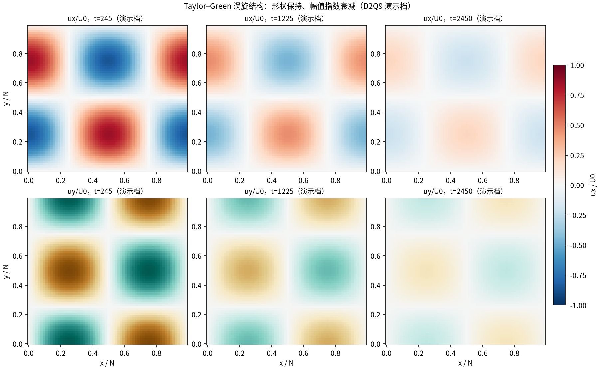
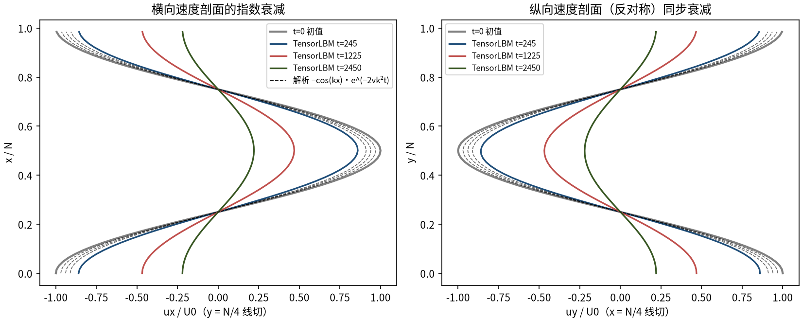
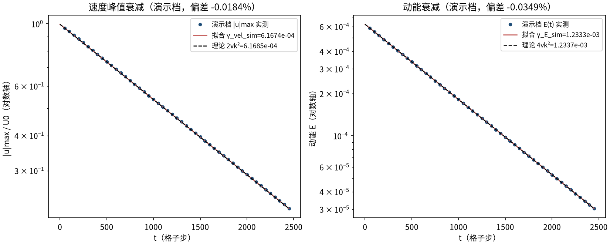
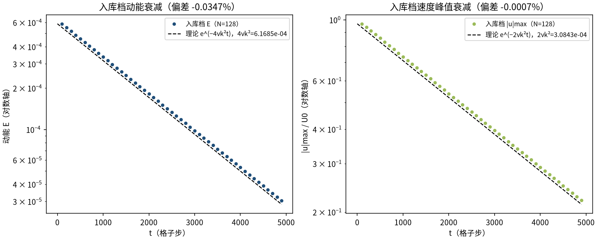
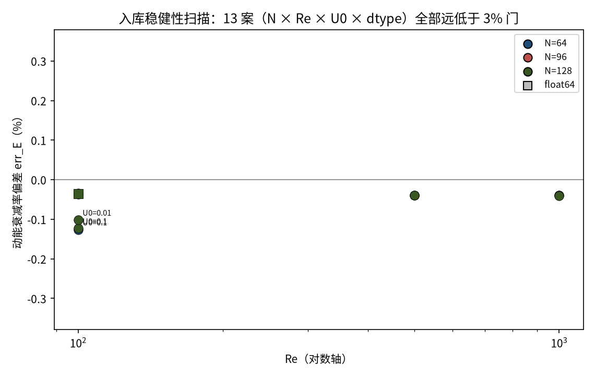

# 二维 Taylor–Green 涡：经典衰减基准（taylor_green_2d）

> 2D Taylor–Green Vortex — Classic Decay Benchmark

**摘要** — TensorLBM D2Q9 BGK 求解器对 2D Taylor–Green 涡的验证：它是不可压 NS 方程的精确解，涡旋结构保持不变、动能按 e^(−4νk²t) 指数衰减。入库主案例（N=128、Re=100）动能衰减率偏差 -0.0347%、速度衰减率偏差 -0.0007%、拟合 R²=0.999999617；另附 13 案稳健性扫描（N × Re × U0 × dtype）全部远低于 3% 门。

## 1. Benchmark 介绍

Taylor–Green 涡是 LBM 验证文献中最经典的衰减基准：周期域上四涡卷初始条件（ux=−U0·cos(kx)·sin(ky)，uy=+U0·sin(kx)·cos(ky)）。二维 TG 是不可压Navier–Stokes 方程的精确解——涡旋形状严格保持，速度按 e^(−2νk²t)、动能按e^(−4νk²t) 指数衰减，衰减率只由 ν 和 k=2π/N 决定，是标定 BGK 等效粘度的标准测试。

它与本库另外两个耗散基准构成谱系：shear_wave_decay 是单 Fourier 模 (0,k)（|κ|²=k²，无非线性项）；2D TG 是交叉模 (±k,±k)（|κ|²=2k²，非线性项恰好被对称性抵消）；3D TG 则不再是精确解（涡拉伸登场，见 taylor_green_3d 教程）。三者覆盖了从纯线性到弱非线性的粘性耗散标定。

本案例为直接观测量对解析解：u_max 与动能 E 由 macroscopic 每 100 步实测记录，衰减率用最小二乘拟合 ln E 与 ln u_max 的斜率，无任何模型修正或重标定。

### 物理与数学背景

不可压 Navier–Stokes 的 Taylor–Green 精确解的格子 Boltzmann 离散：D2Q9、BGK 碰撞、全周期流迁。

```
ux = −U0·cos(kx)·sin(ky)·e^(−2νk²t)，uy = +U0·sin(kx)·cos(ky)·e^(−2νk²t)
```

```
k = 2π/N；波矢 (±k,±k) ⇒ |κ|² = 2k²
```

```
γ_vel = 2νk²（速度衰减率）；γ_E = 4νk²（动能衰减率）
```

```
ν = (τ − 1/2)/3（格子单位）；Re = u0·N/ν
```

**参考解** — Taylor–Green 精确衰减解（不可压 NS 少数精确解之一）；LBM 粘性/衰减率标准验证（Krüger et al. validation 章节）。

**参考文献**

- Taylor G.I., Green A.E. (1937), Mechanism of the production of small eddies from large ones, Proc. R. Soc. A 158, 499.
- Krüger A. et al., The Lattice Boltzmann Method, Springer (2017), validation: Taylor–Green vortex.

## 2. 计算条件设置

正式档计算条件取自入库 result.json（程序化注入，下同）。

| 参数 | 取值 | 说明 |
|---|---|---|
| 格子 / 碰撞 | D2Q9 / BGK | tensorlbm.solver.collide_bgk + stream（周期 wrap，步序 stream→collide） |
| 初始场 | ux=−U0·cos(kx)·sin(ky)，uy=+U0·sin(kx)·cos(ky)，ρ=1 | f = equilibrium(ρ, ux, uy)（feq 初值） |
| 波数 / 粘度 | k=2π/N=0.04909，ν=0.064（τ=0.692 ⇒ ν=(τ−1/2)/3） | 波矢 (±k,±k)，\|κ\|²=2k² |
| 雷诺数 / 幅值 | Re=u0·N/ν=100，U0=0.05 | Ma≈0.087，压缩性误差 O(Ma²) |
| 步数 | 4900（auto：E/E0→e⁻³），每 100 步记录 | 入库档 N=128 |
| 精度 / 设备 | float32 / cpu | 入库档耗时 6.6s |
| 验收门 | \|γ_sim/γ_theory − 1\| ≤ 3%，指数性 R² ≥ 0.999 | 速度 2νk² + 动能 4νk² 双口径 |

## 3. 软件使用步骤

**环境** — Python ≥ 3.11；依赖 torch / numpy / matplotlib；仓库 src 可导入（pip install -e . 或 PYTHONPATH=<repo>/src）

**步骤 1**：获取仓库并进入根目录

```bash
git clone https://github.com/cxs503/TensorLBM.git && cd TensorLBM
```

**步骤 2**：安装/指向 tensorlbm 包

```bash
pip install -e .   # 或 export PYTHONPATH=$PWD/src
```

**步骤 3**：单案例快速复现（N=64，CPU 秒级）

```bash
python benchmarks/verified/taylor_green_2d/run.py --n 64 --re 100
```

**步骤 4**：完整主案例（N=128、Re=100，默认即入库档），写出 result.json

```bash
python benchmarks/verified/taylor_green_2d/run.py --device cpu
```

**步骤 5**：稳健性扫描（N × Re × U0 × dtype 共 13 案），写出 scan_summary.json

```bash
python benchmarks/verified/taylor_green_2d/run.py --scan
```

### 场量可视化演示脚本

非定常演化演示：N=64、Re=100（与入库扫描同族参数）CPU 真跑约 2.0 s（2450 步），输出三时刻 ux/uy 场快照、N/4 线切剖面与能量/峰值速度历史；判据数字一律取自入库扫描。

```bash
python docs/benchmarks/demos/taylor_green_2d_demo.py --n 64 --re 100 --u0 0.05 --out demo.npz
```

## 4. 计算结果

**表 1 入库主案例判据（N=128，Re=100）**

| 案例 | γ_E_sim | γ_E_theory=4νk² | err_E | γ_vel_sim | γ_vel_theory=2νk² | err_vel |
|---|---|---|---|---|---|---|
| N=128 Re=100 | 6.166361e-04 | 6.168503e-04 | -0.0347% | 3.084229e-04 | 3.084251e-04 | -0.0007% |

*来源：benchmarks/verified/taylor_green_2d/result.json（R² = 0.999999617，门 3%）。*

## 5. 与文献 / 解析解的比较

**表 2 稳健性扫描全表（13 案，scan_summary.json）**

| N | Re | U0 | dtype | err_E | err_vel | R² |
|---|---|---|---|---|---|---|
| 64 | 100 | 0.05 | f32 | -0.0361% | -0.0117% | 0.9999997 |
| 64 | 500 | 0.05 | f32 | -0.0393% | -0.0192% | 0.9999996 |
| 64 | 1000 | 0.05 | f32 | -0.0399% | -0.0204% | 0.9999996 |
| 96 | 100 | 0.05 | f32 | -0.0364% | -0.0009% | 0.9999996 |
| 96 | 500 | 0.05 | f32 | -0.0391% | -0.0125% | 0.9999996 |
| 96 | 1000 | 0.05 | f32 | -0.0396% | -0.0118% | 0.9999996 |
| 128 | 100 | 0.05 | f32 | -0.0347% | -0.0007% | 0.9999996 |
| 128 | 500 | 0.05 | f32 | -0.0397% | -0.0008% | 0.9999996 |
| 128 | 1000 | 0.05 | f32 | -0.0408% | -0.0017% | 0.9999996 |
| 64 | 100 | 0.1 | f32 | -0.1263% | +0.0467% | 0.9999963 |
| 128 | 100 | 0.1 | f32 | -0.1232% | +0.0087% | 0.9999955 |
| 128 | 100 | 0.01 | f32 | -0.1019% | -0.0867% | 0.9999998 |
| 128 | 100 | 0.05 | f64 | -0.0349% | -0.0006% | 0.9999996 |

**表 3 交叉验证与守恒诊断**

| 量 | 数值 | 说明 |
|---|---|---|
| 半窗口斜率一致性 | 6.163949e-04 / 6.167298e-04 | 前后半窗拟合斜率一致 ⇒ 纯指数衰减，非拟合假象 |
| 初值实测 | u_max0=0.048354078（理论 0.05） | E0=0.0005872（理论 U0²/4=0.0006250） |
| 质量守恒 | 5.2e-05（相对漂移） | 全周期域 + BGK 守恒碰撞，49 个采样点 |
| 稳健性扫描 | 13 案 err_E ∈ [-0.1263%, -0.0347%] | N/Re/U0/dtype 全扫（含 1 案 float64），\|err\| 最大 0.1263% |
| 与剪切波基准互补 | 本案例 err 符号为负（γ_sim 略小） | shear_wave_decay 单模 (0,k) 为正：不同波矢模态的 BGK 离散修正方向不同，如实记录 |



*图 1 演示档（N=64）三时刻速度场：上排 ux/U0、下排 uy/U0。四涡卷结构随时间严格保持，仅颜色幅值指数衰减（色标固定 ±U0）。*



*图 2 演示档 N/4 线切剖面：左=y=N/4 的 ux(x) 对解析 −cos(kx)·e^(−2νk²t)（虚线）；右=x=N/4 的 uy(y) 对 +cos(ky)·e^(−2νk²t)。各时刻幅值与相位均与解析解重合。*



*图 3 演示档衰减率拟合：左=|u|max（拟合 6.1674e-04 对理论 6.1685e-04，偏差 -0.0184%）；右=动能 E（对 4νk²=1.2337e-03，偏差 -0.0349%）。*



*图 4 入库档 N=128 衰减史（程序化读取 energy_history.csv）：左=动能（偏差 -0.0347%），右=|u|max（偏差 -0.0007%），黑虚线为解析指数律。*



*图 5 入库稳健性扫描 13 案的 err_E 分布（颜色=网格 N，方块=float64）：全部落在 ±0.1263% 内，远低于 3% 验收门（扫描覆盖 Re 数量级变化、U0 敏感性与双精度检查）。*

- 误差定义：γ_sim/γ_theory − 1（速度 2νk² + 动能 4νk² 双口径），验收门 3% + 指数性 R² ≥ 0.999 + 前后半窗斜率一致。
- 测量协议：u_max 与 E 每 100 步由 macroscopic 实测记录，无任何外推/修正；float64 对照案用于排除 fp32 累加误差。
- 本案例为直接观测量对解析解（无模型修正/重标定），符合严格入库标准。

## 6. 复现说明

```bash
python benchmarks/verified/taylor_green_2d/run.py --device cpu
```

**预期结果** — err_E = -0.0347%，err_vel = -0.0007%，R² = 0.999999617（≤3% 门通过）

**参考耗时** — 约 7 s（入库档 cpu 实测）

**入库位置** — `benchmarks/verified/taylor_green_2d`

---

*本教程由 TensorLBM benchmark 档案自动生成，判据数字均取自入库 `result.json` 机器档案；演示图为缩短时长的可视化档，定量结论以存档扫描为准。*
