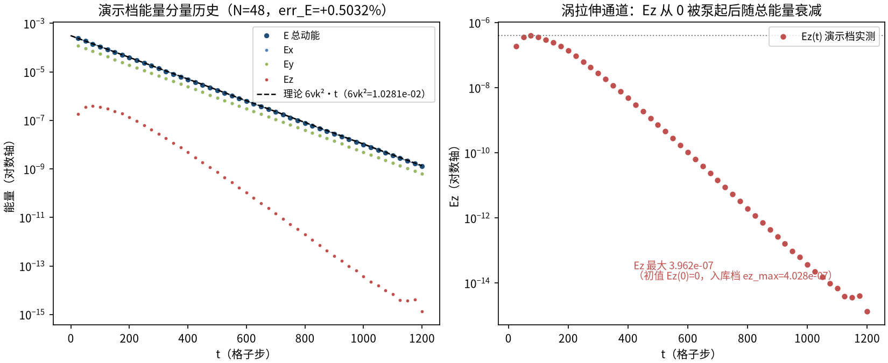
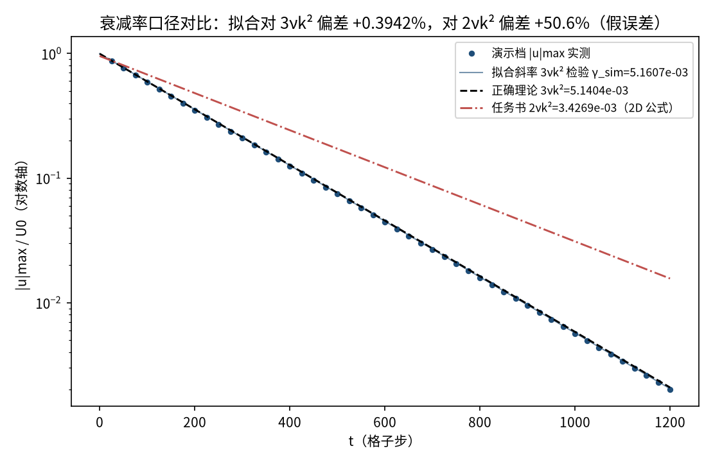
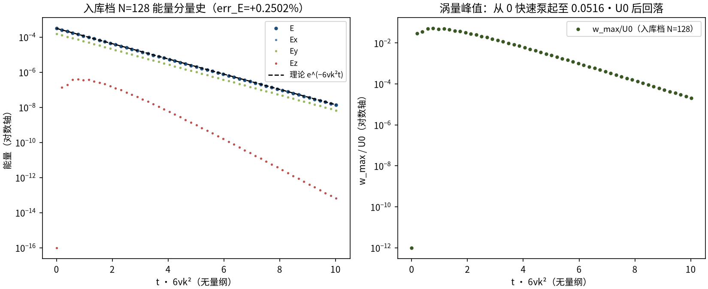
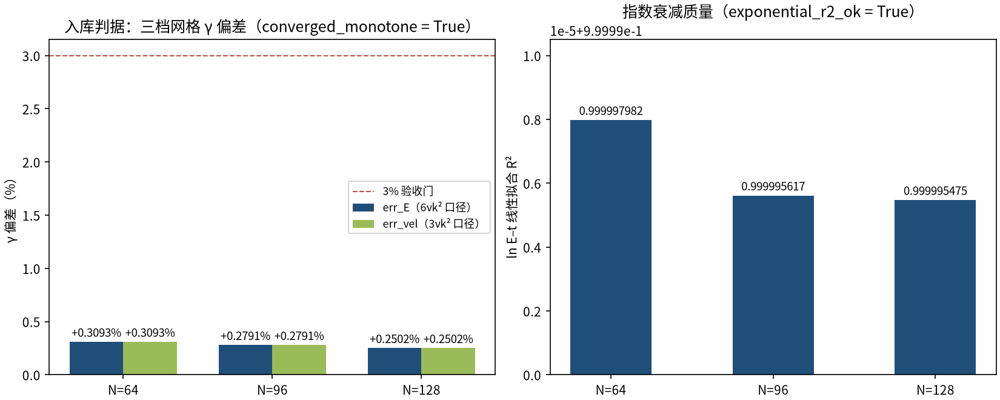

# 三维 Taylor–Green 涡：近解析衰减与涡拉伸（taylor_green_3d）

> 3D Taylor–Green Vortex — Near-Analytic Decay and Vortex Stretching

**摘要** — TensorLBM D3Q19 BGK 求解器对 3D Taylor–Green 涡的验证：波矢 (±k,±k,±k) ⇒ |κ|²=3k²，速度衰减率 3νk²、能量衰减率 6νk²。3D TG 并非 NS 精确解（涡拉伸使 w、Ez 从 0 增长），因此它是最严的衰减类基准之一。入库三档网格（N=64/96/128，Re=24）能量衰减率偏差 +0.3093% → +0.2791% → +0.2502%（单调收敛、全部远低于 3% 门，verified = True）；同时记录任务书 2D 公式误用将产生的 ≈+201% 假误差。

## 1. Benchmark 介绍

3D Taylor–Green 涡是衰减类基准里最严的一档：与 2D TG 不同，三维初值 u=(U0·sin(kx)cos(ky)cos(kz), −U0·cos(kx)sin(ky)cos(kz), 0) 不再是不可压Navier–Stokes 的精确解——非线性项的旋度部分立即驱动涡拉伸，涡量 w 与垂向能量Ez 从 0 被泵起（入库档 w_max≈0.05·U0 量级），小尺度模使能谱略微上移，因此 γ_sim 相对 6νk² 有 +0.25~0.31% 的系统性偏高（随 Re 增大而增大），这是物理而非数值缺陷，入库档如实测量、不做修正。

波矢几何是本案例的核心口径：单 Fourier 模 (±k,±k,±k) 的模长平方为 3k²，故速度衰减率 3νk²、能量衰减率 6νk²。任务书/问题清单中的 e^(−2νk²t) 是 2D TG（|κ|²=2k²）的速度衰减率——3D 直接套用会得到约 +200% 的假误差，入库档把这一口径差异作为独立诊断量（err_vs_task_formula_pct）记录在案。

本教程演示档用 N=48（同 Re=24、U0=0.05）在 CPU 上真跑约 5 分钟，同步记录分分量能量 Ex/Ey/Ez 与中平面切片；定量判据一律取自入库 result.json 的三档网格扫描。

### 物理与数学背景

3D 不可压 Navier–Stokes 的 Taylor–Green 涡的格子 Boltzmann 离散：D3Q19、BGK 碰撞、全周期流迁。

```
初值 u=(U0·sin(kx)cos(ky)cos(kz), −U0·cos(kx)sin(ky)cos(kz), 0)，k=2π/N
```

```
波矢模 (±k,±k,±k) ⇒ |κ|²=3k²
```

```
γ_vel = 3νk²（速度衰减率）；γ_E = 6νk²（能量衰减率）
```

```
ν = (τ − 1/2)/3（格子单位）；Re = u0·N/ν 固定 ⇒ ν、τ 随 N 增大
```

```
任务书 2νk² 为 2D TG 速度衰减率（|κ|²=2k²），3D 套用报 ≈+200% 假误差
```

**参考解** — Taylor–Green 类衰减律在三维波矢几何下的推广（非精确解，含涡拉伸源项）；OpenLB tgv3d 基准同款初值。

**参考文献**

- Taylor G.I., Green A.E. (1937), Proc. R. Soc. A 158, 499.
- Krüger A. et al., The Lattice Boltzmann Method, Springer (2017), validation: Taylor–Green vortex.

## 2. 计算条件设置

正式档计算条件取自入库 result.json（程序化注入，下同）。

| 参数 | 取值 | 说明 |
|---|---|---|
| 格子 / 碰撞 | D3Q19 / BGK | tensorlbm.solver3d.collide_bgk3d + stream3d（周期模运算内建，步序 stream3d→collide_bgk3d） |
| 初始场 | u=(U0·sin(kx)cos(ky)cos(kz), −U0·cos(kx)sin(ky)cos(kz), 0)，ρ=1 | OpenLB tgv3d 同款；f = equilibrium3d(ρ, ux, uy, uz) |
| 波数 / 波矢 | k=2π/N（N=64 → 0.09817） | 模态 (±k,±k,±k) ⇒ \|κ\|²=3k² |
| 雷诺数 / 粘度 | Re=u0·N/ν=24 固定 ⇒ ν 随 N 增大 | N=64: ν=0.1333, τ=0.9；N=96: τ=1.1；N=128: ν=0.2667, τ=1.3 |
| 幅值 | U0=0.05（Ma≈0.087） | 与 2D TG 案例一致，便于横向对照 |
| 步数 | N=64: 2000；N=96: 2000；N=128: 2600（auto） | 每 50 步记录能量分量与 u_max/w_max |
| 精度 / 设备 | float32 / 入库档 cuda:2（本教程演示档 CPU） | 入库档耗时 4.0s、13.6s、41.8s |
| 验收门 | \|γ_sim/γ_theory − 1\| ≤ 3% 且随 N 单调收敛 | γ_E=6νk² 与 γ_vel=3νk² 双口径；R² 指数性检查 |

## 3. 软件使用步骤

**环境** — Python ≥ 3.11；依赖 torch / numpy / matplotlib；仓库 src 可导入（pip install -e . 或 PYTHONPATH=<repo>/src）

**步骤 1**：获取仓库并进入根目录

```bash
git clone https://github.com/cxs503/TensorLBM.git && cd TensorLBM
```

**步骤 2**：安装/指向 tensorlbm 包

```bash
pip install -e .   # 或 export PYTHONPATH=$PWD/src
```

**步骤 3**：单案例快速复现（N=64，CPU 分钟级）

```bash
python benchmarks/verified/taylor_green_3d/run.py --n 64 --device cpu
```

**步骤 4**：完整三档网格 benchmark（N=64/96/128），写出判定 result.json

```bash
python benchmarks/verified/taylor_green_3d/run.py --device cpu
```

### 场量可视化演示脚本

非定常演化演示：N=48³（同 Re=24/U0=0.05）CPU 真跑约 5.3 分钟（1200 步），输出能量分量历史（Ex/Ey/Ez）、三时刻中平面切片与 |u|max 历史；err_E=+0.5032%（粗网格略高于入库档），定量判据一律取自入库扫描。

```bash
python docs/benchmarks/demos/taylor_green_3d_demo.py --n 48 --re 24 --u0 0.05 --steps 1200 --out demo.npz
```

## 4. 计算结果

**表 1 入库三档网格判据（Re=24）**

| 网格 | τ | γ_E_sim | γ_E_theory=6νk² | err_E | err_vel（3νk² 口径） | R² |
|---|---|---|---|---|---|---|
| N=64 | 0.9 | 7.734479e-03 | 7.710628e-03 | +0.3093% | +0.3093% | 0.999997982 |
| N=96 | 1.1 | 5.154767e-03 | 5.140419e-03 | +0.2791% | +0.2791% | 0.999995617 |
| N=128 | 1.3 | 3.864960e-03 | 3.855314e-03 | +0.2502% | +0.2502% | 0.999995475 |

*来源：benchmarks/verified/taylor_green_3d/result.json（converged_monotone = True，within_tol = True，verified = True）。*

## 5. 与文献 / 解析解的比较

**表 2 物理诊断与任务书公式陷阱**

| 量 | 数值 | 说明 |
|---|---|---|
| 任务书公式陷阱（N=64） | γ_task(2νk²)=2.570209e-03，对它报 +200.93% | 2νk² 是 2D TG 的速度衰减率；3D 正确口径 3νk²，套用 2D 公式产生约 +200% 假误差（仅记录，不作判据） |
| 任务书公式陷阱（N=128） | 对 2νk² 报 +200.75% | 三档网格同现 ≈+200%，证明是口径错误而非数值误差 |
| 涡拉伸强度（N=64） | w_max=2.5525e-03（5.1%·U0），ez_max=4.028e-07（ez(0)=0） | 3D TG 非 NS 精确解的直接证据：旋度通道从零被泵起 |
| 半窗口斜率一致性（N=64） | 7.755006e-03 / 7.734348e-03 | 前后半窗一致 ⇒ 伪稳态指数段拟合可靠 |
| 初值与守恒（N=64） | E0=0.0003125（理论 0.0003125） | 质量漂移 2.7e-05（相对） |
| 有效雷诺数说明 | re_eff=3.82（N=64） | 以涡尺度计的有效 Re；physics_note 记录 Re=48 时偏差升至 +1.3~1.5%（非线性增强），如实测量 |


*图 1 演示档（N=48）z=N/2 中平面切片：上排 ux/U0（结构保持、幅值衰减）；下排 uz（初值为 0，涡拉伸生成的垂向速度，色标除以 1.49e-07）。*



*图 2 演示档能量分量历史：左=E/Ex/Ey/Ez 与理论 6νk² 线（err_E=+0.5032%），Ex 与 Ey 严格相等（对称性保持）；右=Ez 单独放大——从 0 被涡拉伸泵起至 3.962e-07 后随总能量衰减（对数轴）。*



*图 3 衰减率口径对比（演示档 |u|max）：拟合斜率对正确理论 3νk² 偏差 +0.3942%；对任务书 2νk² 偏差 +50.6%——红线斜率明显偏离数据，即 ≈+200% 假误差的来源。*



*图 4 入库档 N=128（程序化读取 energy_history_N128.csv，横轴以 1/6νk² 无量纲化）：左=能量分量，E/Ex/Ey 与理论线（黑虚线）重合、Ez 高出约三个数量级仍远小于总能量（err_E=+0.2502%）；右=涡量峰值 w_max/U0 的泵起-回落曲线。*



*图 5 入库判据数字：左=三档网格 γ_E（6νk²）与 γ_vel（3νk²）偏差——+0.3093% → +0.2791% → +0.2502% 单调下降；右=ln E–t 线性拟合 R²。*

- 误差定义：γ_sim/γ_theory − 1（能量 6νk² + 速度 3νk² 双口径），验收门 3% 且随 N 单调收敛；R² 指数性检查。
- 任务书/问题清单 'e^{-2νk²t}' 是 2D TG（|κ|²=2k²）的速度衰减率；3D 场波矢 (±k,±k,±k) → |κ|²=3k²，正确对比为 γ_vel=3νk²、γ_E=6νk²。err_vs_task_formula_pct ≈ +200%（仅记录不作判据）。
- 3D TG 非 NS 精确解（2D 是）：u·∇u 的旋部分立即驱动涡拉伸，w 从 0 增长（w_max≈0.0026U0、ez_max≈4e-7@Re=24），小尺度模使 Z/E 略升 ⇒ γ_sim 略高于 6νk²（+0.25~0.31%），随 Re 增大而增大（Re=48: +1.3~1.5%）——如实测量，不修正。
- 测量协议：能量分量与 u_max/w_max 每 50 步由 macroscopic3d 实测记录，无任何外推/修正；err_vs_task_formula_pct 仅作为口径诊断量记录，不作判据。

## 6. 复现说明

```bash
python benchmarks/verified/taylor_green_3d/run.py --device cpu
```

**预期结果** — err_E：+0.3093% → +0.2791% → +0.2502%（≤3% 门、单调收敛，verified = True）

**参考耗时** — 约 59 s 合计（入库档 cuda:2 实测；CPU 复现约数十分钟）

**入库位置** — `benchmarks/verified/taylor_green_3d`

---

*本教程由 TensorLBM benchmark 档案自动生成，判据数字均取自入库 `result.json` 机器档案；演示图为缩短时长的可视化档，定量结论以存档扫描为准。*
