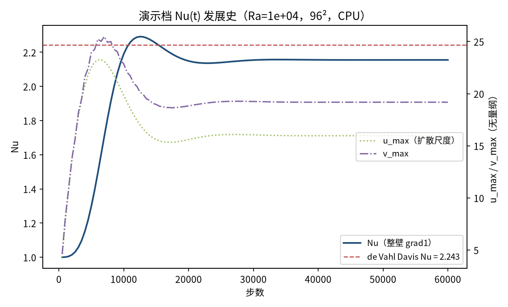
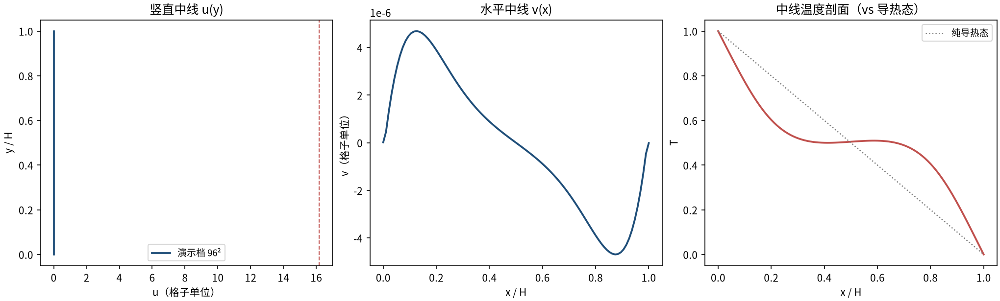
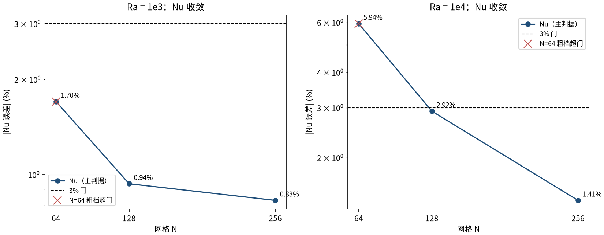
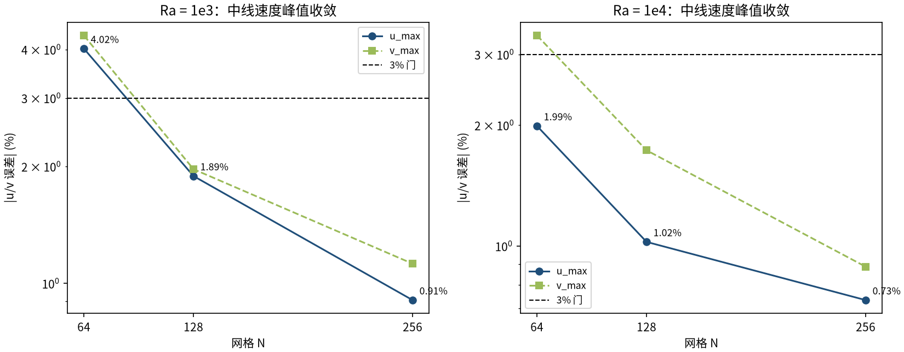

# 方腔自然对流（de Vahl Davis 基准）（thermal_cavity）

> Natural Convection in a Square Cavity (de Vahl Davis, 1983)

**摘要** — 左热右冷、上下绝热的方腔自然对流标准基准：TensorLBM 热流耦合链（D2Q9 BGK + Guo 浮力 + D2Q5 温度 + v3b 修复壁 BC）在 Ra=1e3/1e4 × N=64/128/256 六案上对 de Vahl Davis (1983) 参考解的单调收敛检验。N=128/256 四案 Nu/u_max/v_max 全部 ≤3%（最差 2.92%），六量误差全部严格单调下降；N=64 两案粗网格离散误差超 3%（最差 Nu -5.94%）——入库判决 = PARTIAL（如实区分，未凑数）。本条目同时是库 2D 温度壁 BC两层缺陷的修复验收档案（绝热泄漏 −2.15e-2/步 → 0.0 逐位）。

## 1. Benchmark 介绍

方腔自然对流是热流耦合求解器的事实标准基准：左壁等温加热、右壁等温冷却、上下绝热、四壁无滑移，浮力驱动一个顺时针环流。de Vahl Davis (1983) 用流函数-涡量法给出的 benchmark 解（Nu、u_max、v_max 到 4 位有效数字）至今仍是该问题最常用的参考。

本案例是 TensorLBM 热模块的「修复 + 重扫」双重档案：诊断发现库 2D 温度壁 BC 存在两层缺陷——(1) 全周期温度流迁 + 节点级事后覆写导致绝热壁净热泄漏（fp64 守恒预算直测 −2.15e-2 ΣT/步）；(2) 半程反弹固壁节点的垃圾宏观 u 污染温度碰撞平衡态，造成读数偏置与稳态永不达成。修复（v3b：解缠反射绝热壁 + 零和非平衡转移等温壁；v6 驱动器壁环 u 置零）后以六案基准重扫验收。

口径注记：H = N−1（等温壁位于节点上）；Nu 用库 nusselt_number mode='grad1'（壁节点−首内邻差分，整壁含角点）；u_max/v_max 为中线插值峰值、扩散尺度无量纲化（DVD 约定）。全部为稳态终场直接观测量，无拟合/外推/修正。

### 物理与数学背景

Boussinesq 近似下的热浮力流：速度场 D2Q9 BGK + Guo 格式浮力力项F = ρ·gβ·(T−T_ref)·e_y；温度场 D2Q5 BGK 被动标量（无黏性耗散项），两场经宏观速度耦合。

```
Ra = gβ·ΔT·H³ / (ν·α)，Pr = ν/α
```

```
ν = (τ−1/2)/3，α = ν/Pr，τ_T = 3α + 1/2
```

```
gβ = Ra·ν·α/H³（H = N−1 约定，与 Nu 口径一致）
```

```
Nu = ⟨∂T/∂x⟩_wall·H/ΔT（grad1：壁节点−首内邻差分）
```

**参考解** — de Vahl Davis (1983) 基准解（预注册于任何模拟数字之前，两独立来源交叉 + 控制器独立核对）：Ra=1e3 时 Nu=1.118、u_max=3.649、v_max=3.697；Ra=1e4 时 Nu=2.243、u_max=16.178、v_max=19.617。

**参考文献**

- de Vahl Davis G. (1983), Natural convection of air in a square cavity: a bench mark numerical solution, Int. J. Numer. Methods Fluids 3, 249-264.
- Guo Z., Shi B., Zheng C. (2002), A coupled lattice BGK model for the Boussinesq equations, Int. J. Numer. Methods Fluids 39, 325-342.

## 2. 计算条件设置

正式档计算条件取自入库 result.json（程序化注入，下同）。

| 参数 | 取值 | 说明 |
|---|---|---|
| 格式 | D2Q9（速度）+ D2Q5（温度） | tensorlbm.thermal 温度链 + solver 速度链（零本地物理） |
| 碰撞 | 速度 BGK + Guo 浮力；温度 BGK | τ = 0.6（ν=(τ−1/2)/3），τ_T = 3α+1/2 |
| Pr / Ra | 0.71 / 1e3 与 1e4 | 空气 Pr=0.71；α = ν/Pr，gβ = Ra·ν·α/H³ |
| 边界 | 左右等温 T=1/0，上下绝热，四壁 no-slip | apply_temperature_boundaries v3b（解缠反射绝热 + 零和非平衡转移等温）；pre-streaming 半程反弹 |
| 网格（正式档） | N = 64 / 128 / 256（六案） | H = N−1（等温壁在节点上） |
| 初场 | 线性导热态 T(x)=1−x/H，ρ=1，u=0 | 与 BC 相容的最小发展态 |
| 驱动器方案 | v6：温度碰撞前壁环 u 置零 | mask_wall_u=True（方案选择，全文披露；见档案 NOTES） |
| 稳态判据 | Nu 漂移 <1e-4/1000 步连续 3 窗 | 触发下限 floor + 验证段 max(10000, 10%·t_stop) |

## 3. 软件使用步骤

**环境** — Python ≥ 3.11；依赖 torch / numpy / matplotlib；仓库 src 可导入（pip install -e . 或 PYTHONPATH=<repo>/src）

**步骤 1**：获取仓库并进入根目录

```bash
git clone https://github.com/cxs503/TensorLBM.git && cd TensorLBM
```

**步骤 2**：安装/指向 tensorlbm 包

```bash
pip install -e .   # 或 export PYTHONPATH=$PWD/src
```

**步骤 3**：单案快速体验（N=64，CPU 数分钟；含稳态触发）

```bash
python benchmarks/verified/thermal_cavity/run.py --cases ra1e4_n64 --device cpu
```

**步骤 4**：正式六案扫描（fp32 五案 + ra1e3_n256 需 fp64，见精度注记）

```bash
python benchmarks/verified/thermal_cavity/run.py --cases all --device cuda:0 && python benchmarks/verified/thermal_cavity/run.py --cases ra1e3_n256 --dtype float64 --device cuda:0
```

### 场量可视化演示脚本

场量可视化演示：与正式档同一组库入口、同一步序（含 v6 壁环 u 置零），Ra=1e4、96²、固定 60k 步（CPU 约 9 分钟），输出温度场/速度场与 Nu、中线速度发展史。演示档终值 Nu=2.1552、u_max=15.97、v_max=19.18（参考 2.243/16.178/19.617）——网格与步数均低于正式档，数值仅供参考形态；定量结论一律取自入库六案。

```bash
python docs/benchmarks/demos/thermal_cavity_demo.py --nx 96 --ra 1e4 --steps 60000 --out demo.npz
```

## 4. 计算结果

**表 1 入库六案结果（括号内为对 DVD 参考误差）**

| 案 | 精度 | 步数 | Nu（err） | u_max（err） | v_max（err） | 判 |
|---|---|---|---|---|---|---|
| Ra=1e3 N=64 | fp32 | 37k | 1.09899 (-1.70%) | 3.5024 (-4.02%) | 3.5364 (-4.34%) | FAIL |
| Ra=1e3 N=128 | fp32 | 141k | 1.10754 (-0.94%) | 3.5801 (-1.89%) | 3.6243 (-1.97%) | PASS |
| Ra=1e3 N=256 | fp64 | 563k | 1.10873 (-0.83%) | 3.6160 (-0.91%) | 3.6555 (-1.12%) | PASS |
| Ra=1e4 N=64 | fp32 | 32k | 2.10977 (-5.94%) | 15.8561 (-1.99%) | 18.9611 (-3.34%) | FAIL |
| Ra=1e4 N=128 | fp32 | 115k | 2.17759 (-2.92%) | 16.0124 (-1.02%) | 19.2775 (-1.73%) | PASS |
| Ra=1e4 N=256 | fp32 | 458k | 2.21132 (-1.41%) | 16.0594 (-0.73%) | 19.4428 (-0.89%) | PASS |

*来源：benchmarks/verified/thermal_cavity/result.json。ra1e3_n256 用 fp64（该档 gβ=9.44e-8 使浮力步进 ~0.5 ULP(fp32)，fp32 力量化把 u_max 抬高 +10.5%/v_max +21.9%，fp64 复现 DVD 到 1%；n128 fp32 力步进 ~2.8 ULP，fp64 A/B 差 ≤0.2%）。*



*图 2 演示档发展史：Nu 从纯导热值 1 上升至 2.1552 平台（DVD 参考 2.243，红虚线）；右轴 u_max/v_max 同步爬升。演示档固定步数无稳态触发，用于观察发展过程形态。*



*图 3 演示档中线剖面：u(y) 峰值位于 y/H≈0.82 附近、v(x) 峰值位于 x/H≈0.12 附近（与 DVD 参考位置 0.823/0.119 同侧）；温度中线相对纯导热态明显被环流「抬弯」——对流输运的直接体现。*


*图 1 演示档（Ra=1e4，96²，CPU）稳态场量：左=温度场（左热右冷，等温线被顺时针环流拉成倾斜）；右=速度幅值与流线（浮力沿热壁上行、冷壁下行的单环结构，两角有微弱次级涡迹象）。*

## 5. 与文献 / 解析解的比较

**表 2 与 de Vahl Davis (1983) 参考解的比较**

| 量 | Ra=1e3 参考 | Ra=1e4 参考 | 说明 |
|---|---|---|---|
| Nu（主判据） | 1.118 | 2.243 | de Vahl Davis (1983) 基准解（预注册） |
| u_max（扩散尺度） | 3.649 | 16.178 | 参考位置 y/H = 0.813 / 0.823 |
| v_max | 3.697 | 19.617 | 参考位置 x/H = 0.178 / 0.119 |
| Nu_wall max / min（形态自检） | 1.505 / 0.692 | 3.528 / 0.586 | 热壁 Nu 分布包络（如入库 ra1e3_n256 实测 1.470 / 0.678） |
| 单调收敛（六量） | 全部严格下降 | 全部严格下降 | N=64→128→256 六量（2 Ra × Nu/u/v）全部 \|误差\| 严格下降 = True |
| 判决 | PARTIAL | PARTIAL | N=128/256 四案全过门（max 2.92%）；N=64 两案粗网格离散误差超 3%（最差 Nu -5.94%），如实 FAIL |

*N=128/256 四案全过门 = True；N=64 失败子门 = ['ra1e3_n64', 'ra1e4_n64']；判据 = per case |Nu err|,|u_max err|,|v_max err| <= 3% vs pre-registered DVD 1983 refs;……*



*图 4 Nu 误差收敛（对数纵轴，入库六案）：两 Ra 下 64→128→256 全部严格下降（Ra=1e3：1.70→0.94→0.83%；Ra=1e4：5.94→2.92→1.41%）。N=64（红叉）粗网格离散误差超 3% 门，如实判 FAIL。*



*图 5 u_max / v_max 误差收敛（入库六案）：六量（2 Ra × Nu/u/v）全部严格单调下降；N=256 档最差 1.12%。*

- 误差定义：(实测 − 参考)/参考 × 100%，对预注册 DVD 表值；验收门 |err| ≤ 3% 且 N=64→128→256 单调下降。
- 判决 PARTIAL 的含义：N=128/256 四案全过 + 六量单调收敛（满足 ≥2 档铁律）；N=64 为粗网格离散误差（物理收敛中），非库缺陷；如实报告未修饰。
- 已知残余（披露）：|Nu_hot−Nu_cold| ∝ H²（读数层二阶 u 省略），平均 Nu 不受影响；v_max(Ra=1e4) 文献有 19.617/19.643 两值（差 0.13%），取 19.617。

## 6. 复现说明

```bash
python benchmarks/verified/thermal_cavity/run.py --cases all --device cuda:0 && python benchmarks/verified/thermal_cavity/run.py --cases ra1e3_n256 --dtype float64 --device cuda:0
```

**预期结果** — 六案 |err|：N=128/256 全 ≤3%（最差 Nu 2.92%）；N=64 超门（最差 Nu 5.94%）；六量单调收敛 = True；判决 PARTIAL

**参考耗时** — GPU 六案合计约 1-2 小时量级（六案步数 37k/141k/563k/32k/115k/458k；本演示档 CPU 实测 9 分钟）

**入库位置** — `benchmarks/verified/thermal_cavity`

---

*本教程由 TensorLBM benchmark 档案自动生成，判据数字均取自入库 `result.json` 机器档案；演示图为缩短时长的可视化档，定量结论以存档扫描为准。*
