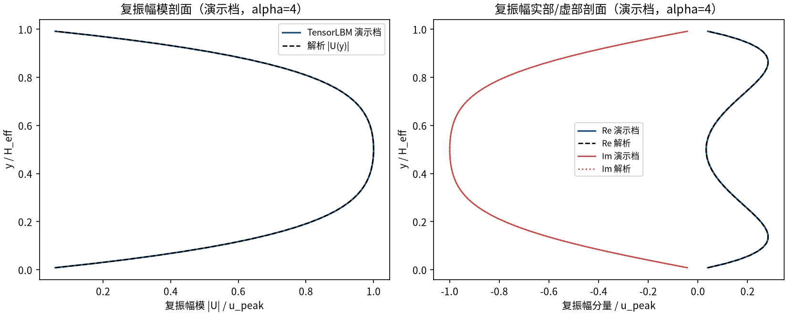
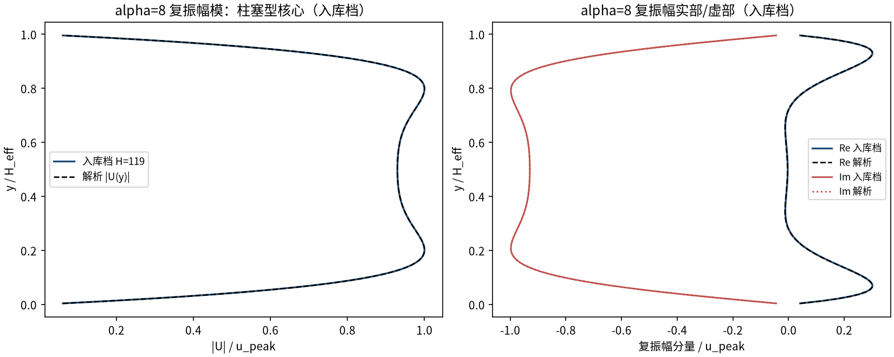
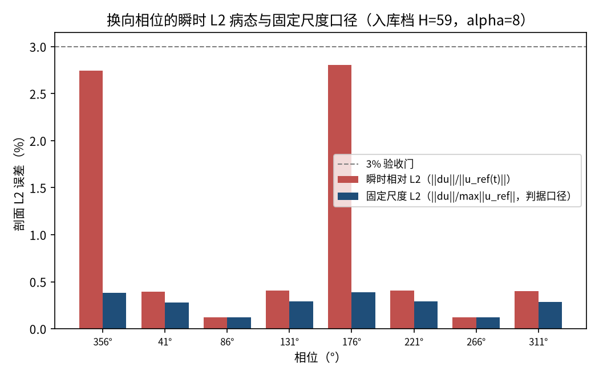
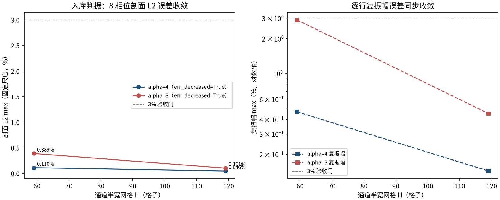

# Womersley 振荡流：周期脉动压力梯度驱动的通道流（womersley）

> Womersley Oscillating Flow — Pulsatile Channel (Womersley 1955)

**摘要** — TensorLBM D2Q9 BGK 求解器对 Womersley (1955) 稳态周期解析解的直接验证：通道受谐波振荡体力 a(t)=a0·cos(ωt) 驱动，alpha=4/8 × H=59/119 四配置的 8 相位剖面 L2 误差（固定尺度）最大 0.389%、逐行复振幅最大 2.900%（均为最粗档），H 加倍后分别降至 0.101% / 0.450%（单调收敛），全部远低于 3% 门，入库判定 pass = True。

## 1. Benchmark 介绍

Womersley 流是脉动管流/血管流的经典基准：平面通道（壁面 y=0, H）受谐波振荡的流向压力梯度 a(t)=a0·cos(ωt) 驱动。稳态周期解（Womersley 1955; Sexl 1930）的相量形式为 U(y) = (a0/iω)·[1 − cosh(λy′)/cosh(λ)]，λ = sqrt(i)·alpha，alpha = (H/2)·sqrt(ω/ν) 为 Womersley 数。

alpha 刻画振荡惯性粘性之比：alpha→0 退回准稳态抛物线（每相位都是 Poiseuille 剖面）；alpha 增大后核心呈柱塞型（plug-like）、壁面附近出现薄振荡边界层，且剖面在周期内出现换向环带（部分流体反向流动）——正是脉搏波传播的典型形态。本案例覆盖 alpha=4（中等环带效应）与 alpha=8（强柱塞 + 换向相位）两档。

测量口径的工程要点：换向相位（alpha=8 的 ~162°/342°）参考剖面本身过零，瞬时相对 L2 的分母塌缩到峰值的 ~0.28 倍而绝对误差不变，比值病态膨胀（实测同相位逐点误差仅 1.74% 而瞬时比值 5.7%）。入库判据因此用固定尺度 L2（对周期内峰值剖面范数归一），瞬时值逐相位原样记录备查（见 result.json phase_table）。

### 物理与数学背景

一维非定常 Stokes 方程的谐波受迫稳态解的格子 Boltzmann 离散：D2Q9、BGK 碰撞、体力注入 + 周期流迁。

```
u(y,t) = Re{ U(y)·e^(iωt) }
```

```
U(y) = (a0 / iω) · [ 1 − cosh(λ·y′)/cosh(λ) ],  y′=(y−H/2)/(H/2), λ=sqrt(i)·alpha
```

```
alpha = (H/2)·sqrt(ω/ν)；omega = 4·alpha²·nu/H_eff²（精确落在解析间隙上）
```

```
固定尺度 L2 = ||du(t)|| / max_t′ ||u_ref(t′)||（判据口径）；a0 定标使 |U|max = u_peak
```

**参考解** — Womersley (1955) 相量解，numpy 复数算术直接实现（无 scipy）；解析解经 PDE 残差~1e-9 与 ω→0 抛物线极限 1e-12 双重独立校验。

**参考文献**

- Womersley J.R. (1955), Method for the calculation of velocity, rate of flow and viscous drag in arteries when the pressure gradient is known, J. Physiol. 127, 553-563.
- Sexl T. (1930), Über den von E.G. Richardson entdeckten Annulareffekt, Z. Phys. 61, 349.

## 2. 计算条件设置

正式档计算条件取自入库 scan_out/result.json（程序化注入，下同）。

| 参数 | 取值 | 说明 |
|---|---|---|
| 格子 / 碰撞 | D2Q9 / BGK | tau=0.8（nu=0.1），tensorlbm.solver.collide_bgk + stream |
| 驱动 | 谐波振荡体力 a(t)=a0·cos(ωt) | tensorlbm.turbulent_channel._apply_body_force_2d（库自用通道驱动路径） |
| 壁面 | 预流半程 bounce-back | f_pre[OPPOSITE] 于壁行；无滑移面 y=0.5/ny−1.5，H_eff=ny−2 |
| Womersley 数 | alpha = 4 / 8 | alpha=(H_eff/2)·sqrt(ω/ν)，ω=4·alpha²·ν/H_eff² 精确落在解析间隙上 |
| 网格 | H=59 / 119（ny=61/121，nx=16） | x 周期（stream 内建） |
| 定标 | u_peak = 0.03 | a0 定标使解析峰值速度=u_peak（Ma=0.052） |
| 瞬态处理 | 跳过 5–7 个整周期后测 4 个整周期 | skip = max(5, ceil(6.5·tau_diff/T))，逐配置记录 |
| 验收门 | 8 相位 L2 / 逐点 / 复振幅 ≤ 3% | L2 用固定尺度归一（换向相位病态，见图 4） |
| 运行设备 | GPU（入库档）；CPU（演示档） | 入库档 4 配置合计约 8 分钟 |

## 3. 软件使用步骤

**环境** — Python ≥ 3.11；依赖 torch / numpy / matplotlib；仓库 src 可导入（pip install -e . 或 PYTHONPATH=<repo>/src）

**步骤 1**：获取仓库并进入根目录

```bash
git clone https://github.com/cxs503/TensorLBM.git && cd TensorLBM
```

**步骤 2**：安装/指向 tensorlbm 包

```bash
pip install -e .   # 或 export PYTHONPATH=$PWD/src
```

**步骤 3**：单配置快速复现（H=59 alpha=4，CPU 约 1–2 分钟）

```bash
python benchmarks/verified/womersley/run.py single 59 4 case.json --device cpu
```

**步骤 4**：正式 4 配置网格收敛扫描，写出判定 result.json

```bash
python benchmarks/verified/womersley/run.py scan scan_out --H 59 119 --alpha 4 8 --device cpu
```

### 场量可视化演示脚本

非定常演化演示：与入库档同参数（H=59、alpha=4、u_peak=0.03）CPU 真跑约 15 s（37,587 步 = 跳过 23,919 + 测量 4 个整周期），输出 8 相位瞬时剖面与逐行复振幅（phasor 解调）；判据数字一律取自入库扫描。

```bash
python docs/benchmarks/demos/womersley_demo.py --H 59 --alpha 4 --tau 0.8 --upeak 0.03 --out demo.npz
```

## 4. 计算结果

**表 1 入库扫描结果（alpha × H 共 4 配置）**

| 扫描线 | 网格 | L2 max（固定尺度） | 逐点/u_peak | 复振幅 max | 中心线复振幅 | 总步数 |
|---|---|---|---|---|---|---|
| alpha=4 | H=59 | 0.110% | 0.109% | 0.466% | 0.096% | 37,587 |
| alpha=4 | H=119 | 0.046% | 0.048% | 0.144% | 0.028% | 152,933 |
| alpha=8 | H=59 | 0.389% | 0.423% | 2.900% | 0.375% | 26,474 |
| alpha=8 | H=119 | 0.101% | 0.107% | 0.450% | 0.092% | 107,756 |

*来源：benchmarks/verified/womersley/scan_out/result.json（status = VERIFIED）。*

## 5. 与文献 / 解析解的比较

**表 2 与解析解的比较及诊断**

| 量 | 数值 | 说明 |
|---|---|---|
| 最差 L2 档（4 档中） | alpha=8 / H=59 | 0.389%（门 3%） |
| 最差复振幅档 | alpha=8 / H=59 | 2.900%：壁面第一行边界层分辨率误差，H 翻倍降到 0.450%（第 2–6 行仅 0.4–0.8%） |
| 中心线复振幅误差（H=59, alpha=4） | 0.096% | 数值相量 (0.001001, -0.029991) vs 解析 (0.000973, -0.029984) |
| 质量漂移（最差档） | 0.082% | 全程 finite，无 NaN |
| 瞬时 L2 峰值（H=59, alpha=8，非判据） | 2.808% | 换向相位 \|\|u_ref\|\| 塌缩所致条件数放大，逐相位记录于 phase_table |


*图 1 演示档（H=59，alpha=4）一个周期内 8 个相位的瞬时剖面（实线）与Womersley 解（虚线）：环带效应下剖面偏离抛物线，部分相位近壁流体反向（负速区），数值与解析逐相位吻合。*



*图 2 演示档 phasor 解调：左=复振幅模剖面；右=实部/虚部剖面（实/虚部分别对应与驱动同相/正交的分量），数值与解析双分量重合。*



*图 3 入库档 alpha=8（H=119）相量剖面：核心区 |U| 平坦（柱塞型），壁面附近急剧衰减到零；Re/Im 分量与解析解在换向环带形态上重合。*



*图 4 换向相位的 L2 条件数（入库档 H=59，alpha=8）：瞬时相对 L2（红）在162°/342° 相位膨胀，而固定尺度口径（蓝，判据口径）平稳且远低于 3% 门——病态来自参考剖面过零而非误差增长。*



*图 5 入库判据数字：左=8 相位剖面 L2（固定尺度）沿两条 alpha 线随 H 单调下降（alpha=4 线 2.4×，alpha=8 线 3.8×）；右=逐行复振幅误差同步收敛（err_decreased = True）。*

- 误差定义：8 个整周期均布相位时刻的剖面 L2（固定尺度归一）与逐点 max/u_peak；复振幅误差行集 |U_ana| ≥ 10%·u_peak。验收门全部 3%。
- 库缺口如实记录：solver.py 无公开 D2Q9 体力入口（用库自用通道驱动函数 turbulent_channel._apply_body_force_2d，每步精确注入 rho·a）；库壁面函数 bounce_back_cells 为流后全程 BB，对这组解析解壁面错位（alpha=8 时 10.5–12.5% 且不收敛），故沿用 verified/poiseuille_2d 的预流半程 BB 范式。
- 本案例为直接观测量对解析解（无任何模型修正或重标定），符合严格入库标准。

## 6. 复现说明

```bash
python benchmarks/verified/womersley/run.py scan scan_out --H 59 119 --alpha 4 8 --device cpu
```

**预期结果** — L2（固定尺度）：alpha=4 线 0.110% → 0.046%；alpha=8 线 0.389% → 0.101%（单调下降，全部 ≤3%，passed=True）

**参考耗时** — 入库档 4 配置合计约 8 分钟（GPU 实测；CPU 演示档 H=59 alpha=4 约 15 s）

**入库位置** — `benchmarks/verified/womersley`

---

*本教程由 TensorLBM benchmark 档案自动生成，判据数字均取自入库 `result.json` 机器档案；演示图为缩短时长的可视化档，定量结论以存档扫描为准。*
