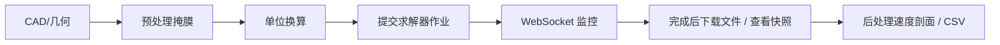

# TensorLBM 平台使用手册 / Platform User Manual

**版本 / Version:** 1.0.0  
**适用对象 / Audience:** 平台终端用户（科研人员、工程师、教学使用者）

> 本手册描述位于 `platform/` 目录下的 **B/S Web 平台**。  
> 若需 TensorLBM 库本身（Python API、LBM 算法、船舶基准等）请参阅
> [`docs/software_manual.md`](software_manual.md)。

---

## 目录 / Table of Contents

1. [简介 / Introduction](#1-简介--introduction)
2. [安装与启动 / Install & Launch](#2-安装与启动--install--launch)
3. [平台架构 / Architecture](#3-平台架构--architecture)
4. [模块使用指南 / Module Guide](#4-模块使用指南--module-guide)
   - 4.1 预处理 / Pre-processing
   - 4.2 CAD 船型 / Ship CAD
   - 4.3 求解器 / Solver
   - 4.4 后处理 / Post-processing
   - 4.5 基准测试 / Benchmarks
   - 4.6 作业管理 / Job Management
   - 4.7 WebSocket 实时更新
5. [REST API 参考 / API Reference](#5-rest-api-参考--api-reference)
6. [GPU 集群与并发 / GPU & Concurrency](#6-gpu-集群与并发--gpu--concurrency)
7. [典型工作流 / Typical Workflow](#7-典型工作流--typical-workflow)
8. [故障排查 / Troubleshooting](#8-故障排查--troubleshooting)
9. [安全注意事项 / Security Notes](#9-安全注意事项--security-notes)

---

## 1. 简介 / Introduction

TensorLBM 平台是一个把 TensorLBM 全部仿真能力封装为可交互 Web 界面的 B/S 系统：

* **后端**：Python 3.11 + FastAPI；线程池调度多个仿真作业；通过 WebSocket 把状态实时推送到浏览器。
* **前端**：Bootstrap 5 + 原生 JS 单页应用；支持几何预览、参数输入、实时日志、PNG 图集与 CSV 下载。
* **GPU 支持**：每个求解器/基准在表单中可选 `cpu` / `cuda:0` / `cuda:1` …，可在同一进程中跨多个 GPU 并行运行作业。

---

## 2. 安装与启动 / Install & Launch

### 2.1 系统要求 / Requirements

* 操作系统：Linux / macOS / Windows  
* Python ≥ 3.11，pip ≥ 23  
* （可选）NVIDIA GPU + CUDA 11.8 或更新

### 2.2 安装依赖 / Install dependencies

```bash
# 在仓库根目录
pip install -e ".[dev]"            # 安装 tensorlbm 库（含 torch, matplotlib …）
pip install -r platform/requirements.txt   # fastapi, uvicorn, python-multipart, aiofiles
```

### 2.3 启动后端 / Start the backend

```bash
cd platform
bash start.sh
# 等价于：
PYTHONPATH=../src uvicorn backend.main:app --host 0.0.0.0 --port 8000 --reload
```

### 2.4 打开浏览器 / Open in browser

* 单页应用：<http://localhost:8000/>
* Swagger UI：<http://localhost:8000/docs>
* 健康检查：<http://localhost:8000/api/health>

---

## 3. 平台架构 / Architecture

```
┌──────────── 浏览器 (Bootstrap 5 SPA) ────────────┐
│   /          /docs       /api/...     /ws       │
└─────┬─────────────────┬───────────────────┬─────┘
      │ REST            │ WebSocket         │ static
┌─────▼─────────────────▼───────────────────▼─────┐
│  FastAPI (backend/main.py)                      │
│  ├ routers/preprocess │ solver │ postprocess    │
│  ├ routers/cad        │ benchmarks │ jobs       │
│  └ job_manager  (ThreadPoolExecutor, 默认 4)    │
└────────────────────────────┬────────────────────┘
                             │  tensorlbm (torch)
                             ▼
                        CPU / cuda:N
```

* 作业目录：`/tmp/tensorlbm_platform/{job_id}`，包含 `run_metadata.json`、PNG 快照、CSV 时间序列、HDF5/VTK 等。
* `ThreadPoolExecutor` 大小由环境变量 `TENSORLBM_MAX_WORKERS` 控制（默认 4）。

---

## 4. 模块使用指南 / Module Guide

### 4.1 预处理 / Pre-processing

| 功能 | 端点 | 说明 |
|------|------|------|
| 多边形 → 障碍掩膜 | `POST /api/preprocess/polygon-mask` | 输入 `[[x,y],…]` 像素顶点，返回 PNG 预览 + 单元统计 |
| 随机多孔介质 | `POST /api/preprocess/random-porosity-2d` | 高斯随机场（`sigma` 控制相关长度） |
| STL 体素化 | `POST /api/preprocess/voxelize-stl` | 上传 STL 文件，返回 3D 网格统计 |
| LBM 单位换算 | `POST /api/preprocess/units` | 物理量 → `dx, dt, τ, Ma, Re`，并提示稳定性 |

> **重要**：单位换算的请求体含 `phys_length_m / phys_velocity_ms / phys_nu_m2s / lbm_length / lbm_velocity`。返回字段 `lbm_tau` 必须 > 0.5，否则 `stable=false`。

### 4.2 CAD 船型 / Ship CAD

| 功能 | 端点 |
|------|------|
| 列出可用船型 | `GET /api/cad/hull-types` → `wigley / series60 / kcs` |
| 三视图预览 | `POST /api/cad/preview` |
| 3D 体素掩膜 + Cb | `POST /api/cad/hull-mask` |
| 由物理量算 LBM 参数 | `POST /api/cad/lbm-parameters` |
| 直接送求解器 | `POST /api/cad/send-to-solver` |
| 导出 STL | `POST /api/cad/export-stl` |

### 4.3 求解器 / Solver

`POST /api/solve/{type}` 启动一个仿真作业，返回 `{ "job_id": "…" }`。
全部 10 种求解器：

| `type`                    | 维度 | 模型 |
|---------------------------|------|------|
| `cylinder-flow`           | 2D | BGK |
| `lid-driven-cavity`       | 2D | BGK |
| `backward-facing-step`    | 2D | BGK |
| `turbulent-channel`       | 2D | Smagorinsky BGK |
| `pipeline-flow`           | 2D | BGK |
| `dam-break`               | 2D | SC / SCMP / CG / FE |
| `sloshing-tank`           | 2D | Color-Gradient |
| `sphere-flow`             | 3D D3Q19 | BGK |
| `ship-hull`               | 3D D3Q19 | Smagorinsky MRT |
| `porous-drainage`         | 2D | SC / CG |

公共参数：`device`（如 `cuda:0`）、`seed`、`n_steps`、`output_interval`。具体字段见 Swagger UI 或对应 Pydantic 模型。

### 4.4 后处理 / Post-processing

| 功能 | 端点 |
|------|------|
| 运行摘要 | `GET /api/postprocess/summary/{job_id}` |
| 速度剖面 | `POST /api/postprocess/velocity-profile` |
| CSV 解析 | `GET /api/postprocess/csv/{job_id}/{csv_name}` |
| 快照清单 | `GET /api/postprocess/snapshot-analysis/{job_id}` |

### 4.5 基准测试 / Benchmarks

`POST /api/benchmarks/{type}`：

* `marine`：可选 `cases=["cylinder","sloshing","pipeline","turbulent_channel","wigley"]`；`fast=True` 用减小算例。
* `multiphase`：静液滴 (Laplace) + 自旋分相 + 双相 Poiseuille；`fast=True` 用小网格。
* `ghia`：与 Ghia (1982) Re=100/400/1000 对比顶盖驱动方腔。
* `mlups`：D2Q9 BGK 性能基准。
* `porous`：Laplace 多孔 + 毛细侵入。

### 4.6 作业管理 / Job Management

| 操作 | 端点 |
|------|------|
| 列出 | `GET /api/jobs/` |
| 详情 | `GET /api/jobs/{id}` |
| 删除 | `DELETE /api/jobs/{id}` |
| 日志 | `GET /api/jobs/{id}/logs` |
| 文件清单 | `GET /api/jobs/{id}/files` |
| 文件下载 | `GET /api/jobs/{id}/files/{path}` |
| 图像清单 | `GET /api/jobs/{id}/images` |
| 图像 base64 | `GET /api/jobs/{id}/images/{path}` |
| 元数据 | `GET /api/jobs/{id}/metadata` |
| 对比 (最多 10) | `GET /api/jobs/compare?ids=&ids=` |

作业状态枚举：`queued / running / completed / failed / cancelled`。

### 4.7 WebSocket 实时更新 / Live updates

* 连接：`ws://<host>:8000/ws`
* 初次连接收到 `{ "type": "init", "jobs": [...] }`。
* 此后服务器在作业状态变化或诊断推送时发送 `{ "type": "job_update", "job": {...} }`。

---

## 5. REST API 参考 / API Reference

完整可交互文档：<http://localhost:8000/docs> （Swagger UI）  
机器可读：<http://localhost:8000/openapi.json>

平台公共状态端点：

| 方法 | 路径 | 说明 |
|------|------|------|
| `GET` | `/api/health` | 轻量心跳（不依赖 torch） |
| `GET` | `/api/status` | CUDA、GPU 列表、作业计数 |

---

## 6. GPU 集群与并发 / GPU & Concurrency

* 在任意求解器表单中，把 **Device** 改成 `cuda:0` 或 `cuda:1` 即可在指定 GPU 上运行。
* 同时可提交多个作业；线程池默认 4 工作线程，可通过 `TENSORLBM_MAX_WORKERS=N` 调整：

```bash
TENSORLBM_MAX_WORKERS=16 bash start.sh
```

* `/api/status` 字段 `devices` 列出当前可用设备。

---

## 7. 典型工作流 / Typical Workflow



CLI 示例（curl）：

```bash
# 1. 提交圆柱绕流
curl -X POST http://localhost:8000/api/solve/cylinder-flow \
     -H 'Content-Type: application/json' \
     -d '{"nx":320,"ny":100,"re":100,"u_in":0.08,"n_steps":1200,"output_interval":200}'
# -> {"job_id":"ab12cd34", ...}

# 2. 轮询状态
curl http://localhost:8000/api/jobs/ab12cd34

# 3. 列出输出文件
curl http://localhost:8000/api/jobs/ab12cd34/files

# 4. 摘要
curl http://localhost:8000/api/postprocess/summary/ab12cd34
```

---

## 8. 故障排查 / Troubleshooting

| 症状 | 排查建议 |
|------|---------|
| 浏览器空白 | 确认 `bash start.sh` 输出 `Uvicorn running on 0.0.0.0:8000`；本地是否开了代理 |
| `/api/health` 200 但作业立即失败 | 在 `/api/jobs/{id}` 的 `error` 字段查看 traceback；常见原因：CUDA 不可用却选了 `cuda:0` |
| 422 Unprocessable Entity | 请求体不符合 Pydantic 模型；查看 Swagger UI 中字段类型与范围 |
| WebSocket 连不上 | 反向代理需要支持 `Upgrade: websocket`（nginx 加 `proxy_set_header Upgrade $http_upgrade;`） |
| MLUPS 极低 | 默认 `device=cpu`；将 `device` 改为 `cuda:0` 提升 10–100× |
| `/etc/passwd` 之类的路径请求 | 服务端会以 403/404 拒绝；这是正常防护 |

---

## 9. 安全注意事项 / Security Notes

* **CORS** 当前为 `*`（开发模式），生产部署请收紧到固定域名。
* **文件下载** 端点对 `..` 已做 realpath 守卫，但仍建议在反向代理层再做一道路径校验。
* **作业目录** 默认 `/tmp/tensorlbm_platform/`，公共多用户主机需替换为受 ACL 保护的目录。
* **STL 上传** 大小未限制；建议在反代层设置 `client_max_body_size`。

---

> 进一步阅读：
> * [`platform/tests/README.md`](../platform/tests/README.md) — 平台测试套件与运行方法  
> * [`docs/platform_test_report.md`](platform_test_report.md) — 测试报告（含缺陷修复清单）  
> * [`docs/software_manual.md`](software_manual.md) — TensorLBM 库（Python API、船舶基准）
