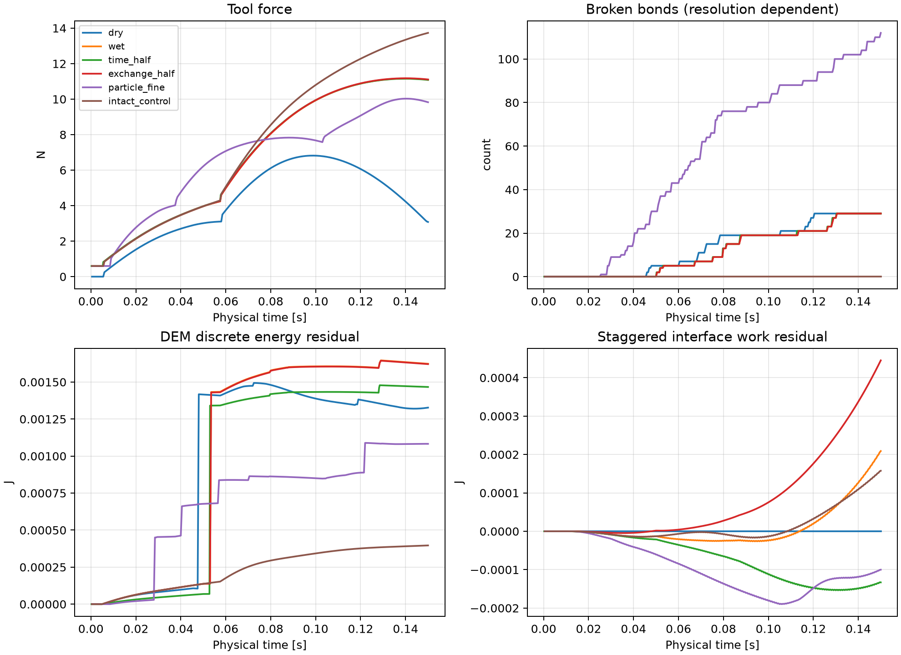
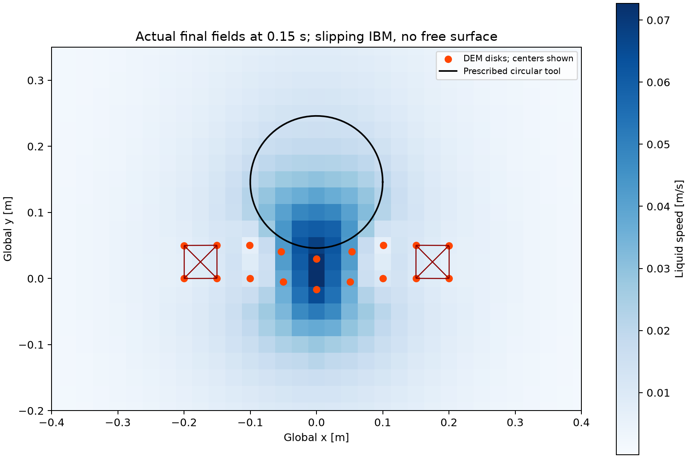

# P1: executable 2-D fluid–bonded-disk exchange

**Status: interface verification passed; physical accuracy unqualified; particle
resolution sensitivity failed. This is not a validated icebreaking solver.**

The driver actually invokes TensorLBM's `collide_bgk_matmul` and periodic
`stream`, and TensorDEM's `IceDEM.step(external_forces=..., load_time=...)`.
There is no second ice solver. TensorDEM owns mass, springs, irreversible bond
failure, and post-failure normal contact. The existing SI traction integration
helpers and `IcebreakingForceLedger` carry explicitly signed ice/hull loads.

## Scope and deliberate reductions

- A 48 × 40 periodic, single-phase liquid lattice (1.2 × 1.0 m), with no gravity
  or free surface. Global positive y points upward; the circular tool moves down.
- Liquid density 1000 kg/m³, **artificial kinematic viscosity 0.02 m²/s**. This
  is a numerically convenient viscous liquid, not calibrated seawater.
- A 9 × 2 bonded disk strip, radius 0.025 m, out-of-plane thickness 0.2 m,
  physical mass 6.481891 kg; edge columns fixed. Bond/contact stiffness 500 N/m,
  normal damping 1 N s/m. DEM's ad hoc drag is zero: fluid loads are not doubled.
- A prescribed circle of radius 0.1 m moves at 0.2 m/s, initially separated by
  1 mm. Its velocity is prescribed by an external actuator; it has no simulated
  dynamic mass or inertia.
- The interface is **finite-coefficient point friction**, using one point per
  ice disk and 24 points around the tool. It is a slipping, regularized IBM,
  not a resolved impermeable disk skin or a pressure/viscous traction model.
  Liquid exists throughout the lattice, including nominal disk interiors.
- No particle rotation, tangential friction, crushing, gravity/buoyancy,
  physically calibrated fracture energy, finite-size fluid exclusion, or 3-D.

Those reductions are exposed in the configuration and results. For example,
wet-case marker slip RMS reaches 0.1069 m/s. Passing a momentum check does not
make this boundary no-slip or validate ice physics.

## Exchange algorithm and contracts

At exchange time `t_k`, bilinear interpolation `J` samples the real liquid
velocity at current DEM/tool positions. The same coefficients spread force
through `S = J^T`. No marker may cross the non-wrapping interpolation support;
although fluid streaming is periodic, the force mapping preserves physical
first moments without periodic coordinate ambiguity.

The force **on liquid** is `F = zeta * (v_solid - J u_liquid)`. Ice uses
`zeta = particle_mass * 30 s^-1`; each prescribed tool point uses
`zeta = (0.1 kg / 24) * 30 s^-1`. The tool coefficient is an interface
regularization parameter, not an added physical mass. All coefficients and
sample times remain in the restart.

The fluid receives `S F`, and DEM receives exactly `-F_ice`, in SI newtons.
The existing particle-traction helper converts `(-F / A, A)` back to the nodal
load, with `A = 2 r thickness`; this declared area is a conversion convention,
not resolved surface stress. Tool quadrature uses circumference × thickness.

At each LBM step:

1. Refresh or hold the exchange state at the declared interval.
2. Apply a D2Q9 momentum source `delta f_i = 3 w_i c_i · delta p_lattice`, which
   has zero zeroth moment and exactly the supplied first moment.
3. Call the existing float64 BGK matrix collision and periodic streaming.
4. Advance real DEM with stable substeps and the opposite SI nodal force.
5. Integrate tool/contact/support impulses and all ledger terms.

Holding loads is explicit: history records `exchange_sample_time_s`,
`exchange_interval_end_s` and `force_hold_age_s`. Each DEM call receives its
current `load_time`; no hidden accumulation occurs. Baseline liquid step is
0.5 ms and exchange interval 1 ms; refined particles require four DEM
substeps. Time refinement uses 0.25 ms with the same 1 ms exchange interval.

Total force, mapping moment and `u · S F = (J u) · F` are verified separately.
This adjoint identity is a mapping property at a common velocity level;
staggered time integration has a separate nonzero work residual.

## Actual results (0.15 s)

| Case | Peak tool force N | Tool impulse N s | Broken / initial bonds |
|---|---:|---:|---:|
| Dry | 6.818504 | 0.622575 | 29 / 41 |
| Wet | 11.162610 | 1.020646 | 29 / 41 |
| Half time step | 11.151834 | 1.021359 | 29 / 41 |
| Half exchange interval | 11.175668 | 1.021722 | 29 / 41 |
| Finer disks | 10.027826 | 0.990436 | 112 / 224 |
| Intact control | 13.732540 | 1.122615 | 0 / 41 |

Dry and wet final surviving-bond graphs each contain 12 components; intact
control contains one. Finer disks produce 32 components. Per-component IDs,
retained physical mass, centroid and mean velocity are saved and independently
reconstructed; no deleted particles or unlogged mass loss. Isolated disks count
as components, not calibrated physical floe predictions.

The finer 18 × 4 strip uses radius 0.0125 m and retains exactly the same physical
ice mass and disk-envelope length/height. Its central-spring parameters are
not recalibrated. The differing topology, damage count and small center-line
geometry shifts mean this is particle-resolution sensitivity, not convergence
to a calibrated continuum material.

Peak-force changes against wet baseline:

- Time step halved: **0.09654%**.
- Exchange interval halved: **0.11697%**.
- Disk size halved: **10.16594% — fails the declared 3% sensitivity gate**.

Tool impulse changes are 0.06984%, 0.10536%, and 2.95989%, respectively. The
aggregate sensitivity flag remains false. These pairwise differences are not
errors against the true solution. No fluid-grid/domain or interface-coefficient
convergence study has yet been completed.

All six cases pass the declared interface ledger gates: momentum < 1e-9 kg m/s,
relative lattice mass < 1e-11, force < 1e-11 N, moment < 1e-11 N m and adjoint
power < 1e-11 W. The largest total momentum residual is 1.48e-11 kg m/s.
Physical mass includes the common out-of-plane thickness; no mass scaling.





## Energy accounting: nonzero residuals retained

The raw files retain DEM bond/contact/tool-contact kinetic and potential energy,
normal damping, deleted-bond spring release, actual `F dot displacement`
external work, and prescribed tool work. The semiimplicit Euler discretization
is not exactly energy preserving. New post-break repulsive contact energy can
also arise when compressed springs are deleted; it remains in the reported
numerical energy residual, rather than being relabelled as physical fracture.

The fluid report stores actual kinetic change from the momentum-source step,
and kinetic change from the collision/stream stage. The latter is a numerical
kinetic-energy ledger term and is not independently identified as continuum
viscous dissipation. Regularization work is `dt F dot (v_sample - J u_current)`.
The combined interface residual is:

`fluid_source_work + DEM_external_work - tool_fluid_work + regularization_work`.

Wet final DEM discrete energy residual is **0.001624 J**; interface work
residual is **0.000209 J**. They are published, independently reconstructed,
and do not receive an exact-energy or physical-accuracy pass flag. The total
energy discrepancy equals the sum of those two residuals under the declared
ledger; the audit checks that identity directly from final fields/accounting.

## Reproduction, restart and evidence

Install TensorLBM and TensorDEM in the same environment, or set both source
paths explicitly:

```bash
OMP_NUM_THREADS=1 MKL_NUM_THREADS=1 \
PYTHONPATH=src:/path/to/TensorDEM/src \
python examples/ice_coupling/run_benchmark.py

OMP_NUM_THREADS=1 MKL_NUM_THREADS=1 \
PYTHONPATH=src:/path/to/TensorDEM/src \
python examples/ice_coupling/audit_evidence.py

OMP_NUM_THREADS=1 MKL_NUM_THREADS=1 \
PYTHONPATH=src:/path/to/TensorDEM/src \
python -m pytest -q tests/test_ice_coupling_2d.py tests/test_icebreaking_force_ledger.py
```

[study.json](assets/ice-coupling/study.json) records solver-source and raw-file
SHA-256 hashes, configurations, gates and sensitivities. Each case JSON includes
real D2Q9 populations, complete DEM state and bonds, exchange map/held loads,
history and cumulative accounting. `CoupledIce2D.from_snapshot(...)` resumes
mid-exchange; tests require subsequent populations and DEM positions to be
bitwise identical. Invalid populations, shape/field/time/subcycle mismatches
are rejected. Configuration rejects booleans/strings in physical real-valued
fields, nonfinite values and nonboolean wet/dry selection. Bilinear mapping
rejects malformed/nonfinite coordinates, invalid grid dimensions or spacing,
and overflow before generating any indexing array. The 70 related tests cover
these failure paths and valid unit-bearing inputs. The standalone audit verifies hashes and independently recomputes
final momentum, masses, topology, energies and force decompositions.

Next gates are resolved disk-boundary coupling, interface/grid sensitivity,
objective fracture regularization and material calibration. Only then should
free-surface floating ice and three-dimensional hull–ice–fluid physics follow.
